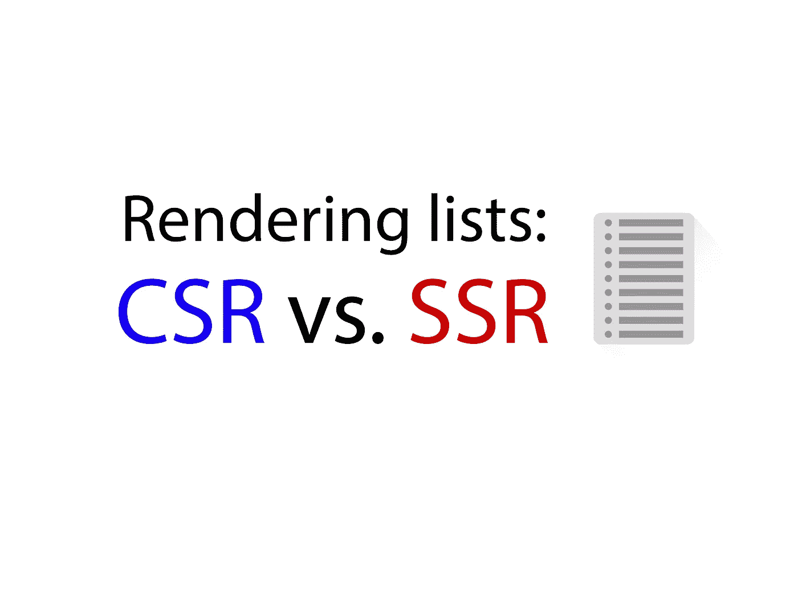
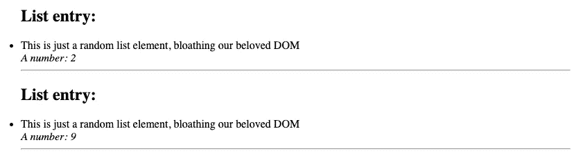
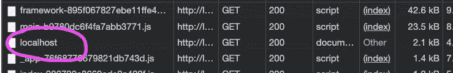
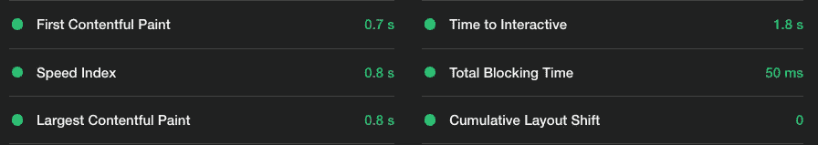
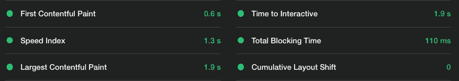
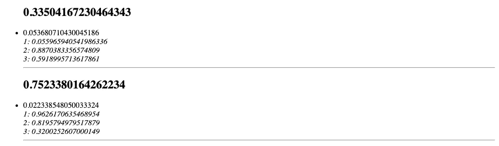

# 呈现巨大的数据列表——客户端呈现的好例子？

> 原文：<https://javascript.plainenglish.io/client-side-rendering-list-3b79e596668f?source=collection_archive---------10----------------------->

## JavaScript 实验

## 南车能比 SSR 有优势吗？



Source: the author

昨天的淋浴想:也许客户端渲染并不是那么糟糕，可以降低我们发送给客户端的千字节数？

***提示*** *，在我们进入之前:这篇文章一般是针对网络渲染的。我会使用 React.js，但是你不需要任何使用它的经验，也不需要学习 React。*

以下是我的假设背后的理论:

客户端渲染意味着我们将 JavaScript 组件发送到客户端浏览器。在浏览器中，它们被渲染并转化为 DOM 元素。但最终，浏览器收到的是这样的内容:

```
function App() {
  return React.createElement("div", { className: "App" }, [
    React.createElement("h1", null, "Hello World!")
  ]);
}
```

而对于服务器端呈现，我们在服务器上执行 JavaScript 组件，并只传送结果 HTML 结构。上面的代码会像这样发送到浏览器:

```
<div class='App'>
  <h1>Hello World!</h1>
</div>
```

这很好。这甚至比发布 JavaScript 组件更好，因为客户端呈现意味着在呈现 DOM 之前，需要执行 JS。

让我们进入重点。

单个 JavaScript 组件，无论是在 Vue、React 还是 Angular 中，都可以生成很多 DOM 元素。事实上，我们希望/需要多少 DOM 元素就有多少。这里有一个例子可以更清楚地说明这一点:

这个 React 组件生成`<li>Element</li>` 100 次。将这个组件作为 JavaScript 发布并不重要。然而，在服务器上呈现它并将其转换成 100 个 DOM 元素的文字列表肯定会导致巨大的 HTTP 响应，因为它包含所有元素，而不仅仅是 blueprint JS 代码。

理论到此为止。我想测试在这种情况下客户端渲染是否比服务器端渲染有优势。通过发布小的 JS 蓝图，而不是大量的 DOM 元素，也许我们的页面会更小。

为了测试这一点，我呈现了相同的 React 组件，创建了一个巨大的列表——一次在客户端，但也在服务器端。让我们看看会发生什么。

# 付诸实践——CSR 与 SSR 的巨大清单

这是我实现的组件:

它产生的是完全相同的列表元素，但是重复了 500 次:



那么，SSR 和 CSR 实际上在规模上如何比较，渲染这个列表？

结果证明我的论文是正确的——嗯，部分是正确的。


Server-side-rendering


Client-side-rendering

我们所看到的非常迷人。

页面本身的大小差异很大，实际上超过 60 千字节。这对我来说并不意外。在 CSR 案例中，我们只发布了组件蓝图，而在 SSR 案例中，我们发布了 500 个元素的列表。
那么，客户端大小渲染的要点是什么？不，没那么容易。

我们应该把重点放在上面图片中的“转让”价值上。

该值表示通过网络实际传输的千字节数。正如我们所见，两页几乎相同。

## 压力支撑着我们。

我们可以在 SSR 案例中最好地看到这一点，network 选项卡中的 *localhost* 元素表示我们收到的 HTML 结构:



Next.js 默认使用 gzip 压缩接收到的代码。只有 2.1 千字节通过网络传输。但事实上，由于我们得到了 500 个列表元素，所以未压缩文件的大小为 67.7 千字节。

如您所见，压缩在这里做得很好。一会儿我们会努力让它更难压缩。

**但是渲染性能呢？**

下面是服务器端渲染的灯塔报告:



以下是客户端渲染的结果:



正如你所看到的，当使用客户端渲染时，第一次内容丰富的绘制实际上更好。

这并不奇怪，因为`<h1>Huge list:</h1>`是一个独立的组件，在计算大列表之前呈现。因此在 CSR 版本中，它安装在前面，构成了我们的 FCP。

另一方面，我们看到浏览器中巨大的渲染工作量，使得最大的内容丰富的绘画花费更多的时间。

CSR 的结果没有那么令人信服，因为这是一个相当不现实的例子，生成了 2500 多个 DOM 元素。在我看来，这不是 CSR 的一个要点。

## 但是如果这个例子太容易压缩了呢？

如果你已经考虑过这个问题，你说得很有道理！在我们看到压缩之前的几行代码做了一件不可思议的工作，使我们庞大的服务器端渲染列表保持较小的大小。

这是因为我们生成的列表非常易于压缩。压缩引擎只能压缩相似的内容—我们创建的元素列表有 80%是相同的。只有随机生成的数字不同。

有时候，对于一个庞大的列表来说，这可能是一个现实的例子。有时，在现实中，我们会遇到一些更随机的情况，因此，我也创造了以下场景:



我加入了更多随机生成的数字——是的，在这种情况下，压缩工作，事实上，没那么好。

突然之间，包含该结构的页面压缩后的大小为 27.8 千字节。这是以前的 10 倍多。然而，绝对来说，在一个已经不切实际的应用程序中增加 25 千字节并不算多——这也体现在灯塔的结果中。

对于第一次内容丰富的绘制，服务器端渲染的结果增长了 0.2 秒——这也不算多。客户端渲染版本的结果保持不变。遗憾的是，对于客户端渲染来说，这仍然不是一个真正的好处。

## 为什么要进行服务器端渲染？

到目前为止，我们在服务器端和客户端渲染之间进行了一场艰苦的战斗。目前，我想这是一个相当大的平局。即使我的减小尺寸的论点是正确的，当使用 CSR 时，这并没有表现为真正的好处。压缩完成了它的任务。

然而，这种比较甚至没有那么复杂。

因为客户端呈现的版本不会从某个地方获取列表数据，它会随机生成列表数据。这是一个奇怪的用例。如果包含动态数据，我们通常从数据源获取它。在客户端渲染中，这需要一些代码来获取数据，并且明显增加了渲染时间。然而，我们把这些额外的负担留给了客户端渲染版本。

因为数据是随机生成的，所以不需要通过每个请求在服务器上运行计算。另一方面，在这种情况下，使用活动的服务器端呈现是多余的。更好的情况是将页面呈现一次，然后将其作为静态站点托管。

为了公平起见，我还将这个巨大的随机列表作为静态页面运行。令我惊讶的是，它提供了与服务器端渲染完全相同的性能——这并不是真正的优势。

好了，我们终于告一段落，稍微总结一下。

# 在这种情况下，我们可以做得更好

我们刚刚了解到，客户端渲染并不比服务器端渲染有真正的优势，即使是在处理不切实际的大量数据时也是如此。

原因是压缩，CSR 需要在客户端进行大量渲染。尤其是在低端设备上，这可能会导致问题。

我默默地希望中国南车在这方面有优势。然而，事实并非如此——即使如此，也有更好的方法来正确处理庞大的列表。

为了避免大量的初始加载和渲染，虚拟化列表和延迟加载可能是更好的方法。虚拟化列表可以帮助我们，只呈现对用户可见的内容。延迟加载会有所帮助，在必要时加载数据/列表组件。

总的来说，有更好的方法来应对这一点，甚至可以与服务器端渲染相结合。然而，我发现这个实验非常令人兴奋。

我希望你也喜欢它——谢谢你的阅读！

下面是我如何在客户端和服务器端渲染同一个组件:

[](/next-js-client-side-rendering-56a3cae65148) [## 如何在 Next.js 中客户端呈现组件

### 以及为什么这真的有用

javascript.plainenglish.io](/next-js-client-side-rendering-56a3cae65148) 

*更多内容看*[***plain English . io***](http://plainenglish.io/)