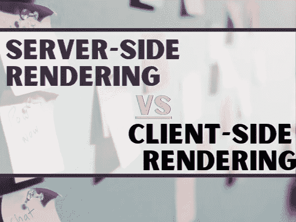

# 客户端渲染与服务器端渲染

> 原文：<https://javascript.plainenglish.io/client-side-rendering-vs-server-side-rendering-1e4b1fabba01?source=collection_archive---------5----------------------->

## 理解客户端和服务器端渲染的介绍指南

在我迄今为止的编码经验中，我发现描述符**客户端**和**服务器端**渲染经常被抛出。这两者都有一些方面，我觉得我直观地掌握了，而且看起来很清楚，但我想花一些时间来探索一下，揭示它们是什么，以及它们的用例看起来是什么样的！开始了。

# 什么是客户端渲染(CSR)？

*   您的初始请求加载页面、布局、CSS、JavaScript(JS)。
*   包含了部分或全部内容:相反，JS 发出另一个请求，得到响应(可能是 JSON 格式的)，并生成适当的 HTML(通常使用 React 之类的模板库)。
*   对于页面的进一步更新，客户端方法重复相同的过程。

## ***CSR 生命周期示例:***

*   服务器向浏览器发送响应。
*   浏览器下载 JS。
*   浏览器执行 React = > >页面现在可以查看和交互。

# 什么是服务器端呈现(SSR)？

*   使用服务器端呈现，您的初始请求加载页面、布局、CSS、JS 和内容(HTML)。
*   服务器端更新不一定意味着页面刷新，将发生的是部分更新，让服务器进行渲染并将最终输出插入 DOM。

## ***SSR 生命周期示例:***

*   服务器向浏览器发送准备呈现的 HTML 响应。
*   浏览器呈现页面，现在可以查看了，浏览器下载 JS。
*   浏览器执行 React = >页面现在是交互式的。

# 客户端渲染的负面影响

*   你依赖于用户有一台快速的计算机来处理浏览器引擎的繁重工作。
*   初始加载可能需要更多的时间，但它会以可视和交互式的方式出现。
*   客户端比服务器端慢，因为它需要下载更多的 Javascript，所以需要解析更多的 JS，它需要第二个 HTTP 请求来加载内容，然后需要更多的 JS 来生成模板。
*   如果没有正确实施降低搜索引擎优化。
*   在大多数情况下需要一个外部库。

# 服务器端渲染的缺点

*   频繁的服务器请求会导致交互性很强的网站出现瓶颈。
*   整体页面呈现缓慢(整个页面重新加载)。
*   非丰富的站点交互。

# 客户端渲染的优势

*   丰富的网站互动。
*   初始加载后的快速网站渲染。
*   非常适合 web 应用程序。
*   JS 库的健壮选择。

# 服务器端渲染的优势

*   在页面变得可交互之前，我们的视图会出现一点。
*   服务器端对浏览器的响应是准备好呈现的页面的 HTML。
*   **伟大的搜索引擎优化(SEO)** 。你的内容在你得到它之前就存在了，所以搜索引擎能够有效地索引和抓取它。
*   初始页面加载更快。
*   CSR 可能出现的空白页在 SSR 中不会出现。
*   **非常适合静态网站**(比如纽约时报，有很多数据的网站)。

# 用例

## ***何时使用 SSR***

*   如果你需要雅虎上的 SEO 等。
*   您已经有了一个工作的 react 应用程序，需要尽可能好的性能，并且愿意为额外的服务器资源付费
*   适用于像新闻网站这样的大量文本的网络应用程序(纽约时报)

## ***不使用 SSR***

*   如果你的 React 应用还没有完成，先让它工作起来。
*   google 上的 SEO 已经足够好了(确保 google 正在抓取你的内容)。
*   服务器资源稀缺可能是因为预算低或无法扩展。

# 结论

我学习 CSR 和 SSR 的经历告诉我，当决定选择哪一个时，你需要评估每一种情况，权衡项目的需求，这绝对不是一个非黑即白的决定。

我要说的是，从我所读的内容来看，我感觉 SSR 对用户的整体体验更有益。CSR 依赖于用户拥有快速的计算机和良好的互联网连接，但对于某些用户来说，情况可能并不总是如此。

当然，总是会有利弊！

你有什么想法？

你倾向于使用一个(CSR)而不是另一个(SSR)吗？

*更多内容请看*[***plain English . io***](http://plainenglish.io)