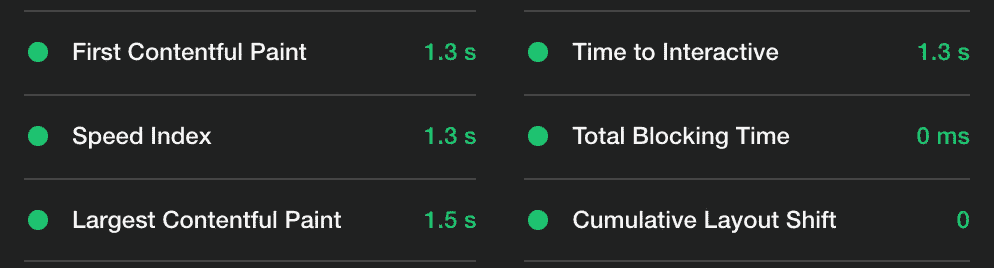
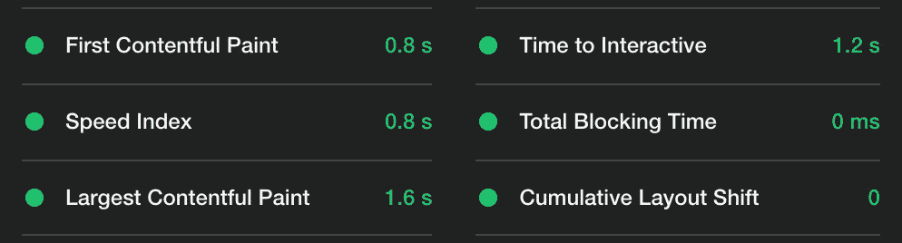

# 客户端渲染是一个错误吗？

> 原文：<https://javascript.plainenglish.io/client-side-vs-server-side-rendering-4a491c4a1746?source=collection_archive---------0----------------------->

## 在 Web 开发的历史上，客户端渲染是一个错误吗？它的历史、现状和前景


Photo by [Tim Gouw](https://unsplash.com/@punttim?utm_source=medium&utm_medium=referral) on [Unsplash](https://unsplash.com?utm_source=medium&utm_medium=referral)

关于客户端和服务器端渲染的老话题。据我所知，所有关于这个主题的文章都是这样陈述的:服务器端渲染是更好的选择。一直都是。

自企业社会责任与安全部门改革的辩论开始以来，几年过去了。从那以后，很多事情可能已经改变了。我想提供一幅客户端渲染的现状图，它的历史，问题，甚至一个潜在的用例。

玩得开心！

# 这是结果——而不是意图

一开始，客户端渲染的想法可能很难让人理解。尤其是你已经知道它的缺点的情况下。因此，知道客户端呈现是一个好消息。

没有人说，“让我们创建应用程序，提供巨大的 JS 文件，执行昂贵的渲染，同时延迟我们的第一次内容丰富的绘制，使我们的页面 SEO 不友好。这不是很好吗？”

很难说它是从什么时候开始的，但也许它是从 Angular.js 开始的。当我们开始越来越多地用 JavaScript 操纵 web 时，Angular.js 和其他框架在这个时候走得更远:不是操纵 web，而是用 JavaScript 呈现 web。

不一会儿，Angular 2 和尤 React.js 接手了。我们没有在 index.html 中编写 HTML 标记，而是用下面的代码代替:

```
function App() {
  return React.createElement("div", { className: "App" }, [
    React.createElement("h1", null, "Hello World!")
  ]);
}
```

但是为什么呢？嗯，完全用 JavaScript 来描述 HTML 使得操纵它变得很容易。当我们点击“增量”按钮时，这是 DOM 自动变化的伟大时代。

被所有操纵 DOM 的工具可能性蒙蔽了双眼，我们最终使用了客户端渲染。几乎 100%客户端渲染。

index.html 突然变成了一点样板代码 bundle.js 变得更大了。事情就是这样开始的。它开始于一个结果。

# 性能问题仍然是一个问题

有很多技术使得网络应用越来越快。
懒加载，默认代码拆分，最小化，压缩，三抖。有人可能认为这也极大地改善了客户端渲染的命运。然而，它仍然面临一些问题。

虽然谷歌公司声称客户端呈现的页面在排名中不受歧视，但还有另一个问题:性能。

在前端重要的是显示内容。当然，交互性也很重要，但是对用户来说最大的障碍是看到一个空页面。

关于这个问题，客户端渲染是一个问题。因为所有的 HTML 都是在 JavaScript 加载并执行后呈现的，所以我们有很大的延迟。
为了说明这个问题，我创建了两个相同的 React.js 应用程序。

第一个是通过使用默认的 React.js 生产流程构建的，该流程生成一个客户端呈现的应用程序。第二个应用程序完全相同，但呈现在服务器上。下面是 Lighthouse 中的性能结果。

客户端渲染版本:



服务器端呈现的版本:



正如所料，服务器端渲染的应用程序要快得多，尤其是在第一次内容丰富的绘制时。即使交互的时间并没有好到哪里去，一些东西也应该尽可能快地被用户看到。否则，用户更有可能退出页面。

此外，请记住，这只是默认的 React.js 应用程序，使用 create-react-app 创建。它没有那么大，也没有交互元素。

当谈到性能比较时，人们经常会提出一个反对服务器端渲染的糟糕论点:

“但客户端呈现的页面可以托管在简单的 webspace 上，而服务器端呈现的应用程序总是需要执行函数，这导致了更高的服务器响应时间和负载。”

当我们谈到主动服务器端渲染时，这是正确的。在这种情况下，每当有请求时，页面都会在服务器上呈现。当然，这是一件很糟糕的事情。然而，在一些项目中实际上需要它，例如，在呈现页面时包括来自数据库或 API 的数据。

幸运的是，许多服务器端渲染框架帮助我们保持良好的性能。缓存响应或更精确地决定是否真的需要渲染。

另一方面，替代方案也没那么美好。这并不是说客户端渲染可以简单地解决这个问题，而不会产生新的问题。想想获取数据并将其集成到服务器上的渲染过程中的例子，CSR 的答案可能是这样的:

将数据提取库发送到客户端，并在用户设备上请求数据。我不需要解释这增加了包的大小，并且客户端渲染会出现已知的问题。

实际上，我们仍然可以在服务器端呈现的或静态的应用程序中发布数据获取的代码——在这种情况下，CSR 没有优势。

# 性能问题仍然是一个问题

单页应用是完全客户端渲染的自然产物。我们坚持使用唯一的 index.html，而不是每个 URL 都有一个单独的 HTML 文件。这个文件包括 JavaScript 包，然后它呈现了我们的应用程序。我们将它们虚拟化，并通过 JavaScript 模拟一个包含多个 HTML 文件的 web 应用程序的体验，而不是“物理”URL。

我第一次接触单页 app 是在著名的 React 路由器上使用 React.js。设置好路线后，整个应用程序会保存在几个文件中。我很快意识到这个系统也有巨大的好处。

好处之一是避免加载单独的页面。浏览器不会通过 HTTP 加载另一个页面。相反，JavaScript 注意到我们想要移动到另一个站点并呈现相关内容。

此外，完整的路由过程，如处理 URL 参数，取决于我们开发的前端。我经常使用 SPAs 来构建动态页面，其内容应该根据 URL 参数或查询而变化。

然而，今天，服务器端渲染赶上了曾经是 CSR 优势的一切。例如，SSR 在浏览应用程序时采用了平滑过渡，使用了页面预加载。因此，我们收到的应用程序实际上是一个单页应用程序，但在每个页面上都提供了 SSR 优势。

## 客户端渲染的例子？

CSR 背后的想法是，用 JavaScript 捆绑我们要呈现的 HTML 结构。你可能知道在像 React 或 Vue 这样的技术中，我们可以渲染几乎无限数量的元素。就拿这个 Vue 例子来说:

如果*项*有 10 个元素，我们将收到一个由 10 个`<li>`元素组成的无序列表。问题是，我们只将这个语法发送到浏览器，而不是这个列表的实际 HTML 结构。这让我相信客户端渲染可能有一个优势:压缩巨大的列表，向浏览器发送更少的千字节。

我原本打算在本文中运行一个案例研究，然而，它变得太大了。呈现大列表的 CSR 与 SSR 现在是一篇 7 分钟的独立文章:

[](/client-side-rendering-list-3b79e596668f) [## 呈现巨大的数据列表——客户端呈现的好例子？

### 南车能比 SSR 有优势吗？

javascript.plainenglish.io](/client-side-rendering-list-3b79e596668f) 

不要在这里吊人胃口:DR:不，当涉及到巨大的列表时，客户端渲染并没有服务器端渲染的真正优势。服务器端压缩非常有助于最小化我们发送给浏览器的数千字节的巨大 HTML 结构。

# 结论

服务器端呈现和预呈现的页面似乎比客户端呈现更有优势。我所知道的每种情况都有优势。那么，我会说客户端渲染是一个错误吗？

我同意使用它可能是一个错误。无论你写的是 React，Vue，Angular，甚至是 Svelte，都没有理由在产品中提供客户端渲染的页面。

然而，我不会说客户端渲染是 web 开发历史上的一个错误。最终，这是其发展过程中的必要一步。感谢早期的 CSR，我们得到了所有那些提供有用特性的库和框架。React、Vue、Angular，如果没有 CSR，所有这些都不会存在。

感谢您的阅读！

关于渲染网页的更多信息:

[](/next-js-client-side-rendering-56a3cae65148) [## 如何在 Next.js 中客户端呈现组件

### 以及为什么这真的有用

javascript.plainenglish.io](/next-js-client-side-rendering-56a3cae65148) 

*更多内容尽在*[***plain English . io***](http://plainenglish.io)