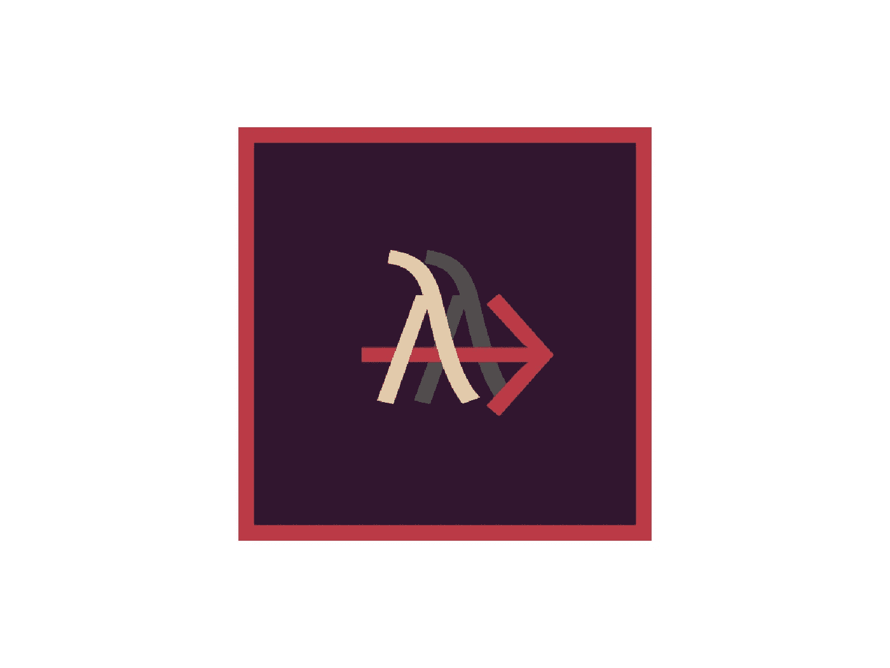

# 认识一下 Clio:一种用于简单多线程和编译成 JavaScript 的语言

> 原文：<https://javascript.plainenglish.io/clio-3bd586052d9f?source=collection_archive---------12----------------------->

## 了解平行、管道、贴图等



Clio 是一种非常年轻的编程语言。一种编译成 JavaScript 的编程语言——不管是用于浏览器还是 Node.js。虽然 TypeScript“只是”JavaScript 的超集，但 Clio 是一种全新的东西。它有令人兴奋的特性。

Clio 是一种函数式编程语言。即使你不确定这意味着什么，也不要担心。Clio 使入门变得相对容易。语法不难理解，不会向您介绍太多新的词汇，我们可以使用很多我们从 JavaScript 中了解到的东西。

但是为什么要给 Clio 一个机会呢？

# 是什么让 Clio 如此有趣？

Clio 想要实现几个目标。一会儿我会详细说明它们。

*   在前端和后端执行高性能的 JavaScript 代码。
*   通过网络使代码可重用，并通过这种方式使编写微服务变得容易。
*   提供可读、灵活、安全的功能代码。

我知道你被表演的事情炒作。尽管 Clio 最终会编译成 JavaScript，但在某些情况下它仍能提供更好的性能。一个原因是编写并行执行代码非常容易。另一个原因是 Clio 正在进行的大量优化。

一个例子是递归函数的尾部调用优化。这种优化技术有助于避免在使用递归时滥发调用堆栈。说到性能，这可能会改变游戏规则。

让我们来看下一点:Clio 的目标是让代码可重用。函数式代码的哲学是编写可重用的函数。Clio 允许我们托管它们，所以它们可以通过网络使用。甚至重用用其他编程语言编写的函数的能力也在计划之中。

所有以前的好处应该可以在一个整体，易于阅读和使用的语法。Clio 提供这个。当读到 Clio 是一种函数式语言时，我一开始是持怀疑态度的。我以前用过 Haskell 和 PureScript，两者都不是那么容易上手。另一方面，我发现 Clios 语法对初学者很友好。易用性的一个巨大好处是可以选择使用我们已经知道的 JavaScript 元素。我们稍后会谈到这一点。

# 安装、运行和构建 Clio

安装这种语言很容易。就像对于 PureScript，或者其他语言，编译成 JS，我们用 NPM: `npm install -g clio`。

安装此软件将为您提供用于创建、运行和构建项目的 CLI。以下是方法。

要创建新项目，请使用:

`clio new <project-name>`

选择名字由你决定。因为 Clio 是为浏览器和 Node.js 两者而设计的，所以 template 标签允许我们选择在哪个平台上构建代码。默认值是 Node.js，我们保留它。

项目初始化后，您可以在编辑器中打开它。在“src”目录下，有一个名为`main.clio`的文件。这是我们写代码的地方。

默认情况下，这里应该有一些“hello world”代码。可以用`clio run`运行。

将你的 Clio 代码编译成 JavaScript 可以和`clio build`一起工作。执行此操作时，会出现一个名为“build”的目录。要运行编译后的 JavaScript 代码:

```
node build/.clio/index.js
```

正如我之前提到的，我们初始化了 Node.js 模板——而不是用于 web 的模板。准备好开始学习 Clio 的基础知识了吗？

# 声明常数

```
export fn main argv:
 "Max" => name 
 "Hello, "+ name -> console.log
```

将 Clio 编译成 JavaScript 时，使用“const”关键字将常量转换成变量。

# 理解函数

函数就像在 PureScript 中一样工作——它们没有 return 关键字。相反，等号右边的所有内容都是返回的内容。至少，这是人们可以想象的。由于我们可以将表达式相互链接，实际上，最后一个求值的表达式是在 Clio 函数中返回的。

我们没有把我们的论点放在括号里，而是把它们列出来，用空格隔开。

```
fn multiply a b: 
  a * bexport fn main argv:
  result = multiply 2 3
  result -> console.log
  multiply 6 2 -> console.log
```

当然，我们可以将函数调用存储在一个变量中并记录下来。或者，我们只记录函数调用。在上面的例子中，你可以看到两种方式。

在控制台中，应该会出现“6”和“12”。

你注意到我们在调用函数时使用了两种不同的语法吗？当我们写下后面的“乘法”函数的参数时，我们使用一个箭头将参数分配给`console.log`。

这并不是因为功能迫使我们这样做。我只想告诉你有两种方法。我们一会儿会谈到用箭的技巧。当然，我们也可以把`console.log`称为另一种方式:

```
export fn main argv:
 console.log "Hello world"
```

# 平静的

管道就是我们用箭头做的，给函数赋值参数。实际上，我们可以结合管道(使用箭头)和其他方式来传递参数:

```
fn minus a b: 
  a — bexport fn main argv:
 result = 6 -> minus 2
 result -> console.log
```

结果是“4”——因此您可以看到语法`result = 6 -> minus 2`与`result = minus 6 2`相同。

管道允许我们链接我们的函数调用。这是一个很好的例子:

```
fn add a b: 
  a + bfn double a: 
  a * 2export fn main argv:
  result = add 2 2 -> double 
  result -> console.log
```

控制台中的结果是“8”。首先，将 2 和 2 相加，然后将结果 4 加倍。

说到管道，我们还可以用它来做别的事情。让我解释一下。方法是绑定到类的函数。因为几乎所有我们可以在数组、字符串和其他对象上使用的东西都被绑定到类，所以我们在这里说方法。使用管道语法，可以在 Clio 中对对象调用这些方法。

```
export fn main argv:
  [1 2 3] -> .reverse -> console.log
```

这将在控制台中打印“[3 2 1]”。请注意实际方法前面的点。上面的 JS 代码应该是:`[1, 2, 3].reverse()`。因此，正如你所看到的，我们在这个上下文中没有使用管道来传递一些参数，而是调用一个对象上的方法。

# 如果，否则，否则如果

这些关键字几乎存在于所有的编程语言中。Clio 也是如此。

我认为这个例子说明了一切:

```
export fn main argv:
  10 => n
  if n < 5: "Less than 5" -> console.log 
  else if n < 8: "Less than 8" -> console.log
  else: "More than 8 and 5" -> console.log
```

# 递归

递归是函数式编程的核心概念。像许多其他函数式语言一样，Clio 不提供循环。相反，我们使用递归来解决这类问题。因为我们刚刚知道了如何使用 if、else 和 else if，所以我们有了编写递归函数的所有东西。

斐波那契函数总是递归的一个很好的例子。它有助于强调您需要了解的关于 Clio 语法的内容:

```
export fn fib n:
  if n < 2: n
  else: (fib n — 1) + (fib n — 2)
```

在 JavaScript 中，完全相同的代码如下:

我在 Clio 中写递归的唯一问题是关于括号的。

虽然我们不把参数放在括号中，但有时，我们需要把整个函数调用放在括号中。你可以在上面的 Clio 代码中看到我们做到了。这两个函数调用都需要包装。当我们在一行中有不止一个函数调用时，情况总是如此——至少，据我所知是这样。

# 平行

这就是 Clio 大放异彩的地方。假设我们有一个数字数组，我们想对每个数字运行 Fibonacci 函数作为参数。在普通 JavaScript 中，我们可以使用 forEach 依次执行 4 个调用:

在我的机器上执行这段代码(以及 Clio 中的相同代码)大约需要 10.3 秒。这并不过分，但是执行四次相同的功能是并行计算的一个好例子。Clio 让这变得简单。但是首先，为了了解它有多简单，让我们看看 Clio 中的非并行代码:

```
export fn fib n:
  if n < 2: n
  else: (fib n — 1)
    + (fib n — 2)export fn main argv: 
  [42 42 42 42]
    -> * fib
    -> * (console.log @it)
```

这将连续运行斐波那契函数——也需要大约 10.3 秒。通过使用所谓的三明治语法，我们初始化了 fib 函数调用的并行执行:

```
export fn main argv: 
  [42 42 42 42]
    -> * [await] |fib|
   -> * (console.log @it)
```

并行函数是异步的，这就是为什么我们需要对它们使用 await。除此之外，唯一改变的是在 fib 函数调用周围使用了“|”。就是这样。

在我的机器上执行这段代码只需要 3.3 秒。差别真大！

# 地图

```
fn double x: 
  x * 2export fn main argv:
  [1 2 3] -> * double -> console.log
```

如您所见，我们只是在箭头后面添加了一个星号。为什么？

因为将整个数组应用于 double 函数是行不通的。我们需要将数组的每个元素传递给函数——可以说，我们将其映射到函数。

打印数组的每个值的方式是一样的:我们需要使用星号。

```
export fn main argv: 
  arr = [4 2 6]
  arr -> * console.log
```

# 关于阵列的更多信息

由于数组是如此重要的数据结构，我想在 Clio 中更多地介绍它。

正如我提到的，Clio 可以使用许多原生 JavaScript 特性。我之前展示过我们如何在一个数组上运行一个默认的数组方法:
`[1 2 3] -> .reverse -> console.log`

但这不是唯一的方法。此外，您可能想知道如何访问数组的默认对象属性，例如`length`。幸运的是，我们可以使用原始的 JavaScript 语法来完成剩下的工作。那么，使用储备功能:

```
export fn main argv: 
  arr = [1 2 3]
  arr.reverse() -> console.log
```

如果你想调用数组的对象属性:

```
export fn main argv: 
  arr = [1 2 3]
  arr.length -> console.log
```

当我们想访问数组中的某个元素时，我们用前面显示的相同方法:

```
arr = [1 2 3]
arr[0] -> console.log
```

为了帮助我们生成数组，我们可以使用 range，就像在 Python 中一样:

```
export fn main argv: 
  1..4 -> .toArray -> console.log
```

这将生成数组`[1, 2, 3]`,因此范围总是不包括我们提供的第二个数字。

Clio 的基础就是这样。虽然不推荐在生产中使用 Clio，但是关注这个项目可能是值得的。在我看来，潜力是巨大的——到目前为止，我喜欢这门语言。

感谢您的阅读！

如果您想阅读更多关于 JS 中函数式编程的内容:

[](/functional-javascript-17032a113930) [## 函数式 JavaScript——一篇文章中的所有重要概念

### 了解原因和方式

javascript.plainenglish.io](/functional-javascript-17032a113930) [](/purescript-cheatsheet-9ba7da3d393f) [## PureScript:编译成 JavaScript 的函数式语言

### PureScript 基础:对象、递归、映射等等

javascript.plainenglish.io](/purescript-cheatsheet-9ba7da3d393f) 

*更多内容尽在*[***plain English . io***](http://plainenglish.io/)