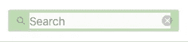

# 我用 React 克隆了 Instagram 搜索栏(以及我一路走来学到的东西)

> 原文：<https://javascript.plainenglish.io/cloning-the-instagram-search-field-d3bc6ba4643?source=collection_archive---------14----------------------->

## 模仿、吸收、创新

## useRef、onClick 事件等等

Photo by [Ousa Chea](https://unsplash.com/@cheaousa?utm_source=unsplash&utm_medium=referral&utm_content=creditCopyText) on [Unsplash](https://unsplash.com/s/photos/microscope?utm_source=unsplash&utm_medium=referral&utm_content=creditCopyText)

虽然我已经转向了其他的追求，但我在学习音乐时积累的知识和智慧将永远伴随着我。伟大的克拉克·特里曾说过这样一句至理名言:“模仿。同化。创新。”克拉克·特里绝对是音乐家中的巨人，他是小号和短号的专家，曾与贝西伯爵、艾灵顿公爵、艾拉·费兹杰拉、塞隆尼斯·蒙克、迪兹·吉莱斯皮、雷·查尔斯、昆西·琼斯等许多人合作过。

Clark Terry in his own words

这句口头禅——模仿、吸收、创新——在我的音乐生涯中被证明是一个非常好的指导原则，直到今天仍在发挥作用。这很简单，却非常有效。如果你不确定该做什么，如果你刚刚开始，*继续，复制一个以前已经有过的人*。利用他们的专业知识，把它变成你自己的，并把它作为你自己创造性探索的跳板。

本着这种精神，我最近一直在努力打造一个 Instagram 克隆版。使用 React 作为我的框架，我一直在梳理 HTML 和 CSS，并努力模仿桌面网站上的行为。在过去的一周里，我复制了 Instagram 的 navbar 搜索栏，并在这个过程中学到了不少东西。

# 可交付成果

Detailing the behavior of the Instagram Search Container.

搜索域的行为可以分为四类:**默认**行为、 **onClick** 行为、 **onBlur** 行为和 **X-Circle 的 onClick** 行为。

## 默认

*   容器有一个`input`子元素
*   input 元素的样式比 navbar 的`background-color`稍暗，有一个 1 像素的边框和一个小的边框半径
*   有一个搜索图标和`placeholder`文本显示，两者都居中对齐

## onClick

*   `placeholder`文本和搜索图标变为左对齐
*   出现一个右对齐的 X 圆图标
*   输入字段被聚焦
*   如果用户先前键入了查询，则选择输入值

**onBlur**

*   `placeholder`文本和搜索图标返回到搜索栏的中心
*   X 圆图标将从页面中移除
*   任何用户输入都会被持久化，取代默认布局方案中的`placeholder`文本。

**X 圈 onClick**

*   X 圆将从页面中删除
*   任何用户输入都会被清除
*   搜索容器恢复到其原始状态和样式，在搜索字段的中间显示`placeholder`文本和搜索图标。

# 查看 HTML

使用 Chrome 的开发工具检查搜索容器将产生以下结果:

下面是同一个 HTML 的注释版本，去掉了类名:

CSS 没有什么太复杂的，因为它都是非常基本的。大多数元素都在使用`box-sizing: border-box`、[，这导致在元素](https://medium.com/geekculture/whats-the-deal-with-box-sizing-c8840dc7da24)的内部应用了*边框和填充。对于 Instagram 用来获得现有布局的精确样式类型，该设置是绝对必要的。*

我发现有趣的一件事是，当搜索字段不聚焦时，Instagram 如何隐藏`input`值。搜索图标和`placeholder`文本包含在两个`div`元素中。**父** `**div**` **具有与输入相同的高度、宽度、背景颜色、边框和边框半径，有效地完全阻止了输入。同时，子** `**div**` **用于将文本和搜索图标** `**5px**` **向左移动，使它们看起来在页面上居中**。外部包装器使用`position: absolute`将它锁定在输入前面的位置，而内部包装器使用`position: relative`来移动与外部包装器相关的所有内容`5px`。

就我个人而言，我觉得这个方案很麻烦，对于我自己的版本，我只是根据元素是否被聚焦来切换`input`的文本颜色以匹配背景。

# 焦点中的 HTML

让我们看看当输入被聚焦时搜索容器的 HTML:

This HTML has been “sanitized”. Most class names have been removed for ease of reading. The elements related to the suggestion card have been removed as well.

一旦获得焦点，图标包装就从页面中移除，两个新元素取而代之。搜索图标返回，尽管样式不同，并添加了一个新元素 X-Circle。

Focused search input with padding visible.

这两个图标使用`position: absolute`以及`left`、`right`和`top`属性将它们放在父容器中。同时，input 元素占据了父容器的整个宽度和高度，但是使用了`box-sizing: border-box`和`padding`的组合，在两边为新图标留出空间。这一切的代码可以在下面的要点中查看。

# 事件处理程序

作为参考，下面是我为了克隆 Instagram 的搜索容器而创建的 React 组件:

*旁白:我正在使用样式组件库作为这个练习的一部分。到目前为止，我一直很喜欢在我的 JavaScript 文件中直接编辑 CSS 的能力！*

## useRef

我通过将值存储在一个`useState`变量中来控制`input`和`span`文本，并且我用另一个名为`isFocused`的`useState`变量在两个布局之间交替，该变量随`onClick`和`onBlur`事件切换。**但是因为图标包装器是在**`**input**`**元素上面的*，所以点击不会自动聚焦*** `**input**`。

对于普通的 JavaScript，这是一个简单的解决方法。一行包含`document.querySelector("the_input_id_here").focus()`的代码就可以完成这个任务。但是在 React 中，您不能使用普通的 JavaScript 与 DOM 交互，那么您如何关注输入呢？

这就是`useRef`的用武之地。我认为`useRef`钩子允许你在变量中存储一个指向 DOM 元素的指针。通过初始化一个`useRef`变量并将其传递给元素的`ref`属性，您就能够在元素上调用普通的 JavaScript 函数，否则您将无法调用这些函数。[点击这里查看关于](https://medium.com/trabe/react-useref-hook-b6c9d39e2022) `[useRef](https://medium.com/trabe/react-useref-hook-b6c9d39e2022)` [钩子的更详细的解释。](https://medium.com/trabe/react-useref-hook-b6c9d39e2022)

# 管理点击事件

I made this video for a StackOverflow question

我不想撒谎，我确实在这件事上浪费了一点时间。我的问题的解决方案在于点击事件序列。单击事件按以下顺序发生:

1.  `mouseDown`
2.  `blur`
3.  `mouseUp`
4.  `click`

最初，我的代码将一个`onClick`事件附加到 IconWrapper，一个`onBlur`事件附加到输入，另一个`onClick`事件附加到 X-Circle。但是由于上面的顺序，X-Circle 的`onClick`函数永远不会被调用，因为`onBlur`函数已经从页面中移除了元素！我甚至尝试给 X-Circle 的`onClick`函数添加一个`e.preventDefault()`，但没有成功。

最终，有人提示我点击事件序列。如果我添加一个`mouseDown`事件处理程序，我可以通过`e.preventDefault()`阻止输入变模糊，并允许 X-Circle 的`onClick`函数触发。最后，我成功地切换了搜索容器的状态，并管理了用户对 X-Circle 元素的点击。

# 反光

事实证明，Instagram 导航条中间那个简单的小搜索栏比看上去要复杂得多。我学会了如何利用`useRef`钩子，如何使用`position: absolute`结合`top`、`left`、`bottom`和`right`属性来调整元素的布局，我还学会了如何防止模糊事件触发。克拉克·特里的智慧是正确的。你可以从模仿前人身上学到很多东西。现在来消化这些金块，将它们吸收到我的知识体系中，也许还能创造出我自己的新的和创新的东西。

*更多内容请看*[***plain English . io***](http://plainenglish.io/)