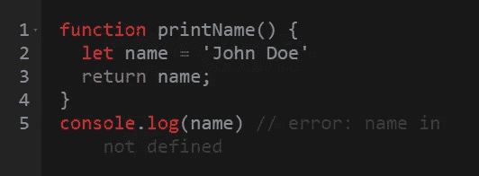
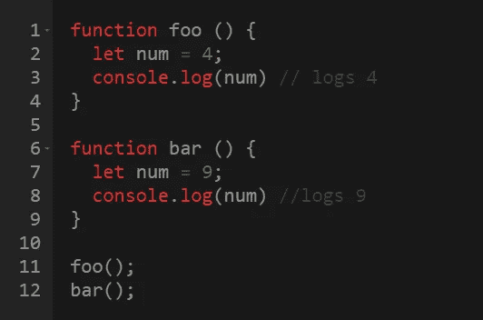
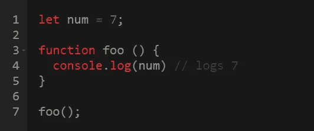
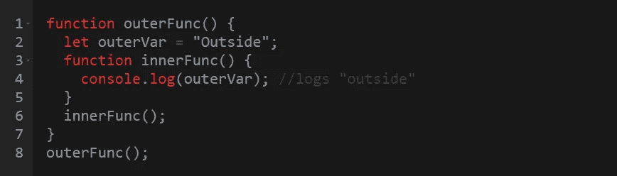
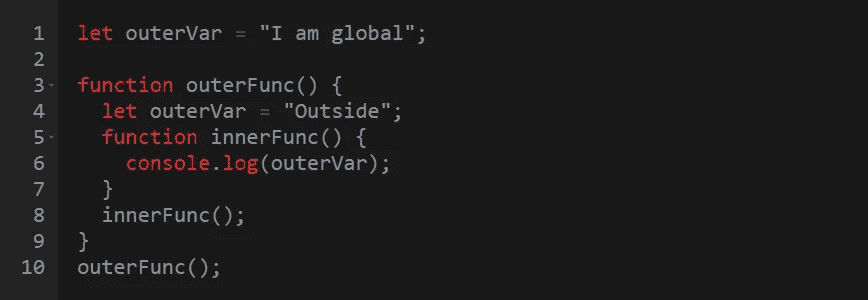
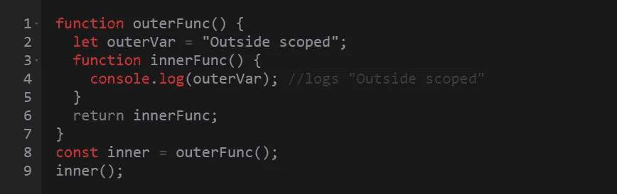
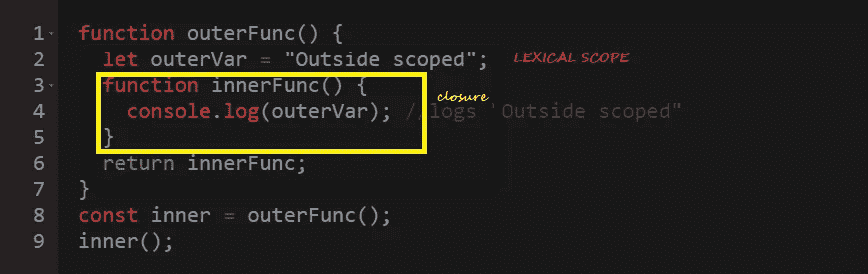

# JavaScript 中的闭包:初学者友好指南

> 原文：<https://javascript.plainenglish.io/closure-in-javascript-3f291eeb8dff?source=collection_archive---------11----------------------->

如果您参加过技术访谈，您可能知道与 JavaScript 闭包相关的问题是如何反复出现的。对于那些正在为此做准备的人来说，你们已经到达了正确的地点。

为了理解闭包，重要的是首先研究一下**局部**和**全局**变量:

## 局部变量

局部变量的作用域在函数内部，不能在函数外部访问:

locally defined ‘name’ can’t be accessed outside

这有助于在不冲突的情况下重用变量名。一些常见的变量可以是*结果*、*计数*、*指数、*等。

‘num’ is locally scoped and has different values accordingly

## 全局变量

函数也可以访问函数外部定义的所有变量。函数外部定义的变量属于 JavaScript 窗口对象:

这里，函数`foo()` 可以访问*全局作用域变量* `*num*` *。*

## 范围嵌套:

如果我们嵌套两个函数呢？换句话说，我们将嵌套两个 ***作用域*** 。例如，`innerFunc()`嵌套在`outerFunc(*)*`中，如下所示:

查看上面的代码，我们看到，变量`outerVar`在函数`outerFunc()`中声明，并在内部函数`innerFunc()`中访问。这意味着我们能够在内部函数中访问外部作用域的变量。

确切地知道 javaScript 如何理解记录在`*innerFunc()*`中的变量`outerVar`**来自`*outerFunc()*`是很有趣的。它通过 ***词法作用域来实现。*** 词法范围仅仅意味着变量的可访问性是由嵌套范围内变量的位置决定的。简单地说，这意味着在外部作用域中声明的变量可以在内部作用域中访问。**

**更简单地说，通过词法范围，JavaScript 如下进行:**

1.  **我看到一个函数`outerFunc()`声明了一个变量`OuterVar`。**
2.  **接下来，我看到一个`innerFunc()`嵌套在`outerFunc()`中。**
3.  **`*innerFunc()*`试图访问一个内部没有任何声明的变量`outerVar`。**
4.  **由于我使用了词法范围，我认为`innerFunc()`中的变量`outerVar`与`outerFunc()`中的变量`outerVar`是同一个变量。**

**如果我们在全局和 T5 声明了同一个变量`outerVar`，会发生什么？`innerFunc()`会访问哪一个？**

****

**如前所述，通过词法范围，JavaScript 将记住`outerFunc()`中的变量声明。因此，输出将是*“外部”。***

# **最后，闭包…**

**现在我们知道了基本知识，我们可以开始谈论结束并结束了！**

****

**我们可以看到，函数`innerFunc()`现在在其词法范围之外被访问。它还能访问变量`outerVar`吗？是的，可以。`innerFunc()` ***关闭*** 或从其词法范围捕获变量`outerVar`。下面给出了直观的解释。**

****

**您会看到`innerFunc()`通过从其外部作用域记住变量`outerVar` 创建了一个闭包。无论你现在在哪里试图访问你的`innerFunc()` ，它都会记住它所捕获的东西。**

# **结论**

**关于闭包的实际例子，我推荐阅读这里的答案。**

** [## JavaScript 中闭包的实际用途是什么？

### 在实践中，闭包可以创造优雅的设计，允许定制…

stackoverflow.com](https://stackoverflow.com/questions/2728278/what-is-a-practical-use-for-a-closure-in-javascript) 

总而言之，闭包是一个从其外部范围捕获变量的函数。不管你在哪里执行变量，它都会记住在它的外部作用域中定义的变量！希望这篇文章对你有帮助。

*更多内容请看*[***plain English . io***](http://plainenglish.io/)**