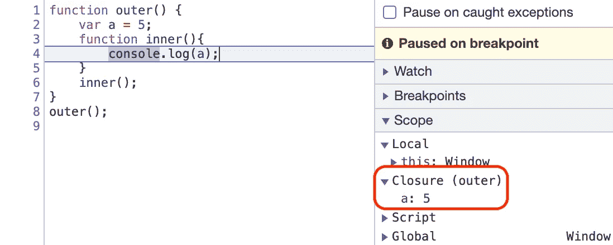
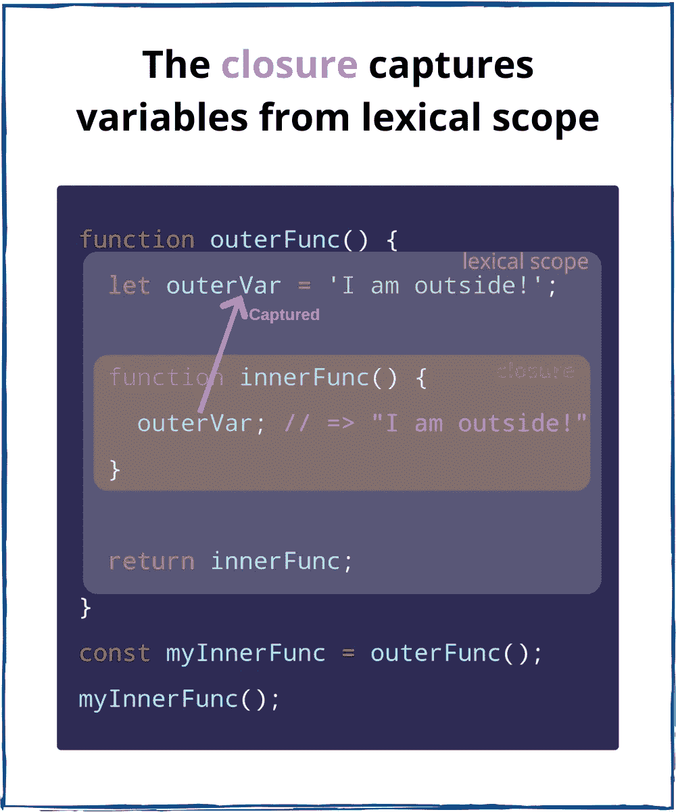
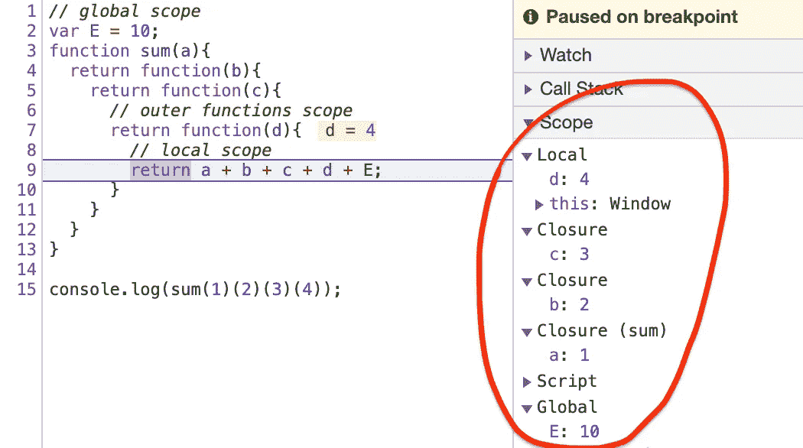

# JavaScript 中闭包如何工作:指南

> 原文：<https://javascript.plainenglish.io/closures-in-javascript-37182198dc20?source=collection_archive---------5----------------------->

## 词法范围、范围链、优点和缺点


> 一个**闭包**是一个函数的组合，该函数被捆绑在一起(被封闭)并引用其周围的状态(即**词法环境**)。

换句话说，闭包让你从内部函数访问外部函数的作用域。在 JavaScript 中，闭包是在每次创建函数时创建的。

# 词法范围

考虑下面的示例代码:

```
function outer() {
    var a = 5;
    function inner(){
        console.log(a);
    }
    inner();
}outer(); //5
```

这里，`outer()`创建了一个名为`a`的局部变量和一个名为`inner()`的函数。`inner()`函数是定义在`outer()`内部的内部函数，并且只在`outer()`函数体内可用。注意`inner()`函数没有自己的局部变量。但是，由于内部函数可以访问外部函数的变量，`inner()`可以访问父函数`outer()`中声明的变量`a`。

注意，`inner()`函数中的`console`语句成功地显示了`a`变量的值，该值是在其父函数中声明的。这是一个*词法* *作用域*的例子，描述了当函数嵌套时解析器如何解析变量名。单词*词法*指的是词法作用域使用变量在源代码中声明的位置来确定该变量在哪里可用。嵌套函数可以访问在其外部作用域中声明的变量。

基本上在这里，`inner()`是和它的词法环境`outer()`捆绑在一起的。第一，`inner()`将检查其局部范围；如果它没有找到`a`，它将转到父词法。所以在`inner()`内部，它与 outer 词法范围内的变量形成了一个闭包，即`inner()`被绑定到了`outer`的变量。



*   当函数从另一个函数返回时，它们仍然保持它们的词法范围，也就是说，它们记得它们实际出现的位置。

```
function outer() {
    var a = 5;
    function inner(){
        console.log(a);
    }
    return inner;
}var x = outer();
x(); //5outer()() //5
```

然而在这里，`outer`不再存在了。然而，`inner()`记住了它的词法范围，也就是说，当我们返回`inner()`时，不仅返回了函数代码，还返回了闭包(函数和词法范围)。

*   闭包的一个重要特征是它在多次调用之间保持外部变量的状态。内部函数不包含变量的单独副本，它只保留外部变量的引用。

```
function outer() {
    var a = 5;
    function inner(){
        console.log(a);
    }
    a = 100;
    return inner;
}
var x= outer();
x(); //100
```

这里`inner()`也将伴随着它的词法范围而来，也就是说`a`将不会引用值，而是引用它的引用。

*   如果我们将局部变量声明改为`let`，如果我们在`outer()`中传递一个额外的参数`b`，在这两种情况下，内部函数仍然形成一个闭包。因为`b`也是内部功能的外部环境的一部分。

```
function outer(b) {
    function inner(){
        console.log(a,b);
    }
    let a = 50;
    return inner;
}
var x= outer('Hello');
x(); //50 "Hello"
```

# 闭包作用域链

每个闭包有三个作用域:

*   本地范围(自己的范围)
*   外部功能范围
*   全球范围

为了进行演示，请考虑以下示例代码:

```
// global scope
var e = 10;
function sum(a){
  return function(b){
    return function(c){
      // outer functions scope
      return function(d){
        // local scope
        return a + b + c + d + e;
      }
    }
  }
}

console.log(sum(1)(2)(3)(4)); // log 20
```



*   现在，如果我们有一个名称冲突的全局变量，即相同的变量名`a`出现在全局变量和外部函数中。那么在这种情况下，将返回 inner `a`或其他函数作用域`a`的值。而全局`a`是全局范围内全新的变量。所以这两个`a`变量是完全不同的。这里的`a`是存在于外部环境中的，如果它不存在那么它就会全局`a`。

```
var a = 10;
function sum(){
  var a = 1;
  return function(b){
    return function(c){
        return a + b + c;
    }
  }
}console.log(sum()(2)(3)); 
//6 (1+2+3)var a = 10;
function sum(){
  //var a = 1;
  return function(b){
    return function(c){
        return a + b + c;
    }
  }
}
console.log(sum()(2)(3));
//15 (10+2+3)
```

# 闭包的优点

## **1)使用私有变量和方法**

Java 之类的语言提供了将方法声明为私有的能力，这意味着它们只能被同一个类中的其他方法调用。JavaScript 没有提供这样做的本地方式，但是可以使用闭包来模拟私有变量和方法。

## **2)数据隐藏和封装**

闭包通过创建私有变量使数据隐藏成为可能，也就是说，其他函数或代码片段将无法访问特定的数据。我们可以说我们可以封装数据，这样程序的其他部分就不能访问它。让我们借助一个例子来理解这一点:

```
function counter(){
    let count = 0;

    return function incrementCounter(){
      count++;
      console.log(count);
    }
}console.log(count); // Uncaught ReferenceError: count is not definedvar counter1 = counter();
counter1(); //1
counter1(); //2var counter2 = counter();
counter2(); //1
counter2(); //2
counter2(); //3
```

这里，`count`变量是私有的或隐藏的，在计数器函数之外是不可访问的。`counter1`和`counter2`完全是不同范围的变量。

现在，如果我们想添加递减计数器，那么好的和可伸缩的方法是创建函数构造函数。

```
function Counter(){
    let count = 0;

    this.incrementCounter = function(){
      count++;
      console.log(count);
    }
    this.decrementCounter  = function(){
      count--;
      console.log(count);
    }
}var counter1 = new Counter(); counter1.incrementCounter(); //1
counter1.incrementCounter(); //2counter1.decrementCounter(); //1
```

## **3)功能匹配**

闭包使得 JavaScript 中的 currying 成为可能。Currying 是一种使用函数的高级技术。Currying 是一种函数转换，它将一个函数从可调用的 as `f(a, b, c)`转换成可调用的 as `f(a)(b)(c)`。当你把一个有多个参数的函数分解成一系列只有一个参数的函数。

```
function add (a, b) {
  return a + b;
}add(3, 4); // returns 7
```

这个函数有两个参数，a 和 b，并返回它们的和。我们现在将搜索这个函数:

```
function add (a) {
  return function (b) {
    return a + b;
  }
}
```

这是一个接受一个参数 a 的函数，返回一个接受另一个参数 b 的函数，这个函数返回它的和。

```
add(3)(4); //7
var add3 = add(3);
add3(4);  //7
```

第一条语句返回 7，类似于 add(3，4)语句。第二条语句定义了一个名为 add3 的新函数，它将把 3 添加到它的参数中。这就是一些人所说的终结。第三条语句使用 add3 运算将 3 加到 4，结果还是 7。

更多细节请参考— [**JavaScript Currying:综合指南**](https://ayushv.medium.com/javascript-currying-comprehensive-guide-e69c47497309)

## **4)函数工厂**

闭包的一个强大用途是使用外部函数作为工厂来创建以某种方式相关的函数。

```
function Job(title) {
    return function(prefix) {
        return prefix + ' ' + title;
    };
}var sales = Job('Salesman');
var manager = Job('Manager');alert(sales('Top'));  // Top Salesman
alert(manager('Assistant to the Regional')); // Assistant to the Regional Manager
alert(manager('Regional')); // Regional Manager
```

使用闭包作为函数工厂是保持 JavaScript 干爽的好方法。五行强大的代码允许我们创建任意数量的具有相似但独特目的的函数。

## **5)仅运行一次功能**

函数通过形成一个闭包来记住函数已经运行了多少次。

```
var something = (function() {
    var executed = false;
    return function() {
        if (!executed) {
            executed = true;
            console.log("do something");
        }
    };
})();something(); // "do something" happens
something(); // nothing happens
```

## **6)设置超时**

是一个方法，在指定的毫秒数后调用一个函数或计算一个表达式。

```
function x(){
   var i = 1;
   setTimeout(function(){
       console.log(i)
   },3000)
   console.log(“After setTimeout”)
}x();
//After setTimeout
// 1 (after 3 sec)
```

这里，setTimeout 中的函数形成了一个闭包。所以这个函数记住了对“我”的引用。所以无论这个函数去哪里，它都会带着“I”的值。setTimeout 获取一个回调函数，并将其存储在某个地方，然后为其附加一个计时器。一旦计时器超时，它将获取函数并将其放入当前调用堆栈，然后运行它。

## **7)记忆化**

记忆化是使长递归/迭代函数运行得更快的编程实践。这里也使用了闭包。下面是一个基本`memoize`函数的例子:

8)闭包也用于在异步世界、迭代器和模块设计模式中维护状态。

# **关闭的弊端**

*   闭包防止函数内部的变量被内存释放，也就是说，只要闭包是活动的，内存就不能被垃圾收集。这些变量会占用内存，消耗大量内存，可能导致**内存泄漏。**这个问题的解决方案是在不使用局部变量时及时删除所有不必要的局部变量，即设置闭包为空。
*   在函数中创建函数会导致内存重复，并导致应用程序的**变慢。这个问题的解决方案是只在需要隐私的时候使用闭包。否则，使用模块模式创建具有共享方法的新对象。**

# 结论

希望这能让您对 JavaScript 中的闭包概念感觉更舒服一些。

感谢您的阅读:)

*更多内容尽在*[*plain English . io*](http://plainenglish.io/)