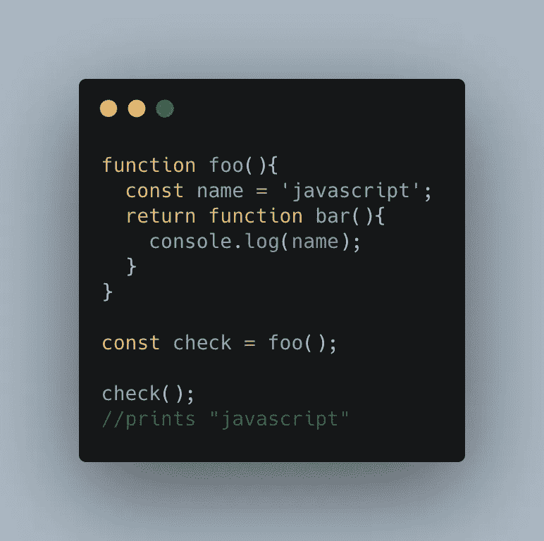
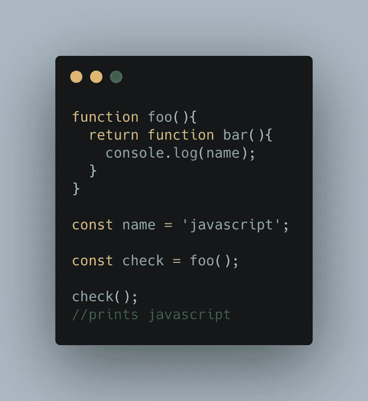
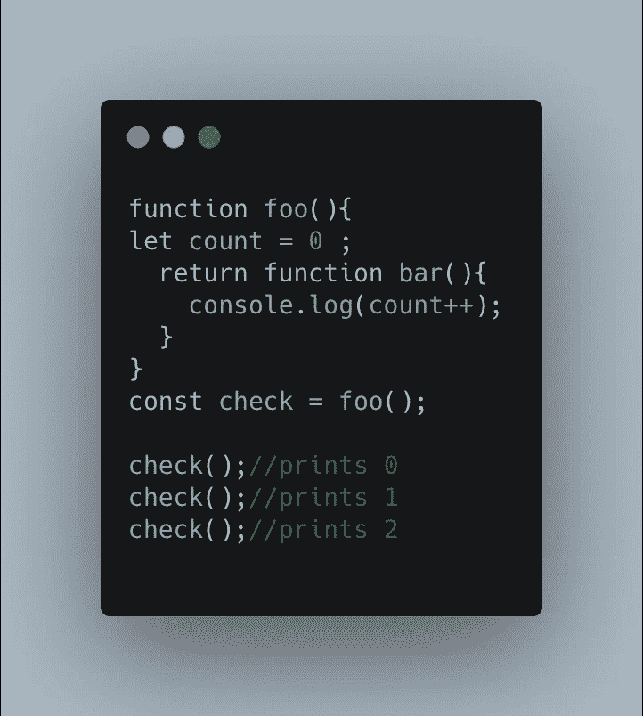
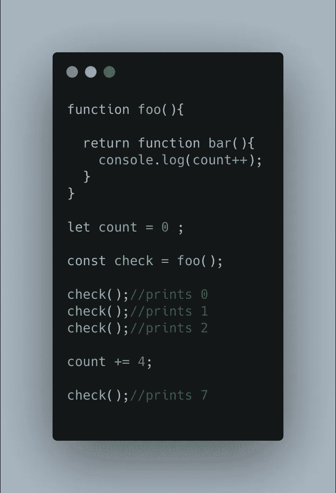

# JavaScript — JS 访谈系列中的闭包

> 原文：<https://javascript.plainenglish.io/closures-in-javascript-js-interview-series-c93af277bfac?source=collection_archive---------1----------------------->

JavaScript 中的闭包被认为是最受欢迎的概念之一，也是 JavaScript 访谈中经常出现的话题。在本文中，我们将探讨 JavaScript 中的闭包以及它们是如何工作的。

按照 Kyle Simpson 的说法，闭包的定义如下:*“闭包是一种 JavaScript 机制，因为它使得函数倾向于记住并访问其作用域之外描述的变量，即使函数本身是在不同的作用域中执行的。”*

让我稍微理解一下。现在我们将通过一个例子来理解这个定义。

`*foo()*`函数返回`*bar()*`函数。当执行`*foo()*`函数时，它返回存储在*校验*变量中的`*bar()*`函数。当执行`*check()*`函数时，这又调用了`*bar()*`函数，我们看到“javascript”被打印出来。

这是因为函数`*bar()*`用变量*名*形成了一个闭包，当函数`*bar()*`被执行时，JavaScript 会试图在`*bar()*`函数的作用域内找到在`*console.log(name)*`中定义的变量*名*。一旦 JavaScript 在其作用域内找不到变量*名称*，它将尝试在其直接外部作用域内搜索变量*名称*，以此类推。

在此之后，函数`*bar()*` 将记住变量*的名称*和它的值，即使它是在不同的作用域(上面例子中的全局作用域)中执行的。

让我们用另一个例子来验证这一点。

这里，变量*名称*在函数`*foo()*`的作用域中找不到，因此 JavaScript 从更高的作用域中选择它。

现在让我们更进一步。

这里，函数`*foo()*` 与变量 *count* 形成一个闭包，并倾向于记住它的值。因此，对于函数`*bar()*`的每次调用，我们得到变量*计数*的一个增量值。

让我们尝试另一个结合了上述两个概念的例子。

显然，函数`*bar()*`与变量*计数*形成了一个闭包，并且倾向于记住它。因此，在最后一行，我们看到`*check()*` 函数打印了`‘7’`。

## **闭包的优缺点**

**优点**

1.  闭包有助于数据封装，也就是说，使用闭包，您可以将数据存储在一个单独的范围内，并且只在必要的时候共享它。
2.  现代 JavaScript 库(如 React)严重依赖闭包来呈现状态或属性变化时的组件。

**缺点**

1.  闭包会消耗大量内存空间，因为函数需要将变量的值存储在内存中，即使变量的函数本身不会在代码中多次使用。

感谢您的阅读。欢迎在评论框中留下任何评论和建议。

*更多内容请看*[***plain English . io***](http://plainenglish.io)