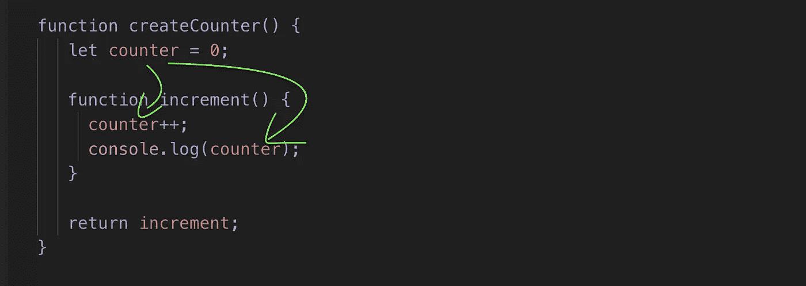

# JavaScript 中的闭包变得简单

> 原文：<https://javascript.plainenglish.io/closures-in-javascript-made-simple-afb0c7dab5f1?source=collection_archive---------15----------------------->

## 你知道 JavaScript 在执行后保持你的函数作用域活动吗？


Photo by [Juanjo Jaramillo](https://unsplash.com/@juanjodev02?utm_source=medium&utm_medium=referral) on [Unsplash](https://unsplash.com?utm_source=medium&utm_medium=referral)

JavaScript 中的闭包意味着内部函数可以访问外部函数的变量。这也适用于外部函数执行完毕的情况。

# JavaScript 中的常规函数是如何工作的

让我们简单看看 JavaScript 中的常规函数是如何工作的。

JavaScript 函数创建了一个新的作用域。在该范围内定义的变量不能从外部访问。

下面是一个函数示例:

```
**function** hello() {
  **const** word = "Hello";
  console.log(word);
}hello();
```

输出:

```
Hello
```

当调用`hello()`时，花括号之间的代码运行。在此期间，函数`hello()`可以访问和使用它的变量`word`。

试图访问函数外部的`hello`不起作用:

```
**function** hello() {
  **const** word = "Hello";
}console.log(word);
```

结果:

```
**Uncaught ReferenceError: word is not defined**
```

# JavaScript 中的闭包

JavaScript 中的闭包使得访问函数外部的变量成为可能。每次运行一个函数时，都会创建一个闭包。

闭包让您可以从内部函数访问外部函数的作用域。

例如，让我们检查这个脚本的行为，其中一个外部函数有一个内部函数:

*   `outer()`函数返回`inner()`函数。这意味着您可以将`inner()`函数存储到一个变量中:

```
**const** greet = outer()
```

*   之后，您可以调用`greet()`来执行`inner()`函数的代码:

```
greet()
```

结果:

```
Hello world
```

但是等等……`greet()`只执行`inner()`函数的代码，看起来像这样:

```
**function** inner() {
     **const** b = "World"; 
     console.log(a+b);
}
```

这难道不意味着当只定义了`b`时，它会尝试记录`a+b`吗？但是你刚刚看到它工作了。这意味着`greet()`仍然需要知道`a`的值。

由于 JavaScript 的封闭性，事实确实如此。闭包意味着即使在执行之后，内部函数也可以访问外部函数的变量。

让我们再来看看`outer()`功能:

*   `inner()`函数自动知道它在一个名为`outer()`的函数中。因此，它“保存”属于`outer()`功能的变量以备后用。这就是为什么`greet()`仍然可以访问值`a`的原因。

干得好。现在您已经了解了 JavaScript 中闭包的基础知识。

# 闭包的真实例子

让我们设置一个简单的计数器来跟踪点击次数，例如:

```
**var** counter = 0;**function** increment() {
  counter++;
}
```

调用`increment()`有效。但是有一个问题:变量`counter`可以在`increment()`之外进行调整。它可能会被意外地设置为例如代码中其他地方的`1000`。这是不好的做法。

为了构建一个可靠的计数器，你需要配置`increment()`函数，使得代码的其他部分不会弄乱`counter`变量。

这就是闭包派上用场的地方。让我们通过在函数中创建一个函数来重新实现计数器:

这段代码的工作方式与您之前看到的`outer()` `inner()`函数组合相同。它利用了 JavaScript 的封闭性:

*   `createCounter()`是外层功能。它将变量`counter`设置为`0`并返回内部函数`increment()`。
*   `increment()`函数负责给`counter`加值。
*   即使在调用`createCounter()`之后，`increment()`函数也可以访问`createCounter()`的变量。这是由于 JavaScript 的封闭性。

让我们使用这段代码。

*   首先，调用`createCounter()`来设置计数器:

```
**let** add = createCounter();
```

*   现在可以调用`add()`来增加`counter`的值。让我们做三次，看看会发生什么:

```
add();
add();
add();
```

输出:

```
1
2
3
```

# 结论

在 JavaScript 中，闭包是一个使函数能够访问其作用域之外的变量的特性——即使在外部作用域被破坏之后。



The variable counter can be accessed in the inner function increment.

感谢阅读。我希望你觉得有用

# 也阅读

[](https://www.codingem.com/50-buzzwords-of-web-development-and-design-in-2021/) [## 2021 年网络开发和设计的 50 多个流行语

### 学习创业公司使用的网页开发和网页设计语言。这篇文章是关于…的很好的入门读物

www.codingem.com](https://www.codingem.com/50-buzzwords-of-web-development-and-design-in-2021/) [](https://medium.com/geekculture/20-javascript-snippets-to-code-like-a-pro-86f5fda5598e) [## 20 个 JavaScript 代码片段，让您像专业人士一样编写代码

### 提升您的 JavaScript 技能

medium.com](https://medium.com/geekculture/20-javascript-snippets-to-code-like-a-pro-86f5fda5598e) 

# 参考

[](https://developer.mozilla.org/en-US/docs/Web/JavaScript/Closures) [## 闭包- JavaScript | MDN

### 闭包是捆绑在一起(封闭的)的函数与对其周围状态的引用的组合

developer.mozilla.org](https://developer.mozilla.org/en-US/docs/Web/JavaScript/Closures) 

*更多内容请看*[***plain English . io***](http://plainenglish.io/)