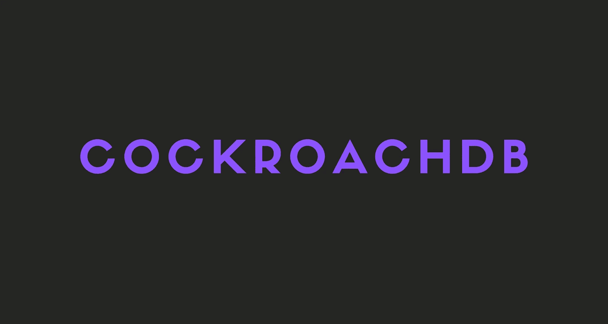

# CockroachDB -最好的 SQL 数据库

> 原文：<https://javascript.plainenglish.io/cockroachdb-the-best-sql-database-67ba81dead6a?source=collection_archive---------14----------------------->

了解 CockroachDB 是什么，以及为什么应该考虑在您的下一个项目中使用它。

在这个故事中，我将谈论 CockroachDB 是什么，它的特性，以及何时应该使用它。

一定要检查 CockroachDB 的官方网站。

 [## 蟑螂实验室，建造蟑螂的公司

### CockroachDB 是一个分布式数据库，带有用于云应用程序的标准 SQL。CockroachDB 为公司提供动力，如…

www.cockroachlabs.com](https://www.cockroachlabs.com/) 

开始吧！

# CockroachDB 是什么？

CockroachDB 是一个开源的分布式 SQL 数据库，由蟑螂实验室的前 Google 工程师团队开发。

该产品被设计为在云中运行，并以其弹性和可伸缩性而闻名。虽然您可以在单台机器上运行它，但是随着组织需求的增长，您也可以将其扩展到数百或数千台服务器。

CockroachDB 的某些方面受到了 Spanner 的启发，Spanner 是 Google 的全球分布式数据库产品。

基本上，CockroachDB 是一个非常强大和可伸缩的分布式 SQL 数据库。

# CockroachDB 功能

蟑螂数据库有 3 个主要特点。可扩展性、故障安全和兼容性。

## 可量测性

谈到可伸缩性，数据库客户经常面临艰难的选择。

像 MySQL 这样的关系数据库提供了很强的一致性，但是它们并没有真正的水平伸缩。

另一方面，NoSQL 数据库像做梦一样水平扩展，但是用户需要处理最终一致性的问题。最终一致性是指在更新后，如果您立即读取数据，您可能会看到也可能看不到刚刚发生的更改。

CockroachDB 为用户提供了一个两全其美的解决方案。它是一个可以水平扩展的 SQL 数据库。如果您需要支持更大的容量，您可以简单地添加更多的机器。有了 CockroachDB，服务器会自动复制和重新平衡它们自己，这使您的系统在增长和发展时保持可用。

## 幸存的失败

蟑螂因几乎不可能被杀死而臭名昭著。这种生存能力激发了 CockroachDB 的名字，它被设计成能够在硬件和软件故障中生存。它的弹性在很大程度上是由于它使用了复制和自动修复。让我们来谈谈这两个过程是如何工作的:

*   **复制:**cocroach db 通过复制数据来确保您的数据始终可用，并通过使用 Raft consensus 算法来保证数据在这些副本之间保持一致。您可以用多种方式设计副本位置，这取决于您的网络安排和您要防范的故障类型。例如，您可以将副本放在同一机架内的不同服务器上，以经受住服务器故障，或者如果您希望容忍网络或电源故障，也可以将它们放在不同机架上的不同服务器上。
*   **自动修复:**cocroach db 使用 Raft 一致性算法在一组副本之间保持平稳运行，以防出现短期故障。一旦失败的复制副本恢复在线，它会迅速重新加入该组。长期的故障和停机也可以无缝处理，CockroachDB 会自动重新平衡工作副本，以处理任何缺失的节点。

## 和睦相处

CockroachDB 被设计成与 PostgreSQL 高度兼容。

这是很重要的一点，不仅仅是因为这意味着用户不需要学习很多新的东西来使用 CockroachDB。这意味着一些为使用 PostgreSQL 而编写的应用程序无需任何修改就可以使用 CockroachDB。

这也意味着您可以使用各种现有的 PostgreSQL 客户端驱动程序与 CockroachDB 对话。已经用几种语言测试过了。

# 什么时候和什么人应该使用 CockroachDB？

## 当...的时候

> CockroachDB 非常适合要求可靠、可用和正确的数据以及毫秒级响应时间的应用程序，而不管规模如何。它旨在以最少的配置和运营开销自动复制、重新平衡和恢复。具体的使用案例包括:
> 
> -分布式或复制的 OLTP
> 
> -多数据中心部署
> 
> -多区域部署
> 
> -云迁移
> 
> -为云构建的基础设施计划
> 
> CockroachDB 在 2 毫秒或更短时间内返回单行读取，在 4 毫秒或更短时间内返回单行写入，并支持各种 SQL 和操作调优实践来优化查询性能。然而，CockroachDB 还不适合重分析/ OLAP。
> 
> -cocroach db 常见问题

我个人会将 CockroachDB 用于任何需要 SQL 的强大功能和 NoSQL 的可伸缩性的项目。对我来说，CockroachDB 是最好也是最容易使用的数据库。

## 谁

任何人都可以使用 CockroachDB。不管你是新手还是有经验的开发人员，我都推荐试试 CockroachDB。

真的没那么难。如果你知道如何使用 PostgreSQL，你也会很容易学会 CockroachDB。

# 最后的想法

好吧，就这样。您刚刚了解了 CockroachDB 是什么以及为什么应该使用它。一定要试试看，看你喜不喜欢！

希望这个故事对你有帮助。我很想听听你对这个故事和 CockroachDB 的看法！

# 仅此而已。感谢您阅读这个故事！

如果你喜欢这个故事，一定要为它鼓掌！你想问我什么都可以。

在 Twitter 上关注我:

 [## re _ ally 边缘

twitter.com](https://twitter.com/Re_allyedge) 

在 Patreon 上支持我:

 [## 阿里木阿尔斯兰卡亚是创造编程故事和教程。帕特里翁

### 今天就成为阿里木阿尔斯兰卡亚的赞助人:在世界上最大的…

www.patreon.com](https://www.patreon.com/allyedge) 

*更多内容尽在*[***plain English . io***](http://plainenglish.io/)