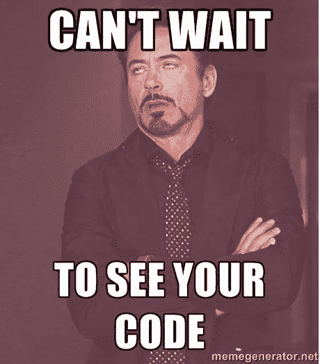

# 让你振作起来的代码评审迷因

> 原文：<https://javascript.plainenglish.io/code-review-memes-to-cheer-you-up-15d4d9cf02c8?source=collection_archive---------5----------------------->

## PRS、评论、批准和其他日常问题

Photo by [BARBARA RIBEIRO](https://www.pexels.com/@barbarar?utm_content=attributionCopyText&utm_medium=referral&utm_source=pexels) from [Pexels](https://www.pexels.com/photo/cheerful-baby-on-sandy-sea-shore-in-stormy-weather-5731169/?utm_content=attributionCopyText&utm_medium=referral&utm_source=pexels)

代码审查已经成为计算机编程领域的一个改变游戏规则的过程。它旨在保证在项目中保持一定的代码质量。这个过程可能因团队而异，但它总是存在的。

是同龄人之间最常见的摩擦点之一。有些人可能会比其他人更优雅地接受评论和建议。软技能是确保不发生沟通失误的关键。

在这篇文章中，我们将回顾通过迷因我们每天可能面临的最常见的场景。我敢肯定，大多数可以涉及至少一对夫妇的情况下描述如下。

不久前，一些团队还不愿意采用代码评审过程。他们没有看到这一点，或者想避免任何同事纠纷。尽管这个过程被证明是必要的。

Credit: [giulianac](https://imgur.com/user/giulianac) at imgur.com

## 我们的第一次公关

当你来到一个新的团队时，你可能不知道它会带给你什么。所以最好谨慎行事…

Credit: anonymous at memeprogrammer.blogspot.com

## 为什么不允许我们编写自己的代码

如果您可以审查自己的代码，会发生什么？很简单，我们的代码总是完美的。

Credit: [RamakantGangwar](https://imgflip.com/user/RamakantGangwar) on imgflip.com

## 获得反馈

这里我们有一个最常见的场景:没有人审查我们的代码。我们可以耐心等待，只希望有人会花时间看看我们的代码。

Credit: [PS6](https://imgflip.com/user/PS6) on imgflip.com

经常地，我们将不得不在要求代码评审中扮演一个积极的角色。也许是在闲暇时大喊一声，或者快速走到同事的办公桌前。

Credit: [JoeHeyming](https://imgur.com/user/JoeHeyming) on imgur.com

之后，您可以放松下来，等待代码评审的到来。

Credit: anonymous at [meme generator](https://memegenerator.net/instance/71577877/the-dude-code-review-im-waiting-dude)

只是不要等太久。

Credit: Anthony Urwin on [twitter.com](https://twitter.com/anthonyurwin/status/913172435184246784)

经过一段相当长的等待时间后，你就有了乞求更多的权利。尽你最大的努力。

Credit: anonymous at [memegenerator.net](https://memegenerator.net/instance/68411709/pr-please-hey-could-i-get-a-quick-code-review-please)

## 同辈心情喜欢

同事们渴望看到其他同事编写代码。他们已经等了一整天了。

Credit: anonymous at [meme generator](https://memegenerator.net/instance/71577877/the-dude-code-review-im-waiting-dude)

我们都知道同行是如何善意地审查我们的代码的。对我们来说不幸的是，他们正在等待一个错误来照亮我们的公关。

Credit: The Cat on [twitter.com](https://twitter.com/Me_llaman_jota)

## 获得反馈

最后，一些反馈让你如愿以偿。有些可能是神秘的。

Credit: [Kobzol](https://www.reddit.com/user/Kobzol/) on reddit

确保你花时间回复你的简历中的所有评论。

Credit: Diogo Costa at [dev.to](https://dev.to/industriousparadigm/code-review-you-don-t-want-your-pr-approved-1dl7)

有些情况下，有些评论可能会让人觉得是个笑话……或者可能不是？谁知道呢？发挥你的软技能。

Credit: [Eumir Gaspar](https://www.freecodecamp.org/news/author/eumir/) on freeecodecamp.com

# 如何增加你被批准的机会？

## 1.评论

您可以添加注释以使代码更具可读性:

Credit: anonymous at meme generator

## 2.试验

总会有人看你的试卷。确保包含相当数量的信息。

Credit: Paul Carduner on [medium.com](https://medium.com/nori-carbon-removal/developer-productivity-and-code-review-345fc18c8197)

不要成为那些牛仔中的一员…那种风格不再酷了。我们都知道结局。

Credit: Sales Lopes on [saleslopes.me](https://www.saleslopes.me/blogs/over-engineering-solving-problems-you-don-t-have)

## 3.代码可读性

你不应该仅仅关注代码的工作。代码应该是可读的，以便其他人理解正在发生的事情。

Credit: [u/SebastianScaini](https://www.reddit.com/user/SebastianScaini/) on reddit

## 4.避免过度设计

过度设计可能会把你带到你不想去的地方。不惜一切代价避免。

Credit: u/jamhamster on [reddit](https://www.reddit.com/r/memes/comments/ivg07c/theres_no_engineering_like_overengineering/)

## 破解任何代码审查

有一个广为人知的黑客，每次都管用。它会让你成为一名专家:

Credit: @slidenerd on [twitter.com](https://twitter.com/slidenerdtech/status/614117141676204032?lang=es)

这里有一个更简单的说法:

## 你的幸运日

你的代码偶尔会在第一次尝试时成功。这是一个值得庆祝的事件。

Credit: superuser at [devrant](https://devrant.com/rants/24716/code-review)

# 最后的想法

代码审查过程需要一段时间来掌握。每支球队都不一样。所以不要因此而沮丧。调整只是时间问题。很快你将能够提供一些通过标准的代码。

如今，有了 ESLint、Github Actions、prettier 这些工具，一切都变得简单了。最琐碎的检查可能发生在预提交/CI 上。你可能只关注于提供高质量的易读代码。

干杯—

# 有关系的

 [## 7 个软件开发原则可以归结为迷因

### “吻”，“干”，“YAGNI”，还有更多有趣的解释

better 编程. pub](https://betterprogramming.pub/7-software-development-principles-boiled-down-to-memes-768589c71a81) 

*更多内容看*[***plain English . io***](http://plainenglish.io/)