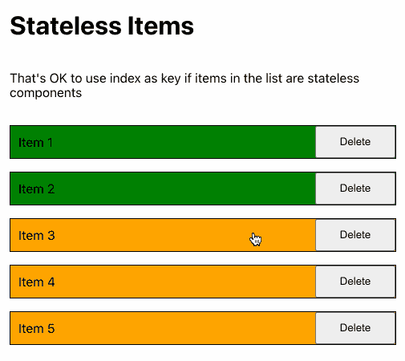
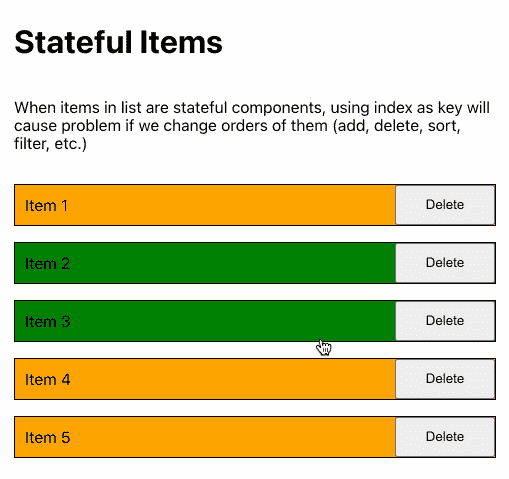
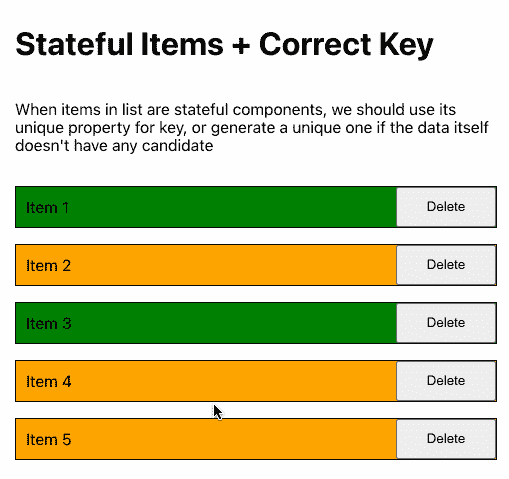

# 代码审查:在 React 应用程序中呈现列表时使用好的键

> 原文：<https://javascript.plainenglish.io/code-review-use-a-good-key-when-rendering-lists-in-your-react-b28d01319eed?source=collection_archive---------17----------------------->

什么时候可以使用索引作为键，什么时候应该为它生成另一个值？

Photo by [Bradyn Trollip](https://unsplash.com/@bradyn) on [Unsplash](https://unsplash.com/s/photos/sequence)

如今，呈现项目列表是大多数 UI 的常见场景。在官方文件中，React 声明`key`是你的列表的一个基本属性。在这篇文章中，我将总结一些关于它的用法的注意事项。

# 在某些情况下，索引已经足够好了

# 静态列表

假设您只显示项目，而没有机会对列表进行重新排序，比如删除一个对象、过滤或移动东西。在那种情况下，`index`对`key`来说是一条安全又容易的路。

# 无状态组件列表

如果你的项目是无状态的组件，使用`index`作为`key`也是可以的，即使你必须改变它们的顺序。

尽管这种方法没有针对渲染性能进行优化，但它不会直接影响用户体验。如果您的列表很小，并且子组件没有那么复杂，您可以将`index`用作`key`。(你可以在 React 的[官方文档](https://reactjs.org/docs/reconciliation.html#recursing-on-children)中阅读更多关于 React 如何使用`key`来优化渲染过程的信息)。

在下面的示例中，我有一个带有不同标签和颜色的项目列表。我将该信息存储为列表的一个状态，并使用无状态组件来呈现其子元素。当我删除一些项目时，标签和颜色仍然匹配良好。这意味着在这种情况下`index`作为`key`工作良好。

Index can work if the list only contains stateless components

# 何时避免使用索引

如果你的项目是有状态的组件，并且用户可以改变他们的顺序，使用`index`作为`key`将会弄乱项目的状态。

下面的示例与上面的示例具有相同的功能。不同的是，我将颜色代码移到了子组件的`state`中。这意味着我现在使用有状态组件而不是无状态组件。当我删除一些项目时，颜色都乱了。

It’s problematic if keys weren’t set correctly

# 怎么处理呢

当您呈现有状态组件的列表并想要对它们重新排序时，您的数据必须有一个惟一的值用作`index`。如果没有，您应该生成一个。

在下面的例子中，我的列表是一个没有任何唯一属性的字符串数组。我必须用新生成的 ID 将每一项转换成一个对象，对于我的有状态子组件，这个 ID 变成了`key`。当我重新排序列表时，这个 ID 确保了正确的状态。

Correct key solves the problem with Stateful Items

# 不要在渲染中生成 ID

不要在渲染中生成 ID。这种行为是一种不好的做法，原因有很多:

*   这些键会改变每一次渲染。它强制将项目视为新添加的，并总是重新呈现。
*   对于呈现动作来说，生成 ID 可能是一项开销很大任务。

ID 应该是列表的永久值。它应该在调用者处生成(如果你使用 props 的话)或者随你的状态一起生成。

# 结论

*   如果您的数据有唯一的属性，请使用它。
*   如果你不需要重新排列你的列表，使用`index`就足够了。
*   如果你需要对你的列表重新排序，并且你的子组件是无状态的，那么使用`index`是可以的，尽管它没有针对渲染性能进行优化。
*   在其他情况下，您必须首先为列表数据生成一个唯一的值。这个值应该是永久的，不应该在渲染中改变。

这篇文章是我关于代码评审的系列文章的一部分，它讲述了我在评审代码时的笔记。对某些人来说，它们中的每一个都可能很小或者没什么特别的。但是因为一个小小的错误会让开发人员付出很大的代价，所以其他人留意所有的可能性可能会有所帮助。

我已经把上面的样本放在了 [Github 库](https://github.com/huynvk/react-small-demos/tree/main/react-key)中，以防有人想试用它们。

*原发布于*[*https://huynvk . dev*](https://huynvk.dev/blog/code-review-use-a-good-key-when-rendering-lists-in-your-react)*。*

*更多内容请看*[***plain English . io***](http://plainenglish.io/)