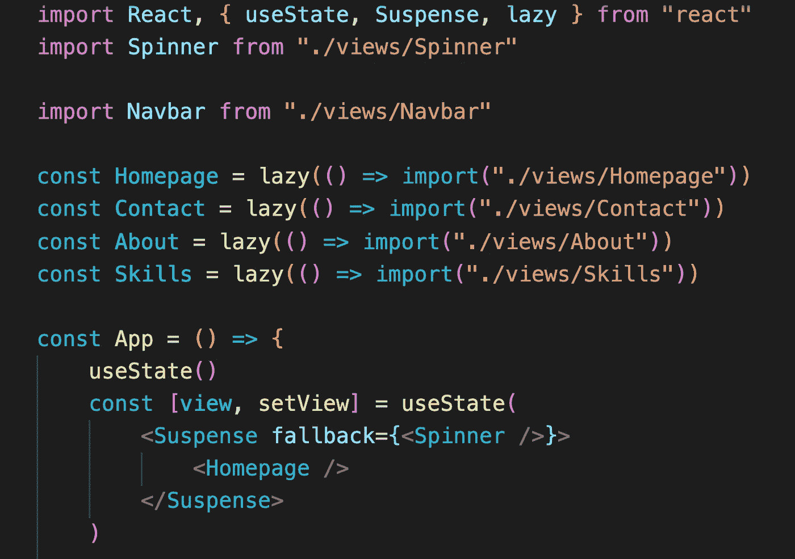

# 使用 React.lazy()进行代码拆分

> 原文：<https://javascript.plainenglish.io/code-splitting-with-react-lazy-6c6b534c8028?source=collection_archive---------22----------------------->


Photo by [Lautaro Andreani](https://unsplash.com/@lautaroandreani?utm_source=medium&utm_medium=referral) on [Unsplash](https://unsplash.com?utm_source=medium&utm_medium=referral)

我使用 React 已经两年多了，每天我都学到很多东西。我已经为大型项目——有太多事情正在进行的项目——和小型项目——使用了 React，小型项目的功能数量有限，需要担心的事情较少。

当我决定建立我的投资组合时，React 是我的第一选择。我的作品集也变成了一个沙箱，用来尝试和实验我在 React 中学到的新东西。这个想法过去是，现在仍然是，学习新概念→在投资组合中使用它们(通过一些重构)。如果它能正常工作，没有任何问题，那么它就会被部署。如果没有，那么就撤销所有的改变，学习更多更好的知识。


今天，我想到在我的文件夹中实现代码分割的概念，使用 React 库中可用的`lazy()`函数。在开始讨论它的作用之前，让我快速地讨论一下捆绑。

> 捆绑是跟随导入的文件并将它们合并成单个文件的过程:一个“捆绑包”。然后，这个包可以包含在网页上，一次加载整个应用程序。React 官方网站。

简而言之，捆绑就是获取项目的所有代码并从中生成一个文件。这意味着项目越大，包的大小就越大，这会增加网站/web 应用程序的下载/加载时间。这就是代码分割的用武之地。

如果我们使用`lazy()`在 React 应用程序中动态导入组件，在构建/捆绑过程中，不是创建单个捆绑文件，而是创建多个更小的文件或块。现在，当我们访问页面时，完整的包并没有立即下载，这最终使得我们的应用程序的加载时间更快。这并不意味着我们编写更少的代码，而是我们的网站/网络应用程序为我们(或公众)提供服务的方式发生了永久性的改变。

现在，有几件事情一起工作，为了这个工作。用`lazy()`函数导入的组件需要用`<Suspense>`标签包装，并指定`fallback`属性。

这就是我们通常在 React 中导入组件的方式，对吗？

```
import React from 'reactimport ComponentA from './components/ComponentA'
import ComponentB from './misc/ComponentB'
```

现在，这就是我们如何使用`lazy()`动态导入组件——也就是说，组件只在需要的时候才被加载(或者从完整的包中下载相应的代码块)。

```
import React, { Suspense, lazy } from 'react'const ComponentA = lazy(() => import('./components/ComponentA'))
const ComponentB = lazy(() => import('./misc/ComponentB'))
```

为了让它现在工作，我们需要将 ComponentA 和 ComponentB 包装在一个`<Suspense>`标签中，并在`fallback`属性中提到一个后备 UI。后备 UI /组件是当我们的组件被下载时将显示的内容，它可以是另一个 React 组件或者像`<div>Loading…</div>`一样简单的东西。如果您选择使用 react 组件，请记住不要动态导入它，否则它会违背作为后备的目的。

```
const Homepage = () => {
    return (
        <Suspense fallback={<div>Loading...</div>}
            <ComponentA />
        </Suspense> <Suspense fallback={<div>Loading...</div>}
            <ComponentB />
        </Suspense>
    )
}
```



I am using a Spinner component as the fallback, which is why it is not dynamically imported.

这样，我们成功地将我们的代码分割成更小的块，这些块将在应用程序/网站使用`npm run build`脚本捆绑后创建。对于较小的应用程序来说，加载组件所花的时间甚至可能很短，以至于回退 UI 永远不会出现。但是对于更大的应用程序，它肯定会出现。


More the number of dynamic imports, more will be the chunks created at the end.

我希望这篇文章对你有帮助。我很感谢你的来访。如果我错过/搞砸了什么，请留下评论，我会尽快纠正。

干杯！

#我们一起学习#发展

*更多内容看* [***说白了就是***](http://plainenglish.io/) *。报名参加我们的* [***免费周报***](http://newsletter.plainenglish.io/) *。在我们的* [***社区获得独家访问写作机会和建议***](https://discord.gg/GtDtUAvyhW) *。*