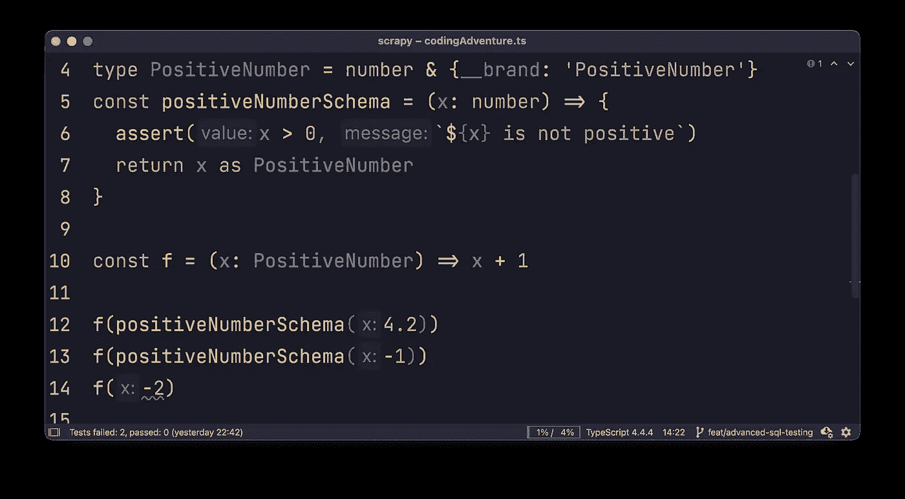
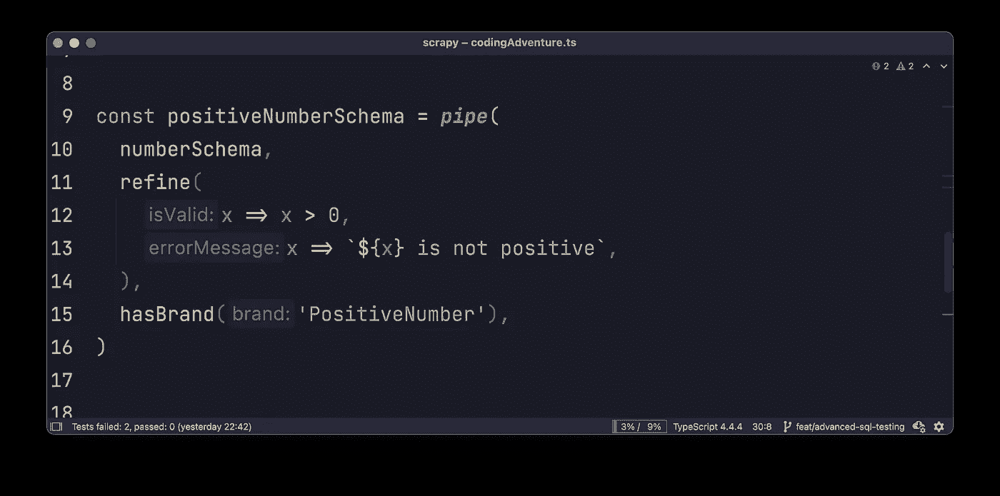

# 编码冒险:TypeScript 中的 PositiveNumber

> 原文：<https://javascript.plainenglish.io/coding-adventure-positivenumber-in-typescript-8c642c17bc76?source=collection_archive---------0----------------------->

## 编码冒险

你能做一个正数类型吗？了解如何为您的 TypeScript 类型编写高级规则。

Can you make a PositiveNumber type?

# 你会做正数吗？

在使用 TypeScript 的第一天，我学习了像数字、字符串和布尔这样的基本类型。但是我很失望没有找到`PositiveNumber`。

没有这么基本和有用的类型，我怎么能写出我的类型安全程序呢？我想要的东西就像上面的图片。

在学习了 6 个月的打字技巧后，我终于可以做我的 PositiveNumber 了。今天，我邀请您参与这次编码冒险。

# 正数=数字

非常简单明了。然而，行不通。我们能做得更好吗？

# 对于正数，我们需要运行时检查

为了检查数字符号，我们需要一个运行时值检查来确定。有一种方法可以在编译时在 TypeScipt 中实现，这是一种将数字转换为字符串并检查第一个字符的巧妙方法，但是这 20 行 TS 魔术并不实用。

positiveNumberSchema()会将任何数字转换为 PositiveNumber。如果数字不是正数，assert()将抛出异常。

好多了，但是我们仍然没有红色的曲线:

positiveNumberSchema(-1)将在运行时抛出异常。然而，对于 f(-2)，我们仍然没有得到错误。我们在 f(x)中的 x 仍然可以是负数。让我们修复它，并添加**品牌**。

# 对于正数，我们需要品牌

我们将我们的正数定义为数字+_ _ 品牌。这是一个很酷的打字技巧！

现在我们不能将任何数字转换成正数。检查这个:

positiveNumberSchema()返回 PositiveNumber，所以我们可以调用 f()而不会出错。但是-2 只是一个数字，它没有品牌`{__brand: ‘PositiveNumber’}`。因为品牌部分丢失，TypeScript 报错:

但是我们可以在 positiveNumberSchema() tho 中找到同样的错误:

用“as”造型可以很容易地解决这个问题:

让我们检查一下当前的结果

现在我们可以 100%确定，除非有人使用“as”强制转换，否则 f()将以正数被调用。

我们甚至可以组合我们的函数，不需要反复检查数字是否为正数。所有的检查都发生在程序的边界上。f()和 f2()保证用正数调用:

# 将 any 转换为正数

通常，节点/快速路线参数和数据库查询结果具有“任意”或“未知”类型。如果我告诉你 positiveNumberSchema()可以被修改来接收任何类型，会怎么样？

当您的程序从外部接收输入时，这很有用:节点/快速路由调用或数据库查询结果:

我们可以想出很酷的规则，比如从用户输入中去掉空格，将字符串转换成数字。或者我们可以将 true 转换为 1。但是如果我们不能将输入转换成正数，我们将抛出一个异常:

让我们使用 pipe()组合重写 positiveNumberSchema():

*   我将为我的管道使用“lodash/fp”模块()
*   refine()是 assert()的包装器，所以我们可以用 pipe()链接它
*   hasBrand()是“as”造型的包装器，所以我们可以用 pipe()链接它

基本上，从 positiveNumberSchema()返回的任何值都是正数。我们可以重写正数类型定义:

# 将正数转换为价格

但是我们可以更深入。

如果你正在做一个交易应用程序的后台，你的用户可以输入价格。您还将价格存储在数据库中。你所有的价格都是美元。诀窍是，您的价格应该是正数，并且只支持逗号后的 2 位数:

我们可以将价格类型定义为:

现在，每个将接收 Pirce 作为输入的函数都将保证价格为正，并四舍五入到逗号后的两位数。

你可以构建你的域名逻辑`sellProduct(price: Price)`,而不用担心用户会把负数作为销售价格。

如果某个用户在某个 web 表单上为价格写了一个负数，他会得到一个错误。如果他在逗号后用空格和更多的数字写价格，它将被规范化为正确的价格。

多酷啊。

# 结论

我希望现在您看到了 TypeScript 模式是多么强大。它们允许您定义高级类型，如正数或价格。你不再局限于基本的数字/字符串/布尔。

但这只是冰山一角。

我希望你喜欢这篇文章，你今天会觉得更有灵感。再见。

*更多内容尽在* [***说白了. io***](http://plainenglish.io/) *。报名参加我们的* [***免费每周简讯这里***](http://newsletter.plainenglish.io/) ***。***