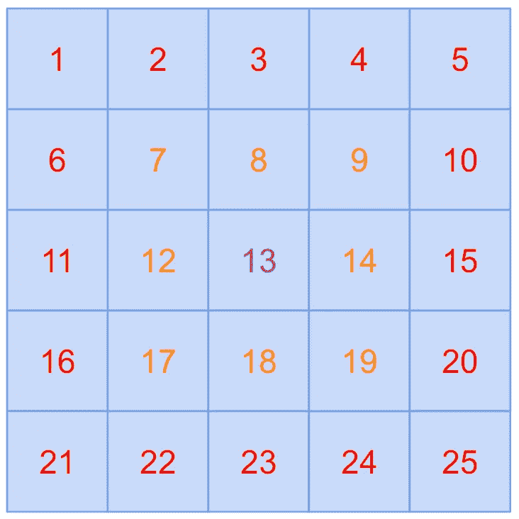

# 编码访谈:解决 JavaScript 中的“旋转矩阵”问题

> 原文：<https://javascript.plainenglish.io/coding-interview-solving-the-rotate-a-matrix-problem-in-javascript-683d742180d8?source=collection_archive---------7----------------------->

Photo by [Markus Spiske](https://unsplash.com/@markusspiske?utm_source=medium&utm_medium=referral) on [Unsplash](https://unsplash.com?utm_source=medium&utm_medium=referral)

# 关于采访编码的一般说明

算法设计通常是软件工程职位编码面试的关键部分。一些公司比其他公司更依赖它们，但对于较大的科技公司来说，它们是最重要的。因此，即使它们可能不是你在工作和职业生涯中表现的最佳反映，你仍然需要实践它们，理解潜在的模式和原则，并能够讨论它们的表现。

# 问题来源/灵感

[破解编码采访](https://www.amazon.com/Cracking-Coding-Interview-Programming-Questions/dp/0984782850/)
*提问者:FAANG*

# 问题描述

给定一个由 NxN 矩阵表示的图像，其中图像中的每个像素是 4 个字节，编写一个方法将图像旋转 90 度。你能做到这一点吗？

An illustration of how a 5x5 matrix should be rotated

# 问题解决方案

在解决任何算法问题时，你应该做的第一件事是建立一个强大的心智模型。如果你的心智模型有缺陷，你的代码也会有缺陷。所以我们将用“分层”的方法来解决这个问题。我们将从外侧开始，一步步深入，直到我们适当地旋转了每个单元格。看看下面的插图，帮助你建立心智模型。

我给各层涂上了颜色，以帮助区分它们。我们将首先通过红色层，直到我们已经旋转了所有的元素。然后我们对橙色层做同样的处理。最后，我们将到达绿色层，这里的旋转实际上会产生相同的结果，所以我们让它保持原样。这种模式适用于所有尺寸的矩阵，奇数边和偶数边都适用。继续用几个不同的案例来测试这个算法逻辑，以帮助巩固你的心理模型。为了完整起见，试着用 6×6 矩阵、2×2 矩阵、甚至 1×1 矩阵来想象这将如何进行。

这种分层方法只是我们算法的开始。现在，让我们想象一下如何在每一层中旋转每个单元格。

上面的插图显示了我们将如何开始遍历每条边的长度，并将单元格转移到它们各自的位置。这两幅插图只是这个过程的第一步和第二步。我们将继续交换单元格，直到完成这一层，然后我们将使用相同的子例程继续完成其余的层。

如果你像我一样，你会到这一步，认为你的心智模型是坚实的，你已经准备好编码。然而，这种模式有一个小的、可修复的问题。你能发现它吗？

假设我们在`2`牢房。我们希望该值在`10`单元格所在的位置，所以我们覆盖了`10`单元格，现在它显示为`2`。接下来，我们希望`24`单元格读取`10`，但是我们已经覆盖了`10`单元格(记住，现在它读取的是`2`)。这是一个可以解决的小问题。我们需要保留对我们的一些数字的引用，以便我们可以在适当的位置覆盖它们。我将在下面举例说明，以帮助巩固你的心智模型。

左边的矩阵说明我们保持对顶行的引用。然后，在右边，我们展示了如何替换每个单元格。我们将从`16`单元格开始，替换`2`单元格的值。注意，我们之前的问题已经解决了，因为我们仍然有对原始值的引用。然后我们可以用`24`单元格替换`16`单元格的值，用`10`单元格替换`24`单元格的值。最后，我们将从存储的引用中获取`2`值，并用它替换`10`单元格。

现在您已经有了一个好的心理模型，我将向您展示我是如何将我的算法编入 JavaScript 的。

一旦你对我们要做的事情有了深刻的理解，代码就不会太复杂。外部循环迭代通过层，而内部循环迭代通过当前层中的单元。这里有几件小事需要注意:

1.  我们复制了第一行的值，并将它们存储在一个新的行数组中，而不仅仅是存储对整行的引用。我这样做是因为我们在适当的位置覆盖了矩阵，所以如果我们不存储一个新的副本而仅仅存储一个引用，我们将会遇到我们之前讨论过的相同的覆盖问题。
2.  我们以特定的顺序复制单元格，以便在需要复制之前不会覆盖单元格。我们从左侧开始，逆时针方向穿过两侧。

# 结论

需要“就地”修改数据结构的大多数问题的一个关键方面归结为以比创建数据结构的全新副本更少的内存(即空间复杂度)来保存对信息的引用。在我们的例子中，我们存储了对一行的引用，而不是整个矩阵。

这些问题起初看起来令人生畏，但是一旦你把它们分解成小块，理清你的思维模式，代码实际上就自己写好了。花一分钟确保你完全理解我们在这里做了什么，如果你有任何问题，请在评论区告诉我。

*最初发表于*[*【https://codingbootcampguides.com】*](https://codingbootcampguides.com/coding-interview-solving-the-rotate-a-matrix-problem-in-javascript)*。*

*更多内容请看*[***plain English . io***](http://plainenglish.io)