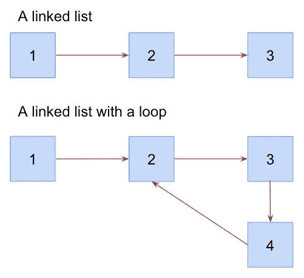

# 编码访谈:解决 JavaScript 中的“检测链表中的循环”问题

> 原文：<https://javascript.plainenglish.io/coding-interviews-solving-the-detect-a-loop-in-a-linked-list-problem-8b2a66257520?source=collection_archive---------17----------------------->

Photo by [JJ Jordan](https://unsplash.com/@simplestory?utm_source=medium&utm_medium=referral) on [Unsplash](https://unsplash.com?utm_source=medium&utm_medium=referral)

# 关于采访编码的一般说明

这些编码面试算法问题不一定是你在工作中表现的最佳反映，但绝大多数公司在他们的技术面试中使用它们。这些挑战至少表明了你对学习的执着，理解复杂抽象概念的能力，以及快速思考的能力。

只要公司还在使用这些类型的问题，你就需要为它们做好准备。

# 问题来源/灵感

[玻璃门](https://www.glassdoor.com/Interview/1-Binary-tree-traversal-2-Linked-list-loop-detection-QTN_4571226.htm)
*提问者:脸书*

# 问题描述

写一个函数来检测链表中的循环。如果找到一个，返回 true。否则，返回 false。

# 问题解决方案

一如既往，让我们建立自己的心智模型。为了做到这一点，有时我喜欢创建一个插图来可视化正在发生的事情，尤其是对于更复杂的问题。那么，让我们来看看。

A comparison between a linked list and a linked list with a loop

通常，当我们遍历一个链表时，当不再有节点需要访问时，我们就终止遍历。在有循环的链表中，你总是有另一个节点要访问，因为每个节点都指向另一个节点。

解决这个问题的关键是了解你的终止条件。让我们用一些代码更深入地研究一下。

注意，我已经创建了一个`Node`类来帮助构造单个节点。我已经用它创建了一个链表来测试我的解决方案，您也应该这样做。如果你是链表的新手，请查看我写的这篇文章[带你完成这个过程。](https://mjstromberg.medium.com/how-to-build-a-linked-list-in-javascript-985543952a5a)

解决方案最终只有 10 行清晰易读的代码。我使用递归解决方案，其中我有两个基本情况或“终止条件”如果我遇到了我以前访问过的节点，则第一种基本情况终止。另一种基本情况是，如果我们已经用完了要遍历的节点，就会终止。

我的解决方案中的递归情况很简单，但它是允许这个解决方案具有 O(1)空间复杂度的部分。如第 5 行和第 6 行所示，我修改了当前节点，添加了一个属性`isVisited`，并给它赋值`true`。然后，我通过递归调用我们的函数并传入链表中的下一个节点来继续我的遍历。这样，如果我运行到一个我以前访问过的节点，我们将能够看到它并终止我们的递归循环。

就这样？是的，就是这样。有时这类玩具问题只是关于熟悉模式。面试官往往是想给你提供你没见过的算法问题。为了做到这一点，他们把问题结合起来，在经典问题上稍加改动，或者只是简单地重新措辞。了解广泛的问题很重要，这样你就可以熟悉几种不同的模式以及它们的时间和空间复杂性。

# 结论

一旦你掌握了递归和使用递归的数据结构遍历，这个问题就会变得相当简单。和大多数问题一样，有多种方法来设计这个算法。这取决于你是否了解每一种的优点和缺点。

尝试用一个`while`循环迭代地解决这个问题，而不是使用递归。或者，如果您的代理通知您不可以修改节点(即不要向节点添加一个`isVisited`属性)，但是您可以使用更多的内存，该怎么办？你能想到一个使用散列图的更“暴力”的解决方案吗？

*最初发表于*[T5【https://codingbootcampguides.com】](https://codingbootcampguides.com/10-things-i-learned-as-a-coding-bootcamp-grad)*。*

*更多内容请看*[***plain English . io***](http://plainenglish.io)