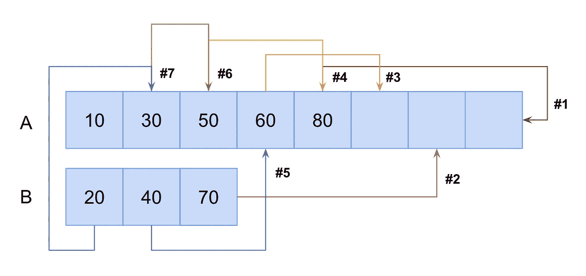

# 编码访谈:解决 JavaScript 中的“就地合并排序数组”问题

> 原文：<https://javascript.plainenglish.io/coding-interviews-solving-the-merge-sorted-arrays-in-place-problem-712b322f5bfe?source=collection_archive---------23----------------------->

Photo by [Lance Grandahl](https://unsplash.com/@lg17?utm_source=medium&utm_medium=referral) on [Unsplash](https://unsplash.com?utm_source=medium&utm_medium=referral)

# 关于采访编码的一般说明

像往常一样，我想谈谈编码面试的本质。他们非常类似于参加 SAT 或 GRE 考试；有时候，它们不一定是你在工作中或大学里表现的最佳反映，但更多的是你的准备和资源的反映。

只要公司还在使用这些类型的问题，你就需要为它们做好准备。

# 问题来源/灵感

这是一个常见的面试问题。
*提问者:亚马逊、谷歌、苹果、脸书、网飞、微软等等。*

# 问题描述

给定两个排序后的整数数组`A`和`B`，将`B`合并为`A`作为一个排序后的数组。注意，你可以假设`A`有足够的空间容纳来自`B`的额外元素，并且在`A`和`B`中初始化的元素数量分别是`m`和`n`。

# 问题解决方案

下面让我们来看一下我们的算法。通过首先将项目移动到第一个数组的末尾，我们可以最小化需要移动的单元数量(即时间复杂度)，因为额外的空间位于数组的末尾。如果我们从第一个数组的开头开始移动项，我们可能必须将第一个数组中该单元格后面的所有项移动一位。

A visual representation of merging to sorted arrays in place

现在我们来看看问题的解决方案，分解一下关键方面。

A solution to merging sorted arrays in place using pointers

我选择创建三个索引变量`i`、`j`和`k`来指向感兴趣的特定索引。`i`对应第一个数组的当前项索引，从最后一项开始。`j`对应第二个数组的当前项索引，也是从最后一项开始。最后，`k`对应需要填充的单元格的索引，从第一个数组的最后一个索引开始。

确定了我们的指针之后，我们就可以开始迭代了。我们从向后遍历第一个数组开始。对于每次迭代，我们比较来自各自数组的`i`和`j`处的值，较大的项被分配给`k`处的单元格。每次迭代我们都需要更新适当的指针。我们在每个循环中递减`k`，也递减`i`或`j`，这取决于我们从哪个数组中取出了一个项目。我们也处理 7 号线的边缘案件。如果`j`小于 0，这意味着第二个数组是空的，我们只需要从第一个数组中抽取。同样，如果`i`小于 0，我们只需要从第二个数组中抽取。

# 结论

这个问题的主要挑战是确定将项目移动到数组后面可用空间的有用性。您可以从前端开始，但是这会使逻辑和代码变得更加复杂。花一些时间考虑这样的时间复杂性的含义将会为你节省更多的编码时间。

*最初发表于*[*https://codingbootcampguides.com*](https://codingbootcampguides.com)*。*

*更多内容请看*[***plain English . io***](http://plainenglish.io)