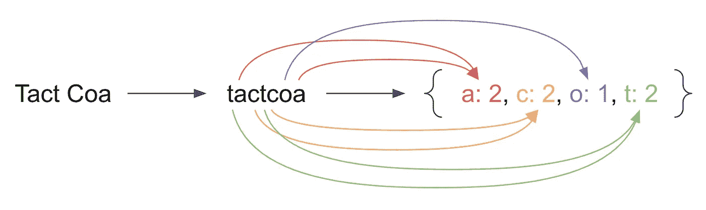
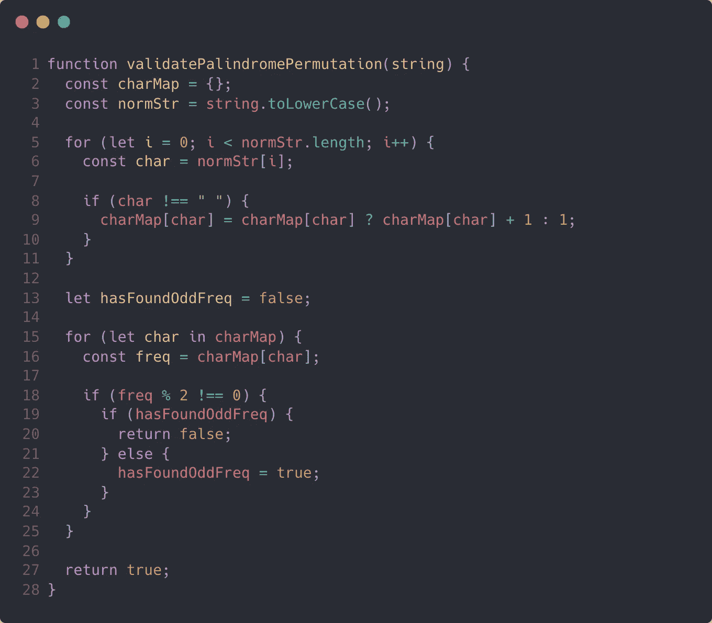

# 编码访谈:解决 JavaScript 中的“回文排列”问题

> 原文：<https://javascript.plainenglish.io/coding-interviews-solving-the-palindrome-permutation-problem-in-javascript-dfb2eb207188?source=collection_archive---------3----------------------->

Photo by [Tobias](https://unsplash.com/@herrzett?utm_source=medium&utm_medium=referral) on [Unsplash](https://unsplash.com?utm_source=medium&utm_medium=referral)

# 关于采访编码的一般说明

编写面试代码可能很困难。您将测试在实际日常工作中可能很少用到的数据结构和算法设计。但大多数科技公司都会问至少几个算法问题，所以你需要做好解决这些问题的准备。确保您实践了它们，理解了潜在的模式和原则，并且能够讨论它们的性能。

# 问题来源/灵感

[破解编码采访](https://www.amazon.com/Cracking-Coding-Interview-Programming-Questions/dp/0984782850/)
*提问者:FAANG*

# 问题描述

给定一个字符串，写一个函数检查它是否是一个回文的排列。回文是向前和向后都一样的单词或短语。排列是字母的重新排列。回文不需要仅限于字典中的单词。

**示例**
输入:“Tact Coa”
输出:true(排列:“taco cat”、“atco cta”等。)

# 问题解决方案

任何算法问题的第一步都是建立你的心智模型。这一步对某些问题来说比较容易，对另一些问题来说比较难。万一你在这个问题上卡住了，我已经决定说明我的心理模型的一部分。下面我们来看看。

An illustration of normalizing and mapping a string to its character count

对我来说，这个问题可以分解为两部分:字符映射和验证。由于回文的性质，我们需要计算每个字符的频率。回文是对称的，这意味着对于字符串一半上的每个字符，在另一边都应该有一个匹配的字符。奇数长度的字符串有一个例外，因为它们可能有一个不需要匹配的中心字符。因此，我们可以计算所有的字符，然后验证它们。上图显示了字符映射过程。

## 字符映射

首先，我们规范化传入的字符串，因为我们的回文不区分大小写，空格将被忽略。最好和你的面试官澄清这一点，因为他们可能会有不同的预期。之后，我们只需遍历字符串并更新映射中的计数。

## 确认

问题的第二部分是验证字符数，以确保它们遵守我们之前定义的规则。每个字符应该有一对，只有一个例外。也就是说，每个字符应该出现偶数次，除非一个字符可能出现奇数次。

就是这样！让我们看看如何将这个心智模型翻译成代码。

A solution to validating a string for a palindrome permutation

正如你所看到的，第`2`到`11`行处理字符映射逻辑，而第`13`到`25`行处理验证。

对于字符映射，我们简单地遍历字符串并增加映射中该字符的计数。我们还将第`3`行的所有字符转换成小写，并忽略第`8`行条件语句中的空格。

验证部分以一点状态开始。我们存储我们是否找到了一个奇数频率的字符，这样如果我们以后发现另一个奇数频率出现，我们就知道这个字符串没有通过测试。我们检查第`18`行的字符数是否为奇数，并检查我们是否已经在第`19`行发现了一个奇数。

# 结论

我总喜欢说算法问题的编码部分很琐碎。困难的部分是建立你的心智模型。在这种情况下，关键是使用一些额外的内存来创建一个映射，以便以后引用。创建地图来组织数据是算法问题中的一种常见模式，所以现在至少已经见过一次了，当它在你的面试中起作用时，你的工具箱中就会有这个工具。祝你好运！

*最初发表于*[*https://codingbootcampguides.com*](https://codingbootcampguides.com/how-to-build-a-queue-in-javascript)*。*

*更多内容请看*[***plain English . io***](http://plainenglish.io)