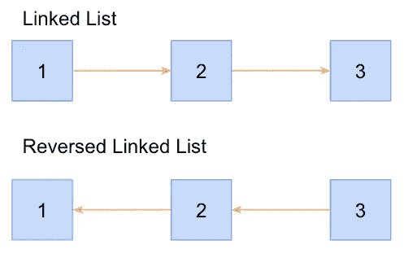
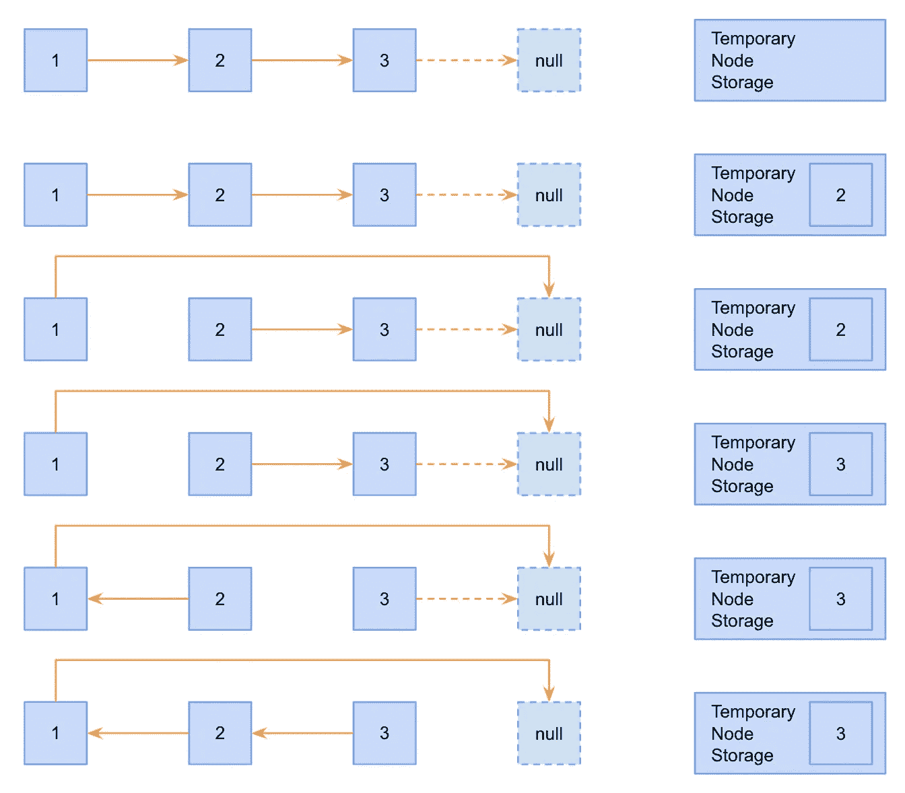

# 编码访谈:解决 JavaScript 中的“就地反转链表”问题

> 原文：<https://javascript.plainenglish.io/coding-interviews-solving-the-reverse-a-linked-list-in-place-problem-ec9884b59efc?source=collection_archive---------22----------------------->

Photo by [Jim Wilson](https://unsplash.com/@wilsonjim?utm_source=medium&utm_medium=referral) on [Unsplash](https://unsplash.com?utm_source=medium&utm_medium=referral)

# 关于采访编码的一般说明

虽然对算法设计和数据结构有很强的掌握可以对你的软件工程生涯有所帮助，但这些编码面试算法问题不一定是你在工作中表现的最佳反映。它们更多地反映了你的准备和资源。

只要公司还在使用这些类型的问题，你就需要为它们做好准备。

# 问题来源/灵感

[Glassdoor](https://www.glassdoor.com/Interview/Reverse-a-linked-list-without-extra-space-QTN_4606937.htm)
*提问者:谷歌*

# 问题描述

反转一个没有多余空间的链表。

An example of a linked list and its reversal.

# 问题解决方案

分析和理解问题陈述的所有方面很重要。在这种情况下，问题陈述很短，可以分成两个主要部分:“反转链表”和“没有额外的空间”第一个组件可以在上图中看到。当一个提示提到一个“链表”而没有任何修饰或说明时，它通常指的是一个单向的单链表。我们需要像 3–2–1 那样链接节点，而不是将节点链接成 1–2–3。

第二个部分是问题的一个小小的扭曲。本质上，问题是反转这个链表，并以 O(1)的空间复杂度完成它。换句话说，不要只是创建一个完全新的被正确反转的链表，而是，就地反转链表。

让我们想象一下我们将如何完成这件事。

首先，您会注意到反转的每个步骤右侧的“临时节点存储”。这是一个展示我们需要保存对单个节点的引用的例子。我们不会创建任何新节点；我们只存储对现有节点的引用。这样我们将只占用 O(1)内存。

现在让我们更详细地看一下每个步骤:

1.  第一步简单说明了我们的初始条件。有 3 个节点，我们没有对任何特定节点的引用。
2.  第二步是保存对列表中“下一个”节点的引用。因为我们的根节点是节点 1，我们的下一个节点将是节点 2。
3.  在步骤 3 中，我们重新分配节点 1 指向的位置。最初，它指向节点 2，但我们随后将它重新分配为指向`null`。注意:图中显示节点 1 指向节点 3 所指向的同一个`null`实例，但这是为了简洁。没必要用同一个实例，新的`null`实例会更实用。
4.  步骤 4 展示了我们如何在临时节点存储中将节点 2 的引用替换为节点 3 的引用。
5.  然后，在步骤 5 中，我们将节点 2 切换到节点 1。
6.  最后，我们到达步骤 6，将节点 3 切换到节点 2。我们不需要存储对任何其他节点的引用，因为我们已经到达了列表的末尾。

一旦理解了算法逻辑，将其翻译成代码就相对简单了。

您会注意到我创建了一个`Node`类来创建我们列表的单个节点。当您编写测试来确认您的解决方案正确工作时，您会想要使用类似这样的东西。如果你是链表的新手，请查看我写的这篇文章带你完成这个过程。

至于函数本身，我选择使用递归解决方案，但是使用指针的迭代解决方案也可以。基本情况是以没有节点为条件的。如果没有节点，该函数将返回前一个节点，该节点将在该点完全反转。递归 case 存储一个对下一个节点的引用，将当前节点的 next 属性指向前一个节点，然后用下一个节点和当前节点递归调用函数。

就是这样！一旦理解了算法，代码自然就来了。

# 结论

这种存储对节点的引用以便以后使用的模式很常见。此外，这个玩具问题也是一个经典问题，已经在采访中使用了几年。熟悉这种模式将有助于您处理未来的问题，并为您的工具箱添加另一种工具。

额外加分:迭代地而不是递归地解决同样的问题。

*最初发表于***。**

**更多内容请看*[***plain English . io***](http://plainenglish.io)*