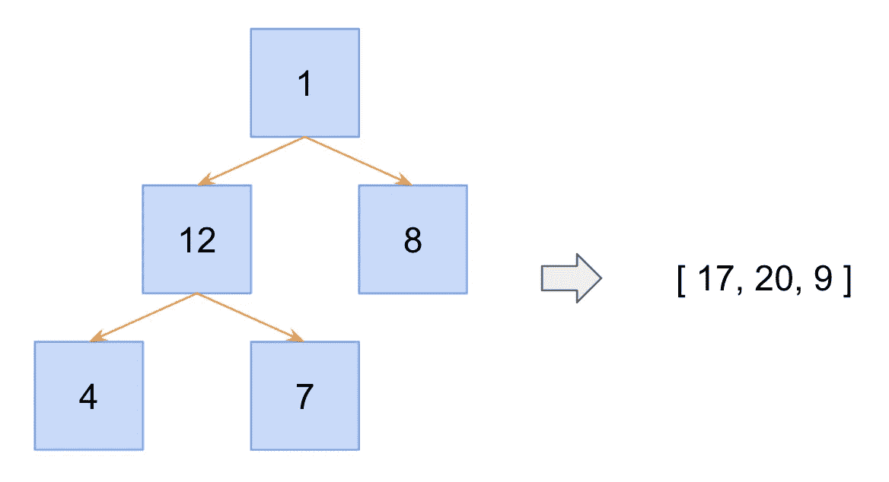
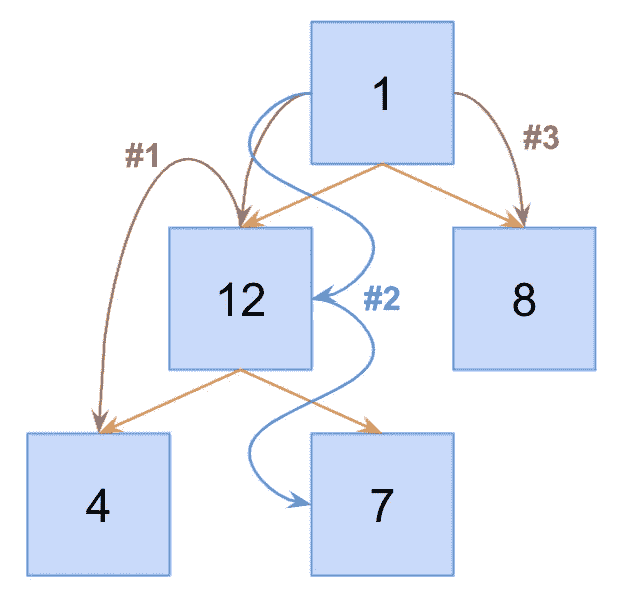

# 编码访谈:解决 JavaScript 中的“从根到叶的树分支总和”问题

> 原文：<https://javascript.plainenglish.io/coding-interviews-solving-the-sum-tree-branches-from-root-to-leaf-problem-46d7d430fe9a?source=collection_archive---------21----------------------->

Photo by [Mila Tovar](https://unsplash.com/@milatovar?utm_source=medium&utm_medium=referral) on [Unsplash](https://unsplash.com?utm_source=medium&utm_medium=referral)

# 关于采访编码的一般说明

这些编码面试算法问题不一定是你在工作或大学表现的最佳反映，但更多的是你的准备和资源的反映。

只要公司还在使用这些类型的问题，你就需要为它们做好准备。

# 问题来源/灵感

[玻璃门](https://www.glassdoor.com/Interview/First-Question-Print-all-combinations-from-dictionary-which-will-result-in-number-N-Input-Dictionary-flag-4-5-t-QTN_4476696.htm)  *被问者:脸书*

# 问题描述

从给定的树中返回根到叶的总和列表(从左到右)。

An example of an integer tree and its corresponding list of sums

# 问题解决方案

让我们举例说明我们将在算法中采取的步骤，以帮助建立一个强大的心理模型。我们将从根节点开始，从左到右遍历树。遍历过程中的每条路径只能“通过”树的每个“层”上的一个节点。

An example of the traversal paths to collect all root-to-node sums

现在让我们检查代码。首先，我创建了一个`Node`函数来帮助我们在测试时重复构建树节点。您可以也应该编写自己的测试来确认您的解决方案。

A recursive solution to traverse through an integer tree.

1.  在这个解决方案中，我们使用递归来遍历树的每个节点。当我们递归时，每次连续调用我们的函数，我们都是在某些标准上归巢。在我们的问题中，与许多树问题一样，我们的终止标准是我们是否有更多的节点沿着那个分支遍历。这个标准可以在第 2 行看到。
2.  我们的递归例子可以在第 4 行到第 14 行的`else`语句中看到。在这里，我们遍历所有的子节点，用当前子节点递归调用`getRootToLeafSums`，并将当前节点的值添加到递归调用产生的子节点和中。
3.  在基本情况和递归情况下，我们都返回一个数字数组。在解决递归问题时，首先设计出函数框架和条件语句通常是有用的。之后，识别返回的 JavaScript“类型”或数据结构可能会很有启发性。您知道每次调用`getRootToLeafSums`都需要返回一个数字数组，因此，您知道您的基本情况和递归情况都需要返回相同的数据结构。

就是这样！这个问题的主要部分是决定如何遍历树结构，以及如何终止对每个分支的遍历。这个问题的数学部分相当简单。

# 结论

通常，这些问题的解决方案并不冗长。关键是规划出您的遍历，并对底层数据结构有一个正确的理解。

*最初发表于*[*【https://codingbootcampguides.com】*](https://codingbootcampguides.com)*。*

*更多内容请看*[***plain English . io***](http://plainenglish.io/)