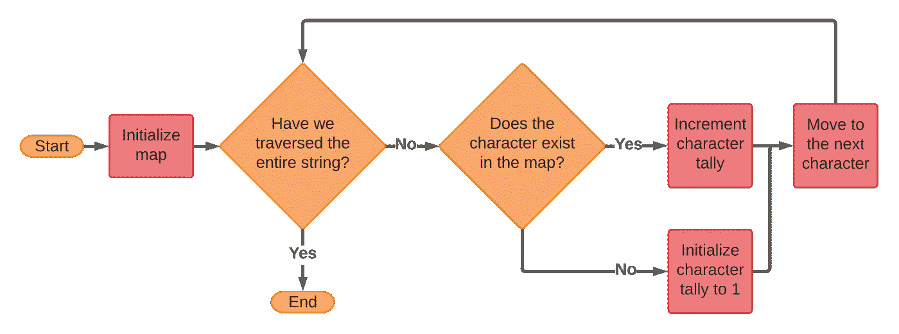
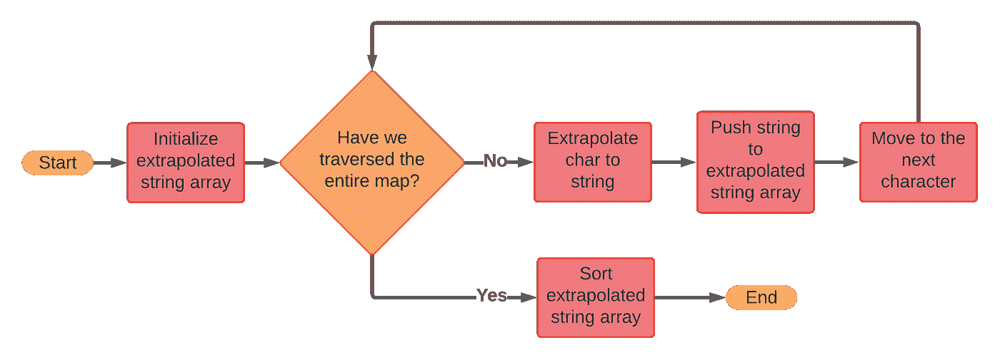
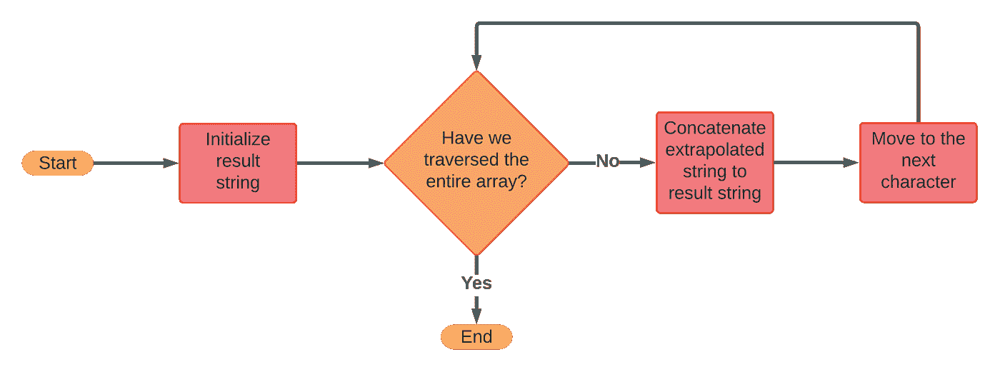
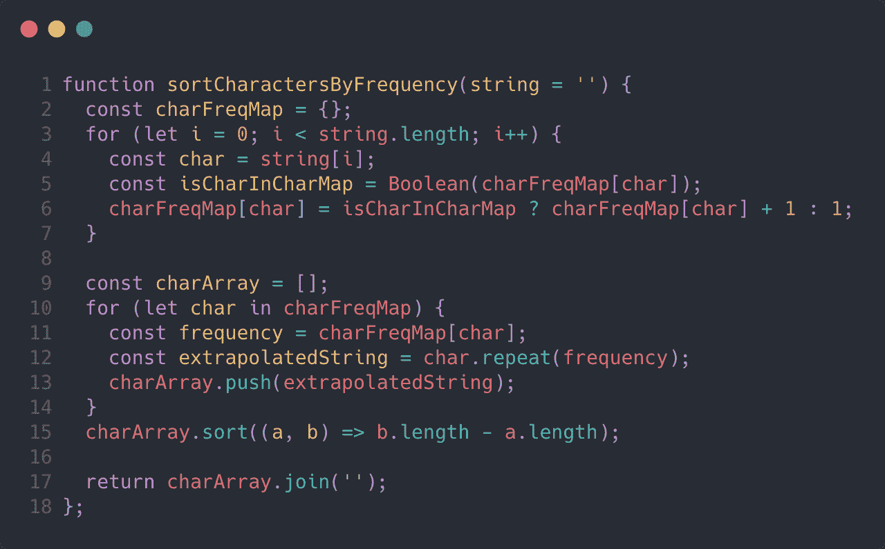

# 编码采访:在 JavaScript 中按频率对字符排序

> 原文：<https://javascript.plainenglish.io/coding-interviews-sorting-characters-by-frequency-in-javascript-f18c85a357d1?source=collection_archive---------8----------------------->

Photo by [Susan Holt Simpson](https://unsplash.com/@shs521?utm_source=medium&utm_medium=referral) on [Unsplash](https://unsplash.com?utm_source=medium&utm_medium=referral)

# TL；速度三角形定位法(dead reckoning)

*   计算频率的问题通常很适合使用地图数据结构。
*   我们需要计算字符频率，推断字符，对推断出的字符串进行排序，然后将这些字符串重新连接在一起。
*   该算法具有`O(n*log(n)`时间复杂度和`O(n)`空间复杂度。

# 问题描述

> *给定一个字符串* `*s*` *，根据字符出现的频率按降序排序。字符的频率是它在字符串中出现的次数。*
> 
> *返回排序后的字符串。如果有多个答案，请返回其中任何一个。*

这个问题来自 [LeetCode](https://leetcode.com/problems/sort-characters-by-frequency/) 。那里不缺少实践问题，但是 LeetCode 是磨练你的算法设计技能的最受欢迎的平台之一。LeetCode 提供了实践问题、解决方案和讨论问题的健康用户群，是一个很好的资源。

# 问题解决方案

这个问题的关键是将字符映射到它们在字符串中出现的频率。每当你遇到一个使用“频率”这个词的问题时，地图很有可能是这项工作的合适工具。

一旦所有的字符都被映射，我们需要将单个的字符外推到包含重复适当次数的字符的字符串中。然后，我们可以对这些字符串进行排序，并将它们连接成一个最终的字符串。

让我们将逻辑分解成更小、更容易理解的部分。

# 计数字符

A flowchart illustrating the logic of counting characters.

与其试图对这些字符进行低效的分组和排序，不如简单地计算字符频率，然后创建我们稍后想要看到的字符分组。地图数据结构在这里特别有用，因为它是以一种允许我们进行常量时间查找的方式实现的(即`O(1)`)。所以通过使用一个地图，当我们想要添加一个角色的时候，它是一个快速的查找来检查我们是否已经在地图中有那个角色。

因此，我们可以遍历我们的角色，检查它们是否已经存在于我们的地图中。如果是这样，我们会将该角色的计数值增加 1，如果不是，我们会将该角色添加到地图中，初始计数值为 1。

# 外推和排序

A flowchart illustrating the logic of extrapolating and sorting characters.

将字符外推至由按其频率重复的字符组成的字符串可能是该算法中自己的部分，但大多数成熟的编程语言都有一种内置的声明性方式来完成这一任务。在 JavaScript 中，我们可以使用`String.prototype.repeat`来完成这个任务。

考虑到外推逻辑，我们的逻辑如下:遍历映射，外推字符，将外推的字符串推入可排序的数据结构，然后排序。这里的关键是使用易于排序的数据结构。在 JavaScript 中，数组有一个原生的`Array.prototype.sort`方法，可以用来声明性地对项目进行排序，所以我们将使用一个方法来存储我们推断出的字符串。

# 连接

A flowchart illustrating the logic of joining extrapolated characters.

在我们对字符串进行排序之后，我们只需要将它们连接成最终的结果字符串。同样，JavaScript 有一个名为`Array.prototype.join`的声明性原型方法，它将为我们完成这项工作。如果您想自己实现连接逻辑，只需遍历数组并将每个字符串连接成一个结果字符串。

# JavaScript 实现

既然我们已经有了心智模型和算法，将其翻译成代码就相当简单了。让我们来看一个 JavaScript 实现。

如您所见，映射逻辑在第 2 行到第 7 行实现。我们创建一个空对象作为我们的映射，使用一个`for`循环来遍历我们的字符串，在每次迭代中，我们使用基本的对象属性赋值来更新我们的字符频率。

字符外推发生在第 9 行到第 14 行。你会注意到我们使用了一个`for...in`循环来遍历我们的对象，在每次迭代中，我们使用`String.prototype.repeat`方法外推我们的字符串，并将其推到数组的末尾。之后，我们使用`Array.prototype.sort`按长度对字符串进行排序。

最后，我们使用`Array.prototype.join`将我们的字符串数组合并成第 17 行的最终字符串。

如果你想运行这段代码，你可以从[这里](https://gist.github.com/mjstromberg/8f4edd906abfb737b30d62cebceaba63)复制它。

# 效率

一个算法的好坏取决于它的效率。在面试中，一个低效的算法当然比什么都没有好，但通常“蛮力”方法是不会成功的。因此，了解如何计算算法的效率以及如何向他人传达这些信息非常重要。

算法的效率通常使用[大 O 符号](https://en.wikipedia.org/wiki/Big_O_notation)来描述，并用于定义时间复杂度和空间复杂度。

## 时间复杂度

对于我们的问题，映射是线性的(即`O(n)`)，连接也是线性的，但是这里的瓶颈是排序。排序效率取决于 JavaScript 运行时的实现。Chrome 使用 V8 引擎，该引擎本身使用 [Timsort](https://v8.dev/blog/array-sort) 算法实现`Array.prototype.sort`，平均产生一个`O(n*log(n)`的时间复杂度。因为这些操作是顺序的，没有嵌套，所以最大的复杂性使其他操作相形见绌，因为`n`(数据结构中的项数)接近无穷大。

## 空间复杂性

本质上，映射操作占用线性空间(即`O(n)`)，因为对于字符串中的每个字符，我们在映射中分配了一块内存。平均来说，映射中使用的内存会更少`n`，因为我们经常会有重复的字符，但是我们通常只关心算法问题中最坏的情况。外推部分也是线性的，因为我们为地图中的每个条目向数组中添加了一个条目。这是消耗额外存储器的操作的仅有的两个部分，并且因为它们都是线性的，所以算法作为一个整体被认为具有线性(即`O(n)`)空间复杂度。

# 结论

算法问题是关于识别何时使用特定的逻辑模式。为此，您需要熟悉各种模式和模式组合。

将字符映射到它们出现的频率是一种常见的模式，您应该对此非常熟悉。一旦你完全理解了这个策略和它背后的效率，你将开始认识到它可以被正确使用的其他领域。

*最初发表于*[*https://codingbootcampguides.com*](https://codingbootcampguides.com/coding-interviews-sorting-characters-by-frequency-in-javascript)*。*

*更多内容请看*[***plain English . io***](http://plainenglish.io/)