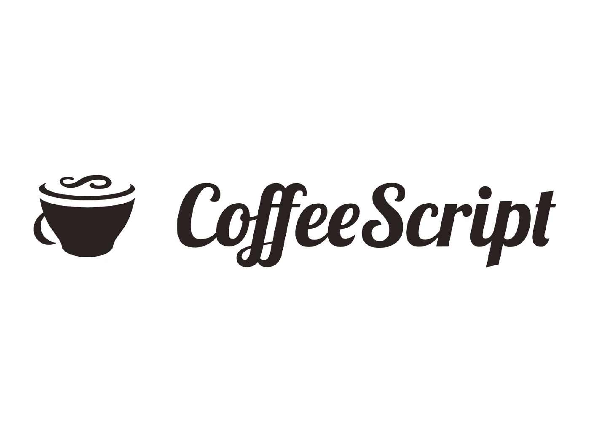
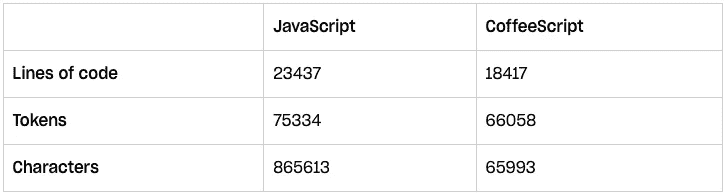
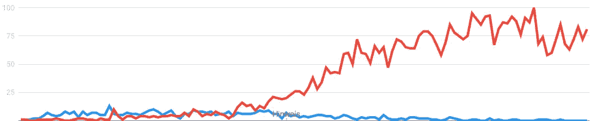

# 咖啡脚本，第一个大的 JavaScript 替代品发生了什么？

> 原文：<https://javascript.plainenglish.io/coffeescript-6dd64142b8dd?source=collection_archive---------3----------------------->

## 甚至 Dropbox 也使用了它



JavaScript 总是有它的问题。自发布以来，人们一直嘲笑这种充满怪异行为的语言。十年前，当 JavaScript 随着每一个版本变得更好的时候，人们在寻找另一种版本。不是一个替代 JavaScript 的选项，而是在将它跨编译成普通 JS 之前编写其他东西。

据我所知，咖啡脚本是实现这一目标的第一个选择——比 TypeScript 早很多年。但是咖啡怎么了？为什么很多网络开发者都不知道呢？让我们看看发生了什么。

# 咖啡脚本到底是什么？

咖啡脚本是一种可以转换成 JavaScript 的编程语言。因此，人们可以把它想象成 TypeScript。然而，与类型脚本相比，咖啡脚本更古老。确切地说，它比 2009 年(2009 年)早了三年，这几乎是编程的一个时代。

正如 JavaScript 一样，咖啡脚本是一种多范例语言，允许您使用自己喜欢的风格。咖啡脚本语法中一个明显的区别:几乎所有的东西都是一个表达式，这意味着几乎所有的东西都是一段代码，评估为一个值。确切地说，这个概念是从函数式编程语言中知道的，它有助于编写声明性代码。

咖啡脚本并不是偶然出现这种风格的。它受到像哈斯克尔这样的语言的很大影响。然而总的来说，它声称“只”为 JavaScript 提供语法糖。哈斯克尔和其他人影响了语言，但它仍然是多范式的，就像 JavaScript 一样。

那么，自 2009 年发布以来，咖啡脚本是如何使用的呢？

# 基于咖啡的项目脚本

研究这样一份名单很难。由于咖啡脚本在发送到浏览器之前会被转换成 JavaScript，所以人们永远无法判断一个 web 应用程序是否在幕后使用咖啡脚本。因此，像 Wappalzyer 这样的检测工具根本没有列出咖啡脚本。

我可以在博客上找到的一个大玩家是 Dropbox。

那时，小 Dropbox 开发了自己的网络应用程序。2012 年的这个时候，jQuery 主宰了一切。尽管 JavaScript 甚至不能执行箭头功能，但咖啡脚本已经提供了这样的功能。Dropbox 的主要目标是:减少代码行数和字符数，提高可读性。

在转向咖啡脚本后，他们实现了自己的目标:



Source: [Dropbox.tech](https://dropbox.tech/application/dropbox-dives-into-coffeescript)

这些是整个 Dropbox 项目的数字。是的，人们可能会期望有超过 23k 行的 JS 代码，但是 Dropbox 那时还是一个初创公司。

在从 JavaScript 转换到咖啡脚本并使用了五年之后，一个新的转变出现了:TypeScript 出现并流行起来。因此，在 2017 年，整个网络代码库被重写。

但是为什么呢？

对此进行调查的 Dropbox。虽然缺乏社区对咖啡脚本的支持是一个原因，但第一个列出的原因是:咖啡脚本中缺少分隔符。后来发现，TypeScript 的另一个好处是支持类型。

Dropbox 的咖啡脚本到此结束。

除了云文件托管服务，一个著名的开源项目也是用 CoffeeScript 构建的:Atom 文本编辑器。

像 VS 代码一样，Atom 是基于 web 编写的:JavaScript、HTML 和 CSS。Atom 没有编写 JavaScript，而是在编译 CoffeeScript 之前使用了它。记得早在 2016 年官网提到 CoffeeScript 的时候。现在不再是这样了。

此外，看起来代码库越来越远离 CoffeeScript。

# 兴趣是如何下降的

您可能注意到了，CoffeeScript 变得不那么重要了。不仅仅是项目远离 it——这也是普遍的兴趣，越来越少。

我们可以从谷歌趋势中很好地看到这一点:



Source: [Google Trends](https://trends.google.de/trends/explore?date=2011-01-01%202021-09-20&geo=DE&q=%2Fm%2F0hjc5m0,%2Fm%2F0n50hxv)

从 2011 年开始到今天，这些数据很好地说明了这一点。蓝色是 CoffeeScript。红色是打字稿。

此外，最大的次级区域的活动大幅下降。所有热门帖子都是 8-10 年前的，这是社区参与度下降的一个很好的指标。相比之下，TypeScript subreddit 中的顶级帖子是在六个月前发布的。此外，TypeScript subreddit 的大小是它的 30 倍。

# 通过打字稿死亡？

很可能假设 TypeScript 推开了 CoffeeScript。正如 CoffeeScript 一样，TS 是一种多范式语言。

然而，有一个关键的区别:TypeScript 是 JavaScript 的一个子集。

这意味着，TypeScript 以兼容的方式扩展了 JavaScript 语法。简单地说:您可以在 TypeScript 文件中编写普通的 JavaScript，然后用 TypeScript 运行它。TS 只是对 JS 的一个补充，并不是一种全新的、强制的编写代码的方式。

对于 CoffeeScript 来说，这是不正确的。让我们看一个例子。

这是一个 CoffeeScript 函数，返回它接收到的双精度数:

```
f = (x) -> x * 2console.log(f(4))
```

用`coffee app.coffee`运行这个就可以了。然而，当将代码重写为 JavaScript 并尝试用 CoffeeScript 运行它时，会导致一个错误:

```
function f(x) {
  return x * 2
}console.log(f(4))
```

在 TypeScript 中不是这种情况，上面的语法工作得很好。

对于开发者来说，这是有用的。构建在 JavaScript 语法的基础上，并且可以选择在项目中的任何地方跳过编写 TypeScript-syntax，这使得学习和工作更加容易。TypeScript 相对于 CoffeeScript 的明显优势。

# 最终想法

对我来说，很明显:TypeScript 取代了 CoffeeScript。这种替换是有原因的——我在试用 CoffeeScript 时注意到了这一点。正如我之前提到的，TypeScript 有更大的好处。至少在我看来是这样。

对我来说，打字稿的类型和兼容性是明显的赢家。

但公平地说，CoffeeScript 可能永远没有机会。三岁的年龄差距改变了游戏规则。据我所知，与 TypeScript 相比，CoffeeScript 侧重于解决不同的问题。

当时，JS 开发人员希望使用链接和箭头函数，但时代已经变了。Web 应用变得巨大，在数百万行代码中，我们开始更关心类型。

毕竟，旧技术更有可能被取代——这是时间的过程。

## 感谢您的阅读！

关于 JavaScript 替代方案的更多信息:

[](/purescript-3ee759ce05aa) [## 用 PureScript 为 Web 带来强大的函数式编程

### 就像 JavaScript 的 Haskell

javascript.plainenglish.io](/purescript-3ee759ce05aa)