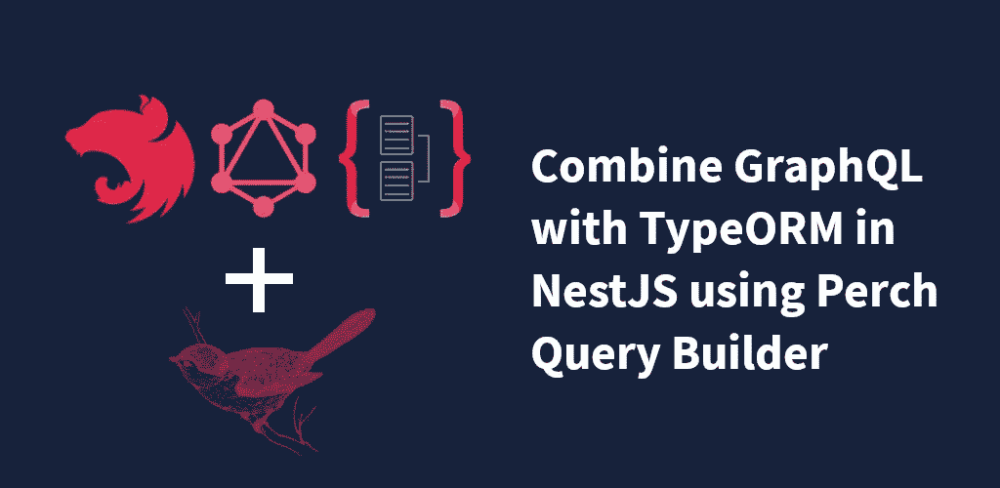

# 使用 Perch 查询生成器在 NestJS 中将 GraphQL 与 TypeORM 结合起来

> 原文：<https://javascript.plainenglish.io/combine-graphql-with-typeorm-and-nestjs-using-perch-query-builder-503e6342c35e?source=collection_archive---------6----------------------->



## 无限制的规范化深度、参数、过滤、排序和分页，无需为每个 ORM 实体定制特殊的逻辑

免责声明:我是 Perch 查询构建器包的作者。

本文假设您已经基本掌握了 [NestJS](https://docs.nestjs.com/) ，以及它是如何用 [TypeORM](https://docs.nestjs.com/techniques/database) 和 [NestJS GraphQL 包](https://docs.nestjs.com/graphql/quick-start)实现的。如果你正在寻找如何启动和运行一个基本项目，看看链接中发布的文档。本文还使用了代码优先的方法，如果您不确定这是什么意思的话[这](https://blog.logrocket.com/code-first-vs-schema-first-development-graphql/)很好地概括了模式优先方法的优点和区别。

# 什么，为什么，为谁

GraphQL 正迅速成为未来 API 的主要组成部分，它提供了一个新的、更加动态的视角来看待应用程序的数据层应该如何使用和开发。使用 GraphQL 优先的方法，每个特性都围绕着一个 GraphQL 模式，允许您的前端团队和 API 团队独立工作，知道这两个部分在准备就绪时将一起工作。我们可以在一个请求中提供我们想要的所有属性和关系，而不是简单的解析相同对象结构的 REST API 端点(可能只是查找其他端点来代替实际的子节点)。

在我使用 NestJS 和 TypeORM 的经验中，GraphQL 的集成有点古怪。首先，查询的结构和深度只在一个半神秘的对象(*@ Info()Info:graphqresolveinfo*)中提供给自定义解析器，并且没有明确的途径来处理查询中的选定属性，如果我们想要构造 TypeORM 查询以满足传入 GraphQL 查询的深度要求，这是一个问题。

这个包的目标是在 GraphQL 和 TypeORM 实现之间架起一座桥梁。PerchQueryBuilder 提供了所有这些与实体的文字结构无关的特性，允许您轻松简单地与 GraphQL 集成，而不是编写一个定制的解析器，它只能深入到 *n* 层，或者编写您自己的定制排序、过滤和分页处理。由于这个包只是试图将 GraphQL 转换成 TypeORM，所以处理查询时就好像它们是对 ORM 实体属性和关系名称的直接转换，因为它依赖于 TypeORM 对实体的定义。例如，如果您有一个名为 Book 的实体，它与一个名为 *author* 的 author 实体有多对一的关系，那么您需要指定 *author* 作为查询的一个选定属性(以及 Author 下的任何属性)来检索它。

这个包是为那些希望构建 API 层的开发人员准备的，当他们的模式在 ORM 中定义时，他们可以检索和提供对象。例如，选择了*标题*属性的图书查询检索图书及其标题，选择了*图书*关系的作者查询检索作者及其基础图书等。没有通过事件层触发器或其他形式的对象操作(通过请求)分配的计算属性，尽管此包没有添加任何限制或干扰这些类型的操作。

# 装置

从 npm 下载 Perch 查询构建器包

```
$ npm i --save perch-query-builder@latest
```

# 使用

Perch Query Builder 是一个尽可能轻量级和不引人注目的包，这意味着它不需要任何特殊的配置或导入到模块中。对于我们的文件结构，假设我们有以下解析器、实体和参数

```
+-- entities
|   +-- book.ts
|   +-- author.ts
+-- resolvers
|   +-- book-resolver.ts
|   +-- author-resolver.ts
+-- arguments
|   +-- book-args.ts
|   +-- author-args.ts
+-- app.module.ts
```

这是我们的图书实体

Our Book Entity

这是我们的作者实体:

Our Author entity

这是我们书中的论点:

Book Argument Class

最后，在 BookResolver 类中，我们使用了 Perch 查询生成器:

Book Resolver Class

如您所见，在公共 GraphQL 层和 ORM 层之间架起一座桥梁只需要一行代码。PerchQueryBuilder.find <t>方法接受 GraphQLResolveInfo 和实体的存储库，并将利用这两者来构造要返回的适当查询。如果我们想查询带有书名和作者姓名的书籍，我们只需要一个如下结构的查询:</t>

Book GraphQL query with author selected

如果我们想搜索一本 id 为 *5* 或者书名为“*莫比·迪克”*的书，我们应该这样构造它:

Using arguments to grab specific results

# 整理

Perch Query Builder 提供了使用给定属性对结果进行升序或降序排序的能力。为了将这种能力添加到我们的 books 查询中，我们需要做的就是将 OrderByArgs 类作为另一个参数添加到解析器中。

Book resolver with sorting arguments added to the definition

就配置而言，不需要任何其他操作，因为参数类 OrderByArgs 只是为您的模式提供这些参数的定义。对从我们的图书查询返回的图书进行排序，如下所示:

Use the sorting arguments in your query

# 标页数

目前，分页简单明了。为了对响应进行分段，我们只能向查询添加偏移量和限制。在未来，我希望能够像 GraphQL 网站中描述的那样，提供基于光标的分页功能。为了给我们的 Book resolver 类添加分页功能，我们需要做与排序功能完全相同的事情。

Use pagination and sorting in your Book resolver

无需进一步配置！现在，我们能够添加一个偏移量，并限制查询中实体的数量。

Use pagination in your query

使用 Perch 查询生成器提供的所有功能进行最终查询:

All Perch Query Builder features used

项目及文件链接:【https://github.com/wesleyyoung/perch-query-builder 