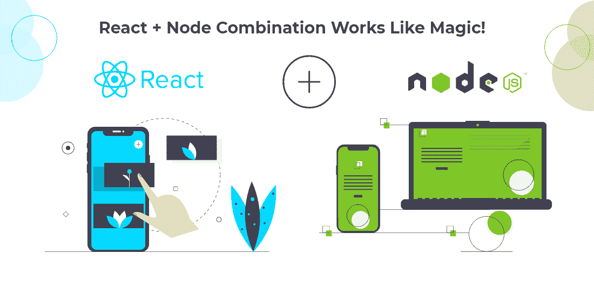
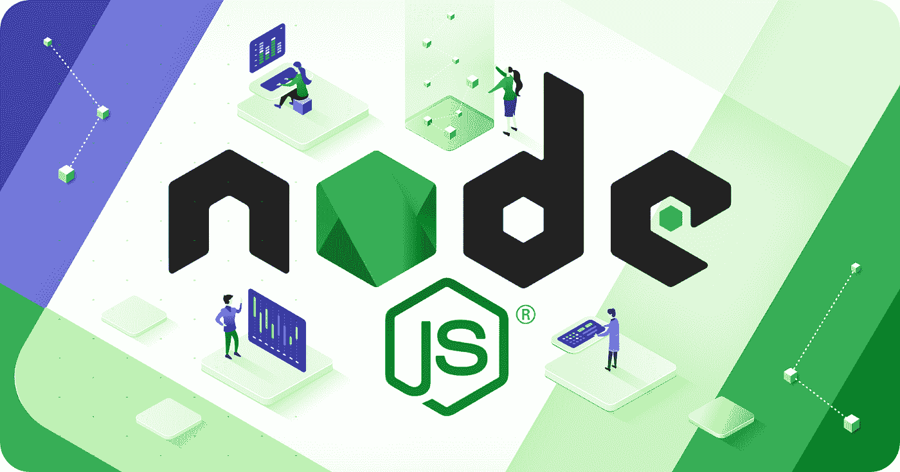

# 将 React 与 Node.js 结合起来，用于全栈 Web 应用程序开发

> 原文：<https://javascript.plainenglish.io/combine-react-with-node-js-for-full-stack-web-application-development-4bfe1dc8ab74?source=collection_archive---------3----------------------->

## 如何使用 React 和 Node.js 创建快速运行的网站？

Image Source: Bacancy Technology

React 是一个流行的前端 JavaScript 库，用于创建交互式用户界面。另一方面，Node.js 是一个服务器端 JavaScript 环境，允许开发人员构建具有高性能和低延迟的可伸缩 web 应用程序。

结合这两种技术可以为从事全栈 web 应用程序开发项目的开发人员带来巨大的好处。

在这里，我们将讨论 React 和 Node.js 如何很好地合作来创建快速运行且易于长期维护的网站。

# 节点. js

Image Source: Railsware

*   *至少有 3000 万个网站使用 node . js(W3Tech)*
*   *Node.js 可以让你的应用性能提升 50%。*

Node.js 是一个 JavaScript 运行时环境，构建在 Google Chrome 的虚拟机上，这些虚拟机是专门为构建快速和可伸缩的网络应用程序而设计的。Node.js 使用事件驱动的非阻塞 I/O 模型，这使它变得轻量级和高效。

此外，它允许您在前端和后端使用 JavaScript 创建 web 应用程序。这为希望使用单一语言构建服务器端和客户端代码的企业提供了许多好处。

为了在 web 应用程序开发中利用 Node.js 的关键特性和功能，您可以考虑雇佣专门的 Node.js 开发人员为优秀的 **Node.js web 开发公司**工作。

# 反应

Image Source: Peerbits

*   *40.14%的受访者正在使用 React (Statista)*
*   *Airbnb、优步、网飞、Instagram、WhatsApp 等等都是使用 ReatJS 的热门应用。*(薄片)

它是一个前端 Javascript 框架，使得构建可重用的 UI 组件成为可能。它允许您创建具有动态、数据驱动视图的大型 web 应用程序，同时在不同设备间保持高性能和高响应性。

React 的简单设计模型让用户可以自由地使用纯 Javascript 轻松开发可扩展的 web 应用，而不必学习复杂的编程语言或框架。

要在 web 应用开发中综合运用 RectJS，可以**雇佣在优秀的 React web 开发公司工作的 React 开发人员**。

# 你为什么要结合节点。JS 配合 React 进行 Web 开发？

使用 Node 有多种原因。JS 与 React for Web 开发。其中一些陈述如下:

# 实时数据

节点。JS 具有事件驱动的架构，这使得它非常适合实时数据应用程序。当与 React 一起使用时，您可以轻松创建功能强大的 web 应用程序，更有效地处理大量流量。

# 迅速发展

当您使用 React with Node.js 进行 web 开发时，您可以获得很高的投资回报(ROI ),并节省您的时间和金钱。这是因为这两种技术可以很好地协同工作，为开发快速运行且易于长期维护的网站提供了一个高效的平台。

# 可量测性

React.js 和 Node.js 使开发人员能够创建具有动态、数据驱动的视图的大型 web 应用程序，这些视图可以跨设备响应。

这在处理大型项目时很有价值，因为在这些项目中，您的 web 应用程序会有很高的流量，并且您需要可伸缩性来保持站点的性能。

# 前端和后端都使用一种语言

使用 React with Node.js，开发人员不必学习复杂的后端语言，如 Ruby 或 Python。他们可以使用 React 开发前端代码，而 Node.js 用于服务器端开发，无需在不同的编程语言和框架之间切换，节省了时间、金钱和资源。

# 高性能

Node.js 是高性能应用程序的完美平台。它使用事件驱动的非阻塞 I/O 模型，这使它变得轻量级和高效。

当与 React 一起使用时，您可以创建强大的 web 应用程序，而不必担心缓慢的响应时间或页面加载时间。

**单页应用**

Node.js 和 React 为开发强大的单页面应用程序提供了完美的平台。这些应用程序比传统的 web 应用程序更有效，因为它们只加载一次，然后随着用户的交互而动态更新。

这有利于开发需要处理大量流量的复杂 web 应用程序。

**更精简的流程**

Node.js 和 React 共同为 web 开发提供了一个简化的流程。这是因为这两种技术都被设计成快速、高效和可扩展的。

当一起使用时，它们可以帮助你为你的企业建立高性能的网站。

**JavaScript 的广泛使用**

带有 Node.js 的 React.js 允许您使用 JavaScript (JS)的全部功能来开发前端和后端代码。

这为 web 开发提供了很大的灵活性和自由度，因为您可以在项目的所有方面使用相同的语言。

如果您已经下定决心使用 Node.js 和 React 开发一个 web 应用程序。你应该**雇佣 Node.js 开发者**和 React 开发者。通过这样做，您将能够有效地利用这两种技术，最终为您的企业形成优秀的 web 应用程序。

# Node.js 和 React For Web 开发能否帮助您满足市场不断变化的需求？

是的，会的。企业需要锁定他们的客户，并为他们提供出色的用户体验，才能在当今竞争激烈的市场环境中生存下来。这就是 React with Node.js 可以帮助您的地方，它提供了一个高效的平台，让您可以快速构建强大的 web 应用程序，同时保持跨设备的高性能。

对于那些想要构建能够处理大量数据的现代、响应迅速的 web 应用程序的人来说，React with Node.js 是一个很好的选择。为什么不试一试？

此外，React 的简单设计模型让用户可以自由创建可重用的 UI 组件，而 Node 的事件驱动架构则允许更高效地处理大量流量。

# Node.js With React:企业家头脑中经常出现的问题

这里我提到了几个与 React 和 Node.js 结合有关的问题，这些问题通常在创业者的脑海中运行。那么让我们来看看:

# 我可以在我的项目中同时使用 React 和 Node.js 吗？

是的，你可以。React 是一个用于构建用户界面的前端库。另一方面，Node.js 允许您构建快速且可伸缩的后端 RESTful APIs。

有了这两种工具，就有可能快速创建复杂的 web 应用程序，而且在规模上也是高效的！此外，Node.js 和 ReachJS 的结合将对您的下一个项目大有裨益。

# 有没有可能结合 React 和 Node.js 进行全栈 web 开发？

是的，可以将 React 与 Node.js 结合起来进行全栈 web 开发。这允许您对整个应用程序使用单一语言(JavaScript)。

您将能够在一个地方编写代码，并在前端和后端运行它！

# 使用 React with Node.js 有什么好处？

使用 React with Node.js 的一些好处包括:

-整个应用程序使用单一语言(JavaScript)

-前端和后端之间高效的代码共享

-开发时间更短，因为您只需学习一种语言

-提高了应用程序的可扩展性

# Node.js 可能会带来哪些挑战？

在考虑使用这种组合时，有几个主要的限制需要记住。例如:

JavaScript 不是一种面向对象的编程语言，所以对于有使用其他语言(如 Java 或 C++)经验的开发人员来说，这可能很困难。此外，在撰写本文时，与其他全栈开发解决方案相比，将 React 与 Node.js 一起使用并没有得到开发人员和公司的广泛支持。

# 全栈 web 开发有哪些备选方案？

如果您对更具企业级、同时提供更大灵活性的选项感兴趣，那么 ASP.NET 核心将是一个不错的选择。这是微软对 Node 日益流行的回应，用他们的全栈 web 开发框架做出反应！

# 包扎

这两种技术相辅相成。Node.js 是一个允许快速数据处理的服务器端平台，可用于用 JavaScript 构建 web 服务器。React 是一个前端框架，它使得使用 Javascript 从组件创建用户界面变得容易。

把这些放在一起，你就有了一个强大的工具组合来创建健壮的网站，而不依赖于通常难以学习和使用的 Java 或 PHP 框架。

如果这听起来像是你公司需要的东西， [**从最好的 React 和**](https://www.valuecoders.com/hire-developers/hire-reactjs-developers?utm_source=Ang_N12&utm_medium=medium&utm_id=reactwithnode) **[**Node.js 开发公司**](https://www.valuecoders.com/blog/technology-and-apps/top-node-js-app-development-companies/?utm_source=Ang_N12&utm_medium=medium&utm_id=reactwithnode) 雇佣 React 开发人员** 和 Node.js 开发人员！这样的公司拥有专家，他们随时准备帮助你，并确保你的网站功能如你所愿，同时看起来也很棒！准备好了吗？我们开始吧！

*更多内容请看*[*plain English . io*](http://plainenglish.io/)*。报名参加我们的* [*免费周报*](http://newsletter.plainenglish.io/) *。在我们的* [*社区*](https://discord.gg/GtDtUAvyhW) *获得独家的写作机会和建议。*