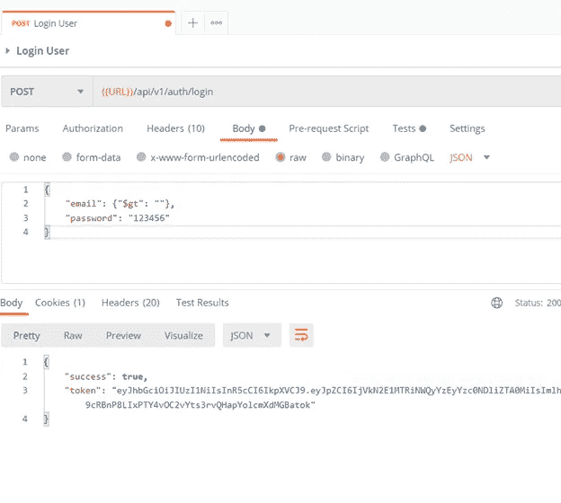
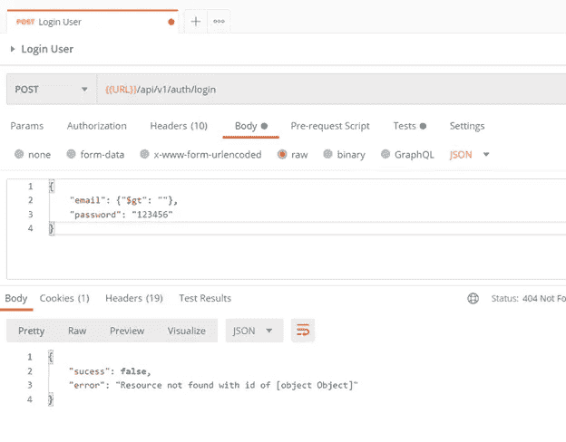
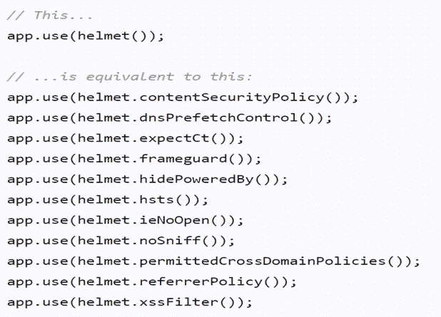
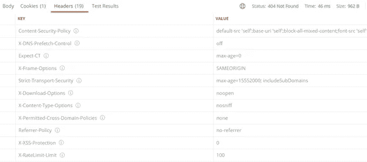
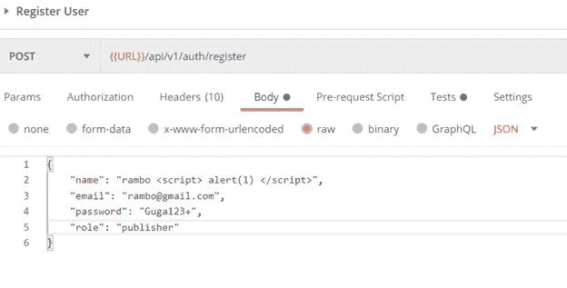
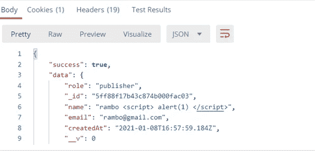
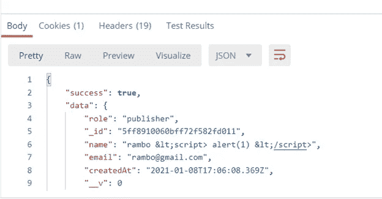

# 如何解决这些常见的 Node.js/Mongo API 安全问题

> 原文：<https://javascript.plainenglish.io/common-nodejs-mongo-api-security-problems-and-how-to-overcome-them-548d0137984c?source=collection_archive---------6----------------------->


Photo from toptal

开发应用程序时，有些人会考虑安全性，有些人可能不会。在开发阶段，安全性非常重要。在深入本文之前，让我们先来看一些基础知识，比如什么是 API 安全性，为什么它如此重要？API 安全是对我们使用和拥有的 API 的完整性的保护。如今，大多数企业都使用 API 来连接服务和传输数据。如果该 API 被破坏、暴露或遭到黑客攻击，将会导致数据泄露。因此，根据传输的信息，我们需要考虑我们将在应用程序中实现的 API 安全级别。在本文中，我将展示一些有用的 npm 包，它们将帮助我们防止常见的安全问题。

## 1.防止 NoSQL 注射

SQL 注入是一种流行的攻击手段，但它不再像过去那样普遍。许多现代应用程序使用 NoSQL 数据库。攻击者将试图使用这种 NoSQL 注入来入侵我们的应用程序。所以考虑这个问题是非常重要的。我将用一个例子和这个问题的解决方案来说明这个问题。



从上面的例子中，你可以看到它返回的令牌没有电子邮件。使用上述操作符，攻击者能够获得属于该应用程序的电子邮件地址。如果我们使用密码加密，他们不能做到这一点，但如果用户使用一些共同的密码如上。这是应用程序中非常严重的漏洞。我们如何克服这个问题？

要解决这个问题，您可以使用 express-mongo-sanitize 软件包。不要想太多，你需要编码很多来解决这个问题。在定义路由之前，只需使用这个包并将其初始化为 server.js 中的 express 中间件就可以解决这个问题。

`$ npm i express-mongo-sanitize`将软件包安装到您的节点应用程序中。然后将包导入到 server.js 文件中。

`const mongoSanitize = require(“express-mongo-sanitize”);`

之后，使用以下命令初始化软件包:

`app.use(mongoSanitize());`



看看我们如何轻松地用 express-mongo-sanitize 包解决了这个问题。

## 2.安全标题

头盔通过设置各种 HTTP 标头来帮助您保护 Express 应用程序。*这不是银弹*，但能有所帮助。基本上，头盔会增加额外的头部来保护你的路线。在终端使用这个包:`$ npm i helmet`。

使用`const helmet = require(“helmet”);`导入包

然后使用`app.use(helmet());`初始化中间件



当你默认使用`app.use(helmet());`时，它会包含上述的标题。如果你愿意，你也可以自定义它们。



如果您检查您的邮递员邮件头，现在您可以看到新的邮件头附在它上面。

## 3.XSS 保护



如果攻击者通过 POST 请求发送有害的脚本，该怎么办？为了解决这个问题，我们可以使用 xss-clean 包。

`$ npm i xss-clean`

然后使用`const xss = require(“xss-clean”);`导入这个包

使用`app.use(xss());`初始化 express 中间件



使用这个包之后，输出会是这样的。在这个计划的帮助下，我们可以阻止 XSS。

## 4.限速

API 限制，也称为速率限制，是互联网安全的重要组成部分，因为 DoS 攻击可以用无限的 API 请求来攻击服务器。速率限制也有助于提高 API 的可伸缩性。如果你的 API 流行起来，可能会有意想不到的流量高峰，导致严重的滞后时间。我们如何克服这个问题？

`$ npm i express-rate-limit`

然后使用`const rateLimit = require(“express-rate-limit”);`导入这个包

然后初始化 limiter，将其作为 express 中间件使用。

```
const limiter = rateLimit({windowMs: 10 * 60 * 1000, // 10 minsmax: 1, // No of Requests});app.use(limiter);
```


根据上面的代码片段，我提到了许多请求，如 1。如果我们超过 1 个以上的请求，它将抛出上述错误。

## 5.HTTP 参数污染(HPP)

HTTP 参数污染(HPP)是一种 Web 攻击规避技术，允许攻击者手工创建 HTTP 请求，以便操纵或检索隐藏信息。我们如何克服这个问题？

`$ npm i hpp`

然后使用`const hpp = require(“hpp”);`导入这个包

使用`app.use(hpp());`初始化 express 中间件

希望这将有助于你在未来的项目。谢谢各位读者。另一个有趣的话题再见。