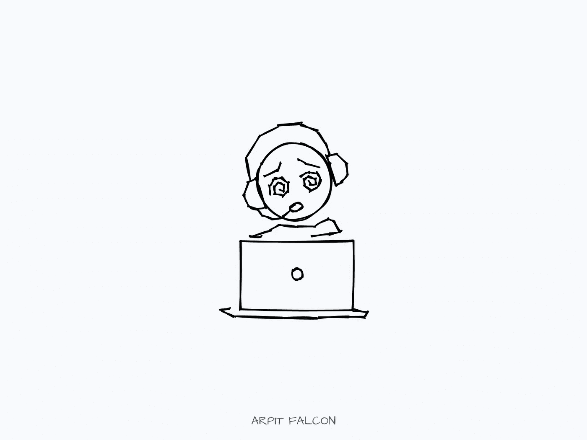

# 作为一名开发人员，你已经精疲力尽了，这是常见的征兆，还有 7 种不常见的克服方法

> 原文：<https://javascript.plainenglish.io/common-signs-you-are-mentally-exhausted-as-a-developer-and-7-uncommon-ways-to-overcome-it-dde98af2427a?source=collection_archive---------8----------------------->

## 请不要忽视他们。

Photo by author

软件开发人员是目前世界上最理性和最有创造性的工作之一。作为一名开发人员，你必须创造性地思考，以新的独特方式提出解决方案，然后理性地思考并编码。

但是，即使很多人热爱编程，软件开发人员的心理健康问题也在增加。[最近研究表明比机械工程师高](http://www.ijhssi.org/papers/v3(2)/Version-2/G0322052056.pdf)。

即使有明显的迹象，软件开发人员仍然继续编程和做他们的工作。你一定已经看到，即使在感觉筋疲力尽之后，你还在参加会议、编程、设计解决方案。这是你能对自己做的最糟糕的事情之一。

忽略一些明显的迹象会导致你很快筋疲力尽，甚至更糟，你可能会开始讨厌你的工作和编程。

这些是你应该留意的一些迹象—

## 1.缺乏动力

你有没有过不想再发扬光大的感觉？对我来说，动力是外在因素之一。这不会持续很长时间。我们可能前一天很上进，第二天就对立了。

但是如果你连续几天都缺乏动力，那是你自我反省的时候了。这可能意味着你精神疲惫，没有好好照顾自己的健康。

## 2.睡眠困难或睡眠过多。

睡眠是一种治疗。它帮助我们恢复活力，建立新的精神联系，并给我们精力度过第二天。

睡眠不足或睡眠过多是精神疲惫的明显标志。即使睡了 8 个小时后，你也会感到疲劳，并且以半吊子的精力工作。

## 3.难以集中注意力

你可能会注意到，当你已经冲刺了一段时间后，你在寻找分散注意力的东西。这是你的大脑告诉你休息一下。

当你发现很难集中注意力时，这一点变得更加明显，即使是很短的时间。你的大脑没有达到解决复杂问题的标准。

这些是当你接近精神疲惫时，你可以检查自己的一些常用方法。

我们的心理健康经常被忽视，因为它不是每个人都能看到的。当我们锻炼时，人们称赞我们，我们看到自己。但是当我们精神活跃时，没有人赞美我们。

我们还必须在精神上保持健康，才能在工作中发挥出最佳水平，并减轻任何长期影响。

我发现了这七种不寻常的方法，可以避免浪费我们的精神能量，也不会让我们筋疲力尽。

## 1.创造一种精神饮食

在当今时代，我们正在经历一场最好的数字洪流。数字洪流描述了导致焦虑和失眠的无休止的信息洪流。

我们需要留意我们一整天都在吃什么。就像我们吃什么决定了我们有多健康一样，我们整天阅读、观看和思考的东西塑造了我们的思想。

## 2.休息一下

好吧，这不是一个不寻常的建议。但是，这很重要。有计划的休息是你日常工作的一部分。你不要浪费时间。你用它来放松自己，然后精力充沛地工作。

确保事先安排好休息时间。这会帮助你不跳过它们。还有，休息的时候不要花时间在社交媒体上。后退一步，放松。不要在休息时间吃垃圾食品。

## 3.脱离你自己

永远想着你正在解决的问题会适得其反。当你下班时，把自己从代码中分离出来，花时间关注你的爱好、家庭和朋友。

找个时间停下来休息一天，然后整理好所有东西放松一下。

## 4.安排你的一天

最后两点稍微讲一下排班。

时间安排是我发现的最好的技巧之一。它带走你一天中的任何模糊。你不用去想你接下来想做什么。你已经有了当天的地图。你要做的就是跟着它走。

> "**纪律**等于**自由**"
> 
> — Jocko Willink，退役海豹突击队员兼作家。

以 30 分钟为单位来安排你的一天。当我用一个小时来安排我的一天时，我发现如果我浪费了这一小时的前 5 分钟，那么整个小时都浪费了。但是如果这些片段是 30 分钟的，那么只有这 30 分钟是徒劳的，我现在可以跳回我的日常生活了。

## 5.与他人联系

编程可能经常会感到孤独。在封锁期间，我们所做的就是坐在电脑前参加会议和编写代码。

人类是群居动物。我们喜欢与他人交流。所以，加入一个社区，和其他开发者联系，和他们交流。了解别人的生活，分享你的生活。

## 6.让你做的事情多样化

日复一日地做同样的事情，即使你不喜欢，这是最糟糕的精神疲惫的表现之一。

使工作多样化。如果你想做一个新项目，问问你的经理。不要满足于你讨厌做的事情。

如果你被它困住了，从你的一天中偷一些时间去做你喜欢的工作。也要使它们多样化。

不要一遍又一遍地做同样无聊的事情。

## 7.忽略竞争

竞争会在几秒钟内破坏你的心理健康。与他人竞争从来不会产生好结果。你可能认为你比别人强，但这只是几个小时或几天。

你过度生长了。

而是和自己有竞争。渴望比你的昨天更好。你不需要每天都努力。到处休息一下。

心理健康是一个不太受称赞的问题。所以，如果你在所有的压力下都坚持下来了，你很棒，我祝福你。

你想更快地学习新技能吗？ [***抓住我的免费 7 步学习框架，加速你的学习，让技能坚持下去。***](https://dedicated-innovator-3432.ck.page/47cebcc022)

如果你是新来的，喜欢这篇文章，在 Medium 上还有很多这样的文章。你可以注册阅读它们，每月只需 5 美元。

[**这里是无限制访问媒体上所有内容的链接。如果你用这个链接注册，我会赚一小笔钱，不需要你额外付费。**](https://arpitfalcon.medium.com/membership)

*更多内容看* [***说白了. io***](http://plainenglish.io/)