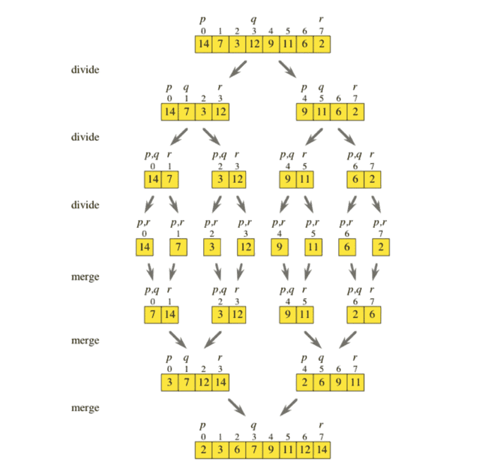

# 常见排序算法及其复杂性

> 原文：<https://javascript.plainenglish.io/common-sorting-algorithms-and-their-complexities-f82b776c987?source=collection_archive---------22----------------------->

## 对于需要排序算法复习的人


Photo by [Alex Chumak](https://unsplash.com/@ralexnder?utm_source=medium&utm_medium=referral) on [Unsplash](https://unsplash.com?utm_source=medium&utm_medium=referral)

在编程中，我们经常需要能够以有效的方式对数据进行排序。在本文中，我将向您介绍一些常见的高级排序算法及其时间复杂性。对于每一个，我都将包含一个简单的对数字数组进行排序的例子。

# 选择排序

让我们从一个更简单的开始，选择排序。选择排序是一种在同一个数组中维护两个子数组的排序算法。其中一个数组是已经排序的数组，另一个是未排序的数组。下面是我们的例子:

```
const unsortedArray = [9, 10, 5, 3, 0, 2, 7];
```

首先，整个数组被认为是“未排序数组”在第一遍中，我们遍历整个数组并找到最小值。在这种情况下，它是 0。我们取 0 并将其添加到排序后的数组中。现在，数组看起来像这样:

```
const unsortedArray = [0, 10, 5, 3, 9, 2, 7];
```

你可以把上面的看作两个数组。一个是带有[0]的已排序数组，另一个是带有[10，5，3，8，2，7]的剩余未排序数组。

接下来，我们遍历，将 2 移到未排序数组的开头，与 9 交换。

```
const unsortedArray = [0, 2, 5, 3, 9, 10, 7];
```

如果继续下去，一旦我们遍历了未排序数组中的每个条目，最终整个数组都会被排序。

## 时间复杂度

这需要两个循环。一种是跟踪我们在数组中的位置(也就是数组中已排序和未排序部分之间的边界)。另一个循环遍历数组的其余部分，查找最小元素。对于两个嵌套循环，该排序算法的时间复杂度是 O(n)。

# 冒泡排序

冒泡排序是另一种简单的方法，但效率不是很高。在冒泡排序算法中，通过交换无序的相邻元素，多次反复迭代数组。最终，最终的数组将被排序。让我们再次使用上面的例子:

```
const unsortedArray = [9, 10, 5, 3, 0, 2, 7];
```

在第一遍中，遍历数组并交换任意两个相邻的无序元素。这是第一次传递的样子，它交换了几个元素，直到 10 到达最后:

```
// PASS 1
const unsortedArray = [9, 5, 10, 3, 0, 2, 7]; // swap 10 & 5
const unsortedArray = [9, 5, 3, 10, 0, 2, 7]; // swap 10 & 3
const unsortedArray = [9, 5, 3, 0, 10, 2, 7]; // swap 10 & 0
const unsortedArray = [9, 5, 3, 0, 2, 10, 7]; // swap 10 & 2
const unsortedArray = [9, 5, 3, 0, 2, 7, 10]; // swap 10 & 7
```

经过几次交换后，数组中最大的数字 10 现在被移到了末尾。所以我们离结果更近了，但是目前为止。在下一次通过后，9 将被移动到更靠近末端的位置。

```
// PASS 2
const unsortedArray = [5, 3, 0, 2, 7, 9, 10];// PASS 3
const unsortedArray = [3, 0, 2, 5, 7, 9, 10];// PASS 4
const unsortedArray = [0, 2, 3, 5, 7, 9, 10];
```

数组现在已经排序了，尽管它仍然会经历 7 次顶级循环，除非您实现一个检查来查看数组是否已经排序。在最坏的情况下，将在所有 7 次传递中进行交换。

## 时间复杂度

这里的算法将总是运行 O(n ),不管数组是否排序。你可以做一些检查来稍微改善这一点。

# 插入排序

插入排序是一种算法，在这种算法中，你一个接一个地遍历数组，将每个数字移动到它后面相应的排序数组中的位置。以我们的阵列为例:

```
const unsortedArray = [9, 10, 5, 3, 0, 2, 7];
```

我们迭代每个数字。当我们检查 9 和 10 时，从 9 > 10 开始什么也没发生。然而，当我们到达 5 时，我们将 9 和 10 移动到右边的一个位置，为在正确的位置添加 5 创造空间:

```
const unsortedArray = [5, 9, 10, 3, 0, 2, 7];
```

这种方法类似于选择排序，因为数组的左边是“排序数组”您只需不断地获取条目，并通过移动其余的条目，将它们插入到排序后的数组中的正确位置。

## 时间复杂度

这是嵌套循环的另一个例子。遍历一次，然后遍历排序后的数组，找到正确的位置，并在必要时移动元素。

# 合并排序

合并排序是一种递归排序算法。它使用分而治之的方法，将问题分解成更小的部分。您将数组分成两部分，对每一部分调用合并排序算法，然后在最后将它们组合起来。这是一个图表:



[https://www.khanacademy.org/computing/computer-science/algorithms/merge-sort/a/overview-of-merge-sort](https://www.khanacademy.org/computing/computer-science/algorithms/merge-sort/a/overview-of-merge-sort)

请注意，数组被分成几部分，直到不能再分，数组长度为 1。此时，merge()算法开始以正确的顺序合并它们，直到您再次拥有完整的数组。

## 时间复杂度

归并排序的时间复杂度为 O(n log n)。每个问题被分解成两个子问题，直到达到一个，然后在合并过程中再次组合。

# JavaScript 的方式

我真的很懒，所以这是我在大多数场景下首选的排序方式。在 JavaScript 中，你可以使用[。sort()函数](https://www.w3schools.com/jsref/jsref_sort.asp)，传入一个 a-b 函数参数。

```
const unsortedArray = [5, 9, 10, 3, 0, 2, 7];unsortedArray.sort(function(a, b){return a-b});console.log(unsortedArray); // [0,2,3,5,7,9,10]
```

这就是我对常用排序算法的概述。希望你喜欢这篇文章！

*更多内容尽在*[plain English . io](http://plainenglish.io/)