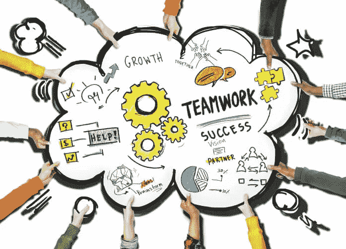

# 沟通与协作——作为一名软件工程师，我希望知道的 5 件事(第 4/5 部分)

> 原文：<https://javascript.plainenglish.io/communicate-collaborate-5-things-i-wish-i-knew-as-a-software-engineer-part-4-5-4ee303cd764a?source=collection_archive---------7----------------------->

如果你错过了这个 5 部分系列中的最后一部分，你可以在: [**关键点 3——不够多——作为一名软件工程师我希望知道的 5 件事**](https://anandsafi.medium.com/not-pocing-enough-5-things-i-wish-i-knew-as-a-software-engineer-part-3-5-25021776d682)

所有的 5 个关键特征都可以在这篇文章中找到 [**。**](https://anandsafi.medium.com/software-engineering-done-right-5-things-i-wish-i-knew-as-a-software-engineer-9419afa85f99)

我喜欢下面这句似乎很适合这个关键特质的话。

> 我们中没有一个人像我们所有人一样聪明。—肯·布兰查德

软件工程是一门艺术，绝对需要创造力。很多时候，由于这一领域的工作性质，工程师们倾向于与更具合作精神的人隔绝或被逼入绝境。这可能只是意味着他们有低头的时间，或者真的需要专注于以安静、孤立的方式解决特定的挑战。

虽然上面说的很有道理，我也同意这种方法，但当这成为一种工作方式和思维模式时，问题就显现出来了。当一个人继续成为 ***独狼*** 并通过自己的工作获得权力时，他们会加倍抵制寻求帮助/要求队友解除障碍。当你想展示你作为工程师的顶尖技能时，骄傲很容易成为障碍。

除了犹豫是否合作，它还会导致沟通障碍。随着时间的推移，团队在你的工作中的可见度降低，可能会努力与你合作，并在需要帮助时进行干预。*沟通有助于促进团队建设，说同一种语言，能够以非技术方式清晰表达任何复杂的技术工作。*

我很想在下面的评论中知道你的想法，以及你是否有过类似的感受或经历。

下一个也是最后一个 [**关键特质# 5——精通利基市场与聪明的多面手…**](https://medium.com/javascript-in-plain-english/mastering-a-niche-vs-smart-generalist-5-things-i-wish-i-knew-as-a-software-engineer-part-5-5-7c835a31ad22)

## 感谢阅读！

## 请随时与我联系: [LinkedIn — Anand Safi](https://www.linkedin.com/in/anandsafi) 。我很想听听你对这个和其他技术话题的想法！