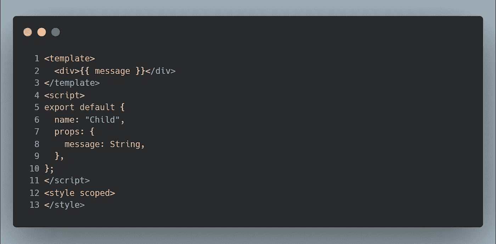
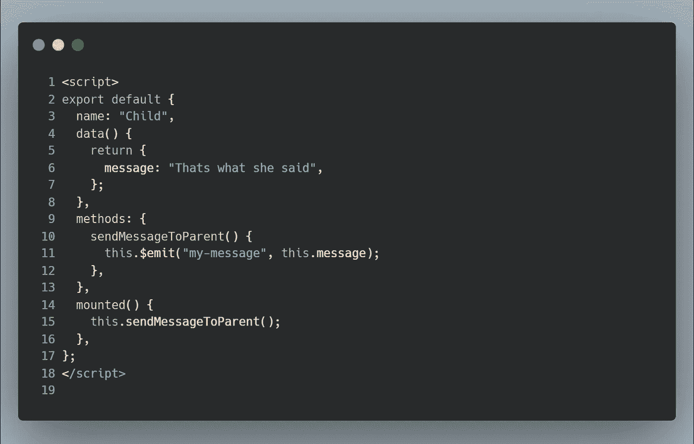

# Vue.js 中组件之间如何通信

> 原文：<https://javascript.plainenglish.io/communication-between-components-in-vue-js-d79124917cd0?source=collection_archive---------0----------------------->

在这篇文章中，我们将学习如何在 Vue.js 中的组件之间进行通信。以下是方法。

Photo by [Florian Olivo](https://unsplash.com/@florianolv?utm_source=medium&utm_medium=referral) on [Unsplash](https://unsplash.com?utm_source=medium&utm_medium=referral)

每个框架都有自己独特的架构，但它们有一个共同点。整个页面被分成小的组件，每个组件都有自己的功能和 UI。有时，我们需要一种方法在这些组件之间进行通信。

一般我们用***【Vuex】****(状态管理工具)*来存储数据，跨组件使用。但是有时，我们需要一种方法将数据从一个组件发送到另一个组件，而不使用 Vuex 存储。在本文中，我们将学习实现这一目标的可能方法。

有五种方法可以将数据从一个组件发送到另一个组件:

**1。使用道具(亲子沟通)**

**2。使用事件(孩子对父母的交流)**

**3。使用事件总线(任何组件之间的通信)**

**4。使用提供/注射(父母对子女的交流)**

**5。利用这个。$refs(亲子沟通)**

让我们逐一研究一下，看看它们是如何工作的。

# 1)使用道具(父母与孩子的交流)

可以使用 *props* 从父子组件发送数据。在下面的例子中，我们通过道具`message`将数据从`parent.vue`发送到`child.vue`。

**Child Component (Child. vue)**

我们已经创建了一个打印消息的组件。我们已经在 props 中定义了一个名为`message`的变量，并在模板中进行渲染。

**Parent component (Parent. vue)**

当我们将子组件嵌套在父组件中时，我们使用指令`v-bind`绑定想要发送的数据，并使用 props 发送数据。

每当父对象更改属性时，新值都会发送给子对象并重新渲染。

# 2)使用事件(从孩子到父母的通信)

这类似于 props，但是我们将数据从子节点发送到父节点，而不是使用 v-bind，我们使用指令`v-on`进行捕获。

我们在包含消息的子组件中定义了一个变量。我们通过从子组件触发一个事件，将相同的内容发送给父组件。

`this.$emit(’name-of-the-event’, args1, args2, args3,...)`是引发事件的一种方式。这是使用指令`v-on`在父组件上捕获的。请注意，应该使用捕获时发送的相同事件名称，并且可以检索参数。

**Child Component(Child.vue)**

**Parent Component (Parent. vue)**

只要子组件中的消息发生变化，新值就会发送到父组件并重新呈现。

# 3)使用事件总线(任意两个组件之间的通信)

事件总线用于任何两个组件*(组件不需要有父子关系)*之间的通信。当需要手动监听组件实例上的事件时，可以使用这种方法。

您可以使用`this.$root.$emit(’name-of-emitter’, args1, args2, ...)`从一个组件发送数据，并在另一个组件中使用与此相同的名称`this.$root.$on(’name-of-emitter’, args1, args2, ...)`捕获数据。

**component-one. vue**

注意，我们使用`mounted() {}`来捕获*组件 2 中的事件。vue。*

**component-two. vue**

# 4)使用提供/注入(亲子沟通)

这用在有 ***深度嵌套组件*** 的结构中，并且只需要来自深度嵌套子组件中父组件的内容。

在这种情况下，您仍然需要将道具传递到整个组件链，这可能很烦人。对于这种情况，我们可以使用`provide`和`inject`对。

虽然我们这里的例子非常简单，但是我们仍然从父母向孩子发送消息，因此它是有效的。

**Parent Component**

我们使用父组件作为提供者，发送数据并将其注入到同名的子组件中。

**Child Component**

无论组件层次结构有多深，父组件都可以作为其所有子组件的依赖提供者。

# 5)用这个。$refs(亲子沟通)

这种方法是进行通信的最不可取的方式，但它是可用的选项之一。

尽管有其他方法，有时您可能仍然需要直接访问子组件。为了实现这一点，您可以使用`ref`属性为子组件分配一个引用 ID。

**Parent Component**

这里我们将子组件引用为' ***子组件*** '(引用 ID)，然后使用`this.$refs.child`捕获它。我们可以通过这种方式访问与子组件相关的任何内容。

**Child Component**

We are consoling the referred component. We get access to everything the component is associated with, which we can use.

# 结论:

这就是总结。如果你知道 Vue.js 中组件之间的其他通信方式，请在下面评论，谢谢。

*更多内容请看*[*plain English . io*](http://plainenglish.io/)