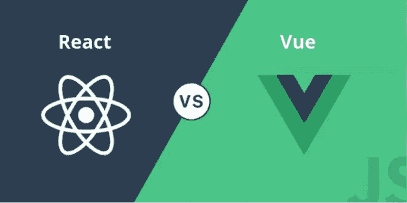
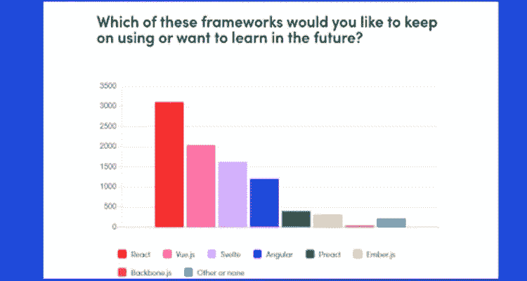
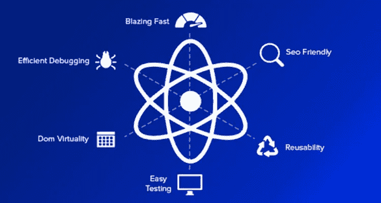
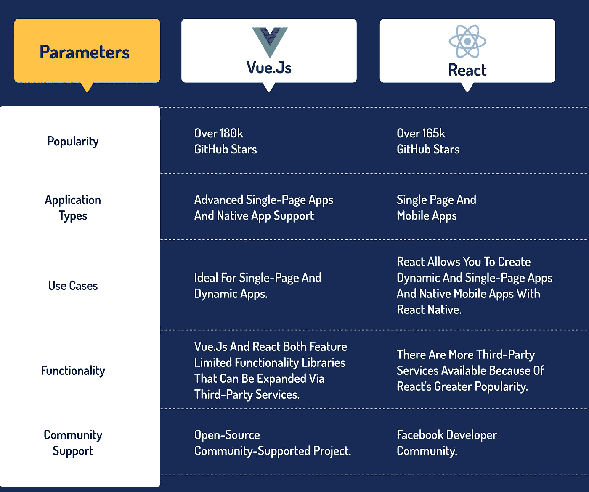

# 最好的 JavaScript 框架之间的比较:Vue.js 与 React.js

> 原文：<https://javascript.plainenglish.io/comparison-between-the-best-javascript-frameworks-vue-js-vs-react-dff9c0d510fc?source=collection_archive---------6----------------------->

尽管 JavaScript 框架对于 web 应用程序开发至关重要，但许多企业在 React(技术上来说是一个库)和 Vue.js 之间左右为难。简短的答案是，从广义上讲，在 React.js 和 Vue.js 的争论中，没有明显的赢家。

你知道吗，根据 Frontend 2020 的一份[状态报告， **React 和 Vue 是最流行的两种 JavaScript 框架**？4500 名专业前端开发人员参与了这项研究。](https://tsh.io/state-of-frontend/#frameworks)

[Source](https://tsh.io/state-of-frontend/#frameworks)

每个框架都有它自己的一套好处和应用程序。查看这篇文章，了解 Vue.js 和 React.js 之间的比较，并决定哪个框架最适合您的项目需求和开发技能！

**让我们开始吧。**

# Vue.js —简介

Vue 于 2014 年发布供一般使用。它是一个开源的 JavaScript 框架，用于创建用户界面和单页应用程序。在 Stack Overflow 的 2020 年开发者调查中，Vue 被认为是第三大最受欢迎的前端 javascript 框架。

每个 Vue.js 开发企业都使用这个框架来开发世界各地的响应式 web 应用程序。它生成单页面 web 应用程序，并集中在视图层。

# 为什么要用 Vue JS？

如果您正在寻找一个简单的解决方案，并且没有对重型框架的真正需求，那么 Vue.js 就是您所需要的。根据 Wappalyzer 和 built with 年 6 月的统计，大约 **427k 和 693k 站点使用 Vue.js 构建**

Vue 的设计考虑到了简单性和性能。在 Vue 中，你可以在几个小时内学会它的所有特性，而其他框架如 Angular 或 Ember 则需要几天或几周。

你应该使用 Vue 的另一个原因是，它支持大型公司，如阿里巴巴，Slack，甚至微软自己，在他们的下一个版本的 Internet Explorer 上使用它。

如果你想要一个功能强大的应用程序，你也可以[雇佣 Vue.js 开发者](https://www.pixelcrayons.com/hire-vuejs-developer)。

## Vue.js 为什么这么受欢迎？

*   Vue.js 使用虚拟 DOM。
*   高速运行时性能
*   Vue.js 提供了响应式的可视化组件。
*   核心库最受关注，而协作库则负责全局状态管理和路由等功能。

# React.js 是什么？

React js 是 2011 年在脸书的办公室开发的 JavaScript 库，用于创建使用 JavaScript 数据结构的单页面应用程序。它提供了自己的虚拟 DOM 实现。

它允许你**创建可重用的和吸引人的用户界面组件**。它非常适合需要经常改变数据的组件。

React 不使用模板和 HTML，而是允许您通过将用户界面分成更小的组件来创建可重用的用户界面。它是目前市场上众多 Javascript MVC 框架之一。

# React 的优势

**灵活性和响应性:**它提供了最大的灵活性和响应性。

**虚拟 DOM:** 因为它是建立在文档对象模型上的，所以它支持浏览器友好的 HTML、XHTML 和 XML 格式的文档结构。

丰富的 JavaScript 库:来自世界各地的贡献者正在努力为丰富的 JavaScript 库添加更多的特性。

**可伸缩性:** React 因其灵活的结构和可伸缩性而被证明更适合大规模应用。

**不断发展:** React 不断发展，因为它得到了不断寻求改进的熟练脸书开发人员的支持。

**Web 或移动平台:** React Native 是一个 Web 和移动框架，允许您使用相同的 React 组件模型为 iOS 和 Android 创建具有本机外观的应用程序。

如果你正考虑用 React 制作一个拥有所有这些额外津贴的应用程序，那么[从一家顶级应用程序开发公司雇佣 React.js 开发人员](https://www.pixelcrayons.com/hire-react-developers)。

# 什么时候用 React.js？

React 是如此的通用，你可以用它来创建任何东西。然而，在一些特殊的情况下，React js 开发是必需的。React 是目前市场上针对以下应用的最佳解决方案。

*   **动态应用**

你在做一个需要频繁重渲染的应用吗？React 是一个很棒的选择，因为它允许您用数据变化即时更新视图。

*   **单页应用**

React 是单页面应用程序的绝佳选择，因为它可以显示内容变化，而无需重新加载当前页面。

*   **本地移动应用**

React Native 允许您创建外观和感觉就像用 Java 或 Objective-C 编写的原生应用程序一样的移动应用程序。

# Vue。Js vs React。Js:终极比较

对于许多开发人员来说，在 Vue.js 和 React.js 之间进行选择的前景是压倒性的，所以我认为创建一个简单的资源来突出它们的一些差异将是有帮助的。

## 一流的性能

虚拟 DOM 和真实 DOM 是两个可以互换使用的术语。使用 DOM 对设计界面的 JavaScript 工具的性能有很大的影响。

React 使用了**虚拟 DOM** ，这是一种轻量级的、独立于浏览器的技术**。React 与 DOM 配合得非常好，这是它受欢迎的关键原因之一。**

Vue 也使用虚拟 DOM，但是它比 React 有**更好的性能和稳定性。**

Vue 和 React 的性能差异，根据数据，只有几毫秒。这证明了 Vue 和 React 在性能方面的可比性。

## #2 灵活性

React 的核心只提供基本的能力。该库的功能必须扩展才能发挥作用。这允许开发人员在选择额外工具时有很大的灵活性。

他们经常借助额外的库来解决以下问题:

*   按指定路线发送
*   服务器渲染
*   应用程序状态管理
*   移动应用程序开发

与 React 不同， **Vue 为开发者提供了一套更全面的标准工具**。它允许您使用第三方库来解决 React 生态系统通常处理的相同挑战。

## #3 尺寸

JS 代码的大小是显著影响 web 项目性能的关键指标。自然是越小越好。

**React 大小约为 100 千字节**。但是，需要强调的是，React 需要第三方库来实现特定的功能。路由就是这样一个功能。

Vue 的大小约为 80 KB ，因为它有更广泛的标准功能；使用 Vue 时还需要附加组件。

React，Vue 的尺寸仍然相对较小，这使得它们非常适合构建小型应用程序。总而言之， **React 比 Vue** 重一点。

## #4 桌面和移动开发

一切都很简单，根据反应过来。你可以用同样的技巧**用 React Native 开发原生 iOS 和 Android 应用。**

Vue 在这种情况下很有挑战性。Weex 项目，一个由阿里巴巴集团创建的跨平台 UI 框架，现在正式得到 Vue 的支持。通过 Weex，你可以使用相同的 Vue 语法构建浏览器组件以及 iOS 和 Android 应用。

Weex 目前处于开发的早期阶段，还不像 React Native 那样成熟或经过充分测试。用 Vue.js 构建真正的原生应用的 NativeScript 插件是 NativeScript-Vue 的另一种形式。

## #5 社区支持

React 库由 Faceboo k 维护和开发。任何使用 React 作为其应用程序前端基础的人都应该放心，它不会很快成为一个废弃的项目。React 开发人员社区已经开发和维护了许多其他工具。

Vue 是一个由个人开始的项目，而不是一个重要的组织。起初，从开发人员的角度来看，这个框架似乎不太可靠。

另一方面，Vue 越来越受欢迎，许多程序员为其开发做出了贡献。我们可以宣称 Vue 开发者社区是项目背后的驱动力。

# Vue 与 React 的快速比较

下面的表格比较了在选择 Vue.js 和 React.js 时需要考虑的关键因素，使我们对前端框架的概述更容易理解。

# Vue.js vs React.js:选哪个？

当在 Vue.js 和 React.js 之间做出选择时，乍一看很难决定使用哪个框架，因为它们都是高质量、构建良好的 JavaScript 库，既有一些相似之处，也有一些不同之处。

Vue 是创业公司的理想选择，但也可以用于大型项目。如果您想通过简单的测试和调试来构建一个高度可伸缩的应用程序，请使用 React。

如果你对两个最流行的 JavaScript 框架感到困惑，并想与印度的一家应用开发公司联系，请随时联系我或在下面留言，与经验丰富的开发团队联系，帮助你轻松创建项目。

祝你好运！

*更多内容尽在*[***plain English . io***](http://plainenglish.io/)