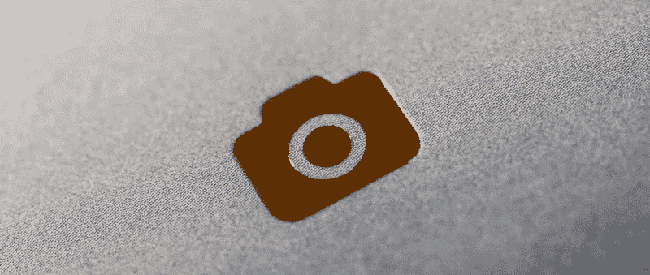
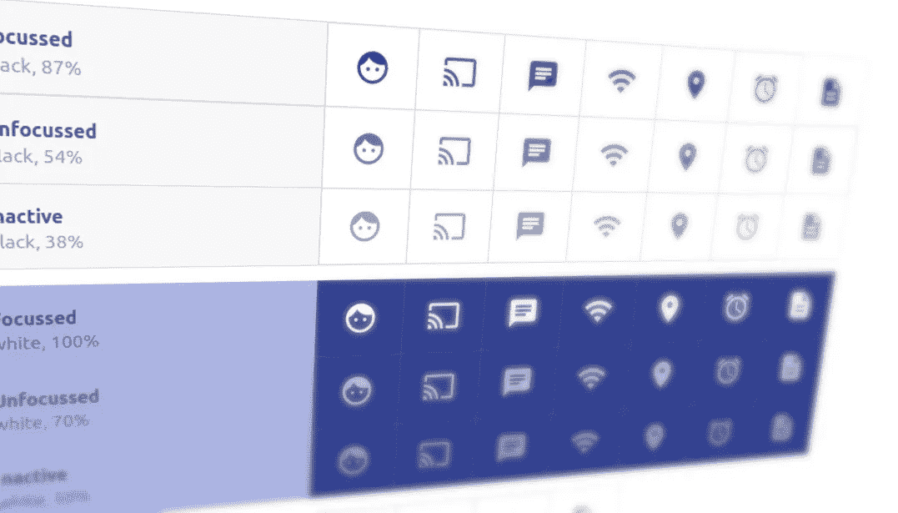
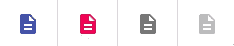
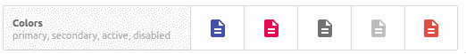
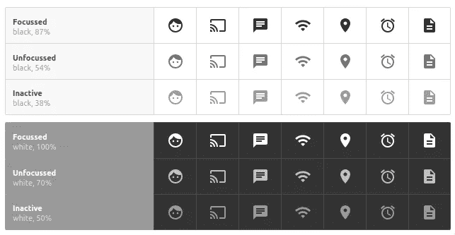
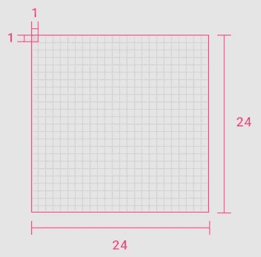
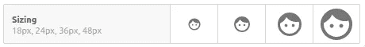
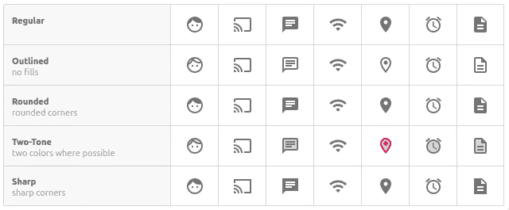
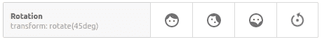

# 反应中使用材料设计图标的完整指南

> 原文：<https://javascript.plainenglish.io/complete-guide-for-using-material-design-icons-in-react-d46fbd09301b?source=collection_archive---------1----------------------->

## 使用“反应”中的“材料设计图标”所需的所有细节。



Photo by [Jason Leung](https://unsplash.com/@ninjason?utm_source=medium&utm_medium=referral) on [Unsplash](https://unsplash.com?utm_source=medium&utm_medium=referral)

## 介绍

**网飞**、**亚马逊**和 **Spotify** 等公司在其 React 应用程序中使用 [Material UI](https://material-ui.com/) 是有原因的。出于同样的原因，我们将看看这个惊人的反应库的一个特定子集:允许我们使用**材料设计图标**的组件。

[**材料设计**](https://material.io/) 是谷歌在 2014 年创造的一种设计语言——或称*风格指南*，时至今日，它已经包含了超过 [1100 个官方图标](https://material.io/resources/icons)。开源社区提高了这个数字，你可以发现总共有 2000 多个图标。

[**Material-UI**](https://material.io/resources/icons) 是一组维护良好的 React 组件，允许开发人员在其前端使用 Material Design 及其图标。如果我们愿意，我们甚至可以用它来创建我们自己的设计系统。

让我们探索如何使用它们美丽的图标。



Source: [Gerardvanderput.com](https://gerardvanderput.com/)

> 注意:本文中的所有图标图像都是来自我的 GitLab 资源库中的[reaction 项目的截图。请随意看一看！考虑克隆回购协议，玩弄图标和代码。](https://gitlab.com/gvanderput/gerard-material-icons)

## 索引

*   从哪里开始？
*   最小化束大小
*   默认图标
*   图标着色
*   推荐的图标颜色
*   图标大小
*   图标主题(变体)
*   旋转和动画图标
*   最后一句话

*…还有很多漂亮的图片！*

## 从哪里开始？

当我们开始搜索时，有相当多看似相关的 NPM 套餐:`@mdi/react`、`mdi-material-ui`和`mdi-react`——说出最受欢迎的套餐。因此，很难弄清楚如何在您的 React 应用程序中获得材质设计图标。

不要再搜索了，使用能粉碎所有数字的包装:

[**@ material-ui/icons**](https://www.npmjs.com/package/@material-ui/icons)

这是来自 Material-UI 的官方包装。它每周有超过 100 万次下载。

我用 CRA 创建了一个新的反应应用程序(创建反应应用程序)，并从 Material UI 添加了*核心*包和相关的*图标*包:

```
$ yarn add @material-ui/core @material-ui/icons
```

每个图标都有自己的 React 组件，如果我们想要渲染它，我们需要导入它。有两种方法可以做到这一点:

第二种方法“*产生最佳的开发者体验*”，正如开发者自己所说。您可以在一行中导入多个图标组件，并且在键入组件名称时更容易受益于自动完成功能。

我同意并推荐使用这种方法。然而，为了防止在开发过程中所有的图标都被加载到包中，这会导致开发服务器的启动时间明显变慢(例如，当您运行`**yarn run start**`时)，您必须正确配置您的 CRA 设置。你可以在这里阅读所有的细节[，但是我将在下面总结这个过程。](https://material-ui.com/guides/minimizing-bundle-size)



## 最小化包大小

> 请注意，这仅在您使用 CRA 时才重要。如果没有，请直接跳到下面的下一章。

我们必须:

*   将`babel-plugin-import`插件添加到我们的项目
*   通过创建一个`.babelrc.js`文件来配置这个插件
*   指示我们的应用程序读取这个 RC 文件

因为我们不想放弃我们的 CRA 项目，我们必须采取一些(小)步骤来实现这个目标。首先，添加三个依赖项:

```
$ yarn add babel-plugin-import customize-cra react-app-rewired
```

然后在根目录下创建文件`.babelrc.js`，内容如下:

最后，通过覆盖我们的 Webpack 配置文件，指示 React 读取该文件。第一，在`package.json`里面，把这条线改一下…

```
"start": "react-scripts start"
```

…变成:

```
"start": "react-app-rewired start"
```

其次，在根目录下创建一个名为`config-overrides.js`的新文件，内容如下:

重启你的开发服务器，我们就可以开始了。是时候渲染一些图标了！

## 默认图标

渲染图标的最基本方法是导入相关的**图标组件**，并在组件的渲染函数中返回:

Rendering a single icon.

您可以使用 IDE 中的自动完成功能来搜索图标。或者，您可以使用以下搜索页面之一获得视觉指导:

1.  [从**物料界面**搜索页面](https://material-ui.com/components/material-icons/)
2.  [从**官方材料设计**网站搜索页面](https://material.io/resources/icons)

呈现图标组件会向 DOM 添加一个 SVG 元素。

## 图标着色

```
<Alarm color="secondary" />
```

通过使用`color`属性，您可以:

*   用预定义的常量(字符串)给图标着色，或
*   给图标一个自定义颜色

请注意，如果图标组件本身没有定义颜色，图标*也会从其父 HTML 元素*继承颜色。因此，如果您的 H1 标题元素是红色的，并且您在其中呈现了一个图标，该图标将变成红色。

**预定义常数**(字符串)为`primary`、`secondary`、`action, disabled`和`error`。在这里你可以看到他们的行动:



Another screenshot from [my repository](https://gitlab.com/gvanderput/gerard-material-icons).

我们还可以通过使用`className`或者使用`style`属性的内联样式为组件添加一个样式类，以便设置图标颜色。如前所述，默认情况下，颜色是从它们的父元素继承的。

```
<Alarm className="myRedIcon" />
<Alarm style={{ color: 'red' }} />
```

## 推荐的图标颜色

对于[在材料设计中使用图标颜色](https://material.io/design/iconography/system-icons.html#color)有指导原则。材质设计和材质 UI 都推荐使用这些颜色(*是的，我确实花了很多时间来创建这些图片*):



## 图标大小

与颜色类似，也有图标大小的建议。所有图标都设计在一个 **24x24 像素**的网格上:



Source: [material.io](https://material.io/design/iconography/system-icons.html#grid-and-keyline-shapes)

因此，很自然地，图标以这种尺寸呈现时会看起来最好。这也恰好是我们到目前为止讨论的图标组件的默认大小。

但是材质图标是 **SVG 图片**。所以它们的伸缩性很好，基本上，你可以以任何尺寸展示它们。风格指南[建议](https://google.github.io/material-design-icons/)坚持这四个维度:

`18x18px`、`**24x24px**` ( *默认*)、`36x36`、`48x48` px。



组件也支持使用属性来控制大小(`fontSize`)，但是它只接受字符串值“**small**”(20px)和“**large**”(35px)，这对我来说没有什么意义，因为它违反了指导原则。

## 图标主题(变体)

我喜欢的一个特点是几乎所有的图标都有五种变化。或者*图标主题*，因为它在[一些地方被称为](https://material.io/design/iconography/system-icons.html#icon-themes):

*   填充(*默认*)
*   概述
*   全面的
*   双色调
*   锋利的

一些例子:



请注意双色变体如何自动生成辅助颜色(填充区域的颜色与笔画相同，但不透明度为 30%)。

所有五种变体都有自己的反应组件:

## 旋转和动画图标

当使用`@material-ui/icons`时，我们**没有得到现成的动画或旋转图标**。但幸运的是，图标设计得如此之好，以至于**为它们制作动画很容易**。

> 注意:像`@mdi/react`这样不太流行的包确实有[对这个](https://templarian.github.io/@mdi/react/)的支持。

我们可以用一些基本的 CSS 快速旋转图标并制作动画。

**旋转:**

```
.myIcon { transform: rotate(45deg); }
```

**动画旋转:**

我的存储库中的一些示例:



Rotation and animation.

## 最后一句话

这是我目前所有的。`@material-ui/icons`使用材料设计图标是多么容易，我对此印象深刻。他们的图书馆由一个非常大和活跃的社区维护。每天都有许多提交，而且总体上看起来维护得很好。

谢谢你的时间！

杰勒德