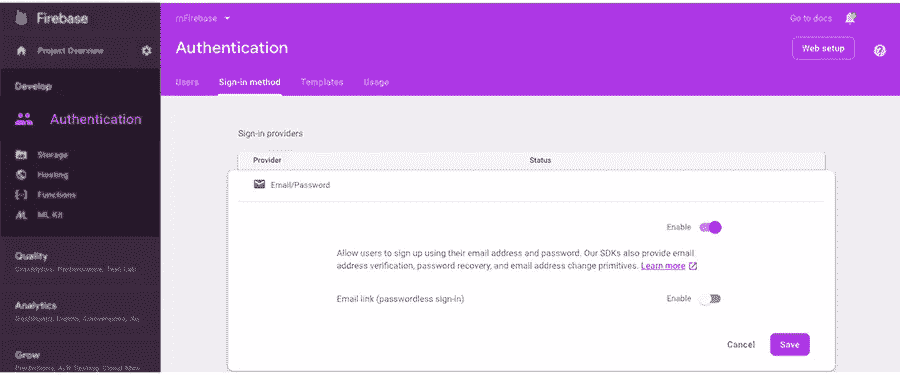

# 2021 年用 React Native 创建聊天应用

> 原文：<https://javascript.plainenglish.io/complete-guide-to-building-a-messaging-chat-app-with-react-native-cb9221ea0403?source=collection_archive---------2----------------------->


您是否想知道如何使用 React Native 构建一个消息应用程序，该应用程序可能会在发布一周内扩展超过 100 万用户？如果是，那么你来对地方了！

该博客涵盖了开发现代消息应用程序的架构和高级功能，以及帮助您立即开始使用领先技术的快速教程。我们的目标是在不到一周的时间内构建一个高度可扩展的聊天应用。

想象一下这样一个场景:如果有人问我希望推出哪种类型的应用程序来为我的业务创造最佳效益，那么聊天和消息应用程序可能会在我的列表中排在第一位。

构建一个具有支持多媒体、照片共享、通话等现代功能的聊天应用程序似乎很有挑战性，也很复杂。然而，与此同时，这似乎也很简单，因为 React Native 为您提供了第三方 API 的支持，有助于为您的聊天应用程序添加功能。

现在你必须知道 React Native 是一个相对年轻的框架，它如何帮助你开发一个成熟的聊天应用程序呢？

当我有机会为我的一个客户工作时，这个问题就在我的脑海里。他们的要求是构建一个具有一系列聊天功能的应用程序，我很幸运地帮助他们在很短的时间内从技术上扩展了拥有超过 100 万用户的应用程序。因此，这正是我想要分享的，并向你展示如何制作一个消息应用程序。

但是在直接进入教程之前，你们中的许多人非常关心这个过程花费了你多少钱，以及 React Native 将如何帮助你在 [**开发一个无缝运行在 iOS、Android 和其他设备上的聊天应用**](https://www.xicom.ae/services/mobile-app-development/) 。

## 【React Native 如何帮助你开发一款可扩展的消息应用？

无论你是一家初创公司还是领先的企业家，为什么你必须选择 React Native 进行聊天应用开发？

在开始任何应用程序开发项目时，每个公司都必须经历一个乏味的过程，决定哪一个是适合他们业务的框架。因此，我们没有相信我们的说法，而是仔细分析了 React Native 帮助企业开始使用该应用程序并利用数百万用户的关键因素。

**React Native 是最近推出的一个框架，用于使用 JavaScript 构建跨平台的移动应用程序。简而言之，使用 React Native 背后的主要思想是创建一个无缝运行在多个平台上的应用程序。用 Javascript 编写整个应用程序背后的逻辑是，你不需要为 Android/iOS 使用两种不同的编程语言。**

**换句话说，React Native 是一个跨平台的应用开发框架，允许您编写一次代码，并将其部署到包括 iOS 和 Android 在内的两个平台。**

## *****这就是为什么企业应该选择 React Native 进行聊天应用开发*****

**尽管是一个年轻的新框架，React Native 已经获得了行业巨头的信任，包括脸书、Instagram、沃尔玛、彭博、Telsa、Vogue、UberEats、Skype 等。**

**在所有这些应用中，Facebook Messenger 是全球公认的顶级消息应用，也得到了 React Native 的支持。原因是，这个框架使你的应用程序能够有效地在一个屋檐下展示混合应用程序和本地应用程序的组合优势。**

> **以下是他们考虑在公司中使用 React Native 的主要原因，以及 React Native 正在成为未来业务的重要框架的原因。**

*   ****为您的企业增添竞争优势****

**数字世界正在快速发展，商业竞争异常激烈。在这种情况下，每天都有成千上万的应用程序被提交到 app 和 play stores，因此，企业必须注意营销应用程序的时机。在这种情况下，React 原生移动应用程序开发解决方案将帮助您更快地完成任务。**

*   ****人才易得****

**根据 Stack Overflow 的开发者调查，大约 70%的受访者已经熟悉 React Native，因为它是基于 Javascript 的。其次，React Native 处于领先地位，被 42%的全球开发者使用，已经在科技公司中变得很受欢迎，因此，在市场上找到最好的 RN 开发者并不是一件遥不可及的事情。**

*   ****降低开发成本****

**因为您可以编写在两个平台上运行的代码，所以与开发本地解决方案相比，雇佣应用程序开发人员的开发成本会大大降低。即使你不需要一个工程师团队来开发解决方案，一个单独的 React 原生应用程序开发人员也可以帮助你为两个平台创建应用程序。**

*   ****可重用的 UI 组件****

**在构建 React 原生应用时，开发人员考虑的第一件事是开始定义出现在应用内许多地方的组件。这些组件就像可重复使用的模块，只需编写一次，就可以在许多地方使用，而无需花费越来越多的时间进行开发，从而节省了应用程序开发项目的成本和时间。**

*   ****跨平台兼容性****

**对于跨平台支持，我们说的是 iOS 和 Android。最初，当由脸书团队创建时，它在 2015 年仅支持 iOS，并在同年晚些时候开始支持 Android。**

**从那以后，这个框架风靡全球，并且还在不断发展。有了这个框架，你所需要的就是雇佣一个在 UI 元素和 API 方面有专长的应用开发者。开发人员只需使用一个代码库就可以为多个平台创建应用程序。**

> ****简而言之:**考虑到账户中的所有此类措施，领先的公司已经为他们的公司采用了 React Native。因此，为了展示为任何类型的应用程序构建现代架构的基本原则，我们将创建一个简单的聊天应用程序，它可以在 iOS、Android 和 web 上运行。**

> **让我们从一个聊天应用开发教程开始吧，它能让你产生超过 100 万的浏览量！**

# ****用 React 原生教程开发聊天应用****

**在本教程中，我们将尝试 [**使用 React Native**](https://www.xicom.ae/services/cross-platform-app-development/) 和 Expo 构建一个聊天 app，并以 Firebase 作为后端服务。我们会让事情变得简单易懂。该应用程序将包含一个简单的认证(注册/登录)屏幕，聊天室的创建，和这些房间内的组消息。此外，用户将被允许上传个人资料图片，聊天应用程序将更像一个实时工作的全球聊天室。**

> **让我们开始编写应用程序:**

## ****步骤 1:启动一个新项目并安装依赖项****

**要启动一个新项目，您可以使用 Expo CLI 创建一个新项目。但是万一，如果你专注于一个特定的平台，那么请记住，你需要有一个特定的 IDE。比方说，如果你打算只为 iOS 构建一个 app，那么你应该使用 Xcode 作为你的集成开发环境。**

****安装依赖关系****

**首先，您必须在本地机器上安装 Expo CLI。为了方便安装，移动应用程序开发人员可以在终端中运行以下命令，以便安装 CLI 并使用它生成新项目。**

***安装 Expo-CLI:***

*   ****生成新项目****

```
expo init RNfirebase-chat
```

*   ****询问时选择空白模板****

***遍历项目目录内***

```
cd RNfirebase-chat
```

**一旦你生成了你的项目，建议你在设备上运行它，或者使用一个 iOS 模拟器或 Android 模拟器来确保一切顺利。如果您雇佣了 Android 解决方案的应用程序开发人员，那么在执行以下命令之前，请确保您的 Android 虚拟设备正在运行:**

> ****iOS 版****

```
npm run ios
```

> ****对于安卓系统****

```
npm run android
```

**接下来，安装一个名为***react-native-gifted-chat***的依赖项，为聊天应用程序提供一个可定制的 UI，并确保屏幕之间的无缝导航。对于多个屏幕之间的导航，专家可以使用 ***React-Navigation*** 命令，最后，为了连接 Firebase 项目，您需要 Firebase SDK。**

****下面是供您使用的快速简短命令:****

```
npm install — save react-native-gifted-chat react-navigation@2.18.x firebase UUID
```

****此外，为了创建一个聊天应用程序，你需要:****

*   **用于注册/登录应用程序的用户认证服务**
*   **服务到用户的邮箱，避免反复询问用户的详细信息**
*   **存储用户个人资料图像的服务**
*   **存储聊天和其他信息的服务**

**所有这些服务都将由 Firebase 提供支持。**

## ****步骤 2: Firebase 设置****

**让我们直接进入要点。**

**由于我们需要应用程序认证，云存储或聊天应用程序的电子邮件存储服务，因此我们需要设置 Firebase。**

**Firebase 是 Google 支持的云服务，将为应用程序处理认证和数据库存储。它为 SDK 提供了电子邮件和社交媒体认证、实时数据库、机器学习工具包、API 等服务。**

**要进行设置， [**移动应用程序开发公司**](https://www.xicom.ae/services/mobile-app-development/) 可以前往此[链接](https://firebase.google.com/)并使用您的 Google 帐户详细信息登录。然后打开[控制台](https://console.firebase.google.com/u/0/?pli=1)和 ***用你喜欢的名字和地区创建一个新项目*** 。**

****

***成功创建项目后，您将被引导至主屏幕，并可进一步访问，如下图所示:***

****

**在上图中，看看左边的侧边栏，它是任何 Firebase 项目中的主导航。**

## ****(2.1) Firebase 认证****

**首先，大多数软件开发公司从认证过程开始。单击开发部分下的身份验证选项卡，然后单击登录方法。使用电子邮件/密码启用身份验证，然后继续单击保存按钮。**

****

## ****(2.2) Firebase 数据库存储****

**下一步是点击数据库并检查它的云数据存储规则。访问左侧边栏菜单上的第二个选项卡，然后选择实时数据库，如图所示。**

****

**单击实时数据库后，再单击选择选项“规则”并进行如下更改。**

****

**现在，您已经完成了设置部分。在下一部分中，让我们开始使用 React Native 构建一个聊天应用程序。**

**如果你在教程的任何一点上遇到困难，你可以联系一家 [**移动应用开发公司**](https://www.xicom.ae/services/mobile-app-development/) ，因为他们有专业开发人员支持，可以立即为你提供帮助。**

## ****第三步:创建聊天屏幕****

**现在，这是应用程序的主要功能发挥作用的地方。react-native-gifted-chat 组件允许您显示联系人列表中其他用户发送的聊天消息。**

**首先，创建一个名为“ **Components** ”的新目录。这是您将要存储所有组件的地方，无论是表示性的还是类的。在这个目录中，用下面的代码片段创建一个新文件 **Chat.js** 。**

****

**现在打开 App.js 文件，添加逻辑以使用 react-navigation 模块创建导航组件。最初，这个文件将包含一个堆栈导航器，但是以后您可以向导航器添加更多的屏幕。现在，我们将只关注聊天屏幕。**

*****所以要创建堆栈导航器，手机应用开发者可以使用下面的命令:*****

****

**现在，如果您在模拟器设备上运行这些命令，那么您几乎不会注意到屏幕上的任何内容。目前，你会注意到一个普通的白色标题，背景，在屏幕的底部，你会看到发送按钮。*当用户开始输入信息时，按钮会自动出现在屏幕上，如下图所示。***

****

***但是,“发送”按钮现在没有任何功能。***

## ****第四步:连接 React 本地聊天应用和 Firebase****

**互联网上有许多教程解释了使用 React Native 开发聊天应用程序的步骤，但没有人向您提供完成该步骤所需的命令。**

**因此，由于我们已经在项目中安装了 Firebase SDK 依赖项，现在是时候添加其他配置，以便将 React 本机应用程序与 Firebase 连接起来。**

**为此，您需要创建一个名为 CONFIG 的文件夹，并在其中保存一个新文件 FirebaseSDK.js。此外，您可以 [**雇佣移动应用程序开发人员**](https://www.xicom.ae/services/mobile-app-developers/) 使用下面提到的命令添加以下键:**

****

**在此之前，请记住，要获得并添加上述文件中所需的密钥，您必须访问 Firebase 控制台。在那里，单击左侧菜单栏中项目概述旁边的齿轮图标，最后转到项目设置部分。**

**现在直接来看 ***登录功能*** ，整个 app 的心脏。将该功能添加到登录按钮背后的逻辑是对已经使用电子邮件和密码注册的用户进行身份验证。现在它将有两个回调函数，一个用于有效的用户凭证，另一个用于在无效细节或未注册的用户凭证的情况下限制访问。**

## ****第五步:给聊天应用添加登录界面****

**要在 React 本地聊天应用程序中添加登录屏幕，您需要在 components 目录中创建一个组件文件 Login.js，代码如下:**

****

**通过遵循这些代码，您将了解到从哪里可以从 **React Native core** 和 **FirebaseSDK** object 导入必要的组件。此外，您需要运行初始测试代码，该代码也包含与我们在上一节中使用的相同的电子邮件 ID 和密码。**

**此外，在登录时。JS 如果你注意到，有两种方法:**登录成功**和**登录失败**。这两个参数都是回调参数，它们将按照我们在上面解释的用户凭证进行处理。实现所有代码命令后，您的聊天屏幕将如下所示:**

## ****步骤 6:创建注册/签名屏幕****

**现在，在这一步中，是时候向您的页面添加功能并允许用户注册聊天应用程序了。因为这是你的应用程序中最关键的部分，尽管寻找外包 [**移动应用程序开发解决方案**](https://www.xicom.ae/services/mobile-app-development/) 来避免你的应用程序中的任何陷阱是有意义的。**

**通过使用 Firebase 中存储的凭证，您的应用程序将提供对注册页面的访问。除了电子邮件 ID 和密码，请确保您的应用程序也将允许用户填写他们的姓名，并将个人资料图像上传到他们的聊天应用程序。**

*****要创建一个新账户，使用用户名和个人资料图片以及电子邮件和密码，你可以使用下面的命令:*****

****

**除了所有这些，还有一个初始阶段，跟踪所有的用户信息。当用户输入所有必需的输入字段时，组件中的状态对象也会自动更新。**

**因此，要让 React 本地聊天应用程序实现这一点，您需要使用下面的命令对 App.js 文件进行一些更改。**

****

## ****步骤 7:添加聊天功能****

**现在，身份验证和聊天屏幕可以在您的聊天应用程序中工作，所以继续添加聊天功能本身。该组件需要来自 Firebase 的用户信息，以便创建聊天消息并将其发送给其他用户。**

> ****下面是您可以用来添加聊天功能的快捷命令:****

****

*****所以现在你已经准备好再次运行你的聊天应用了，要么用 NPM 运行 iOS，要么用 NPM 运行 Android，以确保你的应用运行顺畅。*****

**现在，你知道为什么企业应该考虑使用 React Native 和 tutorial 开发一个聊天应用程序，将你的想法转化为一个强大的应用程序。**

> **现在，你只剩下一个问题:用 React Native 构建一个聊天应用需要多少成本？**

# ****用 React Native 开发一个聊天 App 要多少钱？****

**太好了！**

**我们一步一步地做了一个完美的可扩展的、健壮的聊天应用程序。但现在考虑到一些商业因素，是时候给出一个答案了——制作这个应用程序的成本是多少？**

***考虑到市场统计数据，开发一款聊天应用的平均成本从 1 万美元到 5 万美元不等，可以是任何昂贵的价格。现在你可能想知道为什么开发成本会有如此大的差异…***

**事实上，有各种各样的事情需要评估，包括特性、屏幕数量、功能、复杂性、技术、开发人员的成本、雇佣应用程序开发人员的地点等等。**

**因此，为了确定确切的聊天应用程序开发成本，有必要联系专业的移动应用程序开发公司，因为他们会评估想法和要求，然后为您提供最佳解决方案和预算！**

# ****最后的话****

**希望这个聊天应用教程能帮助你理解一个带有 Firebase 的 React 原生聊天应用的全部功能。我们试图让每一步都非常简单和有序，同时用最少的代码解释应用程序的定制、导航和配置。但是，如果您对教程中的任何一点有任何疑问，那么您可以 [**聘请移动应用程序开发公司**](https://www.xicom.ae/services/mobile-app-development/) 或与专家联系。**

**这是一个要求很高的应用程序解决方案，许多企业更喜欢获得一些启发性的教程，然后相应地定制解决方案。但你不需要担心，专家应用程序开发人员可以帮助你从零开始到聊天应用程序的最终实施，没有任何麻烦。**

## **进一步阅读**

**[](/i-built-a-serverless-live-chat-app-with-next-js-fauna-and-wundergraph-for-graphql-live-queries-b671d9646f6) [## 我用 Next.js、Fauna 和 WunderGraph 为 GraphQL 实时查询构建了一个无服务器的实时聊天应用程序

### 这是使用无服务器技术创建可扩展的实时聊天应用程序的一步一步的指南，并有来自…

javascript.plainenglish.io](/i-built-a-serverless-live-chat-app-with-next-js-fauna-and-wundergraph-for-graphql-live-queries-b671d9646f6) 

*更多内容请看*[*plain English . io*](http://plainenglish.io/)**