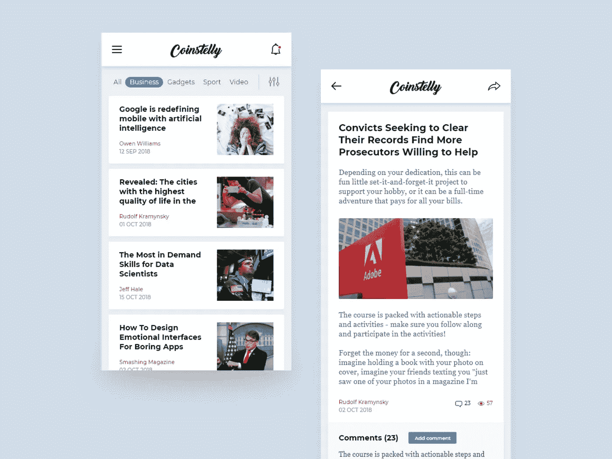

# 反应中组分组成

> 原文：<https://javascript.plainenglish.io/component-composition-in-react-a476c532a6fd?source=collection_archive---------3----------------------->


Photo by [Ferenc Almasi](https://unsplash.com/@flowforfrank?utm_source=medium&utm_medium=referral) on [Unsplash](https://unsplash.com?utm_source=medium&utm_medium=referral)

根据 React 官方[文档](https://reactjs.org/docs/composition-vs-inheritance.html)，*“有些组件提前不知道自己的孩子。这对于像* `*Sidebar*` *或* `*Dialog*` *这样表示通用“盒子”的组件尤其常见。我们建议这样的组件可以使用特殊的* `*children*` *属性将子元素直接传递到它们的输出中。”*

此外，当你在做大项目时，会有多个团队在做同一个项目，一个团队想在另一个团队的页面上展示他们的 UI，这可能是动态的。在这种情况下，您可能必须使用 React 的组件组合。

## **让我们进入一个场景:**

*让我们举一个例子，你正在为一个新闻应用程序工作。最初，所有的新闻都由一个团队处理。新闻标题以卡片形式显示，标题在其中。后来，你的应用程序变得非常受欢迎，对于新闻的每个部分，例如:电影、体育、商业，都有不同的团队和不同类型的卡片。*



1.  现在，您希望创建一个卡容器，以便任何团队都可以将其卡插入到您的容器中。
2.  除了遵循一些你用来渲染卡片的主要指导方针，每个团队应该有实现他们自己的某些功能的自由。例如，点击新闻卡片时调用哪个 API，何时使其已读或未读等。

## **解决方案**

## **方法 1**

每当新团队拿出一张卡，你就和他们坐在一起，理解他们的功能，为他们实现卡，并在容器中使用它。

**缺点:**

1.  不是一个可扩展的方法，将来当团队数量增加时，它将增加单个团队的工作量。
2.  此外，当您的应用程序开始聚合来自第三方供应商的新闻时，必须有一种方法可以将动态新闻卡插入到应用程序中。

## **方法 2**

与文章标题相同，使用组件组合。

第一步:准备一个你需要从 API 接收的通用新闻体，它将包含新闻细节和新闻类型。

为了解释的简单，我考虑下面的示例响应。

```
[{type: ‘SPORTS’,title: ‘It was a great match yesterday’….},{type: ‘BUSINESS’,title: ‘Market has reached new heights,’….}]
```

**第二步:创建一个容器组件，可以将道具传递给所有的子道具**

容器组件的职责只是呈现子组件，并使传递给父组件的所有属性都可以被子组件访问。为了实现这一点，我们使用了上下文方法。如果你不知道 createContext/useContext 有什么用，在这里参考官方文档[。简而言之，useContext 将帮助您将属性从父组件传递到子组件，而无需使用适当的钻取。](https://reactjs.org/docs/hooks-reference.html#usecontext)

例如，假设组件 A 有子组件 B and B 有子组件 C。从 A，如果我们必须将一些道具传递给 C，一种方法是将其传递给 B，然后从 B 传递给 C。或者通过使用 useContext，这将使父道具对所有子组件可用。

```
import React from 'react';const NewsContext = React.createContext({}); // This is responsible for exposing all the props available for 
// NewsContainer to children componentsexport function useNews() { const context = React.useContext(NewsContext); if (context === undefined) { throw new Error('useNews must be used within a <NewsContainer   />'); }return context;}// This will render all the children passed to it.export default function NewsContainer(props) { const {children} = props; return ( <NewsContext.Provider value={{...props}}>
           {children}
       </NewsContext.Provider> );}
```

**第三步:创建新闻标题组件**

在这里，你必须创建新闻标题组件，你将所有已知的新闻类型的标题样式。该组件将像共享库一样公开。因此，任何团队都可以使用它来创建他们的新闻卡。

**参考下面的例子**

```
import React from 'react';
import {Text, StyleSheet} from 'react-native';import useNews from './NewsContainer'; export default function NewsTitle({children}) {const {title, type} = useNews(); const getNewsTitle = () => { switch(type){ case 'SPORTS':
               return ( <Text style={styles.sports}>{title}</Text> )
          case 'BUSINESS':
               return ( <Text style={styles.business}>{title}</Text> ) }}return (<View> {children && children} {!children && getNewsTitle()}</View>);}const styles = StyleSheet.create({
sports:{
color : 'red' },
business:{
color : 'green'
}})
```

**第四步:创建定制的新闻卡片**

通过使用在上述步骤中创建的 NewsTitle 和 NewsContainer 组件。现在所有的队伍都可以在没有你的帮助下创建他们自己选择的卡片。

**例如:**让我们创建商业新闻卡

```
import React from 'react';import NewsContainer from './NewsContainer';
import NewsTitle from './NewsTitle';export default function BusinessNewsCard(props) {
return (<NewsContainer {...props}>
      <NewsTitle />
</NewsContainer>)
}
```

在上面的例子中，我只考虑了标题组件。***在现实世界的例子中，可能在左侧或右侧有一些按钮，或者可能有一些荧光笔等。您可以分别创建它们，并在新闻卡片中使用它们来创建您的自定义卡片*** 。如果一个新闻有左键，而另一个没有，他们可以相应地配置它。

**步骤 4a:允许其他团队创建自己的卡片**

在**步骤 3 中，**观察渲染部分，如果有孩子，那么我们就按原样渲染孩子，如果没有，我们就显示默认组件。如果任何新闻团队决定不使用已经创建的 NewsTitle，那么他们可以在 NewsTitle 中传递他们的子级，如下例所示。

```
import React from 'react';
import {Text} from 'react-native'import NewsContainer from './NewsContainer';
import NewsTitle from './NewsTitle';export default function BusinessNewsCard(props) {
return (<NewsContainer {...props}>
      <NewsTitle >
             <Text>Custom Business title</Text>
      </NewsTitle>
</NewsContainer>)
}
```

现在，在新闻标题组件'自定义业务标题'将被渲染。通过这种方法，您给了其他团队使用他们选择的风格和组件的绝对自由。

**第五步:父组件创建**

到目前为止，您已经创建了所有在传递的道具上工作的子组件。现在，作为创建容器组件的开发人员，您负责进行 API 调用，获取数据并在容器中显示这些卡片。

```
import React, {useState} from 'react';
import BusinessNewsCard './BusinessNewsCard' export default function NewsDashboard(){const [response, setResponse] = useState([]);// Write your logic to get data from APIreturn (
    {
         response.map(newsItem => { if(newsItem.type === 'BUSINESS'){
               return ( <BusinessNewsCard props={newsItem}>
               ) } else if(newsItem.type === 'SPORTS'){
               return ( // ... custom sports card
               )
         }) }
)} 
```

将来，如果任何新类型的新闻出现，或者任何新团队希望将他们的新闻集成到应用程序中，那么他们只需创建自己的新闻卡，并在 NewsDashboard 中保持检查，然后呈现他们的组件。这个例子可以扩展到在点击按钮时调用方法，或者在点击新闻卡片时调用方法等等。

快乐阅读！

## ***更多文章出自同一作者:***

1.  [JavaScript 中的一切都是对象吗？](https://mevasanth.medium.com/how-everything-is-object-in-javascript-a4164d7e6a2d)
2.  [发出带有标题的 Get 请求，以在 React Native 中呈现图像](/react-native-making-get-request-to-display-the-image-f75d4338c5e2)
3.  [JavaScript array . push()是深度拷贝还是浅度拷贝？](/array-push-in-javascript-is-it-deep-or-shallow-copy-90cd195ec5b7)
4.  [异步 Await 函数返回值的问题](/array-push-in-javascript-is-it-deep-or-shallow-copy-90cd195ec5b7)

在这里阅读作者[的所有文章。](https://mevasanth.medium.com/)

## 进一步阅读

[](https://bit.cloud/blog/-extracting-and-reusing-pre-existing-components-using-bit-add-l28qlxpz) [## 使用位添加提取和重用预先存在的组件

### 最后，您完成了为应用程序中的输入创建一个奇妙的输入字段的任务。你对……很满意

比特云](https://bit.cloud/blog/-extracting-and-reusing-pre-existing-components-using-bit-add-l28qlxpz) 

*更多内容请看*[***plain English . io***](https://plainenglish.io/)*。报名参加我们的* [***免费周报***](http://newsletter.plainenglish.io/) *。关注我们关于*[***Twitter***](https://twitter.com/inPlainEngHQ)[***LinkedIn***](https://www.linkedin.com/company/inplainenglish/)*[***YouTube***](https://www.youtube.com/channel/UCtipWUghju290NWcn8jhyAw)***，以及****[***不和***](https://discord.gg/GtDtUAvyhW) *对成长黑客感兴趣？检查* [***电路***](https://circuit.ooo/) ***。*****