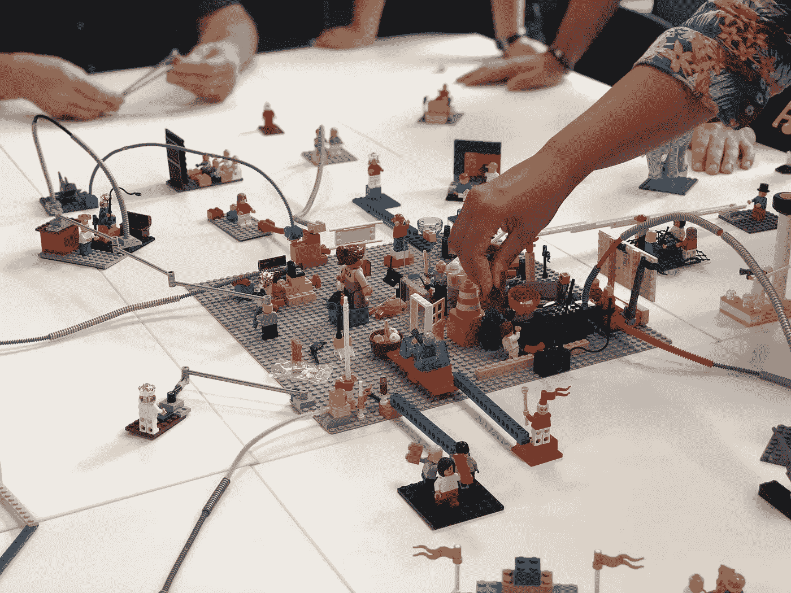

# 为什么以及如何在 React 中使用组件组合

> 原文：<https://javascript.plainenglish.io/component-composition-in-react-c66f1fd02b45?source=collection_archive---------4----------------------->

## 超越道具演练的构图。

Photo by [Amélie Mourichon](https://unsplash.com/@amayli?utm_source=unsplash&utm_medium=referral&utm_content=creditCopyText) on [Unsplash](https://unsplash.com/s/photos/lego?utm_source=unsplash&utm_medium=referral&utm_content=creditCopyText)

在[之前的文章](https://watifefakorede.medium.com/composition-in-react-f02afe24bc46)中，我们探索了道具训练以及如何在 React 中使用合成来使用它。

让我们假设我是一个团队成员，我发现了一个我们将在应用程序中到处使用的卡组件。让我们一起建设它。

## 构建卡组件

太好了！卡组件很好地完成了它的工作，并且结构良好。大家都很高兴，通过调用卡组件去了。轻松生活！

让我们想象一个月后，一个队友写信给我，说了下面的话。

> 嘿，Tife，我在浏览文档时发现了卡组件，它很棒。它为我的用例提供了一个**【小修改】**。我想在卡片图像之前渲染卡片标题，你能构建这个具体的用例吗？谢谢，你是最棒的！

一个常见的方法是我回信说:

> 嘿无名氏，当然！我会加一个道具来处理这个案子。

然后我会做这样的事情。

单个道具和所需的用例得到满足，我们的队友可以使用组件。

让我们想象一下，几个月后，另一个 ***【小修改】*** 被一个队友要求移动进度条前的范围文本，并且可能对于这个用例，他想隐藏标题文本。

按照上面的方法，我们将添加另一个道具并做许多条件来满足这个用例。

你可以很快地看到，我们已经脱离了我们的组件的预期工作方式，现在，它变得更加混乱。在我们知道之前，我们已经有了这个没人想使用或修复的怪物组件。

与其用不必要的道具或者不相干的条件句，我会建议一个更好的方法——[**组件组合**](https://watifefakorede.medium.com/composition-in-react-f02afe24bc46) ***。***

我们可以构建特定的构建模块，并允许用户决定如何构建他们的布局。

让我们重构我们的卡组件来服务更多的用例。

现在，我们拥有的是构建模块，没有什么是耦合在一起的，我们可以轻松地构建我们的布局来适应我们的使用案例。

例如，还记得 John Doe 要求将卡片标题文本移动到图像之前吗？他就不用给我写那封可爱却悲伤的短信了。因为现在，幸运的是，我们有了一个更好的、可扩展的、可重用的组件。

让我们看看。

仅此而已！

如果我们有一个重复使用的用例，我们可以通过从卡构建块创建另一个组件，并给其他任何需要使用该构建块的人构建他们的用例来做到这一点。

例如:

现在，我们有了这个可以在任何地方重用的**“card component”**。

如果你注意到，我们在这里转发道具给需要它们的组件。

你会大喊**道具钻**！但说实话，这样做并不总是坏事。当我们把这些道具的深层次传递下去时，问题就开始了，通常我们会使用像 Redux 或 Context API 这样的工具来解决这个问题。在这里，我们只有一层，即使在同一个文件中也没问题。因此，仍然可以实现协同定位。

这种方法避免了不必要的道具或不相关的条件，并且我们的组件更易于维护和重用。

感谢您的阅读！

*更多内容尽在*[plain English . io](http://plainenglish.io/)