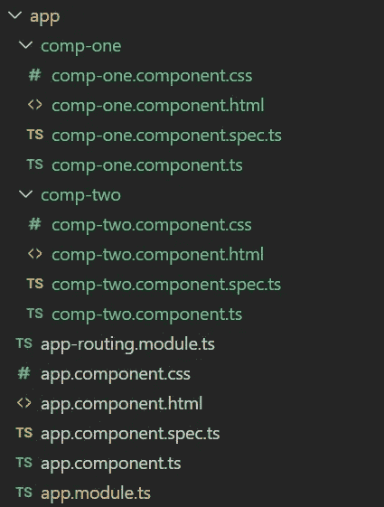
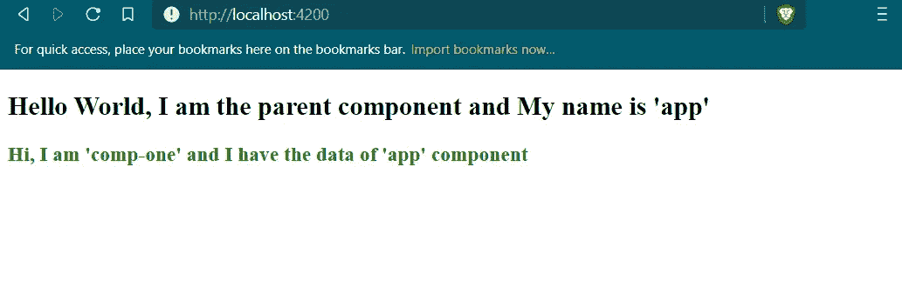
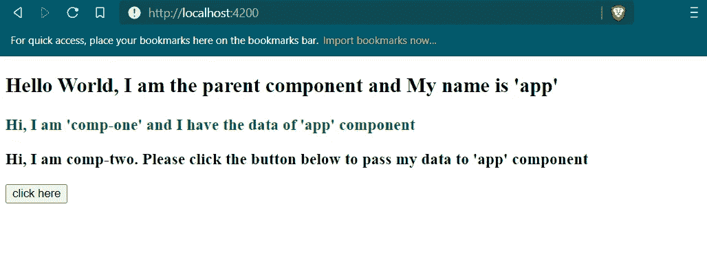
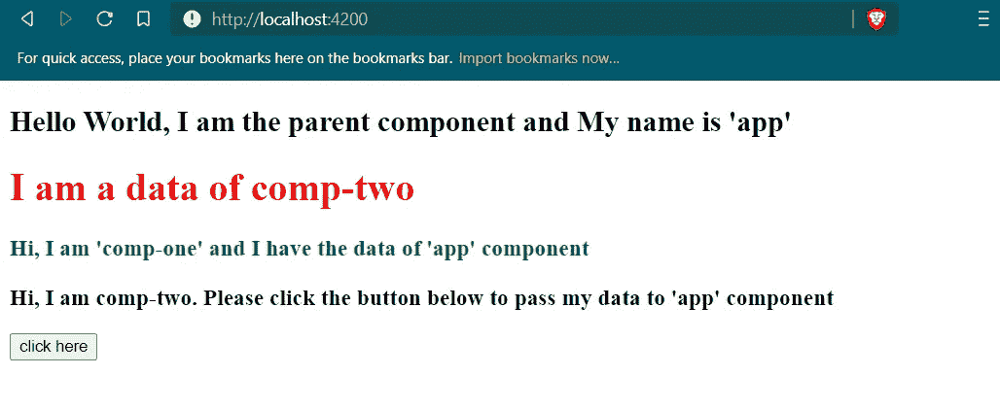
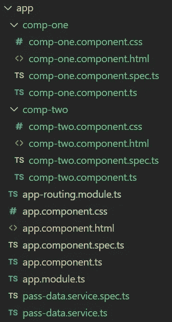
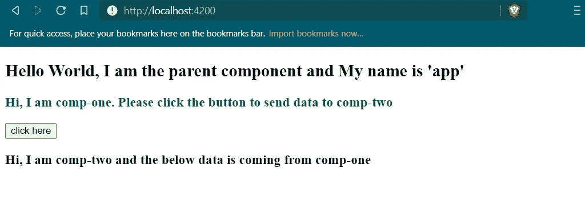
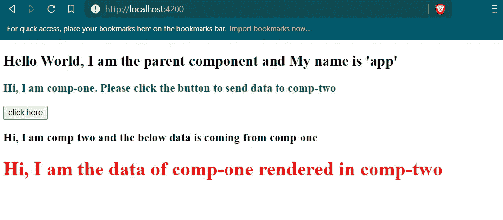

# 以角度表示的组件相互作用

> 原文：<https://javascript.plainenglish.io/component-interactions-in-angular-b197aa656f48?source=collection_archive---------6----------------------->


Photo by [Tyler Nix](https://unsplash.com/@jtylernix?utm_source=medium&utm_medium=referral) on [Unsplash](https://unsplash.com?utm_source=medium&utm_medium=referral)

根据 [Angular](https://angular.io/api/core/Component) 的官方文档，组件是一个 Angular app 最基本的 UI 积木。角度应用程序包含一个角度组件树。这些组件帮助我们轻松地理解和组织 UI 代码。

在本文中，我们将看到如何使这些组件相互交互。更准确地说，我们将学习在组件之间传递数据的各种用例。

# 初始设置

首先，我们将打开终端，用下面的命令— `ng new exercise`初始化我们的 angular 应用程序。这将创建一个名为`exercise`的文件夹。然后我们将导航到`exercise`文件夹。

默认情况下，Angular 将生成一个`app`组件，它将是父组件。然后，我们将使用 CLI 和以下命令生成两个组件。

```
ng g c compOne
```

而且，

```
ng g c compTwo
```

到目前为止，我们的`app`目录将如下所示—



所以，现在我们可以开始看看 Angular 中组件交互的各种用例。

# 将父组件数据传递给子组件

因为，`app`组件是`comp-one`的父组件。因此，我们将从`app`组件向`comp-one`传递一个数据。

因此，在`app.component.ts`文件中，我们将编写以下代码。

这里，我们声明了一个属性`dataForCompOne`，它是`app`组件的数据。

`app.component.html`文件将包含以下代码—

在这里，借助 Angular 的属性绑定特性，我们将父数据，即`dataForCompOne`传递给`comp-one`组件。

现在，为了接收这个父数据，我们将在`comp-one.component.ts`文件中使用`Input`装饰器。

上面代码的第 10 行从`parentData`属性接收`dataForCompOne`，并将其存储到`dataFromApp`中。

现在，在`comp-one.component.html`文件中，我们将编写以下代码—

所以，现在我们将在终端中运行`ng serve -o`命令，这将打开浏览器显示以下内容



# 将子组件数据传递给父组件

现在，我们来看看如何将数据从`comp-two`传递到`app`组件。

在`comp-two.component.ts`文件中，我们将编写以下代码—

在上面的代码中，我们在`comp-two`组件中声明了一个字符串数据`dataForApp`，当调用`sendData()`方法时，它将在`Output`装饰器的帮助下作为一个事件发出。

在`comp-two.component.html`文件中，我们将编写以下代码—

我们可以看到，只有当按钮被点击时，事件才会被发出。

现在，我们必须在`app.component.html`中捕捉这个事件。

当事件发出时，它将作为参数被捕获到`receiveDataFromChild()`方法中，然后它将被存储在`dataFromCompTwo`中，这是在`ap.component.ts` 文件中定义的。

现在，我们将再次运行`ng serve -o`命令，它将在浏览器中显示以下内容。



单击该按钮后，将显示以下内容。



# 使用服务在组件之间传递数据

在这个例子中，我们将使用角度服务将数据从一个子组件传递到另一个子组件。

首先，我们将使用下面的命令生成一个`pass-data`服务。

```
ng g s pass-data
```

现在，我们的`app`目录将如下所示—



在`pass-data.service.ts`文件中，我们将编写以下代码—

现在，我们将把数据从`comp-one`传递到`comp-two`。

因此，在`comp-one.component.ts`文件中，我们将编写以下代码—

在上面的代码中，我们定义了一个属性`dataForCompTwo`，它将是从`comp-one`传递给`comp-two`的数据，借助于`PassDataService`中使用`sendDataToCompTwo()`方法定义的事件。

在`comp-one.component.html`文件中，我们创建了一个按钮，点击它将执行`sendDataToCompTwo()`方法。

并且，在`comp-two.component.ts`文件中，我们将订阅`PassDataService`中定义的事件，并将事件数据存储到`dataFromCompOne`中，如下面的代码所示

为了在浏览器中显示它，我们将在`comp-two.component.html`文件中写入以下内容。

现在，我们将运行`ng serve -o`命令，它将在浏览器中显示以下内容。



单击该按钮后，将显示以下内容。



***参考*** *:棱角文档简介—*[*https://angular.io/docs*](https://angular.io/docs)

*更多内容请看*[***plain English . io***](https://plainenglish.io/)