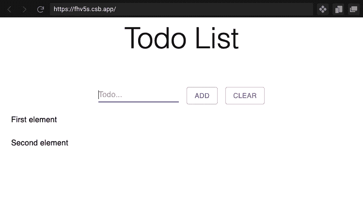
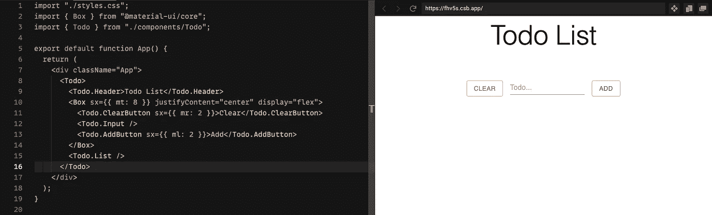
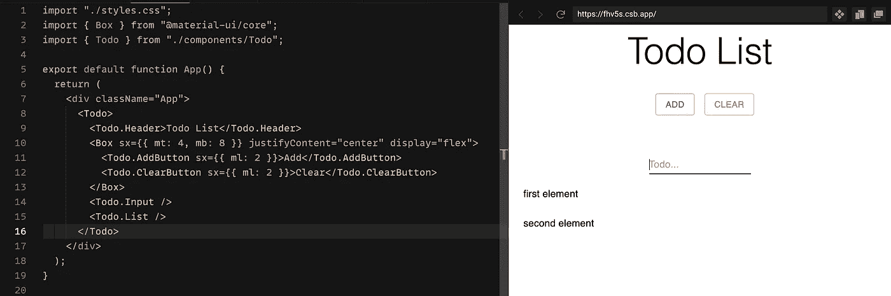
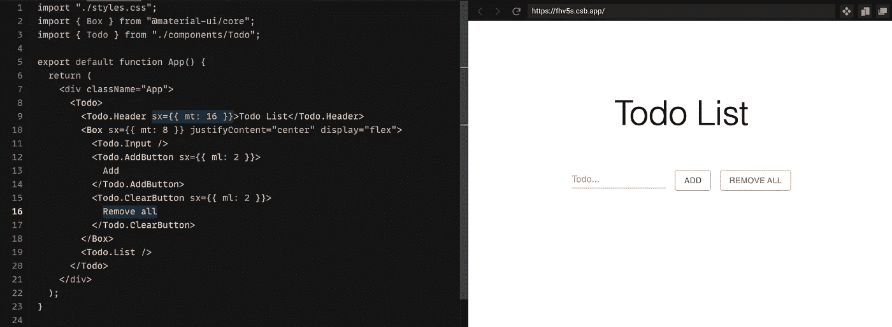

# 复合组件:如何在 React 中编写灵活的组件

> 原文：<https://javascript.plainenglish.io/compound-components-how-to-write-flexible-components-in-react-1cd6caa769fb?source=collection_archive---------5----------------------->

Photo by [Ryan Quintal](https://unsplash.com/@ryanquintal?utm_source=unsplash&utm_medium=referral&utm_content=creditCopyText) on [Unsplash](https://unsplash.com/s/photos/lego?utm_source=unsplash&utm_medium=referral&utm_content=creditCopyText)

我问的第一个问题是，我为什么要关心和学习更多关于复合组件的知识？

# **复合组件解决什么问题？**

问题是你的组件没有足够的灵活性，尤其是当你不知道或者不能预测消费者将如何使用你的组件的每一个用例的时候。

让我们考虑一下我们示例中的一个`Todo`组件，如下所示:

Todo component

它包含了一个标题、输入、列表、添加和清除按钮，但是如果消费者不想要一个清除按钮呢？然后，我们可能必须给我们的`Todo`组件添加一个额外的道具，然后公开新版本，消费者必须添加一个道具`<Todo showClearButton={false} />`，这可能是痛苦的，这是一些组件的唯一可选渲染。想象一下，我们想改变添加按钮的位置，让它在输入的左边，这可能是一个麻烦。

也许有一种方法可以让我们的组件消费者无需付出这种努力就能完成所有这些更改？这是本文要解决的问题。

先说复合组件，挖点代码！

# **例子**

我们有一个呈现`TodoHeader`、`TodoInput`、`TodoClearButton`、`TodoAddButton`和`TodoList`的`Todo`组件，用当前的实现可能很难改变元素在页面上的位置。

实际上，如果没有消费者处理待办状态变更(`list`、`todo`)，这是很难做到的，因为你要么不得不使用`Todo`组件作为黑盒，只需呈现`<Todo />`，要么你不得不透露实现细节并将处理变更的责任推给消费者，这并不理想，对吗？

如果我是待办事项列表组件的消费者，我不想担心当用户点击添加按钮时更新待办事项列表的状态，或者当用户键入某些内容时更改当前待办事项的值，这是组件本身的职责。

这里的问题是像`onAddTodo`、`onClearTodo`和`todos`这样的道具从父`Todo`组件传递到其子组件，所以问题是我们如何移除它们？

**营救的背景**

答案是使用上下文，我们必须更改`Todo`组件实现来创建上下文，并且只有逻辑负责状态更改。上下文应该有`Todo`组件子组件所需的所有方法、变量

在第`4-5`行，我们有与之前的`Todo`组件版本相同的状态，然后在第`7-16`行，我们定义了`value`变量，这是我们的上下文，然后我们将它传递给任何子组件(第`18`行)

`clearList` (line `8`)方法是一个很好的例子，展示了我们如何将一些额外的逻辑封装到我们的上下文中，而不仅仅是清除 todos 列表，我们还清除输入值。

在第`24-28`行，你可以看到 Todo 的子组件被赋值给`Todo`变量，以在我们的主组件和它的子组件之间创建紧密耦合，记住`TodoAddButton`或任何其他内部组件不应该在`Todo`上下文之外呈现，所以这是向消费者传达我们意图的一个非常好的方式。

现在让我们看看应该在新文件中定义的上下文

创建一个消费者可以用来获取上下文的独立钩子是一个很好的实践

这样我们就可以用一些逻辑来检查子组件是否已经被包装在上下文提供者(`Todo`组件)中，如果没有，我们抛出一个错误，应该立即说明发生了什么。

最后缺少的部分是新的子组件实现，首先，让我们看看前面的`TodoAddButton`实现是什么样子的

和新的

我们不再传递`onAddTodo`处理程序，在新版本中我们从上下文中获得`addTodo`和`todo`。

现在我们可以回到我们最初的问题。我们的消费者希望在输入的左边有一个清除按钮？给你。

或者

现在消费者可以随意改变子组件的位置

通过这种方式，我们使我们的`Todo`组件变得灵活，并且子组件的位置是不可知的。与不使用复合组件相比，这也是一种更具声明性的方式，你可以看到消费者在呈现过程中决定想要为`Todo.AddButton`或`Todo.ClearButton`添加什么标签，或者`Todo.Header`是否应该有一些额外的样式。

如果不使用上下文消费者，我们可能不得不添加和传递`Todo.ClearButton`标签和`Todo.Header`边距作为`Todo`组件的属性，如`<Todo clearButtonLabel='' headerProps={} />`或使用`renderProps`。在我看来，两者都比当前的解决方案差，因为需要改变`Todo`组件。

试着自己玩

让我们总结一下使用复合组件的利与弊

## 使用复合组件的优点

*   改变子组件位置的简单方法。
*   创建可以以声明方式配置的组件(消费者可以更改标签或某些样式，而无需更改父组件实现)
*   子组件与父组件紧密耦合

## 使用复合组件的缺点

*   更大的复杂性
*   更多代码

# **总结**

## 什么时候我们应该考虑使用复合组件？

*   每当我们处理一个复杂的组件，并且我们不能在开始时预测它的每一个用例

例如，父组件由几个基本组件组成，这些组件不应该在父上下文之外呈现。

`Menu`(父)和`Menu.ListItem`(基础)，当我们实现`Menu.ListItem`时，我们的意图是总是在`Menu`中呈现这个组件，所以`Menu.ListItem`不应该被用作没有父上下文的独立组件

*   当我们想让复杂的组件更灵活时

`Menu`组件有几个不同的子组件，可以用多种方式呈现，例如不同的位置。

允许`Menu`组件消费者更改子组件位置的最佳方式是不要在开始时选择这些组件的位置，而是在以后选择，这样消费者可以选择组件位置

**什么时候我们不该使用复合元件？**

*   对于像`Button`、`Input`这样的基本组件
*   如果我们想阻止消费者改变儿童的位置

我希望我对复合组件主题有所了解，并且您可以为自己找到一些有用的用例。

如果你想保持联系或询问任何你能找到我的事情

推特: [*k_wdowik*](https://twitter.com/k_wdowik)

或者

github:[kwdowik](https://github.com/kwdowik)

**感谢阅读！**

*更多内容看*[***plain English . io***](http://plainenglish.io/)