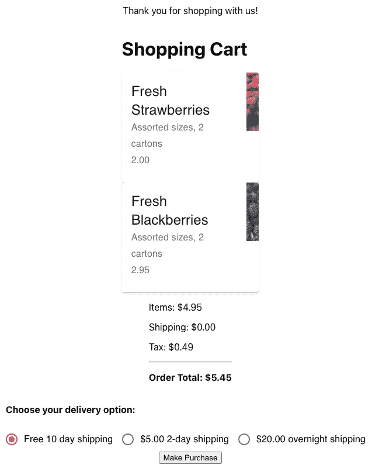

# 使用 React 测试库和 Jest 对 React 和 Node Express 应用程序进行全面的功能测试

> 原文：<https://javascript.plainenglish.io/comprehensive-functional-testing-of-a-react-node-express-app-with-react-test-library-jest-dec0df3c4ab4?source=collection_archive---------5----------------------->


Photo by [Chaitanya Tvs](https://unsplash.com/@tvschaitanya?utm_source=medium&utm_medium=referral) on [Unsplash](https://unsplash.com?utm_source=medium&utm_medium=referral)

用 Jest 进行端点 API 测试，用 React 测试库进行 UI 自动化测试。

本文旨在帮助您开始测试 React 前端和 Node.js Express 后端应用程序。你会意识到你不能用同样的方式测试后端和前端。这是因为 UI 测试需要真实的交互来测试其内容，以及由点击和键盘输入等导致的呈现变化。相比之下，后端代码需要在单个功能的小单元中进行测试。

对于代码的后端测试，您需要采取两种方法，一种是代码功能和集成的实际单元测试，另一种是 HTTP 端点 API 的测试。

本文将为您在低级 JavaScript 代码测试层面提供一个良好的开端。当然还有很多其他的测试技术可以在以后使用，比如负载测试。这篇文章的内容与我写的那本书的内容有关，这本书在亚马逊上有售，名为“[AWS 中的 JavaScript 三层架构，包含 React、Node 和 MongoDB](https://www.amazon.com/dp/0997196696) ”

# 要测试的应用概述

对于这篇文章，我真的试着做了一个最小的应用程序来尽可能容易地理解对测试有用的机制。该应用程序示例展示了购物点的电子商务购物车的用户界面。为了简单起见，没有数据库，只有购物车中产品的内部数组。用户界面如下所示。



Strawberry and Blackberry photos by [Jessica Ruscello](https://unsplash.com/@jruscello?utm_source=unsplash&utm_medium=referral&utm_content=creditCopyText) on [Unsplash](https://unsplash.com/?utm_source=unsplash&utm_medium=referral&utm_content=creditCopyText)

通过 UI，您可以看到购物车中有什么，选择一个交付选项(这将改变订单总数)，然后单击进行购买。

让我们先快速看一下 Node Express 代码。要查看的两个文件是 index.js 和 carts.js。这是相当标准的锅炉板节点服务器代码。您可以看到 React 应用程序的服务以及购物车的 Express API 路由。

下一个要考虑的文件是为提供购物车内容的 API 处理快速路线的文件。现在，它将只包含用于处理特定购物车 id 的 GET 动词。你需要添加更多的动词来使它完全发挥作用。如前所述，顶部有一个硬编码数组。该数组包含购物车条目。当然，您可能还想为应用程序添加更多的功能，比如登录和使用 JWT 对路线进行身份验证。

# 后端节点快速 HTTP API 级别测试

对于 API 端点的测试，我们需要对服务进行实际的 HTTP 调用。对于如何做到这一点，您有几个选择。我将解释让我们开始的最简单的方法。您可以在本地运行 Node.js 服务器，或者公开运行它，然后再检查实际的 IP 地址和端口。一种更简单的方法是将服务器实际导入到测试代码中，并使用 NPM [**超级测试**](https://www.npmjs.com/package/supertest) 模块来访问服务和 API 端点路由。

在我们的测试代码中，我们将使用 [Jest](https://jestjs.io/) 。我们在 package.json 文件中设置了一个脚本来启动它。你只要输入`npm run test-API`。Jest 很容易使用。使用 Jest，您有一个包含所有测试的`describe`块。每个测试都有一个标题/描述和一些要运行的功能代码。当你打电话给`done()`时，每个测试将被认为是完成的。然后设置为按顺序运行每个测试块。您可以并行运行测试。我们已经设置了`runInBand`标志，让测试按顺序运行。我们还设置了`collectCoverage true`标志来收集代码覆盖率数据以供查看。这是 Jest 将用于您的测试运行的文件。

您可以看到，我们有一个测试来获取一个有效的购物车，还有一个测试来确保我们捕捉到一个无效的购物车 id。值得一提的是，您可以在调试器下运行 VS 代码中的测试代码，并在测试代码和快速路由代码上设置断点！

# 后端单元级测试

单元级测试不同于 API 级测试。对于 HTTP API，我们实际上与用户使用的完整可用端点进行了交互。在单元测试中，我们分离出一个功能或者一小段代码，然后缩小范围进行测试。这两种类型的测试都是必要的，以获得全面的覆盖，并有更好的机会在问题最终成为产品中的 bug 之前捕捉到它们。

您单元测试的代码可以在 Node.js Express 应用程序或 React 应用程序中。我现在将说明 React 应用程序中一些代码的测试。作为 React 应用程序的一部分，我们需要一个函数来计算购物车中商品的价格。我们可以将该函数分离到它自己的模块中，这样我们就可以很容易地对其进行单元测试。下面的代码展示了 sum 模块和测试它的 Jest 文件。

```
// sum.js
export default function sum() {
  var s = 0;
  for (var i=0; i < arguments.length; i++) {
      s += arguments[i];
  }
  return s;
}
```

您可以看到同样使用 Jest 来设置测试用例。在 package.json 中设置了另一个脚本来运行这个特定的测试。这个可以用`npm run test-react`运行。这是因为它包含在 react 项目的代码中，react 脚本的使用将查找所有以“test.js”结尾的文件。

# 使用 React 测试库进行 UI 自动化测试

React 应用相当标准。要查看的主要文件是 src 目录中名为 index.js、App.js、cartview.js、cartItem.js 和 ShippingOptions.js 的 JavaScript 文件。该应用程序使用`ShippingOptions`和`CartView`功能组件。`CartView`依次使用`CartItem`功能组件。

将要使用的测试框架将是 Jest 和代表 React 测试库的 RTL。您可以浏览下面的代码，看到它使用了相同的 Jest 功能，带有 describe 和 test 块。

RTL 给了你渲染用户界面的能力。您可以使用下面的代码行— `render(<App cartId={777} />)`来实现。通过这样做，功能组件中的所有实际代码都将运行并使用虚拟 DOM。这意味着应用程序被实例化，因此 CartView 也被实例化。与 React 的常规功能一样，将调用`useEffect()`函数和网络`fetch()`调用来检索购物车 id。

这里我们利用 Jest 的功能，用我们自己的结果覆盖`fetch()`调用。这是在`beforeAll()`调用中设置的，然后在调用`window.fetch.mockResolvedValueOnce()`中使用。这将截取底层网络调用，并返回我们想要的测试结果。

使用由`@testing-library/jest-dom/extend-expect import`提供的`expect()`调用来完成大量的结果测试。我们使用 screen 对象来查找要测试和交互的 UI 元素。你可以看到几个测试价值的例子。单击单选按钮来更改运输选择，然后验证是否计算了正确的订单总额。

该测试可以使用`npm run test-react`运行。还要注意，这里使用了 await，因为在代码开始运行时，UI 正在呈现，我们需要等待某个 UI 元素出现。另一种方法是设置计时器的使用，但这肯定没有那么有效。

*注意:要查看代码覆盖率报告，请转到* `*coverage/lcov-report*` *目录并打开 index.html 文件。在这个屏幕上，您可以点击一个文件并深入到源代码中来查看实际的代码行覆盖率。*

# 结论

任何 React 和 Node.js 项目都必然需要多种测试方法。Jest 是一个很好的框架，它充当了每一种不同类型测试的启动点。在单元测试和 API 测试的情况下，只有 Jest 的使用。在 UI 自动化测试的情况下，它与 React 测试库框架结合使用。

关于这些框架中的每一个，都有更多的东西需要学习，我鼓励您从这些基础知识开始，然后继续学习更有经验的用法。我包含的 GitHub 代码有一些额外的更高级的测试用法和一些建议(在代码注释中)供您考虑。我也鼓励你去看看我写的那本书，它实际上是三本合二为一的书，其中有一部分专门讨论 React 开发"[AWS 中的 JavaScript 三层架构，包括 React、Node 和 MongoDB](https://www.amazon.com/dp/0997196696) "。也在我的 [YouTube 频道](https://www.youtube.com/channel/UCZpDsJis8EqdNHgdMCtrePQ)中有所涉及。

***注意:*** *本文的所有代码都可以在 GitHub 的资源库中找到，这里是——*[*https://github.com/eljamaki01/ReactNodeTesting.git*](https://github.com/eljamaki01/ReactNodeTesting.git)*。要构建并运行它，首先，下载代码。然后从项目的主目录，在命令提示符下，运行* `*npm install*` *，运行* `*npm run build-react*` *，再运行* `*node index.js*` *，然后在浏览器中，转到* `[http://localhost:3000/](http://localhost:3000/)` *。您可以从命令行运行测试脚本，如上所述。*

***资源:*** *链接到有用的文档，像用* `*get/find/query*` *查找元素的 RTL 方法——*[*https://testing-library . com/docs/react-testing-library/cheat sheet*](https://testing-library.com/docs/react-testing-library/cheatsheet) *链接到有用的文档，关于如何处理来自*`[*@testing*](http://twitter.com/testing)*-library/jest-dom*`*——*[*https://github.com/testing-library/jest-dom*](https://github.com/testing-library/jest-dom)

*更多内容请看*[***plain English . io***](http://plainenglish.io/)