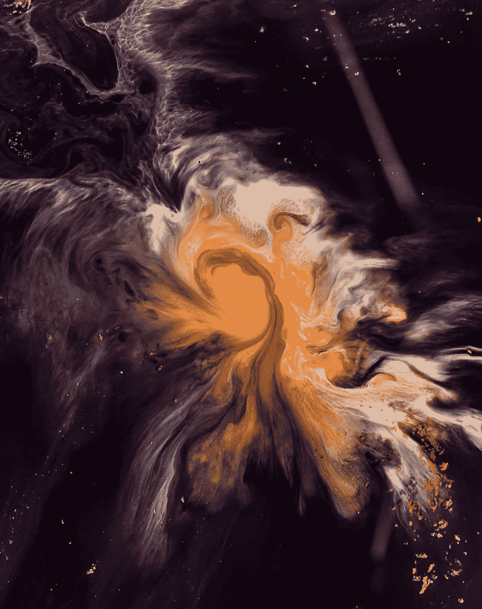
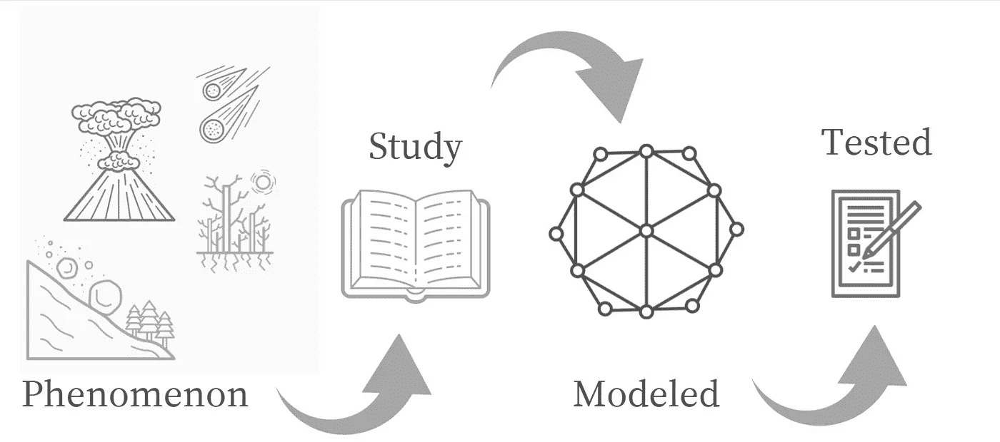
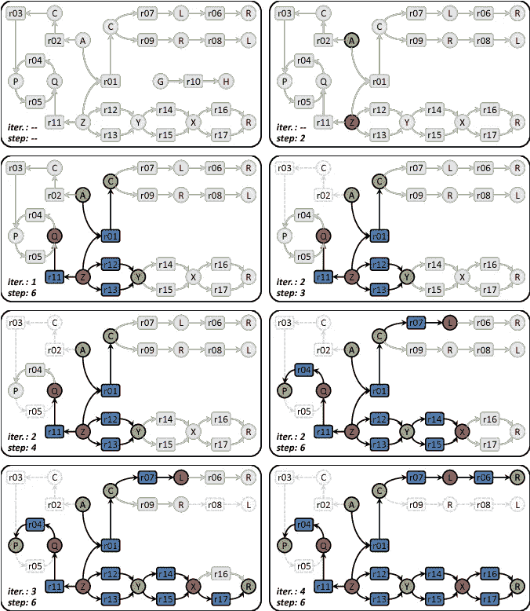
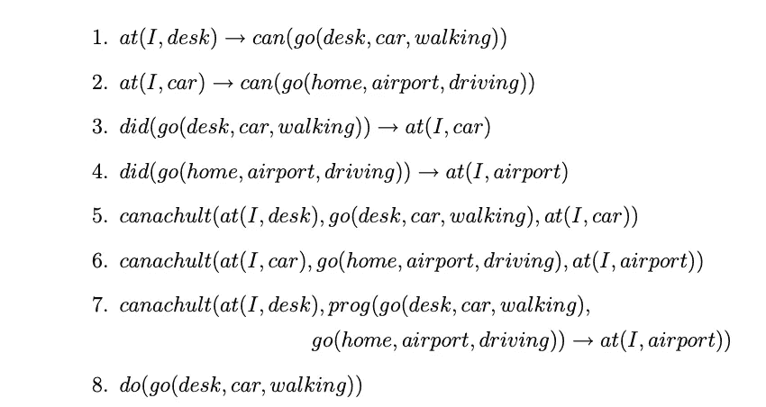

# 计算机科学没有死亡——它从未存在过

> 原文：<https://javascript.plainenglish.io/computer-science-isnt-dead-it-has-never-existed-15d78f605ed2?source=collection_archive---------11----------------------->

## 计算机科学真的是科学吗？

[📷](https://unsplash.com/@joelfilip?utm_source=medium&utm_medium=referral)

有一句老话是这样说的:“任何名称中带有单词*~科学*的学科都不是科学。”

计算机科学是一个名字中带有*~科学*的学科，是吗？

我们这些学习计算机科学的人——我们是什么？

我们是科学家、数学家、工程师还是哲学家？

# 我们是什么，我们在做什么？

计算机科学家并不都同意计算机科学是否是 T4 科学。他们对这个问题的判断似乎取决于他们成长的传统。

认同计算的数学和工程传统的哈尔·阿伯尔森和格里·苏斯曼说:

> 计算机科学并不真的是关于计算机的——它也不是关于计算机的，就像物理学不是关于粒子加速器的，生物学不是关于显微镜和培养皿的……几何学不是关于使用测量仪器的

Edgar Dijkstra 是一位数学家，他开发了精致的软件，经常争论同样的观点，

> 计算机科学与计算机无关，正如天文学与望远镜无关一样。

虽然，他也相信计算是一门数学科学。

许多其他巨头认为计算机科学是科学，而计算机科学的软件部分实际上是工程。

> 这个世界是如此的新，以至于许多事物都没有名字，为了表明它们，有必要指出来。"
> 
> ―加布里埃尔·加西亚·马尔克斯

# 你在边境的哪一边？

计算机科学是必不可少的，因为我们周围的世界想要分类和理解我们。

我认为我们必须用更精确的术语来处理这个问题。

计算机科学符合作为一门科学的所有标准，但它有一个自己造成的可信度问题。

例如，我们需要就我们所说的"**科学**和今天的"**计算机科学**的含义达成一致

> 我认为“科学”是根据模型对现象进行系统的收集、分析和交流，这些模型可以根据其来源进行测试和评论。

除了主要的途径和方法之外，使科学如此令人兴奋和重要的许多特性之一是实际的“知识”。

它以**模型**和**现象**之间的**谈判**的形式出现。

让我们试着把“*文化人类学*”和“*吊桥*”放在“科学”的定义里。(是的，举个例子，我知道这很奇怪)。

对于“吊桥”，我们可以看到很多*现象*可以 ***研究******仿照******测试*** 。因此，源于人类建造的桥梁的“桥梁科学”没有障碍。

“文化人类学”产生了许多*现象*但相对*扩散的模式*。这需要严肃而谨慎的“谈判”——“领域越软，你就必须越强硬。”

我们今天所知的科学花了几十万年才发明出来——甚至对物理学也变得“非常仔细和严肃”——我们可以看到，通过意志“变得强硬”是可能的，因此当我们探索更复杂的系统时，会变得更具挑战性。

现在我们必须把“计算机科学”作为一个术语来处理。它曾经意味着 T4 渴望成为真正的“人造科学”

今天，这个术语通常只是一个习语，指的是那些主要应该归入“工程”类的实践(无论多么初级)，并且该领域的大多数人“不关心这些术语的含义”(听起来就像我见过的相当多的计算机程序！)

几十年前，当“计算机科学”和“软件工程”这两个术语被创造出来的时候，当时追求它的人们把它当作一种严肃的愿望:追求在不稀释“科学”或“工程”的情况下成长为自然领域

这里有一个 50 年代末“真正的计算机科学”的极好例子。

约翰·麦卡锡想制造一个“真正的人工智能”界面代理，它可以用常识术语和推理与人类打交道，并且可以接受和给出“建议”

他需要一种适合编写“常识推理系统”的编程语言

看看当时的计算机和计算机语言(FORTRAN 刚刚出现，当时还有一种奇怪的命令列表结构化语言)。

约翰最终制作了一个计算模型，这个模型用一种数学符号表示，是一种数学，它把自己作为一种定义的手段。你可以用它从理论的不同部分得出结果。

这个定义离实际上可以在当时的计算机上实现的东西并不太远——并且已经完成了。这创造了一个新的工件——一种可以被走过和被测试的桥梁——用它可以做的事情产生了与 FORTRAN 和它的第一个版本完全不同的现象，从而促进了进一步的建模，创造了更强大的理论。

这里我们有两个重要的事情要考虑。第一个是一个“*人工科学*”的计算机例子，以及这个科学中的模型可能是什么样子。

过去几个世纪的第二个美好的事情是人工科学中科学和工程的结合，它创造了一条通向伟大艺术和伟大启蒙的愉快而华丽的道路。事物是被创造的；这些创造激发了关于它们的想法，反过来又激发了创造的进步，等等。

然而，因为“任何东西都可以有一个‘理论’放在下面”，我们必须判断任何科学——任何一套信念、知识、理论等等。—通过跨越或不跨越模型/理论等的阈值。

我觉得麦卡锡做得非常好。

> “科学是我们理解得足以向计算机解释的东西；艺术就是一切。”
> 
> ― **唐纳德·e·克努特**

# 编后记

如果你是一名物理学家，你必须接受大自然提供的一切。但是有了计算机科学，你可以发明任何你想要的东西。这就像数学，除了你发明的东西是有形的

因为计算研究人造物体(技术)，所以它不是一门科学，这种反对是在转移视线。计算机科学研究人工和自然的信息过程。

是的，计算机是人造的，但它们的原理来自其他领域，如物理和电子工程。

毕竟，计算机科学是一个相对较新的领域。过去人们获得博士论文是因为做了程序员现在被期望做的工作。

计算机科学发展非常迅速，但不像数学，他们有 300 年的天才发展数学理论，我们只有 40 年左右的人决定参与进来。

真正优秀的人正在参与其中并做出贡献——编程现在更像是一种主流活动。

事实上，人们在如此年轻的时候就开始接触电脑，这将有助于改变他们在这一领域的思维。

许多伟大的程序员在他们十几岁的时候就开始编程了，那时你思考问题的方式可能更加灵活。

在过去，仅仅成为一名优秀的程序员是不够的；你必须管理人或者做其他事情。

幸运的是，这种情况正在改变。现在，人们意识到这是一门值得坚持和教授他人的科学。

# 结论

今天，计算的规模和范围已经爆炸。我们试图组织和访问世界上所有的信息，计算机和计算正在影响日常生活的所有领域。

因此，计算机科学研究的全新领域已经在跨学科应用中出现，将计算与科学和人类努力的其他领域相结合。

这些新领域的例子包括计算生物学、机器人学、信息物理系统等领域。

Som，你是在宣称计算机科学是科学的一个分支吗？所以你刚才提到的那些巨人都是错的？

嗯，我并不是说他们错了，如果你仔细观察，你会注意到他们都表示计算机科学不仅仅是关于计算机，就像数学一样，它包含了广泛的领域。

# 感谢信

我想利用这最后的机会说声谢谢。

感谢您的光临！

没有像你们这样的人，我不可能做我现在做的事情，他们跟随我并带着那种信念阅读我的帖子。

我希望你能 [**加入我的**](https://polymathsomnath.medium.com/subscribe)[**我未来的博客文章**](https://polymathsomnath.medium.com/subscribe) 并留下来，因为我认为我们这里有一些伟大的东西。我希望在未来的许多年里，我能在你的职业生涯中帮助你！

下次见。再见！

*更多内容请看**[***说白了. io***](http://plainenglish.io/) ***。*** *报名参加我们的* [***免费每周简讯这里***](http://newsletter.plainenglish.io/) ***。****