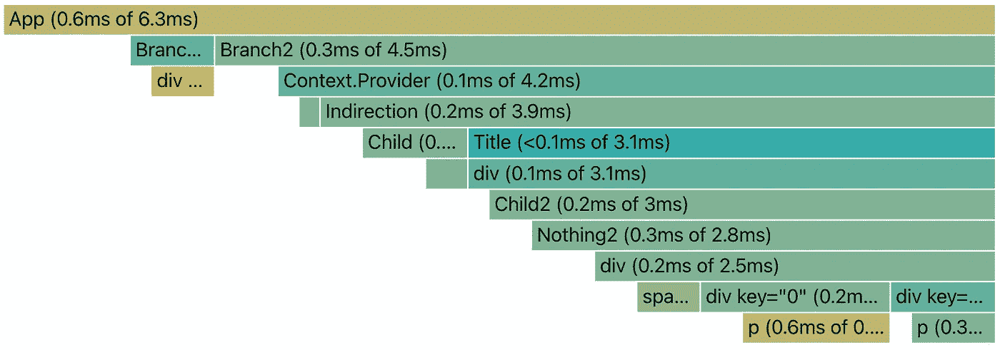
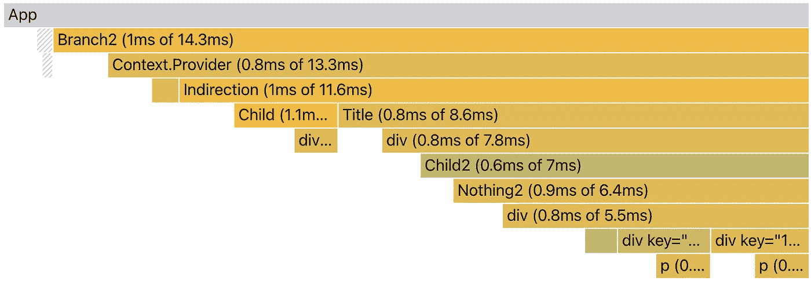
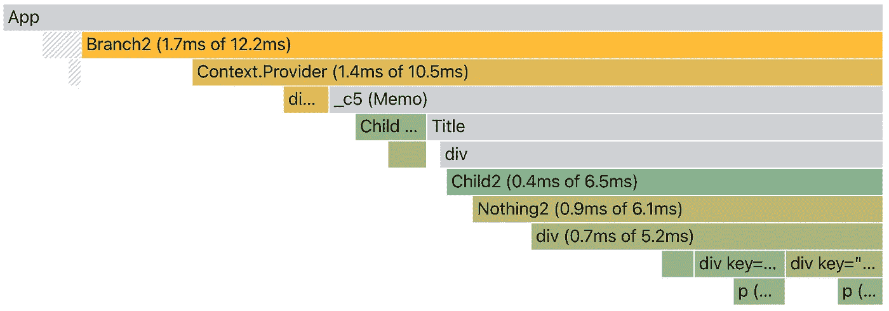
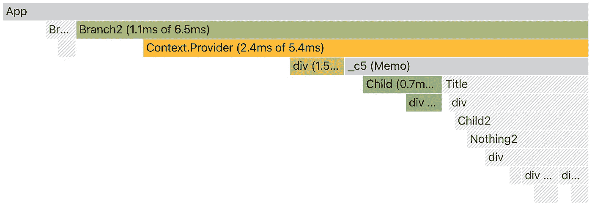
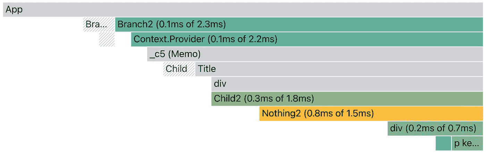

# 条件反应上下文:区别对待每个消费者

> 原文：<https://javascript.plainenglish.io/conditional-react-context-treating-each-consumer-differently-9af48ff81bef?source=collection_archive---------6----------------------->


Photo by [Ferenc Almasi](https://unsplash.com/@flowforfrank?utm_source=medium&utm_medium=referral) on [Unsplash](https://unsplash.com?utm_source=medium&utm_medium=referral)

如果您经常使用 React 上下文，很快您就会意识到当它被更新时，这是一个繁重的操作。因此人们倾向于给孩子加上一个`React.memo`。然后瞧，事情马上就变得不同了，或者有时什么也没发生。:)

假设我们有一个组件应用程序提供一些价值。

```
const App = ({ aProp }) => {
  const [aState, ] = useState(...)

  return (
    <Context.Provider value={...}>
      <Indirection />
    </Context.Provider>
  ) 
}
```

这是渲染所有内容的挂载配置文件。



我们在中间添加一个间接组件来保存以下两个消费者 Child 和 Child2。这个组件在以后的优化中很有用。

```
const Indirection = (() => {
  return (
    <>
      <Child />
      <Title />
    </>
  )
})
```

## 上下文提供者

只读上下文与此对话无关，因为在装载时，所有内容都会被呈现。如果之后上下文保持不变，就不再需要渲染了。

当我们有状态变化时，一切都变得有趣和有争议。由于应用程序上的属性或状态改变，触发对`ContextProvider`的更新。

上下文提供者没有机会退出，因为在应用程序的协调过程中，它已经被标记为具有一组新的`children`道具。提供商做两件事。一种是独特的，将上下文变化传播到所有消费者纤程。第二个是，像大多数组件一样，将自己的子组件整合到纤程中。



将传播放在一边，一旦这一系列协调开始，提供者的所有子代都被呈现，包括它的子代的子代，等等，见上图。提供者下的所有内容都被呈现，因为传播确保了所有消费者都位于该上下文中。

但是有些东西闻起来不对劲。你可能会想，既然间接寻址没有道具，为什么要呈现呢？每个消费者之间都有间接路径，这些路径可能很长。在我们的例子中，我们想要从渲染中摆脱的是 Indirection 和 Child2 之间的 Title 和 div，因为那里没有任何变化。

## 反应备忘录

所以不能加个`React.memo`来救援吗？让我们试一试。

```
const Indirection = **React**.**memo**(() => {
  return (
    <>
      <Child />
      <Title />
    </>
  )
}
```

在将`memo`应用到间接组件之后，当 App 的状态发生变化时，Child 和 Child2 仍然会被呈现，这很好。



有趣的是，Indirection 和 Child2 之间的路径被去掉了，如上图中的灰色所示。还有什么会有这种颜色？对，App(上面还有一个，Root)。

所发生的是，从更高的层次，间接成为另一个根。如果一个分派是一个典型的呈现路径，那么现在我们从一个新的根开始得到多个呈现路径的组合，在我们的例子中是间接的。这不是很神奇吗？

当然，这是我们的想法，也是供应商应该做的。所以这里有一个百万美元的问题:为什么带有 memo 的间接方式不能被添加为默认的提供者行为？我不知道。但是所有与 Provider 相关的 React 测试都带有 Indirection (with memo)组件。

# 有条件的消费者

我们这么想吧。随着`React.memo`的应用，这将使上下文在组件通信方面变得非常强大。

第一个问题来了，我们能保释出更多的孩子吗？尤其是当一个消费者不同于另一个消费者时。

## 改变的比特

有一个不受欢迎的功能，实际上最近被 React 团队关闭了。它使用了上下文的第二个参数。

```
const calculateChangedBits = (oldProps, newProps) => {
  const bits = newProps % 2 === 0 ? 0b10 : 0b01
  return bits
}const AContext = createContext(0, calculateChangedBits)
```

当创建带有值的上下文时，它允许您添加一个函数来指定您想要监视的所有可能的场景。在前面的代码中，我们根据值是偶数还是奇数设置了两种情况。

消费者可以从`useContext`的第二个论点开始监控案例。

```
const Child = () => {
  const a = useContext(AContext, 0b11)
  return <div>{a}</div>
}const Child2 = () => {
  const a = useContext(AContext, 0b10)
  return <Nothing2 a={a} />
}
```

我们可以要求每个消费者听不同的场景。在上面的代码中，我们要求 Child render 处理偶数和奇数，Child2 只处理偶数。



当更改为奇数时，整个 Child2 分支都会被保释，因为它实际上不会在提供者传播时获得更新请求。疯狂的库尔！

## 上下文选择器

虽然我认为`changedBits`是一个聪明的想法，但自从它被引入后就没有受到任何欢迎。我们可以理解，从使用的角度来看，这个想法很难卖给客户，也就是我们。

因此，React 团队开始尝试能够吸引更多受众的方法。总而言之，上下文是支持 React 之外的全局状态的唯一方法。

这种新方法被称为上下文选择器，类似于 redux 选择器，因为在 2021 年 6 月最后一次测试运行的 React 提案也应该适用于 React 的常规和并发版本。

在这个提议中，每个消费者可以监控一个属性的变化。

```
const Child = () => {
  const { a, b } = useContextSelector(AContext, v => v.a)
  return <div>{a} - {b}</div>
}const Child2 = () => {
  const { a, b } = useContextSelector(AContext, v => v.b < 3)
  return <Nothing2 a={b} />
}
```

在第一个孩子中，它使用`useContextSelector`在属性`a`改变时应用渲染，同样，第二个孩子在表达式`b < 3`改变时渲染。

要设置上下文，我们可以将两个属性都放在那里。

```
function useContextSelector(Context, selector) {
  return useContext(Context, { unstable_selector: selector });
}const AContext = createContext({ a: 0, b: 0, dispatch: null })
```

显然，这更容易使用，因为我们可以构造一个变量来动态监控。正如你在下面看到的，如果属性`a`没有改变，这个孩子就被保释出来了。



## 摘要

我们已经讨论过了。希望我们能开始看到语境的力量。它是一个本地化的共享变量，可以以合理的成本覆盖一个区域的更新。

如果未来朝着上述方向发展，而且很有可能是这样，那么上下文或多或少会是一个迷你 redux。

```
const StoreContext = createContext({
  user: object,
  theme: object,
  site: object, 
  loginUser: () => void, 
  changeTheme: () => void,
})
```

我们将把所有的全局骰子放在一个存储中，包括当前用户、主题和站点信息，以及登录和主题改变等操作。

然后，在任何组件中，我们可以只做

```
const userSelector = v => v.userconst AComponent = () => {
  const { user, loginUser } = useContextSelector(
    StoreContext, userSelector
  ) ...
} 
```

与现在相比，我们的优势在于，在用户登录后，所有需要用户信息的组件都会被渲染，而不会造成任何其他损失。

*更多内容看*[***plain English . io***](http://plainenglish.io/)