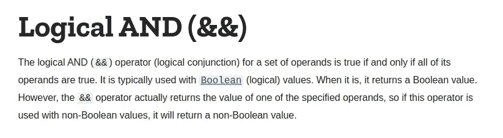
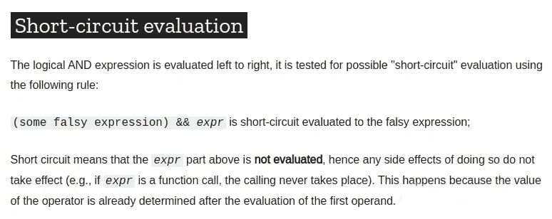
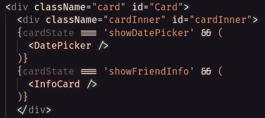
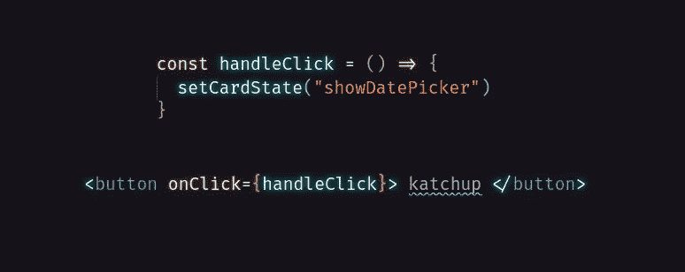

# 如何在 React 中使用逻辑 AND 运算符执行条件呈现

> 原文：<https://javascript.plainenglish.io/conditional-rendering-in-react-with-logical-and-617c973e2aa0?source=collection_archive---------17----------------------->

通常，我们希望根据条件改变向用户显示的内容。假设我们想在用户点击按钮时改变卡片的内容。有几种方法可以实现这一点，但在本例中，我们将研究逻辑 AND 运算符。

Mozilla 文档告诉我们，虽然逻辑 AND 是一个布尔运算符。如果它与非布尔值一起使用，它将返回一个非布尔值。考虑到这一点，我们应该能够使用逻辑 AND 操作符来返回我们希望向用户显示的组件。

Mozilla 文档还告诉我们，如果第一个表达式是 falsy，逻辑 AND 运算符将忽略第二个表达式。这意味着要隐藏一个组件，我们只需要确保逻辑 AND 操作符中的第一个表达式是 falsy。然后，我们可以更改一个值，使我们的第一个表达式真实地向用户显示所需的组件。如果我们使用一个状态变量来做这件事，它将触发一个重新渲染并显示出想要的组件。让我们来看看这是如何工作的。

这里我们有一个带有内部 div 的卡片，它保存了我们想要向用户展示的组件。我们想首先向用户展示信息卡。因此，让我们创建一个状态变量，并将初始值设置为“showCard”。

当用户单击按钮时，我们希望用 DatePicker 组件替换 InfoCard 组件。为此，我们需要将 state 变量的值改为等于“showDatePicker”。

这将为我们做几件事。这将使表达式`cardState === 'showCard'` 变得虚假，从而隐藏我们的 infoCard 组件。它将使表达式`cardState === 'showDatePicker'` 真实，这将显示我们的 DatePicker 组件，因为我们正在更新一个状态变量，它将触发我们的组件的重新呈现，向用户显示更改。不错吧？

逻辑 AND 运算符可以是一个有用的工具，当与状态的效果结合时，我们可以进行切换，只显示我们想要的组件，并且只在我们希望它们被看到时显示。感谢你的阅读，我希望你从中有所收获。编码快乐！

[*更多内容看 plainenglish.io*](http://plainenglish.io/)