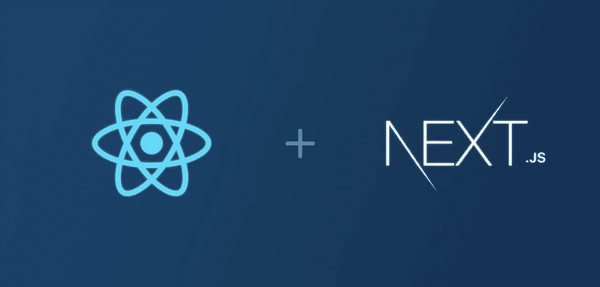

# 在 Next.js 类型脚本应用程序中配置和使用 Apollo 客户端

> 原文：<https://javascript.plainenglish.io/configuring-and-using-the-apollo-client-in-a-next-js-typescript-application-9de6b2258943?source=collection_archive---------3----------------------->

最近一直在围绕[next . js](https://nextjs.org/)graph QL 做一些研究。

在研究了后端之后(我将改天再写)，我想测试一些用于查询我的 GraphQL API 的库。

当然，因为我是在后端使用 Apollo，所以在“客户端”也使用 Apollo 是有意义的。

在本文中，我将解释如何将它集成到我的 Next.js 应用程序中。既然你认识我，那么应用程序使用 TypeScript 应该是很明显的！

注意**我不是 Next.js 专家**(也不是 React one :p)，因此，我可能在很多事情上都是错的；你已经被警告了！:)

我们走吧！

## 概观

在 Next.js 应用程序中开始使用 Apollo 需要几个步骤:

*   安装依赖项
*   编写设置客户端的代码(较难的部分)
*   用非极性溶剂包装部件(或不用)
*   疯狂查询&盈利！

Next.js 让这个过程变得更复杂的是，它[支持](https://nextjs.org/docs/basic-features/pages)不同的“呈现模式”:完全静态的站点生成(SSG)、“增量静态再生”(这听起来是不是很伟大？)、服务器端渲染(SSR)等。有些页面可能在构建时获取一次数据，并在任何时候都以静态方式提供，而其他页面可能是动态的，并在运行时呈现一次或多次。入门有点棘手，但这是 Next.js 最酷的部分。

因为相同的代码将在不同的环境中执行，所以我们需要考虑这个事实，正如我们将在 Apollo 客户机设置中看到的那样。

让我们看看这是如何工作的…

## 属国

通常你只需要一个依赖项:`@apollo/client`。对于本文，我使用的是版本 3.3.7。

## Apollo 客户端设置

Apollo 最大的优势之一是它的文档(在它令人瞠目结舌的特性列表旁边):[https://www.apollographql.com/docs/react/get-started/](https://www.apollographql.com/docs/react/get-started/)。如果你对阿波罗还不熟悉，那么就从那里开始，以后再回来；-)

不幸的是(在这个时间点上)，这些文档只关注 React，没有针对 Next.js 的具体官方指导。我确实在 Apollo 博客上找到了[一篇帮助我开始的帖子，但它是用 js 写的，所以它只能让我到目前为止。至少它帮助我理解了不同的步骤！](https://www.apollographql.com/blog/building-a-next-js-app-with-apollo-client-slash-graphql/)

如果您想跟进，可以创建一个 apollo.tsx 文件。这是我使用的完整代码:

现在让我一步一步地解释。

第一个有趣的函数是`createApolloClient`:

这个函数是唯一真正创建 Apollo 客户机实例的函数。返回类型还可以改进，但这只是一个开始。请注意，服务器端渲染模式仅在有意义时*才启用。知道*代码当前在哪里运行的最简单的方法是检查全局`window`对象是否可用。如果不是，那么我们可以认为我们运行在“服务器端”(即构建时或实际上在服务器上)。**

注意，客户端的链接是使用`createIsomorphicLink`设置的。该函数如下所示:

代码再次检查*代码当前运行的位置*，并根据我们所处的情况创建不同的模式链接。如果代码在服务器上运行(同样，要么实际上在服务器上运行，要么在构建时运行)，那么函数使用`require`调用来直接加载 GraphQL 模式。相反，如果代码运行在客户端，那么这个函数使用一个`HttpLink`来代替，使用 HTTP 加载 GraphQL 模式。

接下来是`initializeApollo`功能:

这个函数接受一些初始状态，并可以用它来合并 Apollo 客户机。首先，如果没有可用的实例，它将检索一个`ApolloClient`实例。这一点很重要，因为它避免了浪费时间/资源，不必要地重新创建新实例。

如果传入了一个初始状态，那么它将被放入 Apollo 缓存。

如果代码没有在浏览器环境中运行，那么就返回 Apollo 客户机实例。否则，将保留对客户端的引用，以便可以重用它(和缓存)。

下一个函数`useApollo`是一个钩子，它用`useMemo`包装了前面的`initializeApollo`函数，这[可能是也可能不是一个好主意](https://kentcdodds.com/blog/usememo-and-usecallback)；-)

最后，`withApollo`函数是一个特设函数，可用于用`ApolloProvider`包装 Next.js 页面/组件，使 Apollo 客户机可用，而不必用它包装整个应用程序。

这基本上是在 Next.js 应用程序中使用 Apollo 客户端库的基本“工具箱”。TypeScript 类型当然可以改进，但我将在这里就此打住。

## 用非极性溶剂包装组件(或不用)

在我能找到的各种例子中，人们似乎用`_app.tsx`文件中的`ApolloProvider`来包装他们的整个 Next.js 应用程序，就像这样:

请注意，我们使用了之前看到的`useApollo`钩子。

同样，我不确定在`_app.tsx`文件中这样做是否是个好主意。如果您在任何地方都使用 Apollo，并且不想担心细节，这是有意义的，但是在完全不需要 GraphQL 的页面/组件周围添加它对我来说感觉很脏。

不管怎样，正如我之前解释的，你也可以选择使用我包含的特设文件，并把阿波罗从你的`_app.tsx`文件中删除。

有了这些，您就可以查询您的 GraphQL APIs 了！

## 疯狂查询&盈利！

既然 Apollo 客户机已经配置好了，并且可以在需要的地方使用，那么就可以与 GraphQL APIs 进行交互了。

正如我们在本文开始时所讨论的，让 Next.js 变得真正酷的是这样一个事实:你可以控制*何时获取数据以及如何构建页面。您可以决定在构建时获取一次数据，并拥有一个超高性能的 SEO 友好的静态页面，您可以选择在运行时在服务器端呈现一次页面，动态地重新呈现它，等等。*

根据不同的场景，您可以使用`useQuery` Apollo [钩子](https://www.apollographql.com/docs/react/get-started/#request-data)来发送查询(假设`ApolloProvider`正在包装您的当前页面/组件)，使用`useApollo`钩子来直接检索客户端，或者使用`getServerSideProps`或`getStaticProps`中的`getApolloClient`函数(`initializeApollo`函数的别名)来检索*Apollo 客户端实例并使用它。*

这里有一个使用`getServerSideProps`的例子:

在上面的例子中，对每个请求都执行查询。

顺便注意一下 Next.js 提供的很酷的`InferGetServerSideProps`实用类型[的用法。得益于此，组件的道具与`getServerSideProps`函数的输出相匹配。整洁！](https://nextjs.org/docs/basic-features/data-fetching#typescript-use-getserversideprops)

以下是一些有用/相关的链接:

*   [https://www . freecodecamp . org/news/如何获取-graph QL-data-in-next-js-with-Apollo-graph QL/](https://www.freecodecamp.org/news/how-to-fetch-graphql-data-in-next-js-with-apollo-graphql/)
*   [https://www.youtube.com/watch?v=oxUPXhZ1t9I](https://www.youtube.com/watch?v=oxUPXhZ1t9I)
*   [https://nextjs.org/docs/basic-features/data-fetching](https://nextjs.org/docs/basic-features/data-fetching)

## 结论和下一步行动

瞧。你可以走了。如果你对 Next.js 和 Apollo 足够熟悉，剩下的就应该很有趣了；-)

在本文中，我讲述了我最近学到的关于如何在 TS Next.js 应用程序中设置/配置 Apollo 客户机的知识。

根据代码在哪里执行，初始化 Apollo 客户端并正确地水合它有点困难。如果您不习惯 Next.js 是如何工作的(像我一样:p ),那就太不简单了。

一旦这个到位，我认为这是相当好的，但它有点太涉入我的意见。这就是为什么我要继续探索，看看在 Next.js 应用程序中 [urql](https://github.com/FormidableLabs/urql) 和 [SWR](https://github.com/vercel/swr) 与 Apollo client 相比如何。

今天就到这里吧！

附言:如果你想了解很多关于软件/网络开发的很酷的事情，那就看看我即将出版的书吧，订阅我的时事通讯吧，在推特上打个招呼吧！