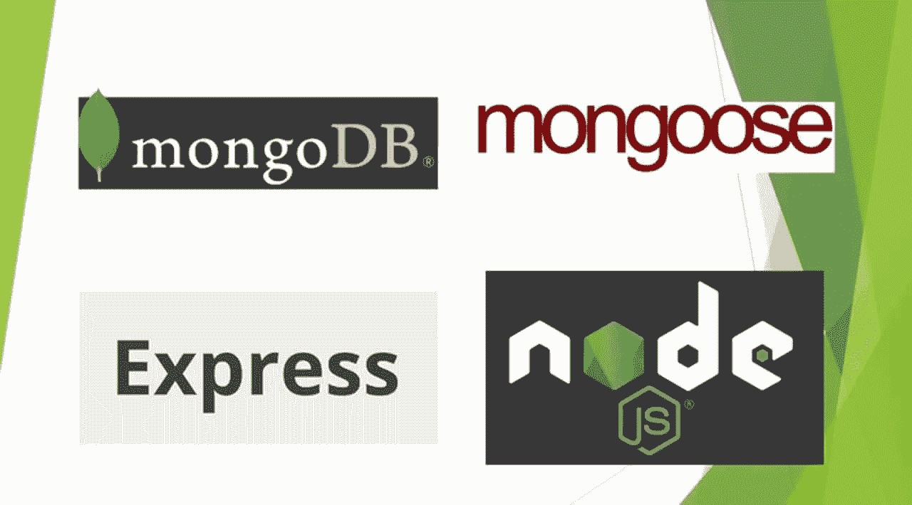
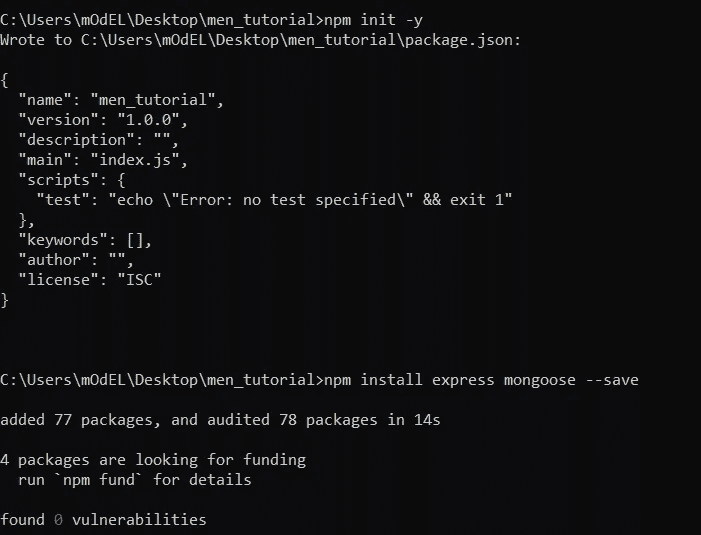
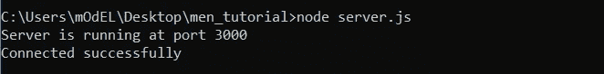
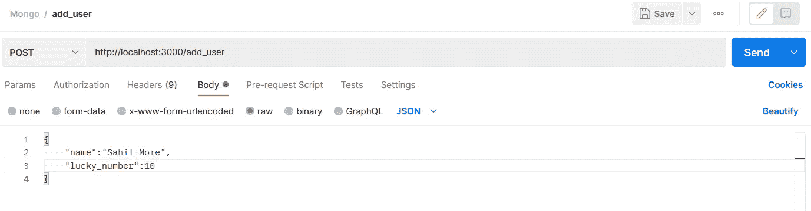
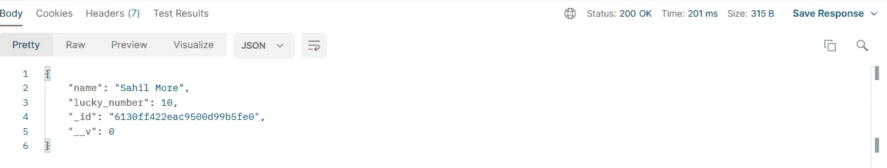
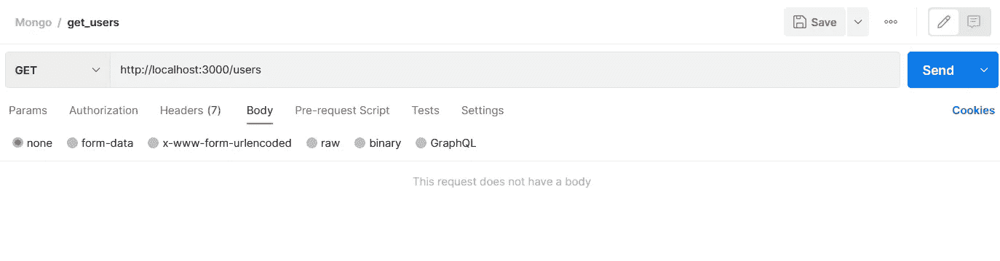
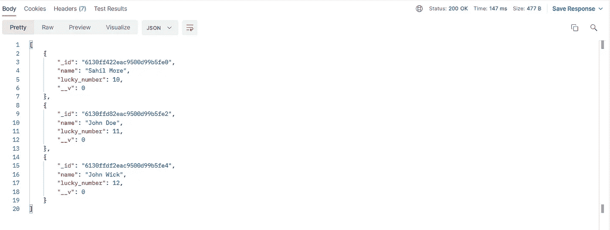

# 使用 Express 和 Mongoose 将 MongoDB 连接到节点

> 原文：<https://javascript.plainenglish.io/connect-mongodb-to-node-using-express-and-mongoose-c405d1158c?source=collection_archive---------1----------------------->



> m**on godb**
> [MongoDB](https://www.mongodb.com/)是一个源代码可用的跨平台面向文档的数据库程序。归类为 NoSQL 数据库程序。
> 
> **Node** [Node . js](https://nodejs.org/en/)是一个开源、跨平台、后端的 JavaScript 运行时环境，运行在 V8 引擎上，在 web 浏览器之外执行 JavaScript 代码。
> 
> **Express** [Express . js](https://expressjs.com/)或简称 Express，是 Node.js 的后端 web 应用框架，在 MIT 许可下作为免费开源软件发布。它是为构建 web 应用程序和 API 而设计的。
> 
> m**on goose**
> [mongose . js](https://mongoosejs.com)将您的 MongoDB 集群或集合与您的 Node.js 应用程序连接起来。它使您能够为您的文档创建模式。Mongoose 在创建和使用模式时提供了很多功能。

## 你的外卖是什么

在本文中，您将了解如何将 MongoDB 实例与 Node.js 应用程序连接起来。让我们开始吧…💃

## 先决条件

*   Node.js 安装在您的计算机上。
*   在您的机器上运行的 MongoDB 实例。
*   Node.js 和 Express.js 的一些知识。
*   测试 API 端点的邮差。

## 1.安装 Express 和 Mongoose

创建一个新目录`men_tutorial`并移动到其中

键入`npm init -y`创建一个避免 npm 提示的项目

使用
`npm install express mongoose --save`命令安装 Express 和 Mongoose



## **2。创建连接**

创建一个新文件`server.js`来启动我们的 Express.js 服务器。

通过向`server.js`添加以下代码来加载`mongoose`和`express`。

```
const express = require("express");
const mongoose = require("mongoose");
const Router = require("./routes")

const app = express();

app.use(express.json());
```

然后使用`mongoose.connect()`函数连接到本地 MongoDB 实例。我们通过`useNewUrlParser: true`等。为了避开`[DeprecationWarning](https://mongoosejs.com/docs/deprecations.html)`。

```
mongoose.connect('mongodb://localhost:27017/usersdb',
  {
    useNewUrlParser: true
  }
);
```

为了确保连接成功，在您的`mongoose.connect()`下面添加以下代码。

```
const db = mongoose.connection;
db.on("error", console.error.bind(console, "connection error: "));
db.once("open", function () {
  console.log("Connected successfully");
});
```

然后，设置 app 监听端口 3000。

```
app.use(Router);

app.listen(3000, () => {
  console.log("Server is running at port 3000");
});
```

*结束* `server.js` *文件。*

## 3.创建模式

创建另一个文件`models.js`并添加以下代码。

```
const mongoose = require("mongoose");const UserSchema = new mongoose.Schema({name: {type: String,required: true,},lucky_number: {type: Number,default: 0,},});const User = mongoose.model("User", UserSchema);module.exports = User;
```

我们使用`mongoose.Schema()`方法创建一个模式`UserSchema`。该模式收集来自请求的`name`和`lucky_number`字段。

然后，我们使用最后两行导出模式。

*结束* `model.js` *文件。*

## 4.正在创建发布端点

创建一个新文件`routes.js`。这个文件定义了我们应用程序的端点。

通过添加以下代码，加载`express`和我们在步骤 3 中创建的模式。

```
const express = require("express");
const userModel = require("./models");
const app = express();
```

然后通过添加以下代码来创建 POST 端点。

```
app.post("/add_user", async (request, response) => {
    const user = new userModel(request.body);

    try {
      await user.save();
      response.send(user);
    } catch (error) {
      response.status(500).send(error);
    }
});
```

我们创建一个路由`/add_user`来向数据库添加一个新用户。我们使用行`const user = new userModel(request.body);`解析要保存到数据库的内容。

然后我们使用`try/catch`块通过`.save()`方法将对象保存到数据库中。

## 5.正在创建获取端点

将以下代码行添加到`routes.js`文件中。

```
app.get("/users", async (request, response) => {
  const users = await userModel.find({});

  try {
    response.send(users);
  } catch (error) {
    response.status(500).send(error);
  }
});
```

我们创建一个路由`/users`来检索使用`/add_user`路由保存的所有用户。我们使用`.find()`方法从数据库中收集这些用户。然后，我们使用一个`try/catch`块将用户“发送”到这个端点。

最后，通过添加下面的行来导出这些端点。

```
module.exports = app;
```

## 6。你的申请已经准备好了…💃

通过运行以下命令为应用程序提供服务:

```
node server.js 
```

输出:



## 7.使用 Postman 测试端点

[Postman](https://www.postman.com/) 是一个用于 API 测试的应用。它是一个 HTTP 客户端，利用一个图形用户界面来测试 HTTP 请求，通过这个界面我们可以获得不同类型的响应，这些响应需要随后进行验证。敬请关注邮差[的安装使用这里](https://sahil-more.medium.com)。

让我们看看我们的应用程序是如何工作的…

> **POST**打开 Postman，向`http://localhost:3000/add_user`端点发出`POST`请求。



`**POST**` **Request**



**POST Success**

每当我们执行`POST`请求时，新的`users`就会被添加到数据库中。我们将能够看到所有使用`GET`端点的用户，这也将在下面演示。

> **得到** 打开邮递员，向
> `http://localhost:3000/users`端点发出`GET`请求。



**GET Request**



**GET Success**

我已经添加了两个以上的用户，只是为了演示🙌

终于到了。我们已经学习了如何使用 Node.js、Express.js 和 Mongoose 模式来设置 MongoDB。您还可以连接到 MongoDB Atlas 或位于远程级别的任何其他数据库。过程是相同的，您只需在建立连接时更新数据库凭证。🔏

> 所有的文件都可以在我的 github [这里](https://github.com/sahilmore-git/MEN-Connection-Example)找到🚀

# 谢谢:)

希望你们喜欢这篇文章💌
请在评论中留言让我知道
在这里发表你对新文章的建议[📬你也可以在这里给我买杯咖啡☕️](mailto:sahilmore19999@gmail.com)

*更多内容看* [***说白了. io***](http://plainenglish.io)