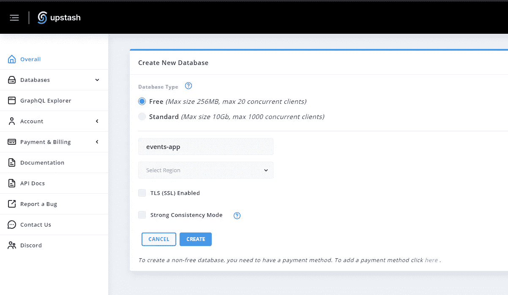

# 从发送 HTTP 请求的任何地方通过 GraphQL 连接到无服务器 Redis

> 原文：<https://javascript.plainenglish.io/connect-to-redis-from-wherever-you-send-http-requests-569eaf190d66?source=collection_archive---------6----------------------->

在本文中，我们将了解如何从您的客户端应用程序直接访问 Redis 数据库。


Photo by [Firos nv](https://unsplash.com/@firosnv?utm_source=medium&utm_medium=referral) on [Unsplash](https://unsplash.com?utm_source=medium&utm_medium=referral)

在本文中，我们将实现一个事件预订应用程序，它将包括以下特性:

1.  在数据库中创建事件。
2.  将事件推送到缓存。
3.  缓存趋势事件，因此我们将运行 CRON 作业来定期更新缓存中的趋势事件。
4.  在客户端 React 应用程序上，我们将使用 GraphQL 直接从 Redis 服务器获取趋势事件，即不需要连接实际的服务器。

```
REST API Routes
1\. POST => /api/events => Create events
2\. GET  => /api/events => Get all events
```

## 软件要求

1.  [Nod](https://nodejs.org/en/) e.js — Node.js 是基于 [Chrome 的 V8 JavaScript 引擎](https://v8.dev/)构建的 JavaScript 运行时。
2.  [Express](https://expressjs.com/)——用于 [Node.js](https://nodejs.org/en/) 的快速、非个性化、极简的 web 框架
3.  [Postman](https://www.postman.com/)—API 开发的协作平台。

我们开始吧。

在本地计算机上安装所需的软件包:

```
npm install express mongoose dotenv redis — save
```

**用 Upstash 建立 Redis 数据库**

是 Redis 的一个无服务器数据库。对于服务器/实例，您通常按小时或固定价格付费。使用无服务器，你按请求付费。

这意味着当数据库没有被使用时，你是免费的。Upstash 为您配置和管理数据库。

首先在 [**上创建一个账户，抢在**](https://upstash.com/) **之前。**

现在设置 Redis 数据库实例。



Create New Database


Connect to your database

不要忘记在根目录中添加`.env`文件。


Root Directory Structure


.env file

创建一个简单的服务器并连接到本地或远程 MongoDB 数据库:

现在，使用 Upstash 提供的配置连接到 Redis 服务器:

猫鼬模型:

现在实现定期缓存趋势事件的逻辑。基本上在这里，我们使用的是一个`setInterval()`模拟 CRON 作业。

现在实现 API 路由:

为了创建事件，我们需要来自用户的`title, description, imageURL, timeAndDate, fees, notes`。

此外，我们正在 Redis 缓存中推送这些事件。

## 服务器应用程序的最终代码:

## 现在，让我们使用 React 实现一个客户端应用程序

通过运行以下命令为 React 创建样板代码:

`npx create-react-app client-app && cd client-app`


Folder Structure for React.js app

安装 Apollo 客户端库:

`npm i @apollo/client`

现在，连接到 Redis 数据库。在您的 **index.js** 文件**中，**添加以下代码以设置 GraphQL 客户端并连接到 Upstash 的 GraphQL 服务器:

从 Upstash 获取凭据:


Upstash GraphQL Redis

> **注**:使用客户端`READ ONLY`访问密钥。

现在为 UI 添加引导:


Bootstrap

实现用于直接从 Upstash Redis 获取趋势事件的代码:

然后尝试使用`npm start`运行:


Running React.js app

您将看到直接从 Redis 数据库获取的趋势事件。

***结账*** [***上州***](https://upstash.com/) ***进行生产。***

*更多内容参见* [*通俗易懂*](http://plainenglish.io/)