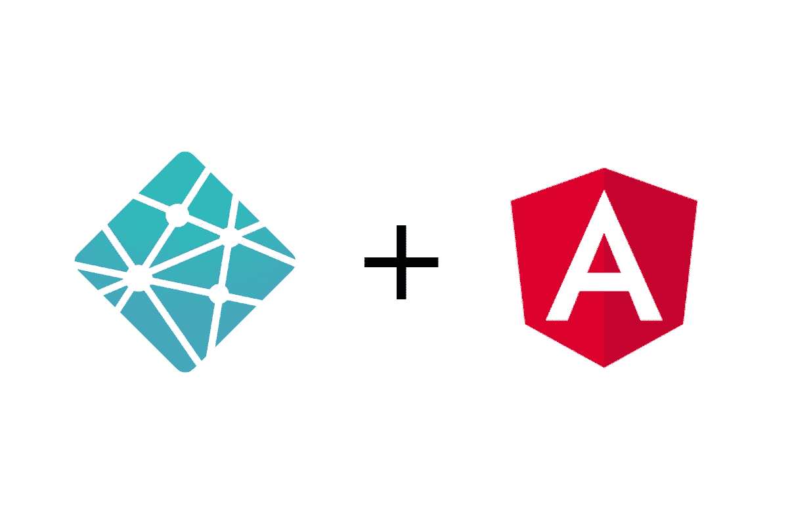

# 将网络形式连接到角度

> 原文：<https://javascript.plainenglish.io/connecting-netlify-forms-to-angular-template-driven-or-reactive-forms-b3f053c5cd56?source=collection_archive---------11----------------------->

## 模板驱动或反应式表单



Netlify 是一个很好的部署解决方案，尤其是对于简单的点对点应用程序。它提供了表单功能，消除了只为表单处理和电子邮件发送而创建后端的需要。

Angular 是最受欢迎的前端框架之一，提供了大量优秀的特性。其中有两种表单类型——反应式和模板驱动式。

这两者不能“开箱即用”,所以让我们让它们发挥作用吧！

# 问题是

简而言之，Angular 使用组件，这意味着我们的表单将由客户端 JavaScript 呈现。因此，Netlify 机器人无法识别表单及其字段，因为它们在部署期间不存在。

# 解决方案

我们需要在我们的`index.html`中创建一个可以被机器人发现的“不可见”表单，我们将提交它。这将通过对我们的索引页面的 POST 请求来实现。

在我们了解所有的本质细节之前，如果你像我一样，你可能会喜欢为下一个应用程序准备一份清单。以下是我的供参考:

*   在`index.html`中编写您的不可见表单(使用与实际表单相同的“name”属性)
*   为你需要的数据写一个合适的接口
*   用`ng g s NetlifyForms`生成一个网络表单服务
*   向包含重定向规则`/* /index.html 200`的 src 文件夹添加一个`_redirects` glob
*   通过添加以下代码行，将 glob 包含在您的`angular.json`资产数组中:

```
{ "glob": "_redirects", "input": "src", "output": "/" }
```

*   在包含表单的组件中使用 NetlifyForms 服务来提交表单

好的，这是一个快速的概述，希望能在未来节省你的时间，并确保你不会错过任何重要的细节。

现在进行深入的过程。

下面是我的可视表单的样子:

如你所见，我使用的是模板驱动的表单，但这种方法也适用于反应式表单。然而，**文件上传不被支持**，所以请记住这一点。

首先，我们需要在`index.html`中创建一个我们表单的克隆。这是我的样子:

重要的是，你要给 **name 属性赋予与你的实际表单**相同的值，还要添加`netlify`属性来通知机器人你希望通过 Netlify 处理这个表单，最后添加`netlify-honeypot="bot-field"`属性来激活所提供的垃圾邮件机器人保护。

您还可以通过指定`data-netlify-recaptcha="true"`属性向表单中添加 reCAPTCHA，并向表单中希望显示挑战的位置添加 div。完成的 reCAPTCHA 表单应该是这样的:

```
<form name="contact" method="POST" data-netlify-recaptcha="true" data-netlify="true">
  <p>
    <label>Email: <input type="text" name="name" /></label>
  </p>
  <p>
    <label>Message: <textarea name="message"></textarea></label>
  </p>
  <div data-netlify-recaptcha="true"></div>
  <p>
    <button type="submit">Send</button>
  </p>
</form>
```

接下来，我们需要创建一个适合我们将要发送的数据类型的接口。我的将被命名为`Feedback`，并将驻留在与我的表单所在的组件相同的文件夹中的一个`feedback.ts`文件中。

这是我完成的反馈界面文件的样子:

我们现在应该创建我们的 Angular 服务，它将处理我们对索引页面表单的提交。

运行`ng g s NetlifyForms`来创建服务。

下面是你的`netlify-forms.service.ts`文件应该是什么样子:

如您所见，我们有两个私有函数来处理错误记录和实际提交，第三个函数可供其他组件访问，以便转换反馈。**为了以正确的数据类型提交表单，我们必须在 POST 请求中包含** `Content-Type` **标题**，并**将其设置为** `application/x-www-form-urlencoded`，这一点很重要。

现在，我们可以在提交表单的组件中使用我们的新服务(例如，通常通过对服务器的请求)。为了向我的用户表明他们的查询已经提交或者没有发送，我在我的表单下面显示了一个弹出窗口。这就是为什么我有`emailSent`和`emailFailed`变量(它们不是必需的)。下面是我的`contact.component.ts`文件的样子:

您还会注意到，我们订阅了我们的`submitFeedback()`函数，因此在`ngOnDestroy`生命周期方法中取消订阅是很好的，这样可以防止可能的数据泄漏。

到目前为止一切顺利，但即使你现在尝试提交表格，它也不会工作。我们需要做的是将每个请求重新路由到我们的`index.html`文件，以便 Angular 可以处理它。

我们写了一个非常简单的规则，规定`/* /index.html 200`。`/*`捕获任何路由并将其重定向到我们的`index.html`文件，并返回一个状态代码`200`，而不是通常用于重定向的`301`。

上面的规则放在一个名为`_redirects`的文件中(不需要扩展名，因为它只是一个 glob ),这个文件位于我们的`src`文件夹中。我们还需要将它包含在我们的`angular.json`中的`assets`数组中，这是通过以下代码行实现的:

```
"assets": ["src/favicon.ico", "src/assets",{ "glob": "_redirects", "input": "src", "output": "/" }]
```

如果您在 localhost 上运行`ng serve`进行开发，您可能仍然会收到 404 状态代码。这是因为您运行在开发服务器上，它被设置为服务于我们的静态文件以及响应路由到根的 GET 请求(`/`)。因此，当我们发出一个包含表单数据的 POST 请求时，我们最终会遇到一个`404 Not Found`错误。不过不要担心，因为这个**将在 Netlify 上工作**。

在这里，您已经准备好将您漂亮的应用程序部署到 Netlify，并直接从表单仪表板上阅读您提交的所有表单，如果您愿意，甚至可以设置电子邮件通知。

# 结论

感谢您从头到尾阅读本文，我希望这种方法能够解决您的问题。如果您也对 Netlify 上的部署工作方式感兴趣，您应该查看本文,其中详细介绍了这两个步骤，也是我自己找到原始解决方案的地方。