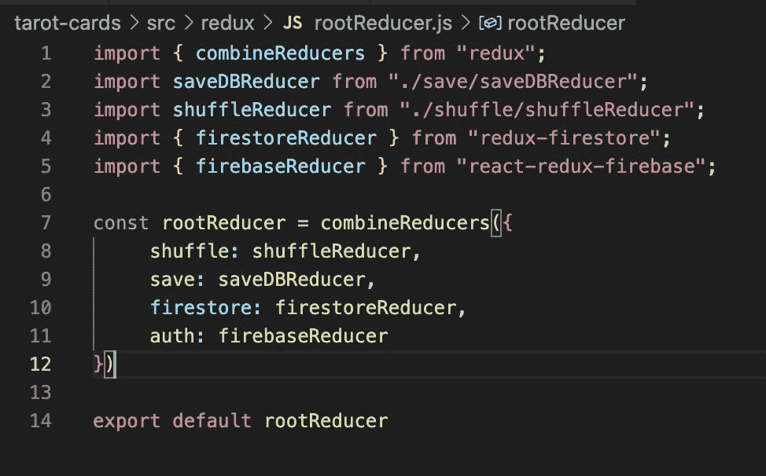
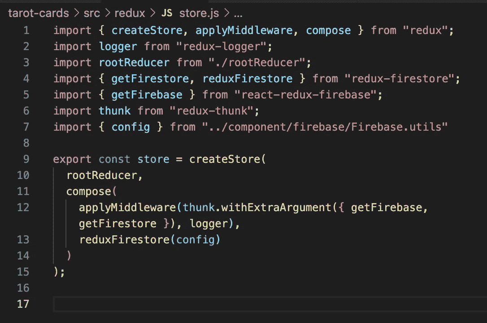
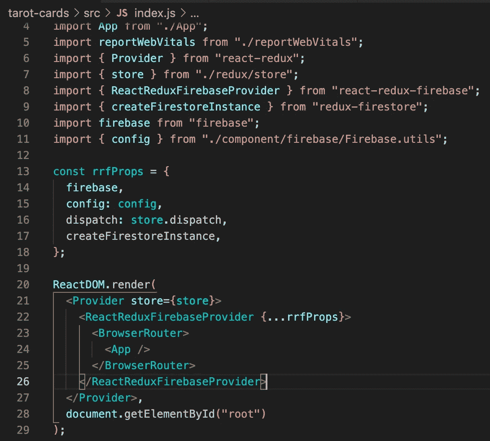

# 将 Redux 连接到您的 Google Firestore 和 Firebase

> 原文：<https://javascript.plainenglish.io/connecting-redux-to-your-google-firestore-and-firebase-d28fc6466da6?source=collection_archive---------10----------------------->

开始使用 Google Firestore 和 Firebase 很像开始使用 Redux 库。要让它工作，需要大量的样板代码和特定的语法。搭建脚手架需要一些努力，但是一旦搭建好，它就非常强大，可以让你的项目更加高效。

我比较这两个是因为我最近实现了一个库，帮助我在一个项目中将它们连接在一起，我经常提到这个项目，我的 React 塔罗牌应用程序。

作为背景介绍，用户可以创建一个帐户，然后通过他们的电子邮件或谷歌帐户登录。一旦进入，用户可以搜索和学习特定的塔罗牌，或者用一张或三张牌生成读数，这些牌用费舍尔-耶茨算法洗牌。用户可以选择保存读数。

以前，用户的 shuffle 和保存的读数存储在 state 中，通过 Redux store 访问。然而，本周我重构了应用程序，这样保存的卡片就可以存储在谷歌的 Firestore 云数据库中。考虑到增长，这是一次必要的更新。随着用户群的增长，将数据保存在一个位置并将其连接到单个用户会更有效。

我很快意识到我连接 Redux 和 Firebase 的努力有点笨拙，直到我找到了 react-redux-firebase 包。

在做了一些搜索来解决我自己的错误之后，这是一件很好的事情。通过快速安装 npm，我有了许多开箱即用的特性。这里是所有规格的文件。

我将向您展示我是如何将它们连接在一起的，但是，基本上，库提供了更高阶的组件，您可以将这些组件包装在应用程序周围，就像您对保存您的存储的 Redux provider 所做的那样。

该库的功能来自其内置的 reducers，它允许您调度与数据库或身份验证相关的函数，并允许您在状态中访问这些属性。那么，您不需要为您想要的动作编写自己的函数。在我的例子中，我希望能够访问数据库来检索和呈现特定用户保存的洗牌。

额外的好处是，我不需要创建一个特定的用户缩减器来保存所有与身份验证相关的 Redux 操作，比如登录开始、登录成功等。，因为这些都是内置在 firebase reducer 中的，我是从包中导入的。

下面是我的 rootReducer 文件。你可以看到我组合了一些传感器，以便在商店里一起使用。我有减速器来处理洗牌和保存到 Firestore，以及进口的减速器。

Inside the rootReducer

shuffle 和 save reducers 是我自己创建的，而 firestore 和 auth reducers 是从 react-redux-firebase 软件包安装中导入的。

Inside the Redux store

以上是我的 Redux 存储文件。我以前没有讨论过它，但是我已经实现了 thunk 来允许异步 Redux 操作，比如访问 Firestore。

Where it all comes together

现在，这里是 index.js 文件，所有的东西最终都在这里连接起来。可以看到这个库有自己的 ReactReduxFirerbaseProvider，就像 Redux Provider 一样，它保存着存储。

最后一个重要的部分是扩展到提供商的 rrfProps，它包括通过{config}部分与我的特定 Firebase 帐户相关的细节。

我轻松地将这些片段组合在一起，这是另一个很好的提醒，让我去寻找一个有用的工具。很可能有人以前遇到过你的挑战。

*更多内容尽在*[*plain English . io*](http://plainenglish.io/)