# 控制台。x 会让你成为更好的程序员！

> 原文：<https://javascript.plainenglish.io/console-x-will-make-you-a-better-programmer-110c14b692f8?source=collection_archive---------10----------------------->

发挥您的控制台的全部功能—您的小控制台不仅仅是一个日志。

你越了解这台机器，你就能越好地使用它！

是还是不是？

无论你是以蓝领还是白领职业为生，你都必须随时拥有完成工作所需的合适工具。否则，你不仅不能以你需要的方式工作，而且你也不能和你的工作保持积极的关系。

> "一个人的好坏取决于他的工具。"
> 
> ―埃米特·沃尔夫

开发人员调试控制台在 web 浏览器中以这样或那样的形式出现已经很多年了。

最初是作为向开发人员报告错误的一种手段，它的功能在许多方面都得到了增强，比如自动记录网络请求、网络响应、安全错误或警告等信息。

控制台对象不仅仅是`console.log()`。尽管控制台对象有很多特性——但很少被研究。

在本文中，我们将揭开控制台对象——对大多数开发人员来说仍然是隐藏的东西。

# 来，让我们坐在桌旁，聊聊天！

您可能已经多次将一个数组或对象放入一个`console.log()`中。
但是你知道吗，对于这些数据类型，还有另外一种更结构化的显示方式，那就是`console.table()`？

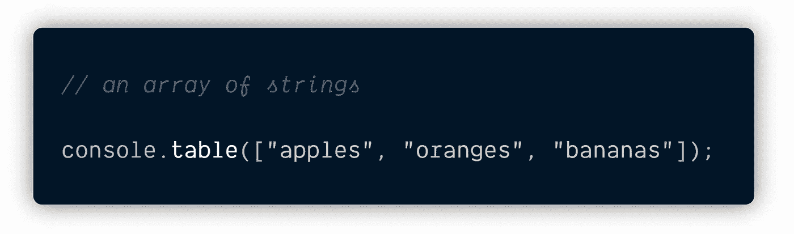

> 耐心点，形势会好转的。
> 
> (如果他们不愿意，就让他们转向。)
> 
> Ruhaniyat

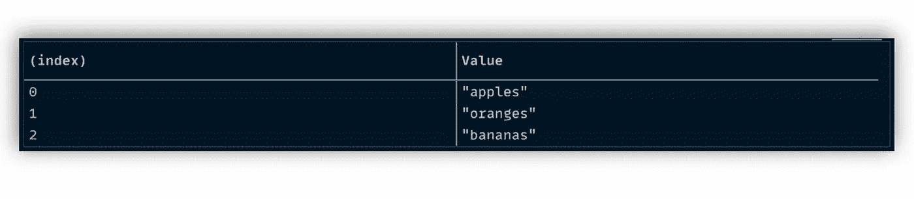

This looks much slick, isn’t it?

# 是时候给你的生活增添一些情趣了。

JavaScript 给了我们五个选项来记录消息。

**console . log()| console . info()| console . debug()| console . warn()| console . error()**

> “人们试图抓住相同之处。这种坚持阻止了增长。”
> 
> ——李小龙

乍一看，他们似乎做同样的事情，从技术上来说，他们做！浏览器提供了与这五个命令相关联的附加功能，为每一个命令提供了独特的优势。

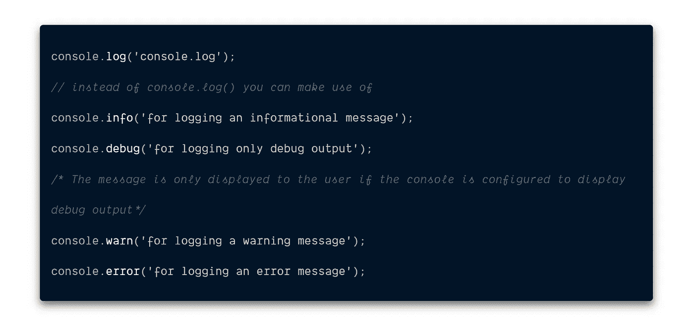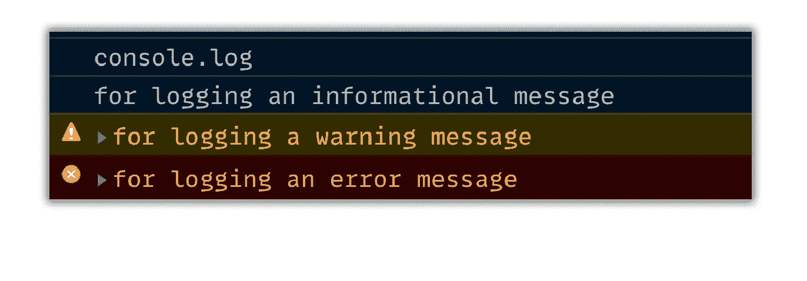

使用 ***错误*** 和 ***警告*** 的意图很容易确定——如何使用其他选择取决于您。

不要只写更好的错误消息，要写不需要的代码。

# 亲爱的，你需要给你的生活增添一些色彩。

如果错误显示为红色，警告显示为黄色，岂不是很神奇？

可能吗？肯定！

您可以将 CSS 样式应用于控制台的输出。它的工作方式就像字符串替换法，您插入一个`%c`变量，从参数中选择要应用的样式。

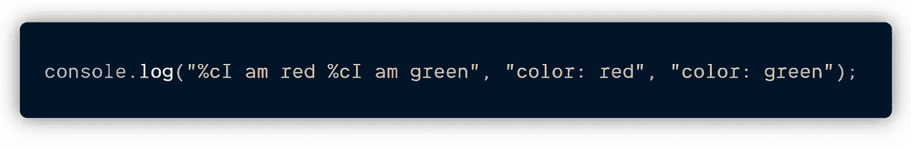

Notice the %c before the I in the above statement.

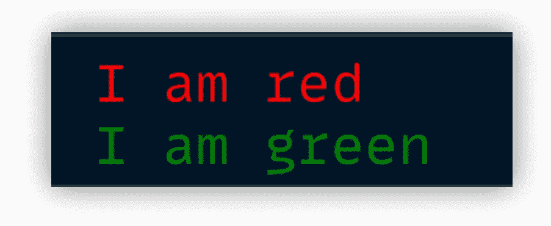

> "颜色之于眼睛，犹如音乐之于耳朵."
> 
> —路易斯·康福特·蒂芙尼

这只是一个例子，你可以用 CSS 实现很多东西。如果你有兴趣的话，看看这个帖子。

# 旧情回忆— C 程序设计。

在 C 编程中，有一种叫做**的占位符**。这些占位符也被称为**格式说明符**。它决定了输入和输出的**格式**。

没有多少人知道这一点，但是 JavaScript 也为我们提供了占位符。我们可以在 JavaScript 的`console.log()`中使用这些占位符

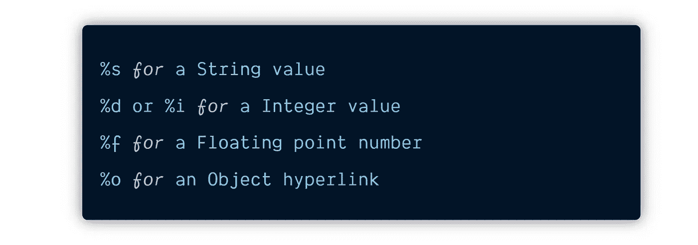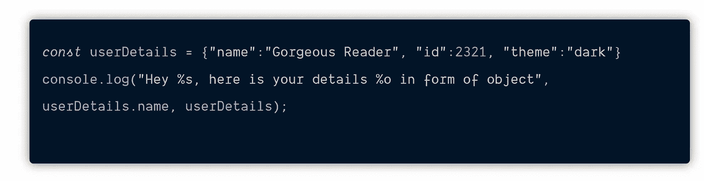

Notice the %s and %o that we have used in the console.log()

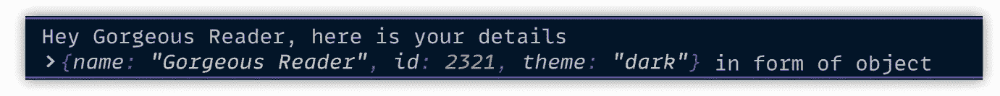

# 你能更好地描述那个东西吗？

当一件事是描述性的，它给我们一个更好的想法，那件事可能会是什么。

`console**.**dir()`显示指定 JavaScript 对象属性的交互式列表。输出显示为带有显示三角形的分层列表，可让您查看子对象的内容。

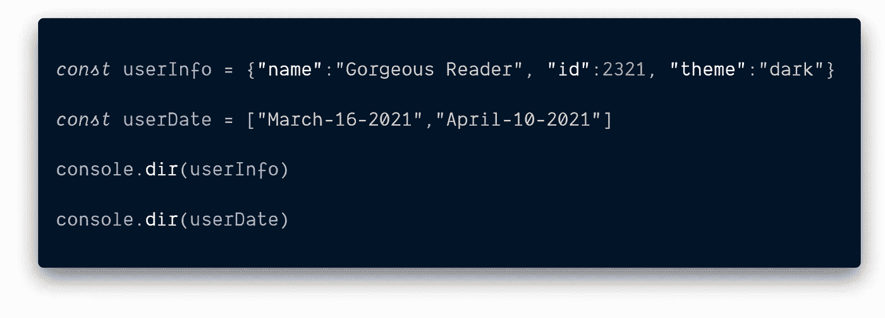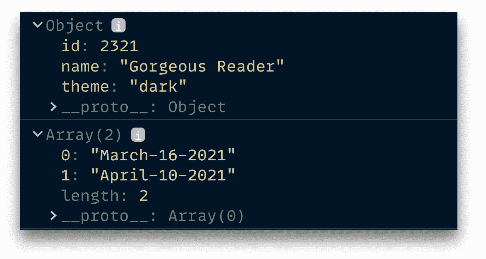

console.dir() didn’t just give an output but also told what kind it is.

有趣的是当我们开始使用 DOM 节点时。那么让我们来看看在`document.body`上使用`dir`和`log`时的区别

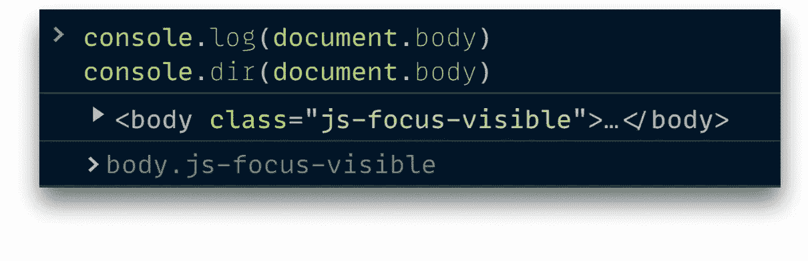

Notice, `console.log()` prints the element in an HTML-like tree and `console.dir()` prints the element in a JSON-like tree.

`console.log()`对 DOM 元素进行特殊处理，而`console.dir()`没有。当试图查看 DOM 对象的完整表示时，这通常很有用。

换句话说，`console.dir()`是在控制台中查看指定 JavaScript 对象的所有属性的方法，开发人员可以通过它轻松获取对象的属性。

# 单独我们是强大的，在一起我们更强大！

一个**组**是一组因为有共同点而被考虑的事物。用控制台对消息进行分组是很有可能的。

使用`console.group()`我们可以将不同的控制台输出分组在一起，以显示它们之间的关系。

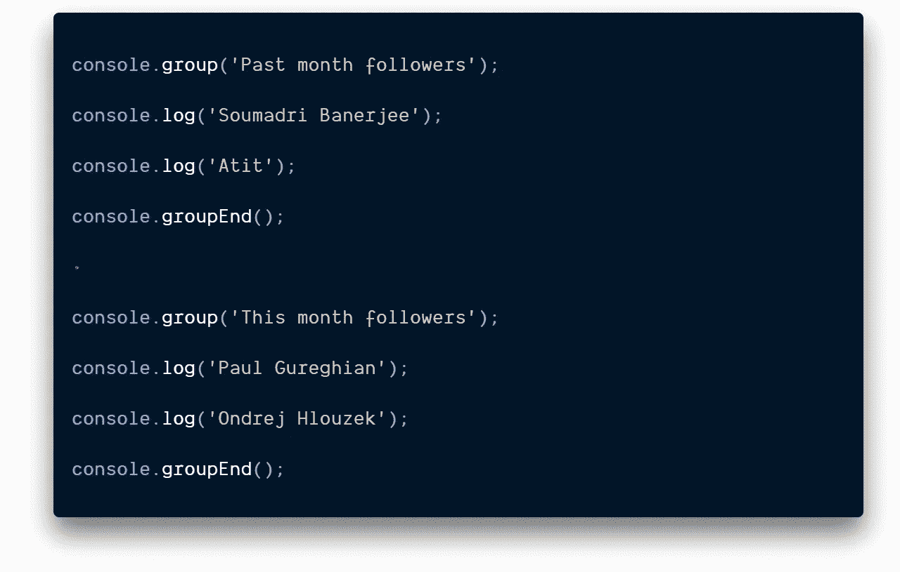

We use group. End() to close the group.

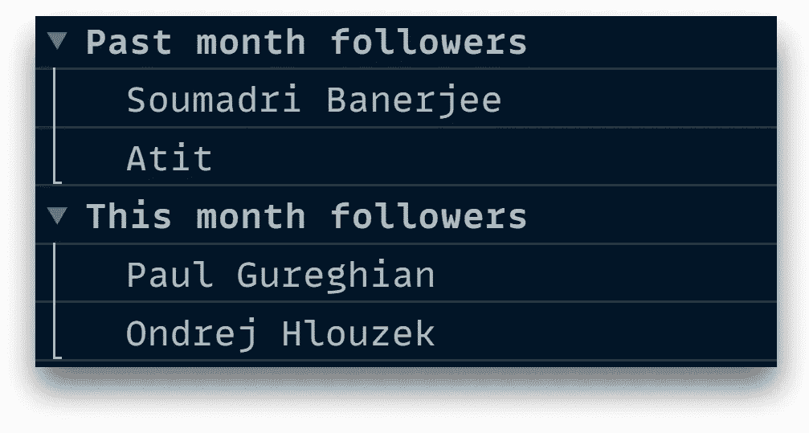

# 你可以像 1，2，3 那样指望我&我会在那里的！

人类，即使在发展的较低阶段，也拥有一种能力，由于没有更好的名称，我姑且称之为数感。这种能力允许他意识到，在他没有直接意识到的情况下，一件物品从一个小收藏中被取走或添加到这个收藏中时，这个小收藏中的某些东西发生了变化。

> “很多东西你可以数，不要数。很多你数不清的东西，真的数得清。”
> 
> **—阿尔伯特·爱因斯坦**

想知道某件事在你的代码中发生了多少次吗？例如，一个特定的函数在一系列事件中被调用了多少次？这就是`console.Count()`命令可以帮忙的地方。

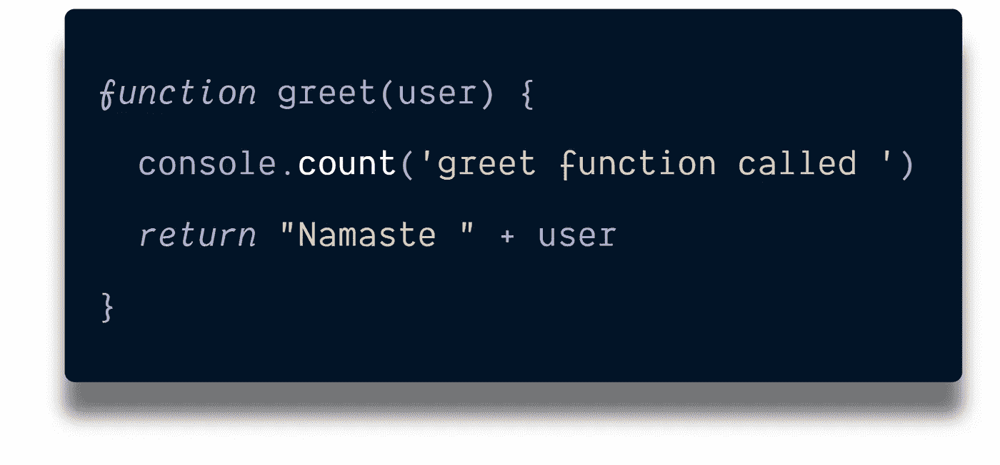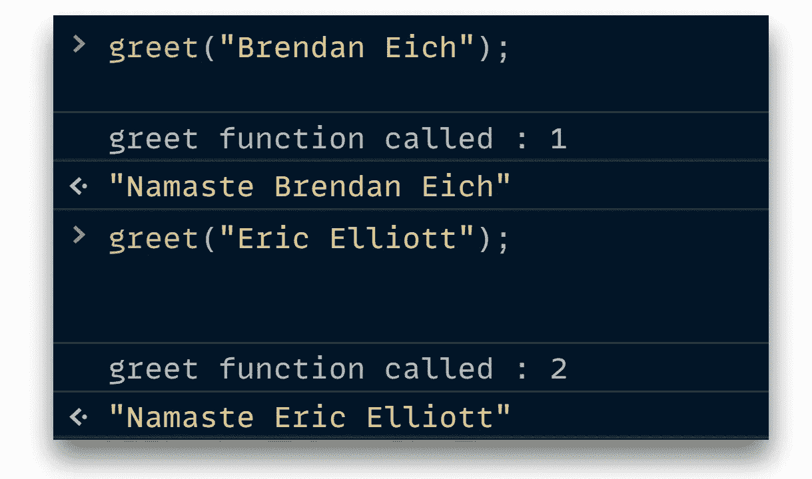

# 要了解自己，就应该坚持自己。

在生活中，真理是唯一的权威。一个人必须拒绝一切，但不是真理。

> 解放的是真理，而不是你争取自由的努力。
> 
> 克里希那穆提

有没有想过记录一些不真实的事情？

当您只想打印一些选定的日志时，即它将只打印错误的参数时,`console.assert()`非常方便。如果第一个论点是真的，它什么也不做。

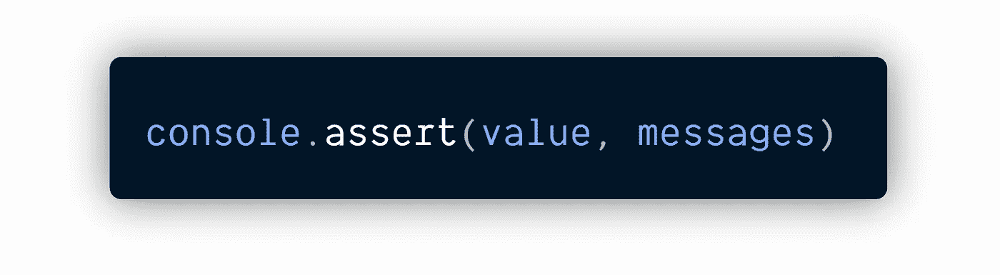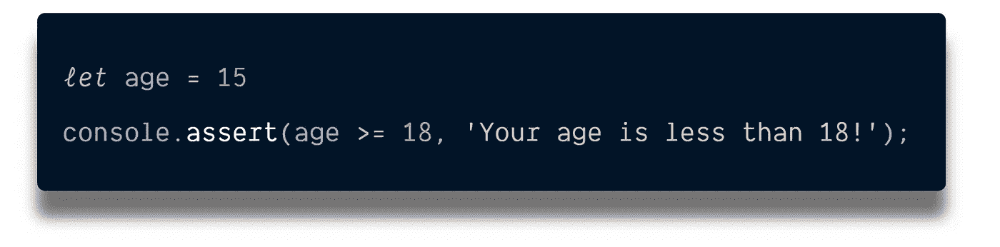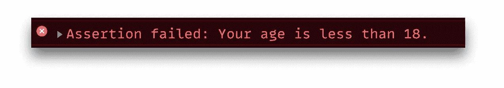

# 你在追踪吗？

bug 可能是沮丧的来源。不可能马上知道是哪个函数调用产生了 bug。理解代码执行流程，可以更好地掌握它们。

您可以使用`console.trace()`来获得快速简单的堆栈跟踪，以更好地理解代码执行流程。

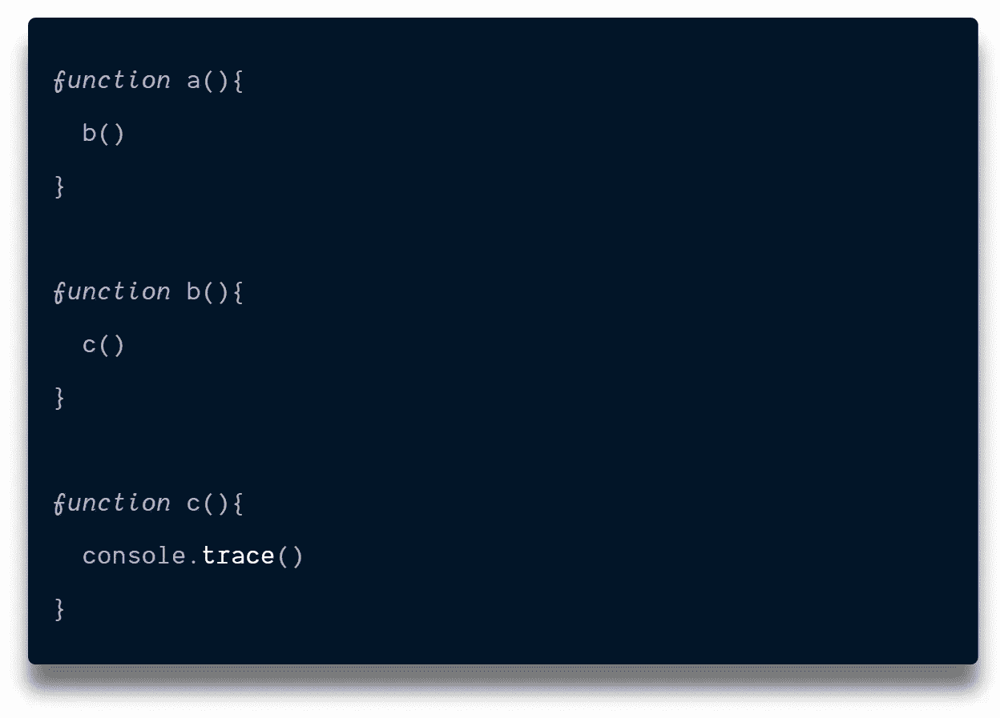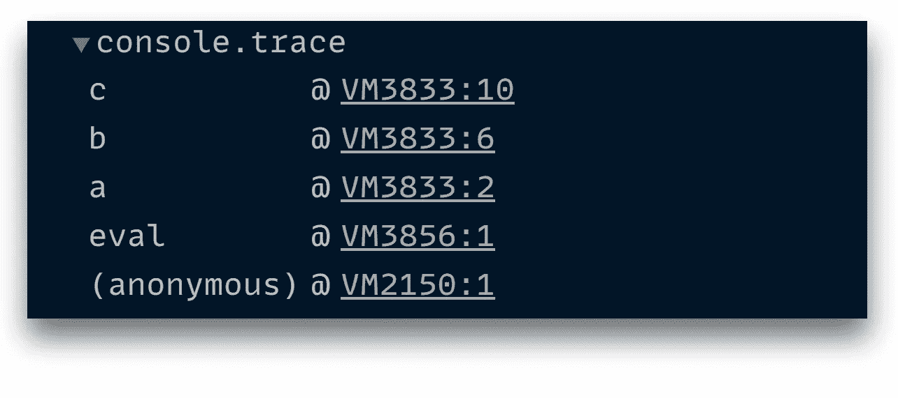

简单地说，`console.trace()`将把调用`console.trace()` 时存在的调用栈记录到控制台。

`console.trace()`非常有用，尤其是在一个大型代码库中，我们已经确定代码在某个地方有 bug，但是我们不确定具体在哪里。

# 你知道这是你第一次这么做吗？

代码执行的大部分时间都花在循环中。理解 JavaScript 中的循环对性能的影响对于成为一名优秀的开发人员至关重要。

使用`console.time()`可以了解某个代码段需要多长时间。

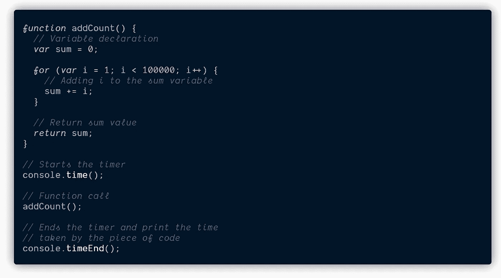

> “时间是被创造的东西。说“我没有时间”，就像说“我不想”。"
> 
> ― **老子**

当我在一篇文章中介绍循环的[性能时，我发现](/the-secrets-surrounding-for-loops-in-javascript-3db58541caa9?source=friends_link&sk=665c05b53d48c8d6316f4fc3df107be1) [**性能接口**](https://developer.mozilla.org/en-US/docs/Web/API/Performance/now) 给出了更为[准确的结果](https://developer.mozilla.org/en-US/docs/Web/API/Performance/now)。

学会将控制台对象视为一个多方面的工具。每种工具都是为特定目的而精确设计的。选择正确的工具将减少完成工作所需的工作量。希望你好好选择。

# 进一步阅读

这并不是一切皆有可能——要涵盖的内容实在太多了。在某些情况下，每个浏览器都有其可以利用的功能或实用程序。我们只探索了几个。我邀请你更深入地挖掘，发现更多的方法来利用浏览器开发工具为您的编码项目服务。

*   [MDN:控制台文档](https://developer.mozilla.org/en-US/docs/Web/API/console)
*   [谷歌开发者:控制台 API 参考](https://developers.google.com/chrome-developer-tools/docs/console-api)
*   [谷歌开发人员:开发工具提示和技巧](https://developers.google.com/chrome-developer-tools/docs/tips-and-tricks)

# 摘要

*   给出更好的数据可视化。
*   除了 `**console.log( )**` 我们还可以有`**console.info( )**` **|**| `**console.debug( )**` **|** `**console.warn( )**` **|** `**console.error( )**`
*   您可以插入一个`%c`变量并使用各种 CSS 样式选项。
*   我们在 JavaScript 中有占位符，如`%s` `%d` `%i` `%f` `%o`，可以决定输出的**格式**。
*   `console.dir()`打印指定对象的 JSON 表示。
*   `console.group()`可用于控制台中 g *rouping 消息*。
*   `console.count()`记录调用`count()`的次数。该函数采用可选参数`label`。
*   `console.trace()`方法显示一个轨迹，显示代码如何在某一点结束。
*   `console.assert()`当语句为假时打印该语句。
*   `console.time()`可用于跟踪 JavaScript 执行所花费的微时间。
*   学会将控制台对象视为一个多方面的工具，使用正确的工具进行工作。

# 感谢信

我想利用这最后的机会说谢谢。

感谢各位光临！如果没有像你这样的 T2 人的追随和信仰飞跃，阅读我的帖子，我将无法做好自己的工作。

我希望你能和我一起在我未来的博客 上分享 [**中的**](https://polymathsomnath.medium.com/) ，并一直关注下去，因为我觉得我们这里有很多很棒的东西。我希望我能帮助你在未来的许多年里继续你的事业！

下次见。拜拜。

*更多内容参见* [*浅显英语。io*T18](http://plainenglish.io/)