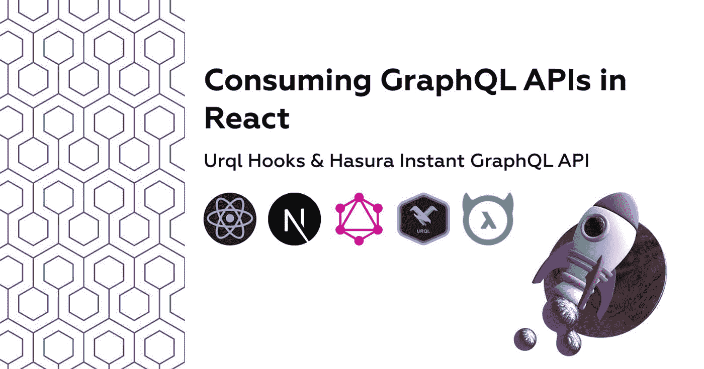

# 在 React 中使用 GraphQL APIs

> 原文：<https://javascript.plainenglish.io/consuming-graphql-apis-in-react-4d195ccdab09?source=collection_archive---------13----------------------->

## Urql Hooks & Hasura 即时云 GraphQL API

由于显而易见的原因，React 是最受欢迎的前端框架(库),它有一个很棒的社区，有许多现成的包来解决每个任务，并允许快速组件驱动的开发，而没有复制粘贴代码的麻烦。

React 没有为 API 请求提供内部解决方案，除了使用现在通过钩子覆盖的通用组件生命周期方法之外，也没有特定的准则可以遵循。这意味着由开发人员来决定消费 API 的最佳方式，无论是 [REST](https://restfulapi.net/) 、 [GraphQL](https://graphql.org/) 还是某些可疑的[修复 API](https://www.fxcm.com/markets/insights/fix-api/) 。

我们将使用 [Hasura](https://hasura.io/) 构建一个快速可靠的 GraphQL API，在最流行的前端库 React 中使用它，并展示那里最可爱的动物**狗**。

# 1.为什么选择 GraphQL

基本上很快。极快的开发速度，开箱即用的 API 文档和选项，可以准确地请求您需要的资源量，或者将多个请求批处理为一个请求。它最初是由脸书开发的，然后作为一个社区项目继续进行，因此它非常适合用于另一个脸书开发的技术，如 React。

# 2.什么是哈苏拉

托管 GraphQL API 的云服务，提供速度，增加 API 开发，并具有内置的身份验证和缓存。它有一个非常友好的图形用户界面，也有一个免费的计划来测试它的能力。

像其他云提供商一样，它要求我们选择定价方案、服务器位置和项目名称，然后我们可以启动控制台。

为了非常快，我们将通过 [Heroku](https://dashboard.heroku.com/) 配置我们的数据库，只需遵循步骤，我们就有了一个免费的操场来构建我们的 API。

选择创建的数据库，并添加一个包含 3 列(id、名称、图像)的动物表。

我们通过 GUI 插入一行，然后在我们的项目中进行测试，我们准备编写一些代码🤓。

如果我们想处理查询或变异，我们总是可以使用 [GraphiQL 接口](https://hasura.io/learn/graphql/hasura/data-modelling/2-try-user-queries/)，它为我们可以进行的查询或变异提供即时文档。

# 3. [Urql](https://formidable.com/open-source/urql/)

一个[强大的](https://formidable.com/)(请原谅双关语)开源轻量级库，用于在 React、Svelte、Vue 甚至普通 JavaScript 项目中使用 GraphQL APIs。尽管没有人阻止我们使用像 [axios](https://github.com/axios/axios) 、 [react-query](https://react-query.tanstack.com/) 甚至是基于浏览器的 fetch API(或者其他 GraphQL 解决方案，如 [Apollo](https://www.apollographql.com/) 或 [Relay](https://relay.dev/) ，但是在这里查看[以获得更多信息](https://formidable.com/open-source/urql/docs/comparison/)，我相信 urql 将提高开发速度并隐藏解析的复杂性，使查询&变异。

为了开始使用 urql & graphql，我们在之前创建的 [NextJS 项目](https://nextjs.org/)上运行:

将应用程序根组件包装在 urql 提供程序中，并根据需要设置选项。

我们现在可以使用 urql 中的 useQuery 和 useMutations 挂钩来快速访问 GraphQL Hasura 托管的 API，如下所示:

在添加了一些用于最小样式的 TailwindCSS 类后，我们得到了

快乐的毛茸茸的节日🐶！

React 中使用 Urql 进行 GraphQL 查询和变异的简单、完整的工作示例。

可以为 urql 配置更多选项，如持久性、SSR、调试、验证和测试，但这不是这个简单示例的目的，这个示例介绍了如何在 React 中快速使用 API。

如果你想检查这个演示项目(替换 api_url & secret in _app.jsx)，这里是 [CodeSandbox](https://codesandbox.io/s/react-graphql-urql-33u2f?file=/tailwind.config.js) 。

我希望你喜欢这篇在 React 中使用 GraphQL 的简短教程，并希望你留下评论！

*更多内容请看*[***plain English . io***](http://plainenglish.io)