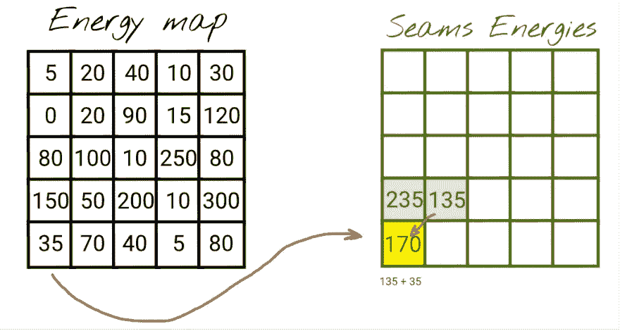

# JavaScript 中内容感知的图像大小调整

> 原文：<https://javascript.plainenglish.io/content-aware-image-resizing-in-javascript-89144c1b5a5c?source=collection_archive---------10----------------------->


Background image by [Ian Dooley](https://unsplash.com/@sadswim?utm_source=unsplash&utm_medium=referral&utm_content=creditCopyText)

所以，通过这篇文章，我想做三件事:

1.  为你提供一个交互式的**内容感知的大小调整器**，这样你就可以调整你自己的图片大小
2.  解释**缝雕算法**背后的想法
3.  解释实现算法的**动态编程方法**(我们将使用 TypeScript)

# 内容感知的图像大小调整

*内容感知型图像尺寸调整*可能适用于改变图像比例(即在保持高度的同时减小宽度)以及不希望丢失图像的某些部分的情况。在这种情况下，进行简单的图像缩放会扭曲其中的对象。为了在改变图像比例时保持对象的比例，我们可以使用由 *Shai Avidan* 和 *Ariel Shamir* 引入的[接缝雕刻算法](https://perso.crans.org/frenoy/matlab2012/seamcarving.pdf)。

下面的例子显示了如何使用*内容感知调整*(左图)和*直接缩放*(右图)将原始图像宽度减少 50%。在这种特殊情况下，左边的图像看起来更自然，因为气球的比例得到了保留。


线缝雕刻算法的思路是找到对图像内容贡献最低的*线缝*(连续的像素序列)然后*雕刻*(去除)。这个过程反复重复，直到我们得到所需的图像宽度或高度。在下面的示例中，您可能会看到热气球像素比天空像素对图像内容的贡献更大。因此，天空像素首先被移除。


寻找能量最低的接缝是一项计算量很大的任务(尤其是对于大图像)。为了使 seam 搜索更快，可以应用*动态编程*方法(我们将在下面详细介绍实现细节)。

# 对象移除

每个像素的重要性(所谓的像素能量)是基于两个相邻像素之间的颜色(`R`、`G`、`B`、`A`)差异来计算的。现在，如果我们人为地将像素能量设置为非常低的水平(例如，通过在它们上面画一个遮罩)，线缝雕刻算法将免费为我们执行一个**对象移除**。


# JS 图像雕刻器演示

我已经创建了 [JS IMAGE CARVER](https://trekhleb.dev/js-image-carver/) web 应用程序(也是[在 GitHub](https://github.com/trekhleb/js-image-carver) 上开源的)，你可以用它来调整你的自定义图像的大小。

# 更多示例

以下是该算法如何处理更复杂背景的更多示例。

背景上的山脉被平滑地缩小，没有可见的接缝。


海浪也是如此。该算法保留了波浪结构，而不会扭曲冲浪者。


我们需要记住，Seam Carving 算法不是一个银弹，它可能无法调整大多数像素是边缘的图像的大小(看起来对算法很重要)。在这种情况下，它甚至开始扭曲图像的重要部分。在下面的例子中，内容感知的图像大小调整看起来非常类似于简单的缩放，因为对于该算法来说，所有像素看起来都很重要，并且它很难区分梵高的脸和背景。


# 接缝雕刻算法是如何工作的

假设我们有一张`1000 x 500 px`图片，我们想将它的大小更改为`500 x 500 px`以使其呈方形(假设方形比例更适合 Instagram 提要)。在这种情况下，我们可能希望为调整大小过程设置几个**要求:**

*   *保留图像的重要部分*(即，如果在调整大小之前有 5 棵树，我们希望在调整大小之后也有 5 棵树)。
*   *保留图像重要部分的比例*(即圆形车轮不应挤压到椭圆形车轮)

为了避免改变图像的重要部分，我们可以找到**连续的像素序列(接缝)**，其从上到下并且对图像的内容具有最低的贡献*(避免重要部分)，然后移除它。接缝移除会将图像缩小 1 个像素。然后，我们将重复这一步，直到图像将获得所需的宽度。*

问题是如何定义*像素*的重要性及其对内容的贡献(在最初的论文中作者使用了术语**像素**的能量)。其中一种方法是将所有形成边缘的像素都视为重要像素。如果像素是边缘的一部分，则其颜色在相邻像素(左像素和右像素)之间的差异将大于不属于边缘的像素。


假设一个像素的颜色由 *4 个*数字(`R` -红色、`G` -绿色、`B` -蓝色、`A`-α)表示，我们可以使用下面的公式来计算色差(像素能量):


其中:

*   `mEnergy` - *中间*像素的能量*(重要性)*(`[0..626]`如果四舍五入)
*   `lR` - *红色*通道值为*左侧*像素(`[0..255]`)
*   `mR` - *红色*通道值为*中间*像素(`[0..255]`)
*   `rR` - *红色*通道值为*右侧*像素(`[0..255]`)
*   `lG` - *绿色*通道值为*左侧*像素(`[0..255]`)
*   诸如此类…

在上面的公式中，我们忽略了 alpha(透明)通道，现在，假设图像中没有透明像素。稍后，我们将使用 alpha 通道进行遮罩和物体移除。


现在，既然我们知道如何找到一个像素的能量，我们可以计算所谓的**能量图**，它将包含图像的每个像素的能量。在每一个调整大小的步骤中，能量图应该被重新计算(至少部分地，下面会有更多关于它的内容),并且将具有与图像相同的大小。

例如，在第一个调整大小的步骤中，我们将有一个`1000 x 500`图像和一个`1000 x 500`能量图。在第二个调整大小的步骤中，我们将从图像中移除接缝，并基于新的收缩图像重新计算能量图。因此，我们将得到一个`999 x 500`图像和一个`999 x 500`能量图。

像素的能量越高，它就越有可能是边缘的一部分，这对图像内容很重要，我们就越不需要去除它。

为了可视化能量图，我们可以将较亮的颜色分配给具有较高能量的像素，将较暗的颜色分配给具有较低能量的像素。这是一个模拟的例子，展示了能量图中随机部分的样子。你可以看到代表边缘的亮线，我们希望在调整尺寸时保留它。


这是你在上面看到的演示图像的能量图的真实例子(用热气球)。


你可以玩你的自定义图像，看看能量图在帖子的[互动版本中会是什么样子。](https://trekhleb.dev/blog/2021/content-aware-image-resizing-in-javascript/)

我们可以使用能量图来寻找具有最低能量的接缝(一个接一个),并通过这样做来决定最终应该删除哪些像素。


找到具有最低能量的接缝不是一项简单的任务，需要在做出决定之前探索许多可能的像素组合。我们将应用动态规划方法来加速它。

在下面的例子中，你可以看到能量图中第一个能量最低的接缝。


在上面的例子中，我们减小了图像的宽度。可以采用类似的方法来降低图像高度。不过，我们需要“轮换”这种方法:

*   开始使用*顶部*和*底部*的像素邻居(而不是*左侧*和*右侧*的)来计算像素能量
*   当搜索一个矿层时，我们需要从左边的*移动到右边的*而不是从上面的*移动到底部的***

# 在 TypeScript 中实现

> *你可以在*[*js-image-carver*](https://github.com/trekhleb/js-image-carver)*库中找到源代码和下面提到的函数。*

为了实现该算法，我们将使用 TypeScript。如果你想要一个 JavaScript 版本，你可以忽略(移除)类型定义和它们的用法。

出于简单的原因，让我们只为图像*宽度*的减少实现接缝雕刻算法。

# 内容感知宽度调整(入口函数)

首先，让我们定义一些我们将在实现算法时使用的常见类型。

```
// Type that describes the image size (width and height).
type ImageSize = { w: number, h: number };// The coordinate of the pixel.
type Coordinate = { x: number, y: number };// The seam is a sequence of pixels (coordinates).
type Seam = Coordinate[];// Energy map is a 2D array that has the same width and height
// as the image the map is being calculated for.
type EnergyMap = number[][];// Type that describes the image pixel's RGBA color.
type Color = [
  r: number, // Red
  g: number, // Green
  b: number, // Blue
  a: number, // Alpha (transparency)
] | Uint8ClampedArray;
```

在高层次上，该算法包括以下步骤:

1.  计算当前版本图像的**能量图**。
2.  根据能量图找到能量最低的**接缝**(这是我们要应用动态规划的地方)。
3.  **从图像中删除能量最低的焊缝**。
4.  **重复**直到图像宽度减小到所需值。

```
type ResizeImageWidthArgs = {
  img: ImageData, // Image data we want to resize.
  toWidth: number, // Final image width we want the image to shrink to.
};type ResizeImageWidthResult = {
  img: ImageData, // Resized image data.
  size: ImageSize, // Resized image size (w x h).
};// Performs the content-aware image width resizing using the seam carving method.
export const resizeImageWidth = (
  { img, toWidth }: ResizeImageWidthArgs,
): ResizeImageWidthResult => {
  // For performance reasons we want to avoid changing the img data array size.
  // Instead we'll just keep the record of the resized image width and height separately.
  const size: ImageSize = { w: img.width, h: img.height }; // Calculating the number of pixels to remove.
  const pxToRemove = img.width - toWidth;
  if (pxToRemove < 0) {
    throw new Error('Upsizing is not supported for now');
  } let energyMap: EnergyMap | null = null;
  let seam: Seam | null = null; // Removing the lowest energy seams one by one.
  for (let i = 0; i < pxToRemove; i += 1) {
    // 1\. Calculate the energy map for the current version of the image.
    energyMap = calculateEnergyMap(img, size); // 2\. Find the seam with the lowest energy based on the energy map.
    seam = findLowEnergySeam(energyMap, size); // 3\. Delete the seam with the lowest energy seam from the image.
    deleteSeam(img, seam, size); // Reduce the image width, and continue iterations.
    size.w -= 1;
  } // Returning the resized image and its final size.
  // The img is actually a reference to the ImageData, so technically
  // the caller of the function already has this pointer. But let's
  // still return it for better code readability.
  return { img, size };
};
```

需要调整大小的图像以 [ImageData](https://developer.mozilla.org/en-US/docs/Web/API/ImageData) 格式传递给函数。您可以在画布上绘制图像，然后从画布中提取图像数据，如下所示:

```
const ctx = canvas.getContext('2d');
const imgData = ctx.getImageData(0, 0, imgWidth, imgHeight);
```

> *用 JavaScript 上传和绘制图像的方法超出了本文的范围，但是您可以在*[*js-image-carver*](https://github.com/trekhleb/js-image-carver)*repo 中找到完整的源代码，了解如何使用 React 来上传和绘制图像。*

让我们逐一分解每个步骤，实现`calculateEnergyMap()`、`findLowEnergySeam()`和`deleteSeam()`功能。

# 计算像素的能量

这里我们应用上面描述的色差公式。对于左边界和右边界(当没有左邻居或右邻居时)，我们忽略邻居，并且在能量计算期间不考虑它们。

```
// Calculates the energy of a pixel.
const getPixelEnergy = (left: Color | null, middle: Color, right: Color | null): number => {
  // Middle pixel is the pixel we're calculating the energy for.
  const [mR, mG, mB] = middle; // Energy from the left pixel (if it exists).
  let lEnergy = 0;
  if (left) {
    const [lR, lG, lB] = left;
    lEnergy = (lR - mR) ** 2 + (lG - mG) ** 2 + (lB - mB) ** 2;
  } // Energy from the right pixel (if it exists).
  let rEnergy = 0;
  if (right) {
    const [rR, rG, rB] = right;
    rEnergy = (rR - mR) ** 2 + (rG - mG) ** 2 + (rB - mB) ** 2;
  } // Resulting pixel energy.
  return Math.sqrt(lEnergy + rEnergy);
};
```

# 计算能量图

我们正在处理的图像具有 [ImageData](https://developer.mozilla.org/en-US/docs/Web/API/ImageData) 格式。这意味着所有的像素(及其颜色)都存储在一个平面(*1D*)[uint 8 clampedarray](https://developer.mozilla.org/en-US/docs/Web/JavaScript/Reference/Global_Objects/Uint8ClampedArray)数组中。出于可读性的目的，让我们引入两个帮助函数，它们将允许我们像使用 *2D* 矩阵一样使用 Uint8ClampedArray 数组。

```
// Helper function that returns the color of the pixel.
const getPixel = (img: ImageData, { x, y }: Coordinate): Color => {
  // The ImageData data array is a flat 1D array.
  // Thus we need to convert x and y coordinates to the linear index.
  const i = y * img.width + x;
  const cellsPerColor = 4; // RGBA
  // For better efficiency, instead of creating a new sub-array we return
  // a pointer to the part of the ImageData array.
  return img.data.subarray(i * cellsPerColor, i * cellsPerColor + cellsPerColor);
};// Helper function that sets the color of the pixel.
const setPixel = (img: ImageData, { x, y }: Coordinate, color: Color): void => {
  // The ImageData data array is a flat 1D array.
  // Thus we need to convert x and y coordinates to the linear index.
  const i = y * img.width + x;
  const cellsPerColor = 4; // RGBA
  img.data.set(color, i * cellsPerColor);
};
```

为了计算能量图，我们遍历每个图像像素，并对其调用前面描述的`getPixelEnergy()`函数。

```
// Helper function that creates a matrix (2D array) of specific
// size (w x h) and fills it with specified value.
const matrix = <T>(w: number, h: number, filler: T): T[][] => {
  return new Array(h)
    .fill(null)
    .map(() => {
      return new Array(w).fill(filler);
    });
};// Calculates the energy of each pixel of the image.
const calculateEnergyMap = (img: ImageData, { w, h }: ImageSize): EnergyMap => {
  // Create an empty energy map where each pixel has infinitely high energy.
  // We will update the energy of each pixel.
  const energyMap: number[][] = matrix<number>(w, h, Infinity);
  for (let y = 0; y < h; y += 1) {
    for (let x = 0; x < w; x += 1) {
      // Left pixel might not exist if we're on the very left edge of the image.
      const left = (x - 1) >= 0 ? getPixel(img, { x: x - 1, y }) : null;
      // The color of the middle pixel that we're calculating the energy for.
      const middle = getPixel(img, { x, y });
      // Right pixel might not exist if we're on the very right edge of the image.
      const right = (x + 1) < w ? getPixel(img, { x: x + 1, y }) : null;
      energyMap[y][x] = getPixelEnergy(left, middle, right);
    }
  }
  return energyMap;
};
```

> *能量图将在每次尺寸调整迭代中重新计算。这意味着，如果我们需要将图像缩小 500 个像素(这不是最佳值),就要重新计算 500 次。为了在第二、第三以及更进一步的步骤中加速能量图的计算，我们可以仅对那些位于将要被去除的接缝周围的像素重新计算能量。为了简单起见，这里省略了这个优化，但是你可以在*[*js-image-carver*](https://github.com/trekhleb/js-image-carver)*repo 中找到示例源代码。*

# 寻找能量最低的矿层(动态规划方法)

> *我之前在* [*动态编程 vs 分治*](https://trekhleb.dev/blog/2018/dynamic-programming-vs-divide-and-conquer/) *文章中描述过一些动态编程的基础知识。有一个基于最小编辑距离问题的 DP 例子。你可能想检查一下，以获得更多的背景。*

我们现在需要解决的问题是在能量图上找到从上到下的路径(接缝),并且具有最小的像素能量和。

## 天真的方法

天真的方法是一个接一个地检查所有可能的路径。


从上到下，对于每个像素，我们有 3 个选项(↙︎向左下走，向下走，↘︎向右下走)。这给了我们`O(w * 3^h)`或者简单的`O(3^h)`的时间复杂度，其中`w`和`h`是图像的宽度和高度。这种方法看起来很慢。

## 贪婪的方法

我们也可以尝试选择下一个像素作为能量最低的像素，希望得到的接缝能量是最小的。


这种方法给出的不是最坏的解决方案，但它不能保证我们会找到最佳的解决方案。在上面的图片中，你可以看到贪婪的方法最初是如何选择了`5`而不是`10`，并且错过了最佳像素链。

这种方法的优点是速度快，时间复杂度为`O(w + h)`，其中`w`和`h`是图像的宽度和高度。在这种情况下，速度的代价是调整大小的低质量。我们需要在第一行找到一个最小值(遍历`w`单元格)，然后我们只探索每行的 3 个相邻像素(遍历`h`行)。

## 动态规划方法

你可能已经注意到，在简单的方法中，我们在计算结果接缝的能量时，一遍又一遍地累加相同的像素能量。


在上面的例子中，你可以看到，对于前两个接缝，我们重复使用了较短接缝的能量(其能量为`235`)。我们不是只做一次运算`235 + 70`来计算第二条缝的能量，而是做四次运算`(5 + 0 + 80 + 150) + 70`。

> *我们正在重新使用前一个接缝的能量来计算当前接缝的能量，这一事实可以递归地应用于所有较短的接缝，直到最上面的第一行接缝。当我们有这种重叠的子问题时，* [*这是一个迹象*](https://trekhleb.dev/blog/2018/dynamic-programming-vs-divide-and-conquer/) *一般问题*可能*被动态规划方法优化。*

因此，我们可以**将特定像素处的当前接缝**的能量保存在附加的`seamsEnergies`表中，以使其可重新用于更快地计算下一个接缝(该`seamsEnergies`表将具有与能量图和图像本身相同的大小)。

我们还要记住，对于图像上的一个特定像素(即左下角的像素)，我们可能有几个先前接缝能量的*值。*


因为我们正在寻找具有最低合成能量的接缝，所以选择具有最低合成能量的前一个接缝也是有意义的。



一般来说，我们有三种可能的先前的似乎可供选择:


你可以这样想:

*   单元`[1][x]`:包含从行`[0][?]`的某处开始到单元`[1][x]`结束的接缝的最低可能能量
*   **当前单元** `[2][3]`:包含从行`[0][?]`的某处开始到单元`[2][3]`结束的接缝的最低可能能量。为了计算它，我们需要将当前像素`[2][3]`(来自能量图)的能量与`min(seam_energy_1_2, seam_energy_1_3, seam_energy_1_4)`相加

如果我们完全填满`seamsEnergies`表，那么最低行中的最小数字将是最低的可能焊缝能量。

让我们尝试填充这个表的几个单元格，看看它是如何工作的。


填写完`seamsEnergies`表格后，我们可以看到最低能量像素的能量为`50`。为了方便起见，在每个像素的`seamsEnergies`生成期间，我们不仅可以保存接缝的能量，还可以保存先前最低能量接缝的坐标。这将使我们有可能轻松地从底部到顶部重建接缝路径。

DP 方法的时间复杂度将是`O(w * h)`，其中`w`和`h`是图像的宽度和高度。我们需要计算图像中每个像素的能量。

下面是如何实现这一逻辑的示例:

```
// The metadata for the pixels in the seam.
type SeamPixelMeta = {
  energy: number, // The energy of the pixel.
  coordinate: Coordinate, // The coordinate of the pixel.
  previous: Coordinate | null, // The previous pixel in a seam.
};// Finds the seam (the sequence of pixels from top to bottom) that has the
// lowest resulting energy using the Dynamic Programming approach.
const findLowEnergySeam = (energyMap: EnergyMap, { w, h }: ImageSize): Seam => {
  // The 2D array of the size of w and h, where each pixel contains the
  // seam metadata (pixel energy, pixel coordinate and previous pixel from
  // the lowest energy seam at this point).
  const seamsEnergies: (SeamPixelMeta | null)[][] = matrix<SeamPixelMeta | null>(w, h, null); // Populate the first row of the map by just copying the energies
  // from the energy map.
  for (let x = 0; x < w; x += 1) {
    const y = 0;
    seamsEnergies[y][x] = {
      energy: energyMap[y][x],
      coordinate: { x, y },
      previous: null,
    };
  } // Populate the rest of the rows.
  for (let y = 1; y < h; y += 1) {
    for (let x = 0; x < w; x += 1) {
      // Find the top adjacent cell with minimum energy.
      // This cell would be the tail of a seam with lowest energy at this point.
      // It doesn't mean that this seam (path) has lowest energy globally.
      // Instead, it means that we found a path with the lowest energy that may lead
      // us to the current pixel with the coordinates x and y.
      let minPrevEnergy = Infinity;
      let minPrevX: number = x;
      for (let i = (x - 1); i <= (x + 1); i += 1) {
        if (i >= 0 && i < w && seamsEnergies[y - 1][i].energy < minPrevEnergy) {
          minPrevEnergy = seamsEnergies[y - 1][i].energy;
          minPrevX = i;
        }
      } // Update the current cell.
      seamsEnergies[y][x] = {
        energy: minPrevEnergy + energyMap[y][x],
        coordinate: { x, y },
        previous: { x: minPrevX, y: y - 1 },
      };
    }
  } // Find where the minimum energy seam ends.
  // We need to find the tail of the lowest energy seam to start
  // traversing it from its tail to its head (from the bottom to the top).
  let lastMinCoordinate: Coordinate | null = null;
  let minSeamEnergy = Infinity;
  for (let x = 0; x < w; x += 1) {
    const y = h - 1;
    if (seamsEnergies[y][x].energy < minSeamEnergy) {
      minSeamEnergy = seamsEnergies[y][x].energy;
      lastMinCoordinate = { x, y };
    }
  } // Find the lowest energy energy seam.
  // Once we know where the tail is we may traverse and assemble the lowest
  // energy seam based on the "previous" value of the seam pixel metadata.
  const seam: Seam = [];
  if (!lastMinCoordinate) {
    return seam;
  } const { x: lastMinX, y: lastMinY } = lastMinCoordinate; // Adding new pixel to the seam path one by one until we reach the top.
  let currentSeam = seamsEnergies[lastMinY][lastMinX];
  while (currentSeam) {
    seam.push(currentSeam.coordinate);
    const prevMinCoordinates = currentSeam.previous;
    if (!prevMinCoordinates) {
      currentSeam = null;
    } else {
      const { x: prevMinX, y: prevMinY } = prevMinCoordinates;
      currentSeam = seamsEnergies[prevMinY][prevMinX];
    }
  } return seam;
};
```

# 用最低能量移除接缝

一旦我们找到了最低能量的接缝，我们需要从图像中移除(雕刻)形成它的像素。通过将接缝右侧的像素向左移动`1px`来进行移除。出于性能原因，我们实际上并不删除最后的列。相反，呈现组件将忽略超出调整后的图像宽度的图像部分。


```
// Deletes the seam from the image data.
// We delete the pixel in each row and then shift the rest of the row pixels to the left.
const deleteSeam = (img: ImageData, seam: Seam, { w }: ImageSize): void => {
  seam.forEach(({ x: seamX, y: seamY }: Coordinate) => {
    for (let x = seamX; x < (w - 1); x += 1) {
      const nextPixel = getPixel(img, { x: x + 1, y: seamY });
      setPixel(img, { x, y: seamY }, nextPixel);
    }
  });
};
```

# 对象移除

接缝雕刻算法首先尝试去除由低能量像素组成的接缝。我们可以利用这一事实，通过手动将低能量分配给一些像素(即，通过在图像上绘制并遮蔽图像的一些区域)，我们可以让 Seam Carving 算法免费为我们进行*对象移除*。

目前，在`getPixelEnergy()`函数中，我们只使用了`R`、`G`、`B`颜色通道来计算像素的能量。但是还有颜色的`A` (alpha，透明度)参数我们还没有用到。我们可以使用透明通道告诉算法透明像素是我们想要移除的像素。你可以检查考虑到透明度的能量函数的[源代码。](https://github.com/trekhleb/js-image-carver/blob/main/src/utils/contentAwareResizer.ts#L54)

以下是该算法如何用于对象移除。


# 问题和下一步

当然，JS IMAGE CARVER web 应用程序还远远不是一个生产就绪的 resizer。其主要目的是以交互方式试验接缝雕刻算法。所以未来的计划是继续实验。

[原始论文](https://perso.crans.org/frenoy/matlab2012/seamcarving.pdf)描述了接缝雕刻算法如何不仅用于图像的缩小，还用于图像**的放大。反过来，在移除对象后，放大可以用于将图像放大回其原始宽度。**

另一个有趣的实验领域可能是让算法在实时环境中工作。

这些是未来的计划，但是现在，我希望缩小图片的例子对你来说是有趣和有用的。我还希望您已经有了使用动态编程来实现它的想法。

那么，祝你自己的实验好运！

*这篇文章有一个* [*的互动版本*](https://trekhleb.dev/blog/2021/content-aware-image-resizing-in-javascript/) *，你可以上传和调整你的自定义图片，并有一个代码语法高亮。*

# TL；速度三角形定位法(dead reckoning)

已经有很多关于 *Seam Carving 算法*的优秀文章，但是我无法抗拒自己探索这个优雅、强大而又简单的*算法的诱惑，并写下我个人的使用体验。引起我注意的另一点(作为一个 [javascript 算法](https://github.com/trekhleb/javascript-algorithms) repo 的创建者)是这样一个事实，即*动态编程(DP)* 方法可以顺利地应用于解决这个问题。如果你像我一样，还在“学习算法”的旅程中，这个算法解决方案可能会丰富你的个人 DP 库。*

*更多内容请看*[***plain English . io***](http://plainenglish.io)