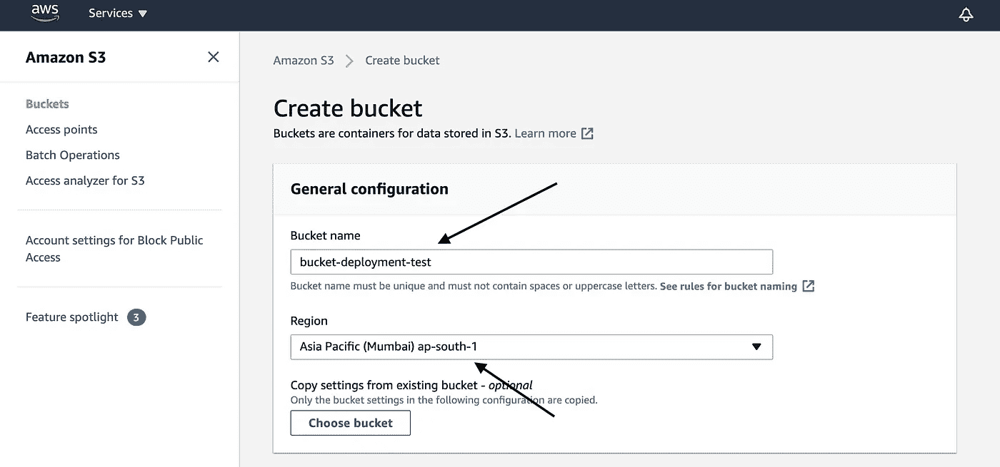
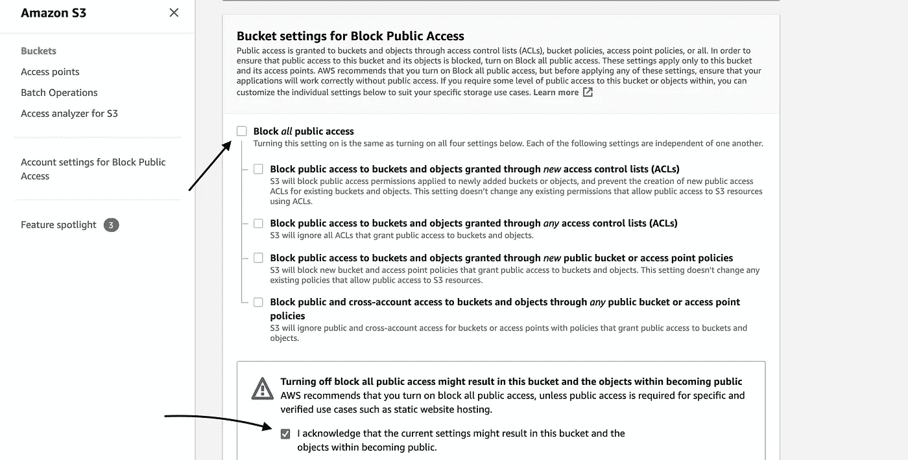
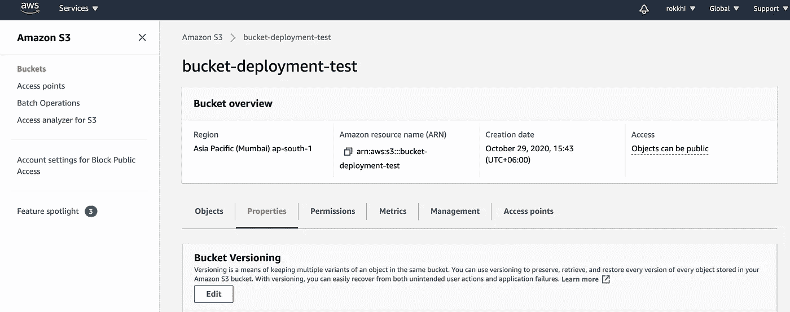
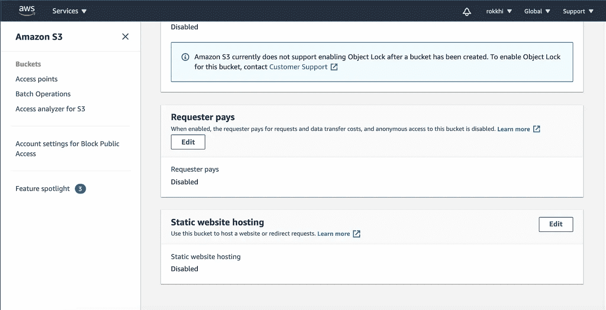
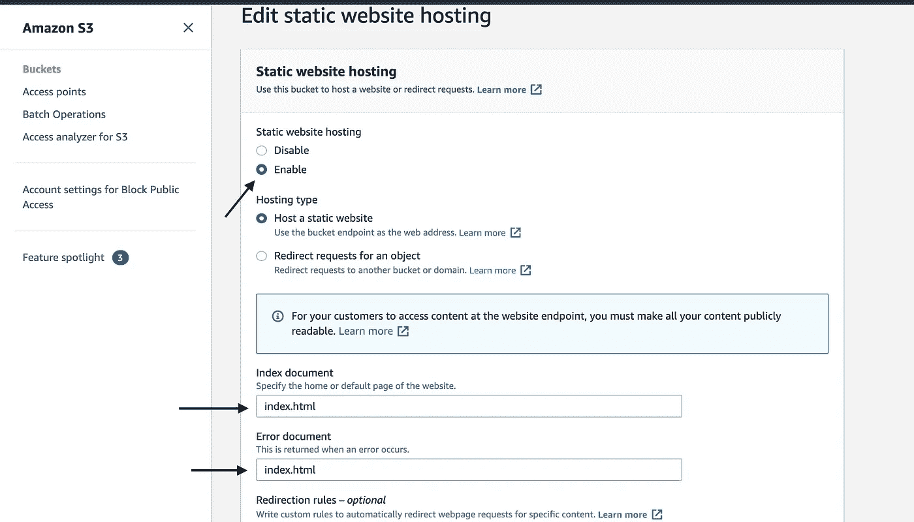
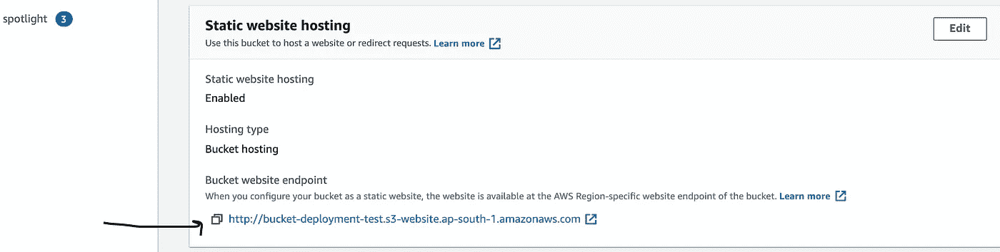
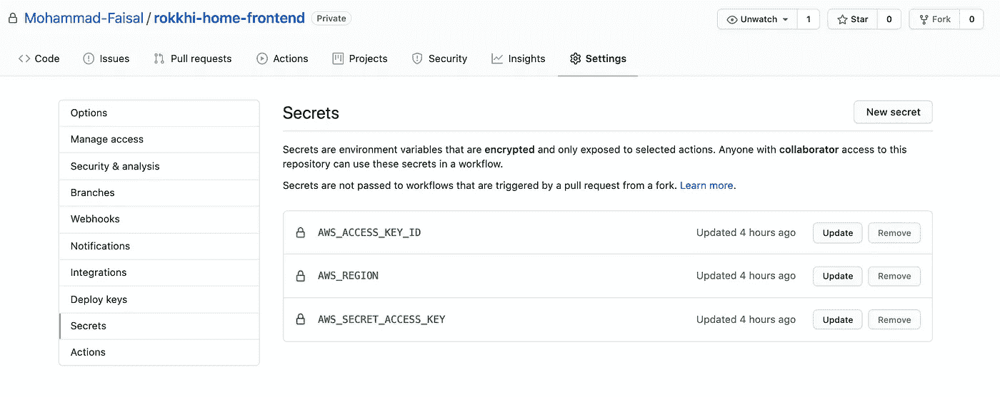
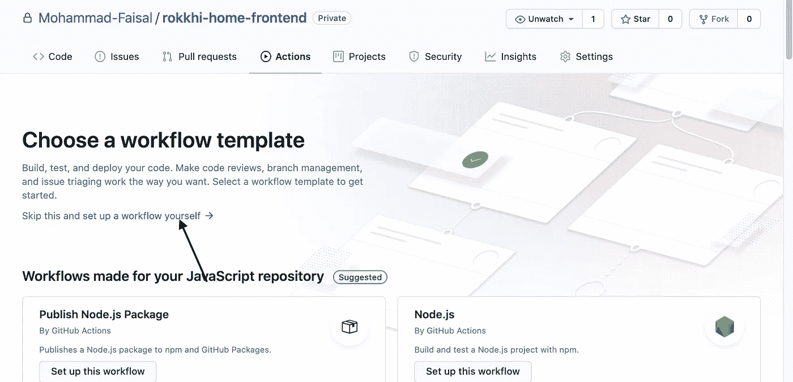
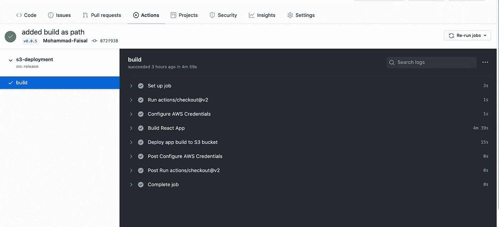

# React 应用的持续部署渠道

> 原文：<https://javascript.plainenglish.io/continuous-deployment-pipeline-for-react-apps-886f887996f8?source=collection_archive---------6----------------------->

## 使用 Github 操作和 AWS S3

Photo by [Fernando Hernandez](https://unsplash.com/@_ferh97?utm_source=unsplash&utm_medium=referral&utm_content=creditCopyText) on [Unsplash](https://unsplash.com/s/photos/programming?utm_source=unsplash&utm_medium=referral&utm_content=creditCopyText)

对于托管 React 应用程序，有许多好的选择。AWS s3 就是其中之一，非常便宜可靠。

部署可能是您日常工作中非常无聊的一部分。我们应该尽可能自动化。

今天，我们将了解如何使用 Github actions 创建一个持续的部署管道，该管道将自动构建我们的网站并将其部署到 aws s3。

## 先决条件

跟我来，我想你已经知道了

*   GitHub 账户
*   AWS 帐户
*   正在运行的反应堆项目

让我们开始吧。。。

# 第一步。创建 S3 存储桶

1.  登录 AWS 控制台
2.  从您的服务中搜索 S3，然后点击**创建存储桶**
3.  给**起一个合适的名字**，选择**区域**。记住您所在地区的值**(对我来说是**AP-south-1)

aws s3 console

*   向下滚动并取消选中**阻止公共访问。**如果您将 S3 用于其他目的，建议不要这样做。但是如果你想托管你的静态网站，这是必要的。

aws s3 console

*   保持其他选项不变，点击**创建存储桶。**

# 第二步。编辑属性以启用静态宿主

*   创建存储桶后，您可以在列表中看到它。单击存储桶名称并打开存储桶概述。选择属性选项卡

向下滚动找到静态网站托管的选项。点击**编辑**

*   **启用**托管选项。并选择**托管一个静态网站**
*   将 index.html 作为索引文档。重要的是要注意错误文件，你也应该给 index.html，因为当我们在构建文件夹中构建 react 应用程序时，只有一个 index.html 文件。

static hosting properties

*   **保存修改。然后复制给你的网址。它将用于访问您的网站。**

# 第三步。允许访问网站的权限

现在打开属性选项卡旁边的**权限**。单击编辑存储桶策略并添加以下代码

s3 permissions

> **需要注意的重要一点:**用你的桶名替换`<bucket-name>`。

*   点击保存，你就可以开始了。

现在您可以上传您的静态网站(在我们运行命令 **npm run build 之后，对 build 文件夹中的内容做出反应)。如果你去你的静态主机的网址，你可以看到你的网站。**

但是我们需要自动化。我们不想每次需要发布我们的网站时都要传输构建文件夹的内容。

为此，我们将使用 GitHub 操作。

# 第四步。将 AWS 秘密添加到 Github

*   现在我们需要从 aws 控制台获取一些秘密，让 GitHub 代表我们进行身份验证。从 AWS 控制台转到 **IAM >用户>安全凭证>创建访问密钥**。
*   会给你两个值**AWS _ ACCESS _ KEY**AWS _ SECRET _ ACCESS _ KEY。将这两个值与您的存储桶的区域名称相加。

GitHub repository

*   将这些值添加到您的存储库设置->机密选项。

# **第五步。设置动作**

*   在存储库中设置新操作。我们将从头开始创建一个工作流。
*   它将在`.github/workflows/main.yml`中创建一个新文件。您可以更改名称 main。拍卖描述(如 aws_deployment.yml)

GitHub actions

*   添加以下代码。将文件底部的<bucket-name>替换为您之前创建的自己的 bucket 名称。</bucket-name>

这一行动将

1.  在每次发布时运行(您可以将其修改为在每次推送到主分支时运行)
2.  它将使用您的秘密访问密钥登录 aws
3.  它将构建您的项目
4.  然后将构建文件夹中的内容转移到 s3 bucket 中。

现在，您可以提交文件并运行作业。或者为您的项目创建一个版本，并从“操作”标签中查看进度。

如果一切顺利，您可以转到 aws bucket，查看它现在包含了您的构建文件夹的内容。

**恭喜**！现在您有了一个连续的部署管道，每次您为您的项目创建一个发布时，它都会被触发。您不再需要自己做部署的脏活累活了。

如果是今天的话。编码快乐！

**通过**[**LinkedIn**](https://www.linkedin.com/in/56faisal/)**或我的** [**个人网站**](https://www.mohammadfaisal.dev/) **与我取得联系。**