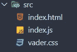
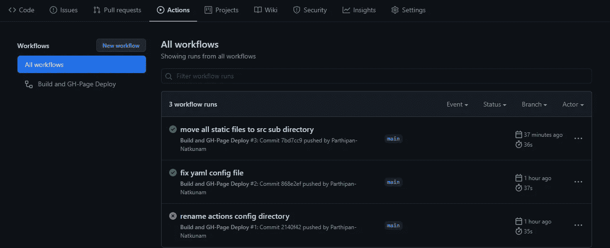
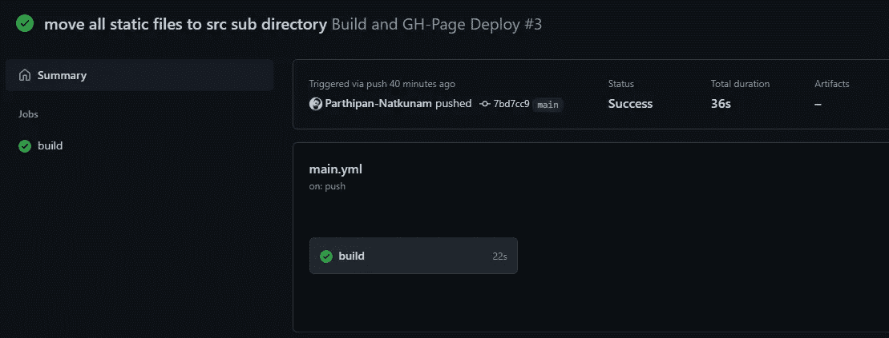
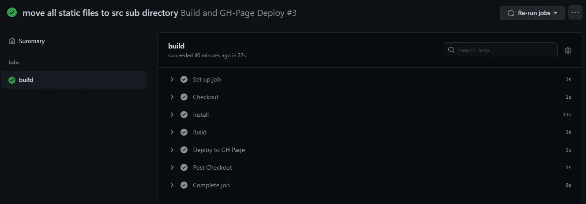
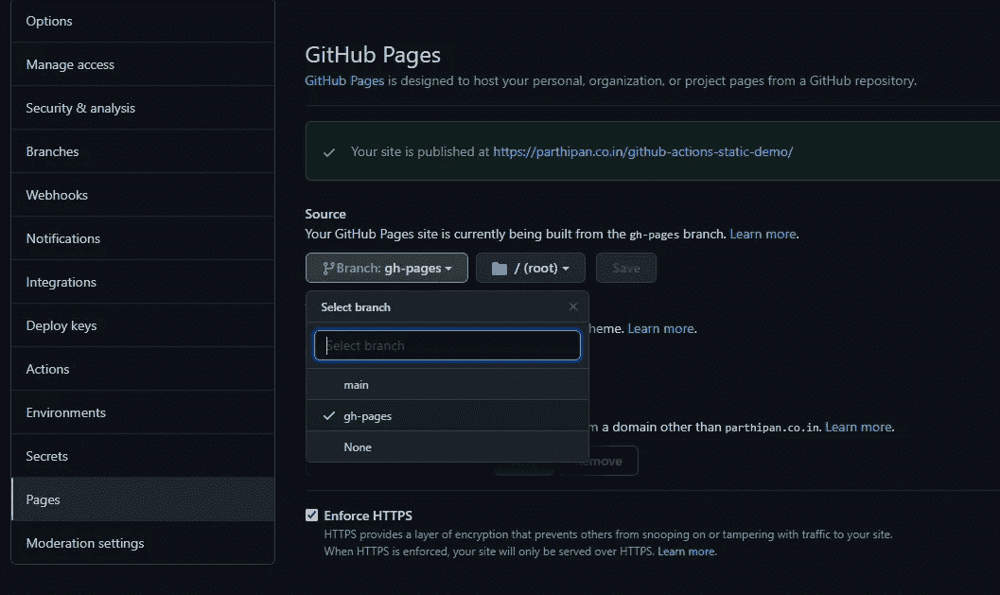

# 使用 Github 动作和 gh-pages 持续部署静态页面

> 原文：<https://javascript.plainenglish.io/continuously-deploy-static-pages-with-github-actions-gh-pages-207e4a009d1c?source=collection_archive---------6----------------------->


A Static Page ( Darth Vader CSS from: [https://codepen.io/poziomq/pen/Lbyomj](https://codepen.io/poziomq/pen/Lbyomj))

在这篇初学者友好、简短且实用的文章中，让我们看看如何使用 Github 操作，轻松地建立一个连续部署管道，以构建静态站点并将其部署到 gh-pages。

## 第一步。创建一个文件夹&初始化 package.json 和 git

我们可以使用`mkdir`命令来创建我们的文件夹。它可能类似于以下内容:

```
mkdir demo-static-deployment
```

现在，我们将工作目录更改为新创建的目录。

```
cd demo-static-deployment
```

让我们为我们的目录初始化 package.json 和 git。

```
yarn init -ygit init
```

在这篇文章中，我使用的是 yarn package manager，但是如果你愿意，也可以使用 npm。在这里没多大区别。

## 第二步。填充 package.json 文件

对于这个演示，我使用 Webpack 来最小化 HTML 和 CSS 文件。这是一种矫枉过正的做法，因为在我们的演示页面中并没有大量使用 javascript，但是我们使用的工具的主要任务是绑定 javascript。

如果你想做的只是缩小和破坏文件，请随意使用任务运行器，如 [Grunt](https://gruntjs.com/) 或 [Gulp](https://gulpjs.com/) 。您必须在 package.json 文件中相应地更改构建脚本。

在这个演示中，考虑到我使用的是 Webpack，我在 package.json 中有以下配置:

```
{
  "name": "darth-vader-fanpage",
  "version": "1.0.0",
  "main": "index.js",
  "license": "MIT",
  "scripts": {
    "build": "node_modules/.bin/webpack --config webpack.config.js"
  },
  "devDependencies": {
    "copy-webpack-plugin": "^7.0.0",
    "css-minimizer-webpack-plugin": "^1.2.0",
    "html-minimizer-webpack-plugin": "^2.1.0",
    "webpack": "^5.15.0",
    "webpack-cli": "^4.3.1",
    "webpack-dev-server": "^3.11.2"
  }
}
```

## 第三步。添加您的静态内容

我们现在可以将 HTML、CSS 和 JS 文件添加到目录中。我为演示所做的是，我将它们放在一个名为`src`的子目录中。



static content sub-directory

## 第四步。创建 Webpack 配置文件

让我们在根目录下创建一个名为`webpack.config.js`的文件，并用以下配置填充它:

```
const CopyPlugin = require("copy-webpack-plugin");
const HtmlMinimizerPlugin = require("html-minimizer-webpack-plugin");
const CssMinimizerPlugin = require("css-minimizer-webpack-plugin");
const TerserPlugin = require("terser-webpack-plugin");

module.exports = {
  entry: "./src/index.js",
  plugins: [
    new CopyPlugin({
      patterns: [
        {
          from: "./src/index.html",
          to: `${__dirname}/dist/index.html`,
        },
        {
          from: "./src/vader.css",
          to: `${__dirname}/dist/vader.css`,
        },
      ],
    }),
  ],
  optimization: {
    minimize: true,
    minimizer: [
      new HtmlMinimizerPlugin(),
      new CssMinimizerPlugin(),
      new TerserPlugin(),
    ],
  },
  output: {
    path: `${__dirname}/dist`,
    filename: "bundle.js",
  },
  mode: "production",
  module: {},
};
```

您可以随意使用任务运行器来代替这一步，还要确保根据您决定使用的工具来更改 package.json 中的构建脚本。

## 第五步。安装依赖项

为了在您的本地机器上工作，我们需要安装 npm 模块，这些模块在 package.json 文件中用作开发依赖项:

```
yarn install
```

## 第六步。忽略 node_modules 和 dist 目录

由于我们不想将我们的`node_modules`和最终构建目录`dist`(在我们的 Webpack 配置文件的输出部分中指定)添加到我们的 git 版本控制中，我们可以通过在我们的项目根目录中创建一个`.gitignore`文件并用以下内容填充它来排除这两个子目录:

```
node_modules
dist
```

## 第七步。添加持续部署的 YAML 配置

从项目的根文件夹中，创建以下子目录:

```
mkdir -p .github/workflows
cd .github/workflows
```

现在创建一个名为`main.yml`的 yml 文件

```
touch main.yml
```

将以下配置添加到`main.yml`文件中:

```
name: Build and GH-Page Deploy

on:
  push:
    branches:
      - main

jobs:
  build:
    runs-on: ubuntu-latest

    steps:
      - name: Checkout
        uses: actions/checkout@v2
        with:
          persist-credentials: false

      - name: Install
        run: yarn install

      - name: Build
        run: |
          yarn autoclean
          yarn build

      - name: Deploy to GH Page
        uses: JamesIves/github-pages-deploy-action@4.1.1
        with:
          branch: gh-pages
          folder: dist
```

基本上，这个配置告诉 Github actions 在每次成功推送到名为`main`的分支时运行一个作业

该作业由 4 个任务组成，即，*检出*(从 repo 中克隆最新代码)、*安装*(依赖项安装)、*构建*(从 Webpack 中缩小文件)、*部署*(将构建操作的结果`dist`文件夹的内容提交到名为`gh-pages`的分支中)

## 第八步。将您的更改推送到远程

现在，当我们将更改推送到主分支时，工作流操作将在第一次和后续推时自动触发。

```
git push -u origin main
```

## 第九步。监测进度

我们可以从存储库中的`Actions`选项卡监控部署作业的进度:



Jobs run on previous pushes

我们还可以单击单个作业并监控其任务进度:



build job



Task level status

## 第十步。从存储库设置添加页面

一旦上述工作成功，我们就可以进入回购中的`settings`选项卡，并从侧边栏中选择`pages`选项。在这里，我们可以将新创建的分支`gh-pages`设置为我们的页面分支。



set up gh-pages branch

这一步只需要在第一次完成，在连续的部署中我们不必担心这一点，除非我们需要更改域或页面分支。

## 结论

因此，我们通过 gh-pages 和 GitHub 操作为静态内容建立了一个持续的部署管道。通过 YAML 配置，我们可以实现真正的创新。

如果你有兴趣，你可以看看演示回购[这里](https://github.com/Parthipan-Natkunam/github-actions-static-demo)和部署页面[这里](https://parthipan.co.in/github-actions-static-demo/)

*注:达斯维达 CSS 取自* [*本笔友链接*](https://codepen.io/poziomq/pen/Lbyomj) *。填充的细节数据来自* [*SWAPI 开源 API*](https://swapi.dev/) *。(达斯维达端点:*https://swapi.dev/api/people/4/*)*

感谢您通读这篇文章，希望您觉得有用。

*更多内容请看*[***plain English . io***](http://plainenglish.io)